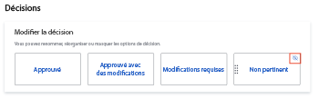

# Configurer les paramètres d’épreuve par défaut

Ces paramètres vous permettent de définir des valeurs par défaut qui s’appliquent à tous les nouveaux BAT créés par vos utilisateurs. Cependant, les utilisateurs peuvent remplacer la plupart de ces paramètres lors de la création d’un BAT.

## Configuration des nouveaux paramètres par défaut du BAT

1. Cliquez sur l’icône **Menu principal**  dans le coin supérieur droit d’Adobe Workfront, puis sur **Configuration**.
1. Dans le panneau de gauche, cliquez sur **Bons à tirer** > **Paramètres de BAT**.
1. Dans la section **New BAT defaul1} , configurez les paramètres suivants :**

   <table style="table-layout:auto"> 
    <col> 
    <col> 
    <tbody> 
     <tr> 
      <td role="rowheader" colspan="2"><b>Destinataires</b></td> 
     </tr> 
     <tr> 
      <td role="rowheader">Exiger une connexion</td> 
      <td> 
Les réviseurs doivent se connecter à l’aide de leur adresse électronique et de leur mot de passe avant d’être autorisés à afficher les bons à tirer créés dans le compte de votre entreprise. Lorsqu’ils sont activés, les utilisateurs ne peuvent pas partager le BAT avec les réviseurs invités.
 
<b>IMPORTANT</b> : lorsqu’elle est activée, la connexion est requise pour tous les bons à tirer nouvellement créés.
 </td> 
     </tr> 
     <tr> 
      <td role="rowheader">Copier le propriétaire à partir de l’épreuve originale pour les nouvelles versions</td> 
      <td> 
Le propriétaire de la première version d’un BAT est également propriétaire de toutes les versions consécutives du BAT, indépendamment de qui crée ces versions. Ce paramètre est activé par défaut.
 </td> 
     </tr> 
     <tr> 
      <td role="rowheader">Autoriser les utilisateurs à supprimer leurs commentaires sur l’épreuve</td> 
      <td>Les utilisateurs peuvent supprimer leurs propres commentaires. Ce paramètre est activé par défaut.</td> 
     </tr> 
     <tr> 
      <td role="rowheader">Exiger que les décisions soient signées de manière électronique </td> 
      <td> 
Les décideurs sont invités à saisir leurs informations d’identification de connexion Workfront lorsqu’ils prennent une décision sur un BAT.
 
<b>IMPORTANT</b> : lorsqu’ils sont activés, les utilisateurs ne peuvent pas partager le BAT avec les réviseurs invités qui n’ont pas d’informations de connexion.
 </td> 
     </tr> 
     <tr> 
      <td role="rowheader" colspan="2"><b>Échéance</b></td> 
     </tr> 
     <tr> 
      <td role="rowheader">Définition de la date limite par défaut</td> 
      <td> 
Le système applique cette échéance à tous les nouveaux BAT de votre compte qui ne disposent pas d’un workflow automatisé.
 </td> 
     </tr> 
     <tr> 
      <td role="rowheader">Avertir les destinataires avant que le BAT ne soit à risque</td> 
      <td>Les destinataires sont avertis par email avant que le BAT ne soit considéré comme à risque, selon le délai spécifié ci-dessus.</td> 
     </tr> 
     <tr> 
      <td role="rowheader" colspan="2"><b>Notifications par e-mail</b></td> 
     </tr> 
     <tr> 
      <td role="rowheader">Informer les destinataires lorsqu’ils sont ajoutés à une épreuve</td> 
      <td>Les destinataires sont avertis par email lorsqu'ils sont ajoutés à un BAT.</td> 
     </tr> 
    </tbody> 
   </table>

1. Cliquer sur **Enregistrer**.

## Configuration des décisions de BAT

Les utilisateurs peuvent utiliser des décisions de BAT pour indiquer le statut du BAT après examen.

>[!NOTE]
>
>La logique sous-jacente aux décisions de BAT permet de calculer l’état global d’un workflow de BAT en cas de décisions multiples de différents niveaux. Les décisions &quot;Approuvé&quot; et &quot;Approuvé avec modifications&quot; déclenchent l’étape suivante d’un workflow automatique.

Pour configurer les décisions du BAT :

1. Cliquez sur l’icône **Menu principal**  dans le coin supérieur droit d’Adobe Workfront, puis sur **Configuration**.
1. Dans le panneau de gauche, cliquez sur **Bons à tirer** > **Paramètres de BAT**.
1. Dans la section **Decisions** , vous pouvez

   1. **Renommer la décision** : cliquez sur le texte dans la zone de décision, puis commencez à saisir le nouveau libellé de décision.

      >[!TIP]
      >
      >Conservez la logique de décision lorsque vous la renommez. Par exemple, la décision par défaut Refusé peut être changée en *Nouvelle version requise*, mais elle ne doit pas être remplacée par *Envoyer aux imprimantes*.

      

   1. **Réorganiser l’ordre de décision** : faites glisser les zones de décision dans l’ordre dans lequel vous souhaitez qu’elles apparaissent dans la visionneuse de vérification.

      

   1. **Masquer une décision** : passez la souris sur la zone de décision, puis cliquez sur l’icône Masquer dans le coin supérieur droit.

      

1. (Facultatif) Pour revenir aux valeurs par défaut de Workfront, cliquez sur **Restaurer les valeurs par défaut**.
1. Cliquer sur **Enregistrer**.
