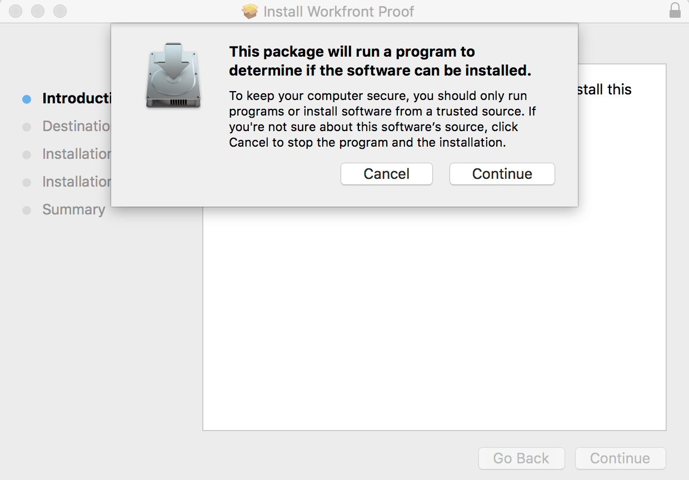

# Installer la visionneuse de relecture de bureau pour votre organisation

<!--Audited: 05/2024-->

La visionneuse de relecture de bureau, conçue principalement pour la relecture de contenu interactif, est une application qui doit être installée sur la machine locale de chaque personne. En tant qu’administrateur ou administratrice Adobe Workfront ou Workfront Proof, vous pouvez effectuer cette installation.

## Conditions d’accès

+++ Développez pour afficher les exigences d’accès aux fonctionnalités de cet article.

Vous devez disposer des accès suivants pour effectuer les étapes décrites dans cet article :

<table style="table-layout:auto">
 <col> 
 <col> 
 <tbody> 
  <tr> 
   <td role="rowheader">Formule Adobe Workfront</td> 
   <td> 
Plan actuel : Pro ou version supérieure
 
ou
 
Formule héritée : Premium ou Select
 
Pour plus d’informations sur l’accès à la relecture avec les différents forfaits, voir <a href="../../../administration-and-setup/manage-workfront/configure-proofing/access-to-proofing-functionality.md" class="MCXref xref">Accéder aux fonctionnalités de relecture dans Workfront</a>.
 </td> 
  </tr> 
  <tr> 
   <td role="rowheader">Licence Adobe Workfront</td> 
   <td> 
Plan actuel : travail ou plan
 
Forfait hérité : toutes (la relecture doit être activée pour l’utilisateur ou l’utilisatrice)
 </td> 
  </tr> 
  <tr> 
   <td role="rowheader">Configurations du niveau d’accès</td> 
   <td> 
L’option d’administration doit être sélectionnée dans votre profil d’autorisation d’épreuve. Pour plus d’informations, voir <a href="../../../administration-and-setup/manage-workfront/configure-proofing/configure-a-users-proofing-access.md" class="MCXref xref">Configurer l’accès d’un utilisateur ou d’une utilisatrice à la relecture</a>.
 </td> 
  </tr> 
 </tbody> 
</table>

Pour plus d’informations sur ce tableau, consultez [Conditions d’accès requises dans la documentation Workfront](/help/quicksilver/administration-and-setup/add-users/access-levels-and-object-permissions/access-level-requirements-in-documentation.md).

+++

## Configuration requise

La visionneuse de relecture de bureau est compatible avec les systèmes d’exploitation suivants :

* Windows 7 et versions ultérieures, 32 bits et 64 bits
* Mac OS X 10.9 et version supérieure, 64 bits

## Conditions préalables

Pour permettre à vos utilisateurs et utilisatrices d’utiliser la visionneuse de relecture de bureau, vous devez configurer le système pour qu’il lance la visionneuse de relecture de bureau comme vue par défaut pour les épreuves interactives avant l’installation.

## Configurer la visionneuse de relecture de bureau comme valeur par défaut pour les épreuves interactives

Après avoir installé la visionneuse de relecture de bureau pour votre organisation, vous pouvez la définir comme visionneuse par défaut pour les épreuves interactives.

{{step1-to-proofing}}

1. Cliquez sur **Paramètres du compte** près du coin supérieur droit de Workfront Proof, puis sur l’onglet **Paramètres**.

1. Sous **Valeurs par défaut des épreuves**, à la fin de la ligne **Visionneuse de relecture de bureau pour la relecture interactive**, cliquez sur **Configuration**.

   

1. Cliquez sur **Activé et valeur par défaut**, puis sur **Enregistrer**.

## Installation de la visionneuse de relecture de bureau pour vos utilisateurs et utilisatrices

* [Installation de la visionneuse de relecture de bureau sur Mac](#installing-the-desktop-proofing-viewer-on-mac)
* [Installation de la visionneuse de relecture de bureau sous Windows](#installing-the-desktop-proofing-viewer-on-windows)

### Installation de la visionneuse de relecture de bureau sur Mac {#installing-the-desktop-proofing-viewer-on-mac}

1. Sur l’ordinateur de l’utilisateur ou de l’utilisatrice, effectuez l’une des opérations suivantes pour télécharger l’application :

   * Si vous utilisez l’environnement de production, cliquez sur [Téléchargement de la production Mac pour la visionneuse de relecture de bureau](https://assets.proofhq.com/nativeviewer/desktop_viewer/Workfront+Proof-2.1.19.pkg).
   * Si vous utilisez l’environnement de prévisualisation, cliquez sur [Téléchargement de la prévisualisation Mac pour la visionneuse de relecture de bureau](https://assets.preview.proofhq.com/nativeviewer/desktop_viewer/Workfront+Proof+Preview-2.1.19.pkg).

1. Ouvrez le fichier que vous venez de télécharger pour démarrer l’installation.
1. Dans la zone d’installation qui apparaît, cliquez sur **Continuer**, puis sur **Installer**.

   

1. Veillez à ce que chaque utilisateur et utilisatrice termine l’installation en ouvrant une épreuve interactive à partir de la zone Documents de Workfront.

### Installation de la visionneuse de relecture de bureau sous Windows {#installing-the-desktop-proofing-viewer-on-windows}

1. Sur l’ordinateur de l’utilisateur ou de l’utilisatrice, effectuez l’une des opérations suivantes pour télécharger l’application :

   * Dans l’environnement de production, cliquez sur [Téléchargement de production Windows pour la visionneuse de relecture de bureau](https://assets.proofhq.com/nativeviewer/desktop_viewer/Workfront+Proof+Setup+2.1.19.exe).
   * Dans l’environnement de prévisualisation, cliquez sur [Téléchargement de prévisualisation Windows pour la visionneuse de relecture de bureau](https://assets.preview.proofhq.com/nativeviewer/desktop_viewer/Workfront+Proof+Preview+Setup+2.1.19.exe).

1. Ouvrez le fichier que vous venez de télécharger pour démarrer l’installation.
1. Dans la zone d’avertissement de sécurité qui apparaît, cliquez sur **Exécuter**.

   

   La visionneuse de relecture de bureau s’installe et s’exécute.

1. (Le cas échéant) Si vous installez l’application à l’aide d’Internet Explorer, rafraîchissez la page de lancement dans le navigateur après l’installation de l’application.
1. Veillez à ce que chaque utilisateur et utilisatrice termine l’installation en ouvrant une épreuve interactive à partir de la zone Documents de Workfront.
