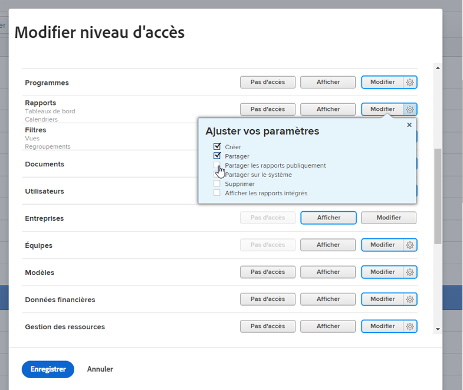

# Masquer les rapports intégrés

Adobe Workfront dispose d’une liste étendue de rapports intégrés par défaut accessibles et consultables par les utilisateurs et les utilisatrices. En tant que membre de l’administration Workfront, vous pouvez modifier le niveau d’accès d’un utilisateur ou d’une utilisatrice pour restreindre l’accès aux rapports intégrés.

## Conditions d’accès

+++ Développez pour afficher les exigences d’accès aux fonctionnalités de cet article.

Vous devez disposer des accès suivants pour effectuer les étapes décrites dans cet article :

<table style="table-layout:auto"> 
 <col> 
 <col> 
 <tbody> 
  <tr> 
   <td role="rowheader">Formule Adobe Workfront</td> 
   <td>Tous</td> 
  </tr> 
  <tr> 
  <tr> 
   <td role="rowheader">Licence Adobe Workfront</td> 
   <td>
Nouveau : Standard

       
Ou

       
Actuel : formule
</td>
  </tr> 
  </tr> 
  <tr> 
   <td role="rowheader">Configurations des niveaux d’accès</td> 
   <td>[!UICONTROL System Administrator]</td>
  </tr> 
 </tbody> 
</table>

Pour plus de détails sur les informations contenues dans ce tableau, consultez [Conditions d’accès préalables dans la documentation Workfront](/help/quicksilver/administration-and-setup/add-users/access-levels-and-object-permissions/access-level-requirements-in-documentation.md).

+++

## Masquer les rapports intégrés

{{step-1-to-setup}}

1. Cliquez sur **Niveaux d’accès**.
1. Sélectionnez le niveau d’accès pour lequel vous souhaitez masquer les rapports intégrés, puis cliquez sur **Modifier**.
1. Pour l’objet **Rapports**, cliquez sur l’icône **Paramètres** à côté du plus haut niveau d’accès disponible, puis désélectionnez **Afficher les rapports intégrés**.

   

1. Cliquer sur **Enregistrer**.
