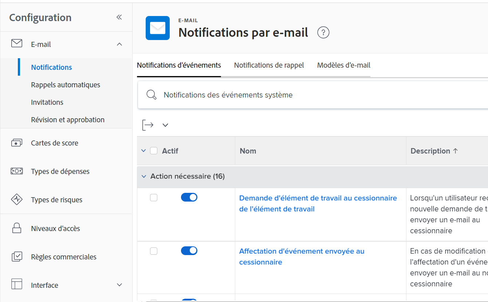

# Configuration des notifications d’événement pour tous les membres du système

<!-- Audited: 1/2024 -->

<!--DON'T DELETE, DRAFT OR HIDE THIS ARTICLE. IT IS LINKED TO THE PRODUCT, THROUGH THE CONTEXT SENSITIVE HELP LINKS-->

Les notifications d’événement déclenchent des emails aux utilisateurs lorsqu’un événement spécifique se produit. En tant qu’administrateur Adobe Workfront ou utilisateur disposant d’un niveau d’accès Planificateur , vous pouvez configurer une notification d’événement pour tous les utilisateurs du système. La configuration d&#39;une notification d&#39;événement consiste à l&#39;activer ou la désactiver.

<!--Alina annotation on the word "all" in 2nd sentence: abive, drafted and remains QS only-->

Selon l’événement que vous activez et que l’utilisateur reste activé sur son propre profil, les utilisateurs reçoivent des notifications instantanées, quotidiennes ou instantanées ou quotidiennes lorsqu’un événement se produit.

Vous devez d’abord spécifier les notifications que vous souhaitez que tous vos utilisateurs reçoivent dans la zone Configuration de votre instance Workfront. Une fois que vous avez activé une notification dans la zone Configuration , elle s’affiche comme activée pour chaque utilisateur dans la page de son profil.

Une fois que les notifications sont activées dans la zone Configuration et qu’elles apparaissent dans les pages de profil des utilisateurs, les utilisateurs individuels ou un autre utilisateur disposant d’une licence Plan peuvent également configurer les notifications activées dans un profil utilisateur afin de contrôler les notifications reçues par cet utilisateur spécifique et la fréquence. Pour plus d’informations, voir [Modifier vos propres notifications électroniques](../../../workfront-basics/using-notifications/activate-or-deactivate-your-own-event-notifications.md).

Pour obtenir la liste de toutes les notifications d’événement que vous pouvez activer et désactiver, voir [Notifications d’événements disponibles dans Adobe Workfront](../../../administration-and-setup/manage-workfront/emails/event-notifications-available-in-wf.md).

Pour plus d’informations sur le déverrouillage d’une notification d’événement afin que les administrateurs de groupe puissent la configurer pour leurs groupes, voir [Déverrouiller ou verrouiller la configuration des notifications d’événement pour tous les groupes](../../../administration-and-setup/manage-workfront/emails/unlock-configuration-of-event-notifications-for-groups.md) et [Affichage et configuration des notifications d’événement pour un groupe](../../../administration-and-setup/manage-groups/create-and-manage-groups/view-and-configure-event-notifications-group.md).

## Exigences d’accès

Vous devez disposer des accès suivants pour effectuer les étapes de cet article :

<table style="table-layout:auto"> 
 <col> 
 <col> 
 <tbody> 
  <tr> 
   <td role="rowheader">Formule Adobe Workfront*</td> 
   <td>Quelconque</td> 
  </tr> 
  <tr> 
   <td role="rowheader">Licence Adobe Workfront*</td> 
   <td> 
Nouveau : Standard

 
ou
 

Actuel : formule
 
</td> 
  </tr> 
  <tr> 
   <td role="rowheader">Paramétrages du niveau d'accès*</td> 
   <td> 
Planificateur ou version ultérieure, avec accès administratif aux notifications de rappel
 
Pour plus d’informations sur l’octroi d’un accès administratif à un utilisateur de formule, voir <a href="../../../administration-and-setup/add-users/configure-and-grant-access/grant-users-admin-access-certain-areas.md" class="MCXref xref">Octroi aux utilisateurs un accès administratif à certaines zones</a>.
 </td> 
  </tr> 
 </tbody> 
</table>

&#42;Pour connaître le plan, le type de licence ou l’accès dont vous disposez, contactez votre administrateur Workfront.

## Configurer des notifications d’événement pour tous les utilisateurs

Vous devez activer les notifications dans la zone Configuration de Workfront pour que les utilisateurs puissent les activer ou les désactiver dans leurs profils individuels.

>[!TIP]
>
>Vous ne pouvez pas activer les notifications pour les objectifs Workfront dans la zone Configuration . Les utilisateurs ne peuvent activer ces notifications que dans leurs profils. Les utilisateurs qui disposent de licences d’abonnement peuvent les activer pour d’autres utilisateurs. Pour plus d’informations sur l’activation des notifications Workfront Goals pour les utilisateurs, voir [Notifications : objectifs](../../../workfront-basics/using-notifications/notifications-goals.md).

{{step-1-to-setup}}

1. Cliquez sur **Email** > **Notifications**.

   

1. Assurez-vous que la variable **Notifications d’événement** est ouvert.
1. Activez ou désactivez le commutateur à gauche du nom de l’événement.

   Pour afficher l’état de notification par défaut d’un événement, voir [Notifications d’événements](../../../workfront-basics/using-notifications/event-notifications.md).

1. (Facultatif) Cliquez sur le nom d’une notification d’événement pour personnaliser l’objet de la notification par e-mail.

   Pour plus d’informations sur la personnalisation de l’objet des notifications par e-mail, voir [Personnalisation des sujets des emails pour les notifications d’événement](../../../administration-and-setup/manage-workfront/emails/custom-email-subjects-event-notification.md).

1. (Facultatif) Si vous souhaitez déverrouiller la configuration d’une notification électronique de sorte que les administrateurs de groupe puissent la configurer séparément pour leurs groupes, cliquez sur le bouton .  à droite de la notification pour la déplacer vers la position déverrouillée. .

   >[!NOTE]
   >
   >Cette fonctionnalité est initialement disponible uniquement pour les clients du cluster 4 dans le cadre d’un déploiement échelonné. Il sera disponible dans d&#39;autres grappes peu de temps après. Cet article sera mis à jour au fur et à mesure.

   Pour plus d’informations, voir [Déverrouiller ou verrouiller la configuration des notifications d’événement pour tous les groupes](../../../administration-and-setup/manage-workfront/emails/unlock-configuration-of-event-notifications-for-groups.md).
