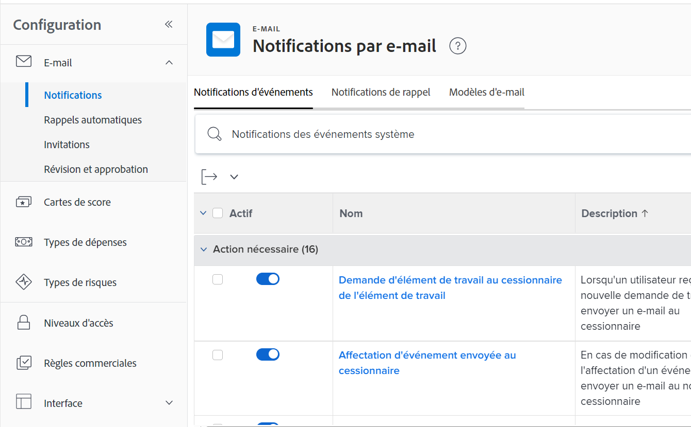

# Configurer les notifications d’événements pour toutes les personnes utilisant le système

<!-- Audited: 1/2024 -->

<!--DON'T DELETE, DRAFT OR HIDE THIS ARTICLE. IT IS LINKED TO THE PRODUCT, THROUGH THE CONTEXT SENSITIVE HELP LINKS-->

Les notifications d’événements déclenchent l’envoi d’e-mails aux utilisateurs et utilisatrices lorsqu’un certain événement se produit. En tant qu’administrateur Adobe Workfront ou utilisateur disposant d’un niveau d’accès Standard ou Plan , vous pouvez configurer une notification d’événement pour tous les utilisateurs du système. La configuration d’une notification d’événement consiste à l’activer ou à la désactiver.

<!--Alina annotation on the word "all" in 2nd sentence: abive, drafted and remains QS only-->

En fonction de l’événement que vous activez et que l’utilisateur ou l’utilisatrice laisse activé sur son propre profil, les utilisateurs et utilisatrices reçoivent des notifications instantanées, quotidiennes ou à la fois instantanées et quotidiennes par e-mail lorsqu’un événement se produit.

Vous devez d’abord spécifier les notifications que vous souhaitez que les utilisateurs et utilisatrices reçoivent dans la zone de configuration de votre instance Workfront. Une fois que vous avez activé une notification dans la zone de configuration, celle-ci s’affiche comme activée pour chaque utilisateur ou utilisatrice dans sa page de profil.

Une fois que les notifications sont activées dans la zone Configuration et qu’elles apparaissent dans les pages de profil des utilisateurs, les utilisateurs individuels ou un autre utilisateur disposant d’une licence Standard ou Plan peuvent également configurer les notifications activées dans un profil utilisateur pour contrôler quelles notifications cet utilisateur spécifique reçoit et à quelle fréquence. Pour plus d’informations, voir [Modifier vos propres notifications par e-mail](../../../workfront-basics/using-notifications/activate-or-deactivate-your-own-event-notifications.md).

Pour une liste de toutes les notifications d’événements que vous pouvez activer et désactiver, voir [Types de notifications d’événements](../../../administration-and-setup/manage-workfront/emails/event-notifications-available-in-wf.md).

Pour plus d’informations sur le déverrouillage d’une notification d’événement afin que les administrateurs et administratrices de groupes puissent la configurer pour leurs groupes, voir [Déverrouiller ou verrouiller la configuration des notifications d’événements pour tous les groupes](../../../administration-and-setup/manage-workfront/emails/unlock-configuration-of-event-notifications-for-groups.md) et [Visualiser et configurer les notifications d’événements pour un groupe](../../../administration-and-setup/manage-groups/create-and-manage-groups/view-and-configure-event-notifications-group.md).

## Conditions d’accès

+++ Développez pour afficher les exigences d’accès aux fonctionnalités de cet article.

<table style="table-layout:auto"> 
 <col> 
 <col> 
 <tbody> 
  <tr> 
   <td role="rowheader">Package Adobe Workfront</td> 
   <td>Tous</td> 
  </tr> 
  <tr> 
   <td role="rowheader">Licence Adobe Workfront</td> 
   <td> 
Standard

Plan
 
</td> 
  </tr> 
  <tr> 
   <td role="rowheader">Configurations des niveaux d’accès</td> 
   <td> 
Accès administratif aux notifications de rappel
 </td> 
  </tr> 
 </tbody> 
</table>

Pour plus d’informations, voir [Conditions d’accès requises dans la documentation Workfront](/help/quicksilver/administration-and-setup/add-users/access-levels-and-object-permissions/access-level-requirements-in-documentation.md).
+++

## Configurer les notifications d’événements pour tous les utilisateurs et utilisatrices

Vous devez activer les notifications dans la zone de configuration de Workfront avant que les utilisateurs et utilisatrices puissent les activer ou les désactiver dans leurs profils individuels.

>[!TIP]
>
>Vous ne pouvez pas activer les notifications pour les Objectifs Workfront à partir de la zone de configuration. Les utilisateurs et utilisatrices ne peuvent activer ces notifications que dans leur profil. Les utilisateurs et utilisatrices disposant de licences Plan peuvent les activer pour d’autres personnes. Pour plus d’informations sur l’activation des notifications Objectifs Workfront pour les utilisateurs et utilisatrices, voir [Notifications : Objectifs](../../../workfront-basics/using-notifications/notifications-goals.md).

{{step-1-to-setup}}

1. Cliquez sur **E-mail** > **Notifications**.

   

1. Assurez-vous que l’onglet **Notifications d’événements** est ouvert.
1. Appuyez sur le bouton situé à gauche du nom de l’événement pour l’activer ou le désactiver.

   Pour connaître le statut de notification par défaut d’un événement, voir [Notifications d’événements](../../../workfront-basics/using-notifications/event-notifications.md).

1. (Facultatif) Cliquez sur le nom d’une notification d’événement pour personnaliser l’objet de la notification par e-mail.

   Pour plus d’informations sur la personnalisation des objets des notifications par e-mail, voir [Personnaliser les objets des e-mails pour les notifications d’événements](../../../administration-and-setup/manage-workfront/emails/custom-email-subjects-event-notification.md).

1. (Facultatif) Si vous souhaitez déverrouiller la configuration d’une notification par e-mail afin que les administrateurs de groupes puissent la configurer séparément pour leurs groupes, cliquez sur le bouton  à droite de la notification pour la faire basculer en position déverrouillée .

   Pour plus d’informations, voir [Déverrouiller ou verrouiller la configuration des notifications d’événements pour tous les groupes](../../../administration-and-setup/manage-workfront/emails/unlock-configuration-of-event-notifications-for-groups.md).

Les utilisateurs et utilisatrices peuvent personnaliser la fréquence de ces notifications dans leur profil utilisateur.
