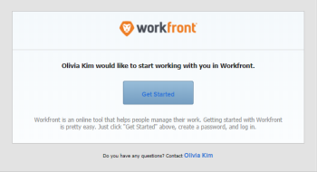

# Gérer les invitations par courrier électronique aux nouveaux utilisateurs

<!--

*** DON'T DELETE, DRAFT OR HIDE THIS ARTICLE. IT IS LINKED TO THE PRODUCT, THROUGH THE CONTEXT SENSITIVE HELP LINKS. **

-->

>[!IMPORTANT]
>
>La procédure décrite sur cette page s’applique uniquement aux organisations qui n’ont pas encore été intégrées au Admin Console. Si votre organisation a été intégrée à Adobe Admin Console, vous devez effectuer cette action via Adobe Admin Console.
>
>Pour obtenir une liste des procédures différentes selon que votre organisation a été intégrée à Adobe Admin Console, reportez-vous à la section [Différences d’administration basées sur les plateformes (Adobe Workfront/Adobe Business Platform)](../../../administration-and-setup/get-started-wf-administration/actions-in-admin-console.md).

En tant qu’administrateur d’Adobe Workfront, vous pouvez ajouter des utilisateurs à Workfront et les informer qu’ils ont été ajoutés en leur envoyant des invitations par courrier électronique.

L’invitation par courrier électronique permet aux nouveaux utilisateurs de suivre un lien où ils peuvent choisir un mot de passe pour leur compte Workfront. Ils peuvent alors terminer la configuration de leur compte.

Pour garantir la sécurité des nouveaux comptes, nous vous recommandons d’utiliser des invitations par email pour vos nouveaux utilisateurs, afin qu’ils puissent choisir leur propre mot de passe. Vous pouvez également sélectionner un mot de passe pour un nouvel utilisateur lors de la création de son compte. Pour plus d’informations sur l’ajout de nouveaux utilisateurs à Workfront, voir [Ajout d’utilisateurs](../../../administration-and-setup/add-users/create-and-manage-users/add-users.md).

Vous pouvez configurer les nouveaux courriers électroniques utilisateur pour :

* Tout nouvel utilisateur ajouté à Workfront
* Utilisateurs ajoutés à Workfront avec une licence Requestor

Tous les nouveaux utilisateurs voient le même courrier électronique lorsqu’une invitation par courrier électronique est envoyée.

Pour plus d’informations sur la réception d’invitations par courrier électronique, voir [Recevoir des invitations par courrier électronique et créer un mot de passe pour Adobe Workfront](../../../workfront-basics/manage-your-account-and-profile/managing-your-workfront-account/receive-email-invitations.md).

## Exigences d’accès

Vous devez disposer des accès suivants pour effectuer les étapes de cet article :

<table style="table-layout:auto"> 
 <col> 
 <col> 
 <tbody> 
  <tr> 
   <td role="rowheader">Formule Adobe Workfront</td> 
   <td>Tous</td> 
  </tr> 
  <tr> 
   <td role="rowheader">Licence Adobe Workfront</td> 
   <td>Plan</td> 
  </tr> 
  <tr> 
   <td role="rowheader">Paramétrages du niveau d'accès</td> 
   <td> 
Administrateur système
 </td> 
  </tr> 
 </tbody> 
</table>

## Générer des invitations par courrier électronique {#generate-email-invitations}

Les invitations par email sont générées dans les scénarios suivants :

* Lorsque vous créez un utilisateur et que vous sélectionnez l’option **Envoyer un courrier électronique d’invitation à cette personne** sur le **Nouvel utilisateur** formulaire. Pour plus d’informations sur la création de nouveaux utilisateurs, voir [Ajout d’utilisateurs](../../../administration-and-setup/add-users/create-and-manage-users/add-users.md).
* Lorsque vous importez plusieurs nouveaux utilisateurs et que vous sélectionnez le **Envoyer des emails d’invitation à ces personnes** . Pour plus d’informations sur l’import de plusieurs nouveaux utilisateurs, voir [Importer des utilisateurs](../../../administration-and-setup/add-users/create-and-manage-users/import-users.md).
* Une fois les utilisateurs créés, vous pouvez générer manuellement les invitations destinées aux utilisateurs qui n’ont pas encore enregistré leur compte auprès de Workfront et qui n’ont pas encore défini de mot de passe Workfront.\
   Les utilisateurs pour lesquels un compte a été créé mais n’ont pas encore enregistré leur compte sont marqués comme **Désinscrit** dans Workfront.

   >[!NOTE]
   >
   >Si vous désélectionnez l’option **Envoyer une invitation par courrier électronique à cette personne** lorsque vous créez l’utilisateur, l’invitation par courrier électronique ne peut pas être générée manuellement. L’envoi manuel des invitations par courrier électronique n’est possible que pour les utilisateurs qui ont reçu l’invitation par courrier électronique initiale lors de la création de leur compte. Pour plus d’informations sur la création de nouveaux utilisateurs, voir [Ajout d’utilisateurs](../../../administration-and-setup/add-users/create-and-manage-users/add-users.md).

Pour générer manuellement des invitations par courrier électronique à des utilisateurs non enregistrés existants :

1. Cliquez sur le bouton **Menu Principal** icon  dans le coin supérieur droit d’Adobe Workfront, puis cliquez sur **Utilisateurs** .
1. Sélectionnez l’utilisateur qui affiche la variable **Désinscrit** de leur nom.

   

1. Cliquez sur l’icône Plus , puis cliquez sur **Rappel à l’utilisateur pour l’enregistrement**.

   Une invitation par courrier électronique est envoyée au nouvel utilisateur avec un nouveau lien qu’il peut utiliser pour créer son mot de passe Workfront.

   >[!NOTE]
   >
   >Si votre entreprise a été intégrée au Admin Console et que vous ajoutez un utilisateur via Workfront, vous n’avez pas la possibilité d’envoyer une invitation par courrier électronique à de nouveaux utilisateurs.
   >
   >Les nouveaux utilisateurs d’Adobe sont ajoutés au Admin Console et le Admin Console leur envoie un courrier électronique pour les inviter à terminer le processus d’enregistrement. Tous les utilisateurs doivent terminer le processus d’enregistrement pour accéder à n’importe quel système d’Adobe.
   >
   >Pour les utilisateurs d’Adobe existants, l’utilisateur peut recevoir ou non un e-mail sur la disponibilité de Workfront. Il s’agit d’une préférence contrôlée par l’administrateur d’Adobe pour le produit.

## Configuration des invitations par courrier électronique {#configure-email-invitations}

En tant qu’administrateur Workfront, vous pouvez configurer le message que vous incluez avec les invitations par courrier électronique pour les nouveaux utilisateurs.

1. Cliquez sur le bouton **Menu Principal** icon  dans le coin supérieur droit d’Adobe Workfront, puis cliquez sur **Configuration** .

1. Dans la liste de gauche, cliquez sur **Email** > **Invitations**.

1. Dans le **Options générales** effectuez l’une des modifications suivantes :

   <table style="table-layout:auto"> 
    <col> 
    <col> 
    <tbody> 
     <tr> 
      <td role="rowheader"><strong>Désactivation des liens d’invitation après ... jours</strong> </td> 
      <td> 
Sélectionnez la durée au bout de laquelle les invitations par e-mail ne contiennent plus de lien valide vers Workfront. Le nombre de jours par défaut est de 45.
 </td> 
     </tr> 
     <tr> 
      <td role="rowheader"><strong>Inclure un message et/ou la durée du service</strong> </td> 
      <td> 
Sélectionnez cette option si vous souhaitez modifier l’invitation par courrier électronique pour tous les nouveaux utilisateurs ajoutés à Workfront. Cela n’inclut pas les utilisateurs disposant d’une licence du demandeur.
 
       <ul> 
        <li><strong>Message</strong>: Si vous choisissez de modifier l’invitation par courrier électronique pour tous les nouveaux utilisateurs, indiquez le texte que vous souhaitez inclure dans vos invitations par courrier électronique en tant que corps de courrier électronique.</li> 
        <li><strong>Termes et conditions</strong>: Si vous choisissez de modifier l’invitation par courrier électronique pour tous les nouveaux utilisateurs, indiquez le texte que vous souhaitez inclure dans vos invitations par courrier électronique en tant que conditions générales. </li> 
        <li><strong>Inclure un message et/ou la durée du service pour les utilisateurs du service d’assistance</strong>: Sélectionnez cette option si vous souhaitez modifier l’invitation par courrier électronique pour tous les nouveaux utilisateurs ajoutés à Workfront qui disposent d’une licence Requestor.</li> 
        <li><strong>Message</strong>: Si vous choisissez de modifier l’invitation par courrier électronique pour tous les nouveaux utilisateurs disposant d’une licence Requestor, spécifiez le texte que vous souhaitez inclure dans vos invitations par courrier électronique en tant que corps de courrier électronique.</li> 
        <li><strong>Termes et conditions</strong>: Si vous choisissez de modifier l’invitation par courrier électronique pour tous les nouveaux utilisateurs disposant d’une licence Requestor, spécifiez le texte que vous souhaitez inclure dans vos invitations par courrier électronique comme conditions générales. </li> 
        <li> 
Dans le <strong>Aperçu de l’invitation</strong> , vous pouvez voir un aperçu de votre invitation par courrier électronique. Si vous avez choisi d’inclure un message personnalisé dans votre invitation par courrier électronique, le message personnalisé s’affiche dans cette zone.
 
  
 </li> 
       </ul> </td> 
     </tr> 
    </tbody> 
   </table>

1. Cliquer sur **Enregistrer**.
