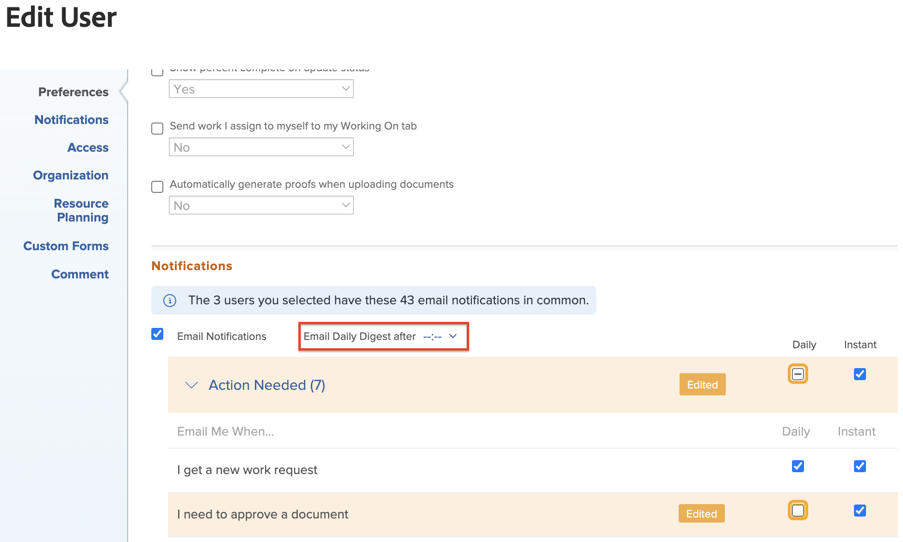

# Modification des paramètres de notification électronique de plusieurs utilisateurs

<!-- Audited: 12/2023 -->

Si vous êtes administrateur Adobe Workfront ou si vous disposez d’un niveau d’accès Planificateur vous permettant de modifier les paramètres d’autres utilisateurs, vous pouvez configurer les paramètres de notification pour plusieurs utilisateurs à la fois. Cela inclut la spécification des notifications reçues par les utilisateurs au fur et à mesure des événements, ou dans un email de résumé quotidien, comme décrit dans la section [Notifications Adobe Workfront](../../../workfront-basics/using-notifications/wf-notifications.md). Pour plus d’informations sur le niveau d’accès requis pour modifier les utilisateurs, voir [Accorder l’accès aux utilisateurs](../../../administration-and-setup/add-users/configure-and-grant-access/grant-access-other-users.md).

Vous pouvez également configurer des notifications électroniques pour un utilisateur à la fois, y compris votre propre profil. Pour plus d’informations, voir [Modifier vos propres notifications électroniques](../../../workfront-basics/using-notifications/activate-or-deactivate-your-own-event-notifications.md).

## Exigences d’accès

Vous devez disposer des accès suivants pour effectuer les étapes de cet article :

<table style="table-layout:auto"> 
 <col> 
 <col> 
 <tbody> 
  <tr> 
   <td role="rowheader">Formule Adobe Workfront</td> 
   <td>Quelconque</td> 
  </tr> 
  <tr> 
   <td role="rowheader">Licence Adobe Workfront</td> 
   <td> 
Nouveau plan : Standard 

 
ou
 

Formule actuelle : Formule 
 
</td> 
  </tr> 
 </tbody> 
</table>

Pour plus d’informations sur ce tableau, voir [Conditions d’accès requises dans la documentation Workfront](/help/quicksilver/administration-and-setup/add-users/access-levels-and-object-permissions/access-level-requirements-in-documentation.md).

## Modification des paramètres de notification électronique pour plusieurs utilisateurs

Lorsque vous configurez les paramètres de notification en bloc, vous ne pouvez modifier que les paramètres communs aux utilisateurs sélectionnés.

Lorsque vous modifiez un paramètre de notification, le libellé **Modifié** s’affiche pour ce paramètre de notification afin de vous informer que ce paramètre de notification a été modifié.

Pour modifier les paramètres de notification électronique pour plusieurs utilisateurs :

{{step-1-to-users}}

1. Sélectionnez les utilisateurs, puis cliquez sur **Modifier**.
1. Dans le **Modifier la personne** qui s’affiche, cliquez sur **Notifications**.

1. Développez une catégorie pour afficher les paramètres de notification associés à cette catégorie.

   Si au moins un utilisateur est sélectionné alors que les notifications ne correspondent pas à celles des autres utilisateurs sélectionnés, la case à cocher de catégorie de cette notification comporte une ligne horizontale.  plutôt qu’une coche.

1. Cliquez sur les notifications que vous souhaitez que les utilisateurs reçoivent quotidiennement ou instantanément, ou effacez celles que vous souhaitez qu’ils cessent de recevoir.

   >[!NOTE]
   >
   >   Pour le **Communication** vous pouvez sélectionner des notifications individuelles pour une diffusion instantanée uniquement. Vous devez sélectionner toutes les notifications à diffuser dans un résumé quotidien.

1. Si vous avez sélectionné des notifications à envoyer sous forme de résumé quotidien, sélectionnez l’heure de la journée à laquelle vous souhaitez que le résumé soit diffusé en haut de la page **Notifications** dans la section **Email Daily Digest après** .

   

   Le résumé quotidien comprend les événements qui répondent aux critères des notifications 24 heures avant l’heure sélectionnée. Les utilisateurs reçoivent un courrier électronique condensé quotidien pour chaque type de notification.

   Le résumé quotidien peut arriver après la période sélectionnée, selon le nombre d&#39;emails placés en file d&#39;attente pour diffusion dans le système. L’heure indiquée correspond à l’heure locale spécifiée dans les paramètres du navigateur.
