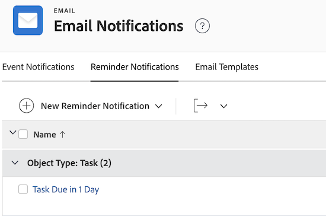

# Configurer des notifications de rappel

<!-- Audited: 1/2024 -->

En tant qu’administrateur ou administratrice Workfront, vous pouvez créer des notifications de rappel pour les utilisateurs et utilisatrices et les associer à des objets auxquels vous souhaitez que les personnes accordent une attention particulière.

Les notifications de rappel génèrent des e-mails qui sont envoyés aux utilisateurs et utilisatrices selon des critères spécifiés. Les notifications de rappel rappellent aux utilisateurs et utilisatrices qu’une action doit être effectuée pour une tâche, un problème, un projet ou une feuille de temps.

Après la création des notifications de rappel, les utilisateurs et utilisatrices peuvent les associer manuellement aux éléments de travail tels que les projets, les tâches, les problèmes et les feuilles de temps. Pour plus d’informations, voir [Joindre une notification de rappel à un objet](/help/quicksilver/workfront-basics/using-notifications/attach-reminder-notification-object.md).

<!--
DRAFTED IN FLARE:
An example of how this can be used would be helpful here and/or in the section 
<a href="../../../workfront-basics/using-notifications/wf-notifications.md#reminder-notifications" class="MCXref xref">Reminder notifications</a>
 in 
<a href="../../../workfront-basics/using-notifications/wf-notifications.md" class="MCXref xref">Adobe Workfront notifications</a>

-->

## Conditions d’accès

+++ Développez pour afficher les exigences d’accès aux fonctionnalités de cet article.

Vous devez disposer des accès suivants pour effectuer les étapes décrites dans cet article :

<table style="table-layout:auto"> 
 <col> 
 <col> 
 <tbody> 
  <tr> 
   <td role="rowheader">Formule Adobe Workfront*</td> 
   <td>Tous</td> 
  </tr> 
  <tr> 
   <td role="rowheader">Licence Adobe Workfront</td> 
   <td> 
Nouveau : Standard 

 
ou
 

Actuel : formule
 
</td> 
  </tr> 
  <tr> 
   <td role="rowheader">Configurations des niveaux d’accès</td> 
   <td> 
Planificateur ou version ultérieure, avec accès administratif aux notifications de rappel
</td> 
  </tr> 
 </tbody> 
</table>

* Pour plus d’informations sur ce tableau, consultez [Conditions d’accès requises dans la documentation Workfront](/help/quicksilver/administration-and-setup/add-users/access-levels-and-object-permissions/access-level-requirements-in-documentation.md).

+++

## Personnaliser l’e-mail de rappel

Vous pouvez personnaliser l’objet, le corps et le code HTML de l’e-mail de notification de rappel.

Vous pouvez également utiliser l’e-mail par défaut inclus dans la notification de rappel. L’e-mail par défaut utilise le nom de la notification de rappel comme objet de l’e-mail, ainsi que le nom de l’objet dans le corps de l’e-mail, et inclut l’événement qui a déclenché la notification.

Si vous souhaitez personnaliser l’e-mail de rappel, vous devez créer un modèle d’e-mail et le joindre à la notification de rappel.

Pour plus d’informations sur la création d’un modèle d’e-mail, consultez la section [Configurer des modèles d’e-mail](../../../administration-and-setup/manage-workfront/emails/configure-email-templates.md).

## Créer une notification de rappel

{{step-1-to-setup}}

1. Cliquez sur **E-mail** > **Notifications** > **Notifications de rappel**.

   

1. Cliquez sur **Nouvelle notification de rappel**.

1. Dans la liste déroulante, cliquez sur le type d’objet à associer à la notification de rappel.

   Par exemple, si vous souhaitez joindre une notification de rappel à une feuille de temps, cliquez sur **Feuille de temps**.

1. Dans la zone **Nouvelle notification de rappel** qui s’affiche, indiquez les informations suivantes.

   <table style="table-layout:auto"> 
    <col> 
    <col> 
    <tbody> 
     <tr> 
      <td role="rowheader">Nom de la notification de rappel</td> 
      <td>Indiquez le nom de la notification de rappel.</td> 
     </tr> 
     <tr> 
      <td role="rowheader">Période qualifiante</td> 
      <td> 
Spécifiez le nombre d’heures, de jours ouvrables, de jours (calendaires), de semaines ou de mois avant ou après la date dans le champ <strong>Planning</strong>.
 
<b>NOTE</b> :  
        <ul> 
         <li> 
Les notifications de rappel démarrent 24 heures après la date spécifiée et une fois tous les critères satisfaits.
 </li> 
         <li> 
Les notifications de rappel liées à des projets, des tâches et à des problèmes se déclenchent toutes les nuits à minuit, heure des Rocheuses. Tous les objets qui remplissent les critères d’une notification de rappel de ce jour déclenchent une notification aux personnes désignées peu de temps après cette heure.
 </li> 
         <li> 
Les notifications de rappel liées aux feuilles de temps sont envoyées à l’heure spécifiée selon votre fuseau horaire et la date de fin, la date de début ou la date de dernière mise à jour de la feuille de temps.
 </li> 
        </ul> 
 </td> 
     </tr> 
     <tr> 
      <td role="rowheader">Planning</td> 
      <td> 
Sélectionnez l’événement déclenchant la notification de rappel à programmer.
 
Si la notification de rappel concerne des projets, des tâches ou des problèmes, les options disponibles sont liées à la date d’achèvement ou à la date de début. La notification de rappel prend en compte l’horodatage des dates d’achèvement et de début des projets, des tâches et des problèmes.

   
Si la notification de rappel concerne des feuilles de temps, les options disponibles sont liées à la date de fin, à la date de début ou à la date de dernière mise à jour. La notification de rappel concernant les feuilles de temps prend en compte l’horodatage des dates de fin, de début et de dernière mise à jour de la feuille de temps. La feuille de temps commence le jour de la date de début à minuit (00 h 00) et se termine juste avant minuit le jour de la date de fin (23 h 59).

   
<b>NOTE</b>

      
Les notifications de rappel concernant les feuilles de temps ne sont envoyées qu’une fois toutes les 24 heures.
 
Lorsque vous configurez plusieurs notifications de rappel dans une période de 24 heures, Workfront envoie un seul e-mail de notification qui regroupe tous les rappels inclus dans cette notification.

      
Par exemple, si vous configurez trois notifications de rappel pour qu’elles se déclenchent 10 heures, 2 heures et 1 heure avant une date d’échéance, les trois rappels seront regroupés dans la même notification s’ils ont lieu le même jour.
 
Cependant, si vous définissez une notification de rappel pour qu’elle se déclenche 26 heures avant l’échéance et une autre pour qu’elle se déclenche 1 heure avant l’échéance, les personnes recevront deux notifications distinctes. 

   </td> 
     </tr> 
     <tr> 
      <td role="rowheader">Critères</td> 
      <td> 
Sélectionnez les critères pour qualifier la notification de rappel à planifier. Les notifications de rappel ne sont pas planifiées, sauf si la sélection des critères est respectée.
 
Les options de critères suivantes sont disponibles, selon le type d’objet sélectionné à l’étape 4 :
 
       <ul> 
        <li><strong>Incomplet dans les projets en cours :</strong> <i>(disponible pour les rappels de tâche et de problème)</i> l’envoi de la notification de rappel est planifié uniquement lorsque le statut de l’objet auquel la notification de rappel est associée n’est pas Terminé et que le statut du projet est Actif.</li> 
        <li><strong>Tout dans les projets en cours :</strong> <i>(disponible pour les rappels de tâche et de problème)</i> l’envoi de la notification de rappel est planifié quel que soit le statut de l’objet. Cette notification doit être envoyée uniquement lorsque le statut du projet auquel la notification de rappel est associée est Actif.</li> 
        <li><strong>Projets incomplets :</strong> <i>(disponible pour les rappels de projet)</i> l’envoi de la notification de rappel est planifié lorsque le statut du projet est autre que Terminé.</li> 
        <li><strong>Tous les projets :</strong> <i>(disponible pour les rappels de projet)</i> l’envoi de la notification de rappel est planifié quel que soit le statut du projet.</li> 
        <li><strong>Feuilles de temps ouvertes :</strong> <i>(disponible pour les rappels de feuille de temps)</i> l’envoi de la notification de rappel est planifié lorsque le statut de la feuille de temps est Ouvert.</li> 
        <li><strong>Feuilles de temps envoyées :</strong> <i>(disponible pour les rappels de feuille de temps)</i> l’envoi de la notification de rappel est planifié lorsque le statut de la feuille de temps est Envoyé.</li> 
        <li><strong>Feuille de temps ouverte ou de moins de 40 heures par semaine :</strong> <i>(disponible pour les rappels de feuille de temps)</i> l’envoi de la notification de rappel est planifié lorsque le statut de la feuille de temps est Ouvert ou lorsque la feuille de temps a moins de 40 heures de consignées.</li> 
        <li><strong>Modèle d’e-mail :</strong> dans la liste déroulante, sélectionnez un modèle d’e-mail à joindre à votre rappel. Pour plus d’informations sur la création d’un modèle d’e-mail, reportez-vous à la section <a href="../../../administration-and-setup/manage-workfront/emails/configure-email-templates.md" class="MCXref xref">Configurer des modèles d’e-mail</a>.</li> 
       </ul> </td> 
     </tr> 
     <tr> 
      <td role="rowheader">Destinataires</td> 
      <td>
En fonction de l’objet pour lequel la notification de rappel est envoyée, sélectionnez l’un des types de personnes suivants auxquels vous souhaitez envoyer la notification :

      <ul>
      <li>Affecté à</li>
      <li>Entré par</li>
      <li>Équipe du projet (rappel reçu par toutes les personnes de l’équipe du projet)</li>
      <li>Personnes cessionnaires de tâche dépendantes (rappel reçu par les personnes affectées à des tâches dépendantes)</li>
      <li>Propriétaire du projet</li>
      <li>Affecté à (rappel reçu par les personnes affectées à une tâche ou à un problème)</li>
      <li>Propriétaire de feuille de temps</li>
      <li>Approbateur de feuilles de temps</li>
      <li>Gestionnaire du propriétaire de feuille de temps</li></ul>
      </td> 
     </tr> 
    </tbody> 
   </table>

1. Cliquer sur **Enregistrer**.
1. Joignez la notification de rappel à un élément de travail, comme décrit dans [Joindre une notification de rappel à un objet](../../../workfront-basics/using-notifications/attach-reminder-notification-object.md).

## Recevoir une notification de rappel

Lorsque la condition est remplie sur l’élément auquel est jointe la notification de rappel, une notification par e-mail est déclenchée à la personne définie dans la notification de rappel.

Pour plus d’informations sur la réception de notifications de rappel, voir la section [Notifications de rappel](../../../workfront-basics/using-notifications/wf-notifications.md#reminder-notifications) dans [Notifications Adobe Workfront](../../../workfront-basics/using-notifications/wf-notifications.md).

## Tester la diffusion de la notification de rappel

Les notifications de rappel se déclenchent toutes les nuits à minuit, heure des Rocheuses. Tous les objets qui remplissent les critères d’une notification de rappel déclenchent une notification aux personnes désignées peu de temps après.

Pour que les notifications de rappel se déclenchent manuellement, la condition du rappel doit d’abord être remplie.\
Par exemple, si un rappel est défini pour se déclencher une heure après la date d’achèvement prévue d’un projet, ce délai doit s’être écoulé entre le moment où le rappel a été défini et maintenant. Les projets dont la date d’achèvement prévue était antérieure à l’activation du rappel ne déclenchent pas de notification.

Pour déclencher manuellement une notification de rappel :

{{step-1-to-setup}}

1. Cliquez sur **Système** > **Diagnostics** dans le coin inférieur gauche de Workfront.

1. Cliquez sur **Envoyer des notifications de rappel** et attendez la confirmation d’envoi en haut de l’écran.

   Les personnes désignées dans la notification de rappel reçoivent un e-mail.

