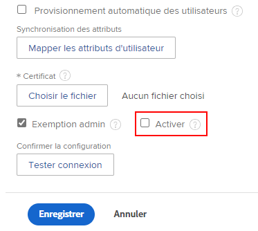

# Gérer les clés API

<!--DON'T DELETE, DRAFT OR HIDE THIS ARTICLE. IT IS LINKED TO THE PRODUCT, THROUGH THE CONTEXT SENSITIVE HELP LINKS.

-->

>[!IMPORTANT]
>
>Workfront ne recommande plus l’utilisation du point d’entrée `/login` ou des clés API. Utilisez plutôt l’une des méthodes d’authentification suivantes :
>
>* Authentification du serveur avec JWT
>* Authentification des utilisateurs et utilisatrices avec OAuth2
>
>Pour obtenir des instructions sur la configuration de ces méthodes d’authentification, voir [Créer des applications OAuth2 pour les intégrations Workfront](/help/quicksilver/administration-and-setup/configure-integrations/create-oauth-application.md).
>
>Pour obtenir des instructions sur l’utilisation de l’authentification du serveur dans Workfront, voir [Configurer et utiliser les applications OAuth 2 personnalisées de votre organisation à l’aide du flux JWT](/help/quicksilver/wf-api/api/oauth-app-jwt-flow.md).
>
>Pour obtenir des instructions sur l’utilisation de l’authentification des utilisateurs et utilisatrices dans Workfront, voir [Configurer et utiliser les applications OAuth 2 personnalisées de votre organisation à l’aide du flux de code d’autorisation](/help/quicksilver/wf-api/api/oauth-app-code-token-flow.md).

Afin de minimiser les vulnérabilités en matière de sécurité des API, les administrateurs et administratrices Adobe Workfront peuvent gérer les clés API utilisées afin de permettre aux applications d’accéder à Workfront pour le compte d’un utilisateur ou d’une utilisatrice.

Vous pouvez réinitialiser ou supprimer votre clé API d’administrateur ou d’administratrice actuelle, configurer l’expiration des clés API et supprimer les clés API de toutes les personnes.

Voici quelques exemples d’applications qui exploitent l’API Workfront :

* Intégrations de documents, tels que Dropbox, Google Drive et Workfront DAM
* Applications mobiles Workfront

>[!IMPORTANT]
>
>Lors de la réinitialisation ou de la suppression d’une clé API, toute application utilisant l’API Workfront et s’authentifiant auprès de Workfront via cette clé API doit être reconfigurée afin de pouvoir accéder à nouveau à Workfront.

## Conditions d’accès

+++ Développez pour afficher les exigences d’accès aux fonctionnalités de cet article.

<table style="table-layout:auto"> 
 <col> 
 <col> 
 <tbody> 
  <tr> 
   <td role="rowheader">Package Adobe Workfront</td> 
   <td>
Tous
</td> 
  </tr> 
  <tr> 
   <td role="rowheader">Licence Adobe Workfront</td> 
   <td>
Standard

Plan
</td> 
  </tr> 
  <tr> 
   <td role="rowheader">Configurations des niveaux d’accès</td> 
   <td> 
Vous devez être un administrateur ou une administratrice Workfront.
 
 </td> 
  </tr> 
 </tbody> 
</table>

Pour plus d’informations, voir [Conditions d’accès requises dans la documentation Workfront](/help/quicksilver/administration-and-setup/add-users/access-levels-and-object-permissions/access-level-requirements-in-documentation.md).

+++

## Clés API de Workfront

Chaque personne utilisant Workfront dispose d’une clé API unique. Cette clé est générée pour chaque personne au moment où celle-ci accède à une intégration exploitant l’API Workfront (telle que l’application mobile Workfront ou une intégration de documents).

>[!NOTE]
>
> Les clés API que vous générez dans l’environnement de production sont copiées dans votre environnement de prévisualisation lors de l’actualisation hebdomadaire. Toutes les clés API générées dans l’environnement de prévisualisation seront remplacées par vos clés API de production lors de l’actualisation hebdomadaire.

Les administrateurs et administratrices Workfront disposent également d’une clé API unique. Lorsqu’une application utilise une clé API d’administration pour accéder à Workfront, elle dispose d’un accès d’administration à Workfront.

## Gérer une clé API d’administration

Vous pouvez générer, réinitialiser ou supprimer la clé API pour votre compte d’administrateur ou d’administratrice.

{{step-1-to-setup}}

1. Cliquez sur **Système >** **Infos client.**
1. (Le cas échéant) Effectuez l’une des actions suivantes :

   Pour générer une clé API : dans la section **Paramètres de la clé API**, cliquez sur **Générer la clé API**.

   Ou\
   Pour réinitialiser une clé API : dans la section **Paramètres de la clé API**, cliquez sur **Réinitialiser**, puis sur **Réinitialiser.**

   Ou

   Pour supprimer la clé API : dans la section **Paramètres de la clé API**, cliquez sur **Supprimer**, puis sur **Supprimer**.

## Générer une clé API pour les personnes non administratrices

Vous pouvez générer et gérer des clés API pour les personnes ayant un rôle autre que celui d’administrateur ou administratrice Workfront.

>[!NOTE]
>
>Cette option n’est pas disponible si l’instance Workfront de votre organisation repose sur Adobe IMS. Consultez votre administrateur ou administratrice réseau ou informatique si vous avez besoin de plus d’informations.

1. (Le cas échéant) Si votre organisation utilise la gestion des accès par authentification unique (SSO), désactivez temporairement l’option nécessitant l’authentification SSO.

   {{step-1-to-setup}}

   1. Développez **Système**, puis cliquez sur **Authentification unique (SSO)**.
   1. Dans le champ **Type**, sélectionnez le type de SSO utilisé par votre entreprise.
   1. Avec le type sélectionné, faites défiler l’écran vers le bas et décochez la case **Activer**.
      
   1. Cliquer sur **Enregistrer**.

1. Dans la barre d’adresse d’un navigateur, saisissez l’appel API suivant :

   `<domain>`.my.workfront.com/attask/api/v7.0/user?action=generateApiKey&amp;username=**username**&amp;password=**password**&amp;method=PUT

   Remplacez `<domain>` par votre nom de domaine Workfront, et le nom d’utilisateur ou d’utilisatrice et le mot de passe par les informations d’identification Workfront de la personne.

1. (Le cas échéant) Activez l’option nécessitant une authentification SSO si vous l’avez désactivée à l’étape 1.

   {{step-1-to-setup}}

   1. Développez **Système**, puis cliquez sur **Authentification unique (SSO)**.

   1. Sélectionnez votre méthode SSO dans le menu déroulant **Type**.
   1. Cochez la case demandant l’authentification SSO.

## Configurer l’expiration des clés API

Vous pouvez configurer l’expiration des clés API pour toutes les personnes de votre système. Lorsque la clé API d’une personne expire, cette personne doit s’authentifier à nouveau auprès de toute application qui utilise l’API Workfront pour accéder à Workfront. Vous pouvez modifier la fréquence d’expiration des clés API. Vous pouvez également déterminer si les clés API expirent lorsque le mot de passe d’une personne expire.

{{step-1-to-setup}}

1. Cliquez sur **Système** > **Infos client**.
1. Dans la zone **Paramètres de la clé API**, dans la liste déroulante **Après leur création**, **les clés API expirent dans**, sélectionnez le délai d’expiration des clés API.

   Lorsque vous modifiez cette option, le nouveau délai entre en vigueur au moment où vous effectuez la modification. Par exemple, si vous modifiez cette option de *1 mois* à *6 mois*, les clés API expirent 6 mois après la modification.

   Par défaut, les clés API expirent chaque mois.

1. Pour configurer les clés d’API qui expirent au moment où les mots de passe des utilisateurs expirent, activez **Supprimer la clé d’API à l’expiration d’un mot de passe utilisateur**.

   Par défaut, cette option n’est pas activée.

   Pour plus d’informations sur la configuration de l’expiration des mots de passe des personnes, voir [Configurer les préférences de sécurité du système](../../../administration-and-setup/manage-workfront/security/configure-security-preferences.md).

1. Cliquer sur **Enregistrer**.

## Supprimer les clés API pour toutes les personnes

Si une faille de sécurité particulière vous préoccupe concernant votre système Workfront, vous pouvez supprimer les clés API simultanément pour toutes les personnes.

>[!IMPORTANT]
>
>La suppression des clés API pour toutes les personnes invalide TOUTES les clés API pour tous les utilisateurs et utilisatrices du système. Cette action entraînera l’échec de toutes vos intégrations dans Workfront jusqu’à ce que vous génériez une nouvelle clé API dans Workfront et que vous mettiez à jour toutes vos intégrations.

{{step-1-to-setup}}

1. Développez **Système**, puis cliquez sur **Infos client**.

1. Dans la zone **Paramètres de la clé API**, cliquez sur **Supprimer toutes les clés API**, puis sur **Supprimer** **tout**.

## Restreindre les connexions à l’API à l’aide d’un certificat X.509

>[!IMPORTANT]
>
>La procédure décrite dans cette section ne s’applique qu’aux organisations qui n’ont pas encore été intégrées à Adobe Business Platform. La connexion à Workfront via l’API Workfront n’est pas disponible si votre entreprise a été intégrée à Adobe Business Platform.
>
>Pour obtenir une liste de procédures qui diffèrent selon que votre entreprise a été intégrée ou non à Adobe Business Platform, voir [Différences d’administration en fonction de la plateforme (Adobe Workfront/Adobe Business Platform)](../../../administration-and-setup/get-started-wf-administration/actions-in-admin-console.md).

>[!NOTE]
>
>Cette option n’est pas disponible si l’instance Workfront de votre organisation repose sur Adobe IMS. Consultez votre administrateur ou administratrice réseau ou informatique si vous avez besoin de plus d’informations.

Les applications tierces peuvent communiquer avec Workfront par le biais de l’API. Pour renforcer la sécurité de votre site Workfront, vous pouvez configurer Workfront pour restreindre les demandes de connexion à l’API en chargeant un certificat X.509 dans Workfront. Une fois cette option activée, toutes les demandes de connexion via l’API doivent inclure un certificat client en plus du nom d’utilisateur ou d’utilisatrice et du mot de passe.

* [Obtenir le certificat X.509](#obtain-the-x-509-certificate)
* [Charger le certificat dans Workfront](#upload-the-certificate-to-workfront)
* [Vérifier que les appels de connexion à l’API sont limités](#verify-api-login-calls-are-restricted)

### Obtenir le certificat X.509 {#obtain-the-x-509-certificate}

Obtenez un certificat X.509 valide d’une autorité de certification approuvée (telle que Verisign) et enregistrez-le à un emplacement temporaire sur votre station de travail.

### Charger le certificat dans Workfront {#upload-the-certificate-to-workfront}

Après avoir obtenu le certificat X.509 auprès de votre autorité de certification, vous devez le charger dans Workfront.

1. Cliquez sur l’icône **Menu principal**  dans le coin supérieur droit d’Adobe Workfront, puis cliquez sur **Configuration** .

1. Développez **Système**, puis cliquez sur **Infos client**.

1. Dans la zone **Paramètres de clé API**, sélectionnez **Exiger un certificat X.509 pour les connexions API**.
1. Cliquez sur **Modifier le certificat**.
1. Sur votre poste de travail, recherchez et sélectionnez le certificat X.509 que vous avez téléchargé précédemment.
1. (Facultatif) Cliquez sur **Afficher les détails** en regard du nom du certificat pour afficher les détails suivants sur le certificat :

   * Nom courant du sujet
   * Organisation du sujet
   * Unité organisationnelle du sujet
   * Nom courant de l&#39;émetteur
   * Organisation de l&#39;émetteur
   * Unité organisationnelle de l&#39;émetteur
   * Numéro de série
   * Date de l&#39;événement
   * Date d&#39;expiration

1. Cliquer sur **Enregistrer**.

### Vérifier que les appels de connexion à l’API sont limités {#verify-api-login-calls-are-restricted}

Avant de configurer votre instance Workfront pour qu’elle demande un certificat X.509, effectuez une demande API au point d’entrée `/login` en utilisant des paramètres de nom d’utilisateur et d’utilisatrice et de mot de passe valides. Vous recevrez une réponse 200 contenant un sessionID.

Après avoir rendu le certificat X.509 obligatoire via la page d’informations sur le client de votre instance de Workfront, effectuez une autre tentative de connexion. Cette fois, vous recevrez une réponse d’erreur 500 avec le message suivant : « Demande non fiable. Contactez votre administrateur système et joignez un certificat. »

Après avoir confirmé que le certificat X.509 est nécessaire, effectuez la même demande de connexion avec un paramètre supplémentaire pour apiCertificate défini sur la valeur de votre certificat. Si cette opération a été effectuée correctement, vous recevrez une réponse 200 contenant un sessionID valide.
