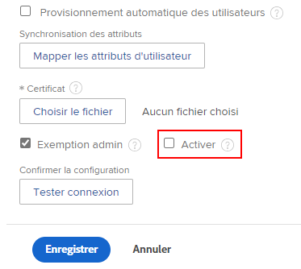

# Gérer les clés API

<!--
DON'T DELETE, DRAFT OR HIDE THIS ARTICLE. IT IS LINKED TO THE PRODUCT, THROUGH THE CONTEXT SENSITIVE HELP LINKS.

-->

>[!IMPORTANT]
>
>Workfront ne recommande plus l’utilisation du point d’entrée `/login` ou des clés API. Utilisez plutôt l’une des méthodes d’authentification suivantes :
>
>* Authentification du serveur avec JWT
>* Authentification des utilisateurs et utilisatrices avec OAuth2
>
>Pour obtenir des instructions sur la configuration de ces méthodes d’authentification, voir [Créer des applications OAuth2 pour les intégrations Workfront](/help/quicksilver/administration-and-setup/configure-integrations/create-oauth-application.md).
>
>Pour obtenir des instructions sur l’utilisation de l’authentification du serveur dans Workfront, voir [Configurer et utiliser les applications OAuth 2 personnalisées de votre organisation à l’aide du flux JWT](/help/quicksilver/wf-api/api/oauth-app-jwt-flow.md).
>
>Pour obtenir des instructions sur l’utilisation de l’authentification des utilisateurs et utilisatrices dans Workfront, voir [Configurer et utiliser les applications OAuth 2 personnalisées de votre organisation à l’aide du flux de code d’autorisation](/help/quicksilver/wf-api/api/oauth-app-code-token-flow.md).

Afin de minimiser les vulnérabilités en matière de sécurité des API, les administrateurs et administratrices Adobe Workfront peuvent gérer les clés API utilisées afin de permettre aux applications d’accéder à Workfront pour le compte d’un utilisateur ou d’une utilisatrice.

Vous pouvez réinitialiser ou supprimer votre clé API d’administrateur ou d’administratrice actuelle, configurer l’expiration des clés API et supprimer les clés API de toutes les personnes.

Voici quelques exemples d’applications qui exploitent l’API Workfront :

* Intégrations de documents, tels que Dropbox, Google Drive et Workfront DAM
* Applications mobiles Workfront

>[!IMPORTANT]
>
>Lors de la réinitialisation ou de la suppression d’une clé API, toute application utilisant l’API Workfront et s’authentifiant auprès de Workfront via cette clé API doit être reconfigurée afin de pouvoir accéder à nouveau à Workfront.

## Conditions d’accès

+++ Développez pour afficher les exigences d’accès aux fonctionnalités de cet article.

<table style="table-layout:auto"> 
 <col> 
 <col> 
 <tbody> 
  <tr> 
   <td role="rowheader">Package Adobe Workfront</td> 
   <td>
Tous
</td> 
  </tr> 
  <tr> 
   <td role="rowheader">Licence Adobe Workfront</td> 
   <td>
Standard

Plan
</td> 
  </tr> 
  <tr> 
   <td role="rowheader">Configurations des niveaux d’accès</td> 
   <td> 
Vous devez être un administrateur ou une administratrice Workfront.
 
 </td> 
  </tr> 
 </tbody> 
</table>

Pour plus d’informations, voir [Conditions d’accès requises dans la documentation Workfront](/help/quicksilver/administration-and-setup/add-users/access-levels-and-object-permissions/access-level-requirements-in-documentation.md).

+++

## Clés API de Workfront

Chaque personne utilisant Workfront dispose d’une clé API unique. Cette clé est générée pour chaque personne au moment où celle-ci accède à une intégration exploitant l’API Workfront (telle que l’application mobile Workfront ou une intégration de documents).

>[!NOTE]
>
> Les clés API que vous générez dans l’environnement de production sont copiées dans votre environnement de prévisualisation lors de l’actualisation hebdomadaire. Toutes les clés API générées dans l’environnement de prévisualisation seront remplacées par vos clés API de production lors de l’actualisation hebdomadaire.

Les administrateurs et administratrices Workfront disposent également d’une clé API unique. Lorsqu’une application utilise une clé API d’administration pour accéder à Workfront, elle dispose d’un accès d’administration à Workfront.

## Gérer une clé API d’administration

Vous pouvez générer, réinitialiser ou supprimer la clé API pour votre compte d’administrateur ou d’administratrice.

{{step-1-to-setup}}

1. Cliquez sur **Système >** **Infos client.**
1. (Le cas échéant) Effectuez l’une des actions suivantes :

   Pour générer une clé API : dans la section **Paramètres de la clé API**, cliquez sur **Générer la clé API**.

   Ou\
   Pour réinitialiser une clé API : dans la section **Paramètres de la clé API**, cliquez sur **Réinitialiser**, puis sur **Réinitialiser.**

   Ou

   Pour supprimer la clé API : dans la section **Paramètres de la clé API**, cliquez sur **Supprimer**, puis sur **Supprimer**.

<!--

   Remove me October 2026

## Generate an API Key for Non-Admin Users

You can generate and manage API Keys for users in roles other than Workfront administrator.

>[!NOTE]
>
>This is not available if your organization's Workfront instance is enabled with Adobe IMS. See your network or IT administrator if you need more information.

1. (Conditional) If your organization uses Single Sign-On (SSO) access management, temporarily disable the option requiring SSO authentication.

   {{step-1-to-setup}} 
   
   1. Expand **System**, then click **Single Sign-on (SSO)**. 
   1. In the **Type** field, select the type of SSO your organization uses.
   1. With the type selected, scroll down and clear the **Enable** checkbox. 
        
   1. Click **Save**.

1. In the address bar of a browser, enter the following API call:

   `<domain>`.my.workfront.com/attask/api/v7.0/user?action=generateApiKey&username=**username**&password=**password**&method=PUT

   Replace `<domain>` with your Workfront domain name, and username and password with the user's Workfront credentials.

1. (Conditional) Enable the option requiring SSO authentication if you disabled it in Step 1.

   {{step-1-to-setup}}
   
   1. Expand **System**, then click **Single Sign-on (SSO)**.
   
   1. Select your SSO method in the **Type** drop down menu.
   1. Check the checkbox requiring SSO authentication.

   -->

## Configurer l’expiration des clés API

Vous pouvez configurer l’expiration des clés API pour toutes les personnes de votre système. Lorsque la clé API d’une personne expire, cette personne doit s’authentifier à nouveau auprès de toute application qui utilise l’API Workfront pour accéder à Workfront. Vous pouvez modifier la fréquence d’expiration des clés API. Vous pouvez également déterminer si les clés API expirent lorsque le mot de passe d’une personne expire.

{{step-1-to-setup}}

1. Cliquez sur **Système** > **Infos client**.
1. Dans la zone **Paramètres de la clé API**, dans la liste déroulante **Après leur création**, **les clés API expirent dans**, sélectionnez le délai d’expiration des clés API.

   Lorsque vous modifiez cette option, le nouveau délai entre en vigueur au moment où vous effectuez la modification. Par exemple, si vous modifiez cette option de *1 mois* à *6 mois*, les clés API expirent 6 mois après la modification.

   Par défaut, les clés API expirent chaque mois.

1. Pour configurer les clés d’API qui expirent au moment où les mots de passe des utilisateurs expirent, activez **Supprimer la clé d’API à l’expiration d’un mot de passe utilisateur**.

   Par défaut, cette option n’est pas activée.

   Pour plus d’informations sur la configuration de l’expiration des mots de passe des personnes, voir [Configurer les préférences de sécurité du système](../../../administration-and-setup/manage-workfront/security/configure-security-preferences.md).

1. Cliquer sur **Enregistrer**.

## Supprimer les clés API pour toutes les personnes

Si une faille de sécurité particulière vous préoccupe concernant votre système Workfront, vous pouvez supprimer les clés API simultanément pour toutes les personnes.

>[!IMPORTANT]
>
>La suppression des clés API pour toutes les personnes invalide TOUTES les clés API pour tous les utilisateurs et utilisatrices du système. Cette action entraînera l’échec de toutes vos intégrations dans Workfront jusqu’à ce que vous génériez une nouvelle clé API dans Workfront et que vous mettiez à jour toutes vos intégrations.

{{step-1-to-setup}}

1. Développez **Système**, puis cliquez sur **Infos client**.

1. Dans la zone **Paramètres de la clé API**, cliquez sur **Supprimer toutes les clés API**, puis sur **Supprimer** **tout**.

<!--

Remove me October 2026

## Restricting API logins with an X.509 certificate

>[!IMPORTANT]
>
>The procedure described in this section applies only to organizations that have not yet been onboarded to the Adobe Business Platform. Logging in to Workfront through the Workfront API is not available if your organization has been onboarded to the Adobe Business Platform.
>
>For a list of procedures that differ based on whether your organization has been onboarded to the Adobe Business Platform, see [Administration differences between Adobe Workfront and Adobe Business Platform](../../../administration-and-setup/get-started-wf-administration/actions-in-admin-console.md).

>[!NOTE]
>
>This is not available if your organization's Workfront instance is enabled with Adobe IMS. See your network or IT administrator if you need more information.

Third-party applications can communicate with Workfront through the API. To increase the security of your Workfront site, you can configure Workfront to restrict API login requests by uploading an X.509 certificate to Workfront. Once enabled, all login requests through the API must include a client certificate in addition to username and password.

* [Obtain the X.509 certificate](#obtain-the-x-509-certificate) 
* [Upload the certificate to Workfront](#upload-the-certificate-to-workfront) 
* [Verify API login calls are restricted](#verify-api-login-calls-are-restricted)

### Obtain the X.509 certificate {#obtain-the-x-509-certificate}

Obtain a valid X.509 certificate from a trusted Certificate Authority (such as Verisign), and save it to a temporary location on your workstation. 

### Upload the certificate to Workfront {#upload-the-certificate-to-workfront}

After you have obtained the X.509 certificate from your Certificate Authority, you need to upload it to Workfront.

1. Click the **Main Menu** icon  in the upper-right corner of Adobe Workfront, then click **Setup** .  

1. Expand **System**, then click **Customer Info**.

1. In the **API Key Settings** area, select **Require X.509 Certificate for API logins**.
1. Click **Change Certificate**.
1. On your workstation, browse to and select the X.509 certificate that you previously downloaded.
1. (Optional) Click **View Details** next to the certificate name to view the following details about the certificate:

   * Subject Common Name
   * Subject Organization
   * Subject Organization Unit
   * Issuer Common Name
   * Issuer Organization
   * Issuer Organization Unit
   * Serial Number
   * Issue Date
   * Expiration Date

1. Click **Save**. 

### Verify API login calls are restricted {#verify-api-login-calls-are-restricted}

Prior to configuring your instance of Workfront to require an X.509 certificate, perform an API request to the `/login` endpoint using valid username and password parameters. You will receive a 200 response that contains a sessionID.

After making the X.509 certificate a requirement via the customer info page in your instance of Workfront, make another login attempt. This time you will receive a 500 error response with the following message: "Untrusted request. Please contact your system administrator and attach certificate."

After confirming that the X.509 certificate is required, perform the same login request with an additional parameter for apiCertificate set to the value of your certificate. If this operation was performed correctly you will receive a 200 response that contains a valid sessionID.

-->
