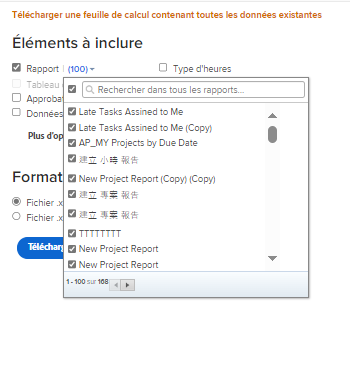

# Exportation des données de Workfront via le démarrage

<!-- Audited: 2/2024 -->

<!--

***DON'T DELETE, DRAFT OR HIDE THIS ARTICLE. IT IS LINKED TO THE PRODUCT, THROUGH THE CONTEXT SENSITIVE HELP LINKS. **

-->

En tant qu’administrateur ou administratrice Adobe Workfront, vous pouvez utiliser l’exporteur de données Kickstart pour exporter des données à partir de Workfront. Vous pouvez les utiliser dans d’autres applications après les avoir exportées.

L’export de données par le biais des Kickstarts permet également de comprendre quels champs sont associés à chaque objet, la manière dont ces champs sont codés, ainsi que la manière dont les valeurs de ces champs sont formatées dans la base de données.

## Conditions d’accès

+++ Développez pour afficher les exigences d’accès aux fonctionnalités de cet article.

Vous devez disposer des accès suivants pour effectuer les étapes de cet article :

<table style="table-layout:auto"> 
 <col> 
 <col> 
 <tbody> 
  <tr> 
   <td role="rowheader">Forfait Adobe Workfront</td> 
   <td>N’importe quelle</td> 
  </tr> 
  <tr> 
   <td role="rowheader">Licence Adobe Workfront</td> 
   <td>
   
Nouvelle : standard

   Ou
   
Actuelle : formule

   </td> 
  </tr> 
  <tr> 
   <td role="rowheader">Configurations du niveau d’accès</td> 
   <td> 
Vous devez être un administrateur ou une administratrice de Workfront.
</td> 
  </tr> 
 </tbody> 
</table>

Pour plus d’informations sur ce tableau, consultez [Conditions d’accès requises dans la documentation Workfront](/help/quicksilver/administration-and-setup/add-users/access-levels-and-object-permissions/access-level-requirements-in-documentation.md).

+++

## Avantages et inconvénients de l’utilisation de Kickstarts pour exporter des données

Il existe deux manières d’exporter des données dans Workfront :

* Exporter des données depuis un rapport ou une liste

  Pour plus d’informations sur l’export de données depuis un rapport ou une liste, consultez [Exporter des données](../../../reports-and-dashboards/reports/creating-and-managing-reports/export-data.md).

* Exporter des données via des Kickstarts

Le tableau suivant présente les avantages et les inconvénients de chaque méthode :

<table style="table-layout:auto"> 
 <col> 
 <col> 
 <col> 
 <thead> 
  <tr> 
   <th>  </th> 
   <th> 
Les données exportées incluent des valeurs d’objets et de champs.
 </th> 
   <th> 
Possibilité d’exporter simultanément des données impliquant plusieurs types d’objets
 </th> 
  </tr> 
 </thead> 
 <tbody> 
  <tr> 
   <td> 
<strong>Exporter des données à partir d’une vue Liste</strong> 
 
Pour plus d’informations sur l’export de données depuis une liste, consultez <a href="../../../reports-and-dashboards/reports/creating-and-managing-reports/export-data.md" class="MCXref xref">Exporter des données</a>.
 </td> 
   <td> 
Oui
 
Les champs natifs Workfront et les champs personnalisés associés aux objets sont exportés.
 </td> 
   <td> 
Non
 </td> 
  </tr> 
  <tr> 
   <td> 
<strong>Exporter des données via des Kickstarts</strong> 
 </td> 
   <td> 
Oui (limité)
 
La plupart des champs natifs Workfront associés aux objets sont exportés, mais certains ne le sont pas. Par exemple, vous ne pouvez pas exporter les champs Planning, Personne propriétaire du projet ou Personne sponsor du projet via un export Kickstart de projet.
 
Dans un projet auquel est associé un formulaire personnalisé, les données saisies dans les champs du formulaire ne sont pas exportées.
 
Vous pouvez toutefois exporter un formulaire personnalisé. Le fichier obtenu répertorie les champs configurés dans le formulaire, tels que les zones de texte et les cases d’option.
 </td> 
   <td> 
Oui
 
L’utilisation des Kickstarts pour exporter des données Workfront vous permet d’exporter des données impliquant plusieurs types d’objets dans un seul export. Par exemple, vous pouvez inclure des tâches, des problèmes et des projets dans un seul export.
 </td> 
  </tr> 
 </tbody> 
</table>

## Limites d’export

Les restrictions suivantes s’appliquent lors de l’export de données via des Kickstarts (les données sont exportées au format de fichier Excel) :

* **50 000 lignes :** nombre de lignes autorisé dans le fichier.
* **65 530 liens hypertexte : il s’agit d’une limite imposée par Excel aux documents qui contiennent plus de 65 530 liens hypertexte.** Une fois exportés, ces documents ne peuvent plus être ouverts. Notez que si un document Excel ne contient que 200 lignes de données, mais plus de 65 530 liens, il ne s’ouvrira pas.

## Exporter des données via des Kickstarts

{{step-1-to-setup}}

1. Cliquez sur **Système** > **Kickstarts**, puis cliquez sur **Exporter des données.**

1. Sélectionnez l’objet que vous souhaitez exporter. Par défaut, les objets suivants sont affichés dans **Éléments à inclure** :

   <table style="table-layout:auto"> 
    <col> 
    <col> 
    <col> 
    <thead> 
     <tr> 
      <th> 
<strong>Objet</strong> 
 </th> 
      <th> 
<strong>Feuilles exportées du fichier Excel</strong> 
 </th> 
      <th> 
 <strong>Format d’export</strong>
 </th> 
     </tr> 
    </thead> 
    <tbody> 
     <tr> 
      <td scope="col" valign="top"> 
Tableau de bord
 
 
 
 
 </td> 
      <td scope="col" valign="top"> 
Paramètre Option de paramètre Groupe de paramètres Paramètre de catégorie Catégorie Rapport Section Onglet de portail Tableau de bord Préférences
 </td> 
      <td scope="col" valign="top">ZIP</td> 
     </tr> 
     <tr> 
      <td scope="col" valign="top"> 
Rapport
 
 
 
 
 </td> 
      <td scope="col" valign="top">Paramètre Option de paramètre Groupe de paramètres Paramètre de catégorie Catégorie Rapport Préférences</td> 
      <td scope="col" valign="top">ZIP </td> 
     </tr> 
     <tr> 
      <td scope="col" valign="top"> 
Approbation
 </td> 
      <td scope="col" valign="top"> 
Personne approbatrice d’étape Étape d’approbation Approbation Processus d’approbation Préférences
 </td> 
      <td scope="col" valign="top"> 
Excel
 </td> 
     </tr> 
     <tr> 
      <td scope="col" valign="top"> 
Données personnalisées
 </td> 
      <td scope="col" valign="top"> 
Paramètre Option de paramètre Groupe de paramètres Paramètre de catégorie Catégorie Préférences
 </td> 
      <td scope="col" valign="top"> 
Excel
 </td> 
     </tr> 
     <tr> 
      <td scope="col" valign="top"> 
Type de frais
 </td> 
      <td valign="top"> 
Type de dépense Préférences
 </td> 
      <td scope="col" valign="top"> 
Excel
 </td> 
     </tr> 
     <tr> 
      <td valign="top"> 
Type d’heure
 </td> 
      <td valign="top"> 
Type d’heure Préférences
 </td> 
      <td scope="col" valign="top"> 
Excel
 </td> 
     </tr> 
     <tr> 
      <td valign="top"> 
Equipe
 </td> 
      <td valign="top"> Personne membre de l’équipe Équipe Préférences </td> 
      <td scope="col" valign="top"> 
Excel
 </td> 
     </tr> 
     <tr> 
      <td valign="top"> 
l’utilisateur ou de l’utilisatrice
 </td> 
      <td valign="top"> 
Utilisateur ou utilisatrice Préférences
 </td> 
      <td valign="top"> 
Excel
 </td> 
     </tr> 
    </tbody> 
   </table>

1. Cliquez sur **Plus d’options** pour afficher la liste complète des objets.

   Tous les objets répertoriés ici peuvent également être utilisés pour importer des données dans Workfront.

   La seule exception est l’objet Niveaux d’accès. **** La feuille de données des niveaux d’accès incluse dans un export est fournie à titre de référence uniquement. Elle vous permet d’affecter un niveau d’accès à un nouveau compte d’utilisateur ou d’utilisatrice par ID.

   Pour plus d’informations sur l’import de données dans Workfront via des Kickstarts, consultez Importer des données dans Adobe Workfront à l’aide d’un modèle Kickstart.  Voici une liste de tous les objets qui peuvent être exportés via des Kickstarts :

   <table style="table-layout:auto"> 
    <col> 
    <col> 
    <col> 
    <thead> 
     <tr> 
      <th> 
Objet
 </th> 
      <th> 
Feuilles exportées du fichier Excel
 </th> 
      <th> 
Format d’export
 </th> 
     </tr> 
    </thead> 
    <tbody> 
     <tr> 
      <td scope="col" valign="top">Niveau d’accès</td> 
      <td scope="col" valign="top">Niveau d’accès Préférences</td> 
      <td scope="col" valign="top">Excel</td> 
     </tr> 
     <tr> 
      <td scope="col" valign="top">Affectation</td> 
      <td scope="col" valign="top">Affectation Préférences</td> 
      <td scope="col" valign="top">Excel</td> 
     </tr> 
     <tr> 
      <td scope="col" valign="top">Entreprise</td> 
      <td scope="col" valign="top"> Entreprise Préférences </td> 
      <td scope="col" valign="top">Excel</td> 
     </tr> 
     <tr> 
      <td scope="col" valign="top">Modèle d’e-mail</td> 
      <td scope="col" valign="top"> Modèle d’e-mail Préférences </td> 
      <td scope="col" valign="top">Excel</td> 
     </tr> 
     <tr> 
      <td scope="col" valign="top">Frais</td> 
      <td valign="top"> Dépense Préférences </td> 
      <td scope="col" valign="top">Excel</td> 
     </tr> 
     <tr> 
      <td valign="top">Page externe</td> 
      <td valign="top"> Page externe Préférences </td> 
      <td scope="col" valign="top">Excel</td> 
     </tr> 
     <tr> 
      <td valign="top">Filtre</td> 
      <td valign="top"> Filtre Préférences </td> 
      <td valign="top">ZIP </td> 
     </tr> 
     <tr> 
      <td valign="top">Groupe</td> 
      <td valign="top"> Groupe Préférences  </td> 
      <td valign="top">Excel</td> 
     </tr> 
     <tr> 
      <td valign="top">Regroupement </td> 
      <td valign="top"> Regroupement Préférences </td> 
      <td valign="top">ZIP</td> 
     </tr> 
     <tr> 
      <td valign="top">Heure</td> 
      <td valign="top"> Heure Préférences </td> 
      <td valign="top">Excel</td> 
     </tr> 
     <tr> 
      <td valign="top">Problème</td> 
      <td valign="top"> Problème Préférences </td> 
      <td valign="top">Excel</td> 
     </tr> 
     <tr> 
      <td valign="top">Fonction</td> 
      <td valign="top"> Fonction Préférences </td> 
      <td valign="top">Excel</td> 
     </tr> 
     <tr> 
      <td valign="top">Chemin jalonné</td> 
      <td valign="top"> Jalon Chemin jalonné Préférences </td> 
      <td valign="top">Excel </td> 
     </tr> 
     <tr> 
      <td valign="top">Note</td> 
      <td valign="top"> Note Préférences </td> 
      <td valign="top">Excel</td> 
     </tr> 
     <tr> 
      <td valign="top">Portfolio</td> 
      <td valign="top"> PortfolioPréférences   </td> 
      <td valign="top">Excel</td> 
     </tr> 
     <tr> 
      <td valign="top">Projet</td> 
      <td valign="top"> File d’attente Projet Règle de routage Rubrique de file d’attente Préférences </td> 
      <td valign="top">Excel</td> 
     </tr> 
     <tr> 
      <td valign="top">Estimation de ressources</td> 
      <td valign="top"> Estimation de ressource Préférences </td> 
      <td valign="top">Excel</td> 
     </tr> 
     <tr> 
      <td valign="top">Pool de ressources</td> 
      <td valign="top"> Groupe de ressources Préférences </td> 
      <td valign="top">Excel</td> 
     </tr> 
     <tr> 
      <td valign="top">Risque</td> 
      <td valign="top"> Risque Préférences  </td> 
      <td valign="top">Excel</td> 
     </tr> 
     <tr> 
      <td valign="top">Type de risque</td> 
      <td valign="top"> Type de risque Préférences  </td> 
      <td valign="top">Excel </td> 
     </tr> 
     <tr> 
      <td valign="top">Carte de score</td> 
      <td valign="top">Questions relatives aux cartes de performance Option de carte de performance Carte de performance Préférences </td> 
      <td valign="top">Excel </td> 
     </tr> 
     <tr> 
      <td valign="top">Tâche</td> 
      <td valign="top"> Tâche Préférences </td> 
      <td valign="top">Excel </td> 
     </tr> 
     <tr> 
      <td valign="top">Modèle</td> 
      <td valign="top"> File d’attente Modèle Règle de routage Rubrique de file d’attente Préférences </td> 
      <td valign="top">Excel  </td> 
     </tr> 
     <tr> 
      <td valign="top">Modèle d’affectation</td> 
      <td valign="top"> Modèle d’affectation Préférences </td> 
      <td valign="top">Excel </td> 
     </tr> 
     <tr> 
      <td valign="top">Tâche de modèle</td> 
      <td valign="top"> Tâche de modèle Préférences </td> 
      <td valign="top">Excel </td> 
     </tr> 
     <tr> 
      <td valign="top">Feuille de temps</td> 
      <td valign="top"> Profil de feuille de temps Feuille de temps Préférences </td> 
      <td valign="top">Excel  </td> 
     </tr> 
     <tr> 
      <td valign="top"> Afficher </td> 
      <td valign="top"> Vue Préférences  </td> 
      <td valign="top">ZIP</td> 
     </tr> 
    </tbody> 
   </table>

1. Cliquez sur **Télécharger**.

   Le fichier Kickstart exporté est téléchargé sur votre ordinateur sous la forme d’un fichier Excel ou d’un fichier compressé ZIP contenant plusieurs fichiers Excel et fichiers de propriétés. Chaque fichier Excel est un ensemble de feuilles, chacune représentant un champ associé à l’objet que vous avez sélectionné. Une feuille **Propriétés** est associée à chaque export.

   Les options **Tableau de bord** et **Rapport** permettent de sélectionner des tableaux de bord et des rapports spécifiques à inclure dans le téléchargement. Vous ne pouvez exporter que les tableaux de bord qui sont partagés à l’échelle du système.

   Il n’est pas possible d’exporter les rapports de matrice. Pour plus d’informations sur les rapports de matrice, consultez la section [Créer un rapport de matrice](../../../reports-and-dashboards/reports/creating-and-managing-reports/create-matrix-report.md).

   Kick-Starts ne prend pas en charge les filtres en mode texte. Pour effectuer un export, les filtres de création de rapports doivent être définis en mode standard.

   Vous pouvez sélectionner jusqu’à 100 tableaux de bord et 100 rapports pour un seul export.

   

   Vous pouvez exporter plusieurs objets simultanément.

1. (Recommandé) Analysez les données exportées pour vous assurer que toutes les informations souhaitées ont été exportées.

   Pour les exports volumineux, Workfront fonctionne en arrière-plan pour produire le fichier Excel et vous avertit du délai d’attente supplémentaire. Le fichier Kickstart vous est envoyé par e-mail à la fin du téléchargement.

   
