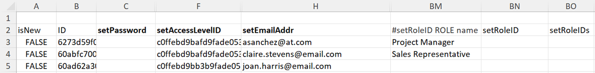

# Importation de données dans Workfront à l’aide d’un modèle de démarrage rapide

<!--Audited: 12/2023-->

Les débuts sont des classeurs Excel spécialement formatés que vous pouvez renseigner avec les données à importer dans Workfront. Adobe Workfront fournit un modèle de démarrage rapide que vous pouvez utiliser pour ce faire, comme expliqué dans la section [Importateur de données de démarrage rapide](../../../administration-and-setup/manage-workfront/using-kick-starts/kick-starts-data-importer.md).

Ce processus est divisé en 3 tâches principales :

* Tout d’abord, vous exportez un modèle de démarrage rapide sous forme de fichier de feuille de calcul.
* Deuxièmement, vous complétez la feuille de calcul avec vos données.
* Enfin, vous importez la feuille de calcul renseignée dans Workfront.

Chacune de ces procédures est décrite dans l&#39;ordre approprié dans le présent article.

## Conditions d’accès

+++ Développez pour afficher les exigences d’accès aux fonctionnalités de cet article.

Vous devez disposer des accès suivants pour effectuer les étapes de cet article :

<table style="table-layout:auto"> 
 <col> 
 <col> 
 <tbody> 
  <tr> 
   <td role="rowheader">Forfait Adobe Workfront</td> 
   <td>N’importe quelle</td> 
  </tr> 
  <tr> 
   <td role="rowheader">Licence Adobe Workfront</td> 
   <td>
   
 Nouvelle : standard

   ou
   
Actuelle : formule
</td> 
  </tr> 
  <tr> 
   <td role="rowheader">Configurations du niveau d’accès</td> 
   <td>Vous devez être un administrateur ou une administratrice de Workfront. </td> 
  </tr> 
 </tbody> 
</table>

Pour plus d’informations sur ce tableau, consultez [Conditions d’accès requises dans la documentation Workfront](/help/quicksilver/administration-and-setup/add-users/access-levels-and-object-permissions/access-level-requirements-in-documentation.md).

+++

## Limites

Vous pouvez importer un grand nombre d’objets dans Workfront à l’aide d’un modèle de démarrage rapide. Toutefois, tenez compte des restrictions suivantes :

* L&#39;import de données de cette manière ne met pas à jour les informations sur les enregistrements déjà présents dans Workfront.
* Vous ne pouvez importer que les nouveaux enregistrements et leurs informations.
* Importez pas plus de 2 000 enregistrements à la fois pour vous assurer que l&#39;import n&#39;expire pas.

## Exporter un modèle de démarrage rapide sous la forme d’un fichier de feuille de calcul

Lorsque vous exportez un modèle de démarrage rapide, vous recevez un classeur de feuille de calcul Excel vierge. Une fois la feuille de calcul téléchargée sur votre ordinateur, vous pouvez l’utiliser pour remplir vos informations, puis les réimporter dans Workfront.

Pour exporter un modèle de démarrage rapide :

{{step-1-to-setup}}

<!--
1. Click the **Main Menu** icon  in the upper-right corner of Adobe Workfront, then click **Setup** .  -->

1. Cliquez sur **Système** > **Importer des données (démarrage)**.

1. Sélectionnez les types d’informations à inclure.

   Chaque option sélectionnée représente un ensemble de plusieurs onglets dans la feuille de calcul exportée. Par exemple, si vous sélectionnez l’option **Rapport**, tous les objets nécessaires à la création d’un rapport seront inclus dans la feuille de calcul (vues, filtres, regroupements, rapports).

   Vous pouvez utiliser tous les types d’objets répertoriés ci-dessous pour importer des données dans Workfront. (La seule exception concerne l’option Niveaux d’accès . La feuille de données des niveaux d’accès d’un export est fournie à titre de référence ; elle vous permet d’attribuer un niveau d’accès à un nouveau compte utilisateur par son identifiant.)

   Le modèle de chacun des types d’objets peut être exporté dans les formats de fichiers suivants et contient les feuilles suivantes :

   <table style="table-layout:auto"> 
    <col> 
    <col> 
    <col> 
    <thead> 
     <tr> 
      <th> 
<strong>Objet</strong> 
 </th> 
      <th> 
<strong>Exports as</strong> 
 </th> 
      <th> 
<strong>Feuilles dans la feuille de calcul exportée</strong> 
 </th> 
     </tr> 
    </thead> 
    <tbody> 
     <tr> 
      <td scope="col"> 
Tableau de bord
 
Tous les tableaux de bord du système peuvent être exportés. Vous pouvez sélectionner jusqu’à 100 tableaux de bord spécifiques dans une seule exportation.
 </td> 
      <td scope="col">Exporte en tant que fichier ZIP</td> 
      <td scope="col"> 
Paramètre
 
Texte descriptif

Option de paramètre
 
Groupe de paramètres
 
Paramètre de catégorie
 
Catégorie
 
Rapport
 
Section d'onglet de portail
 
Tableau de bord
 
Préférences
 </td> 
     </tr> 
     <tr> 
      <td scope="col"> 
Rapport
 
Tous les rapports du système peuvent être exportés. Vous pouvez sélectionner jusqu’à 100 rapports spécifiques au sein d’une seule exportation.
 
Le démarrage rapide ne prend pas en charge les filtres en mode texte. Pour réussir l’exportation, les filtres de création de rapports doivent être basculés en mode standard.
 </td> 
      <td scope="col">Exporte en tant que fichier ZIP </td> 
      <td scope="col"> 
Paramètre
 
Texte descriptif
 
Option de paramètre
 
Groupe de paramètres
 
Paramètre de catégorie
 
Catégorie
 
Rapport
 
Préférences
 </td> 
     </tr> 
     <tr> 
      <td scope="col"> 
Approbation
 </td> 
      <td scope="col"> 
Exporte sous forme de fichier Excel
 </td> 
      <td scope="col"> 
Approbateur d'étape
 
Étape d’approbation
 
Approbation
 
Processus d'approbation
 
Préférences
 </td> 
     </tr> 
     <tr> 
      <td scope="col"> 
Données personnalisées
 </td> 
      <td scope="col"> 
Exporte sous forme de fichier Excel
 </td> 
      <td scope="col"> 
Paramètre
 
Texte descriptif
  
Option de paramètre
 
Groupe de paramètres
 
Paramètre de catégorie
 
Catégorie
 
Préférences
 </td> 
     </tr> 
     <tr> 
      <td scope="col"> 
Type de frais
 </td> 
      <td scope="col"> 
Exporte sous forme de fichier Excel
 </td> 
      <td> 
Type de frais
 
Préférences
 </td> 
     </tr> 
     <tr> 
      <td> 
Type d’heure
 </td> 
      <td scope="col"> 
Exporte sous forme de fichier Excel
 </td> 
      <td> 
Type d’heure
 
Préférences
 </td> 
     </tr> 
     <tr> 
      <td> 
Equipe
 </td> 
      <td scope="col"> 
Exporte sous forme de fichier Excel
 </td> 
      <td> 
 Membre d'équipe
 
Equipe
 
Préférences 
 </td> 
     </tr> 
     <tr> 
      <td> 
l’utilisateur ou de l’utilisatrice
 </td> 
      <td> 
Exporte sous forme de fichier Excel. Pour afficher la liste complète des options, cliquez sur <strong>Plus d’options</strong>.
 </td> 
      <td> 
l’utilisateur ou de l’utilisatrice
 
Préférences
 </td> 
     </tr> 
     <tr> 
      <td>Niveau d’accès</td> 
      <td>Exporte sous forme de fichier Excel</td> 
      <td> 
Niveau d’accès
 
Préférences
 </td> 
     </tr> 
     <tr> 
      <td>Affectation</td> 
      <td>Exporte sous forme de fichier Excel</td> 
      <td> 
Affectation
 
Préférences
 </td> 
     </tr> 
     <tr> 
      <td>Entreprise</td> 
      <td>Exporte sous forme de fichier Excel</td> 
      <td> 
 Entreprise
 
Préférences 
 </td> 
     </tr> 
     <tr> 
      <td>Modèle d'e-mail</td> 
      <td>Exporte sous forme de fichier Excel</td> 
      <td> 
Modèle d'e-mail
 
Préférences 
 </td> 
     </tr> 
     <tr> 
      <td>Frais</td> 
      <td>Exporte sous forme de fichier Excel</td> 
      <td> 
 Frais'
 
Préférences 
 </td> 
     </tr> 
     <tr> 
      <td>Page externe</td> 
      <td>Exporte sous forme de fichier Excel</td> 
      <td> 
 Page externe
 
Préférences 
 </td> 
     </tr> 
     <tr> 
      <td>Filtre</td> 
      <td>Exporte en tant que fichier ZIP</td> 
      <td> 
 Filtre
 
Préférences 
 </td> 
     </tr> 
     <tr> 
      <td>Groupe</td> 
      <td>Exporte sous forme de fichier Excel</td> 
      <td> 
 Groupe
 
Préférences 
 </td> 
     </tr> 
     <tr> 
      <td>Regroupement </td> 
      <td>Exporte en tant que fichier ZIP</td> 
      <td> 
 Regroupement 
 
Préférences 
 </td> 
     </tr> 
     <tr> 
      <td>Heure</td> 
      <td>Exporte sous forme de fichier Excel</td> 
      <td> 
 Heure
 
Préférences 
 </td> 
     </tr> 
     <tr> 
      <td>Problème</td> 
      <td>Exporte sous forme de fichier Excel</td> 
      <td> 
 Problème
 
Préférences 
 </td> 
     </tr> 
     <tr> 
      <td>Fonction</td> 
      <td>Exporte sous forme de fichier Excel</td> 
      <td> 
 Fonction
 
Préférences 
 </td> 
     </tr>

   <tr> 
      <td>Chemin jalonné</td> 
      <td> Exporte sous forme de fichier Excel</td> 
      <td> 
 Jalon
 
Chemin jalonné
 
Préférences 
 </td> 
     </tr>

   <tr> 
      <td>Note</td> 
      <td>Exporte sous forme de fichier Excel</td> 
      <td> 
 Note
 
Préférences 
 </td> 
     </tr> 
     <tr> 
      <td>Portfolio</td> 
      <td>Exporte sous forme de fichier Excel</td> 
      <td> 
 Portfolio
 
Préférences 
 </td> 
     </tr> 
     <tr> 
      <td>Projet</td> 
      <td>Exporte sous forme de fichier Excel</td> 
      <td> 
 File d'attente
 
Projet
 
Règle de transmission
 
Rubrique de file d'attente
 
Préférences 
 </td> 
     </tr> 
     <tr> 
      <td>Estimation de ressources</td> 
      <td>Exporte sous forme de fichier Excel</td> 
      <td> 
 Estimation de ressources
 
Préférences 
 </td> 
     </tr> 
     <tr> 
      <td>Risque</td> 
      <td>Exporte sous forme de fichier Excel</td> 
      <td> 
 Risque
 
Préférences 
 </td> 
     </tr> 
     <tr> 
      <td>Type de risque</td> 
      <td> Exporte sous forme de fichier Excel</td> 
      <td> 
 Type de risque
 
Préférences
 </td> 
     </tr> 
     <tr> 
      <td>Carte de score</td> 
      <td>Exporte sous forme de fichier Excel</td> 
      <td> 
Question sur la carte de score
 
Option de la carte de résultats
 
Carte de score
 
Préférences 
 </td> 
     </tr> 
     <tr> 
      <td>Tâche</td> 
      <td>Exporte sous forme de fichier Excel</td> 
      <td> 
 Tâche
 
Préférences 
 </td> 
     </tr> 
     <tr> 
      <td>Modèle</td> 
      <td> Exporte sous forme de fichier Excel</td> 
      <td> 
 File d'attente
 
Modèle
 
Règle de transmission
 
Rubrique de file d'attente
 
Préférences 
 </td> 
     </tr> 
     <tr> 
      <td>Modèle d'affectation</td> 
      <td>Exporte sous forme de fichier Excel</td> 
      <td> 
 Modèle d'affectation
 
Préférences 
 </td> 
     </tr> 
     <tr> 
      <td>Tâche de modèle</td> 
      <td>Exporte sous forme de fichier Excel</td> 
      <td> 
 Tâche de modèle
 
Préférences 
 </td> 
     </tr> 
     <tr> 
      <td>Feuille de temps</td> 
      <td> Exporte sous forme de fichier Excel</td> 
      <td> 
 Profil de feuille de temps
 
Feuille de temps
 
Préférences 
 </td> 
     </tr> 
     <tr> 
      <td>Afficher </td> 
      <td> 
Exporte en tant que fichier ZIP
 </td> 
      <td> 
 Afficher
 
Préférences 
 </td> 
     </tr> 
    </tbody> 
   </table>

1. Cliquez sur **Télécharger**.
1. Passez à la [Remplissage du modèle de feuille de calcul avec vos données](#populate-the-spreadsheet-template-with-your-data) pour remplir la feuille de calcul de modèle vierge avec vos informations.

## Remplissage du modèle de feuille de calcul avec vos données {#populate-the-spreadsheet-template-with-your-data}

* [Présentation des onglets (feuilles de données) inclus dans la feuille de calcul](#overview-of-the-tabs-data-sheets-included-in-the-spreadsheet)
* [Importer un enregistrement](#import-a-record)
* [Inclure des dates](#include-dates)
* [Utiliser des caractères génériques](#use-wildcards)
* [Substitution des noms d’attribut pour les identifiants](#attribute-name-substitution-for-ids)

### Présentation des onglets (feuilles de données) inclus dans la feuille de calcul

>[!TIP]
>
>Pour mieux comprendre comment vous devrez formater les informations dans chaque colonne lorsque vous renseignez le modèle Démarrage rapide , envisagez d’effectuer une exécution pratique en exportant une mise en route avec des données Workfront existantes sur les objets que vous essayez d’importer. Pour obtenir des instructions, reportez-vous à la section [Exportation de données d’Adobe Workfront via Kick-Starts](../../../administration-and-setup/manage-workfront/using-kick-starts/export-data-from-wf-via-kick-starts.md).

Lorsque vous ouvrez un modèle de démarrage rapide vierge, plusieurs onglets (feuilles de données) sont disponibles. Ils dépendent des objets que vous avez sélectionnés pour le téléchargement. Chacun représente un objet dans l’application, tel que le projet, les tâches, les heures, le tableau de bord et les utilisateurs :

Lorsque vous ouvrez l’un de ces onglets, la ligne 2 affiche les champs de chaque objet pouvant être défini au cours d’un import. Dans un en-tête de colonne, après le mot &quot;set&quot;, le nom du champ s&#39;affiche tel qu&#39;il apparaît dans la base de données. Ces champs se comportent comme des en-têtes de colonne.

>[!IMPORTANT]
>
>Pour éviter les erreurs, vérifiez les points suivants :
>
>* Ne supprimez pas la première ligne vide d’une feuille de calcul de démarrage rapide.
>* Ne supprimez, ne modifiez pas et ne réorganisez pas ces champs (en-têtes de colonne) de quelque manière que ce soit. Par exemple, ne modifiez pas leur ordre ou leur nom.
>* Ajoutez des valeurs à chaque champ qui s’affiche en gras dans l’en-tête de colonne. Il s’agit des champs obligatoires.
>
>     Toutefois, si un champ obligatoire contient une valeur par défaut définie dans les préférences du système, il n’est pas nécessaire de le renseigner.
>
>     Par exemple, sur l’onglet **PROJ Project** , les champs **setCondition** et **setConditionType** peuvent être laissés vides, mais les colonnes **setGroupID** et **setName** ne le peuvent pas.
>
>* Certains champs, y compris **setResourceRevenue** et **setEnteredByID**, sont générés automatiquement par le système. Si vous saisissez des données pour ces champs dans la feuille de calcul, le processus de démarrage rapide l’emportera lors du téléchargement de la feuille de calcul.

### Importation d’un enregistrement  {#import-a-record}

Chaque ligne de la feuille correspond à un objet unique.

1. Ajoutez des informations dans la colonne **isNew** :

   * Si l’objet que vous importez est nouveau, saisissez **TRUE** pour importer les données de la ligne. Cette valeur est sensible à la casse et doit toujours être en majuscules.
   * Si l’objet se trouve déjà dans Workfront, saisissez **FALSE** dans la colonne **isNew** pour ignorer la ligne. Cette valeur est sensible à la casse et doit toujours être en majuscules.

      * Les enregistrements qui existent déjà dans Workfront ne sont pas mis à jour.
      * Si vous avez téléchargé un modèle avec des données de Workfront, les objets existants sont déjà marqués par **FALSE**.
      * Si vous avez téléchargé un modèle vierge, il n’est pas nécessaire d’ajouter de nouvelles lignes pour les objets existants.

1. Ajoutez des informations dans la colonne **ID** de l’une des manières suivantes :

   * Si l’objet que vous importez est nouveau (et que vous avez tapé **TRUE** dans la colonne **isNew** ), saisissez n’importe quel numéro pour l’ID. Ce nombre doit être unique dans la feuille de calcul. Par exemple, si vous importez trois objets, vous pouvez leur attribuer respectivement l’identifiant 1, 2 et 3.

   * Si l’objet existe déjà dans Workfront (et que **FALSE** se trouve dans la colonne **isNew**) et que vous importez de nouvelles informations sur les objets existants, l’ID doit être le GUID alphanumérique existant dans Workfront pour cet objet.

   >[!TIP]
   >
   > Pour découvrir le GUID unique d’un objet dans Workfront, vous pouvez créer un rapport pour cet objet et ajouter la colonne ID au rapport. La valeur de chaque objet de cette colonne correspond au GUID de l’objet.

   * Les enregistrements qui existent déjà dans Workfront ne sont pas mis à jour.
   * Si vous avez téléchargé un modèle avec des données, les objets existants contiennent déjà le GUID en tant qu’identifiant.
   * Vous pouvez importer un nouvel objet en fonction d’un objet existant en remplaçant **FALSE** par **TRUE** dans la colonne **isNew**, en modifiant l’identifiant et en effectuant les ajustements de données nécessaires avant l’importation.

   

   * Lorsque vous importez un projet, vous devez indiquer un ID de groupe.

      * Si le groupe existe déjà dans Workfront, vous devez ajouter son identifiant unique au champ **setGroupID** pour le projet.
      * Si le groupe n’existe pas dans Workfront, vous pouvez ajouter la feuille **GROUP** à votre fichier d’importation, définir le champ **isNew** sur **TRUE** dans la feuille Group et indiquer un identifiant numérique pour le nouveau groupe dans la colonne **ID**. Le champ **setGroupID** du nouveau projet doit correspondre au **ID** numérique du nouveau groupe.

     **Exemple :** Pour un projet, la valeur affichée dans la colonne **setGroupID** doit correspondre à l’une des valeurs suivantes :

      * GUID d’un groupe existant dans votre instance Workfront
      * La valeur (nombre) dans la colonne ID de la feuille **GROUP** si vous créez un groupe au cours de l’importation.

1. Valeurs de saisie des champs obligatoires et de tous les autres champs que vous souhaitez renseigner lors de l&#39;import.
1. (Facultatif) Pour ajouter des données personnalisées :

   * Créez une nouvelle colonne pour chaque champ personnalisé que vous souhaitez inclure dans le processus d&#39;import.
   * Nommez chaque nouvelle colonne pour son champ personnalisé correspondant comme suit : **DE:[Nom du champ personnalisé tel qu’il apparaît dans Workfront]**. Par exemple, vous pouvez créer le champ personnalisé suivant : &quot;DE: Department&quot;.
   * Dans la colonne **setCategoryID**, saisissez le GUID du formulaire personnalisé existant sur lequel réside ce champ personnalisé. Ce champ est obligatoire lors de l’import de données personnalisées.
   * Si vous devez ajouter plusieurs valeurs de données dans un champ personnalisé (comme des boutons radio, des cases à cocher ou des listes), utilisez le délimiteur de données personnalisé de barre verticale &quot;|&quot; répertorié dans l’onglet Préférences pour séparer les valeurs.

     **Exemple :** Saisissez A|D sous la colonne DE:Parameters pour renseigner les départements A et D dans votre formulaire personnalisé.

### Inclure des dates  {#include-dates}

Workfront peut traiter la plupart des formats de date. Cependant, vous devez vous assurer que la colonne de date de la feuille de calcul est formatée en tant que date. L’importation échoue si la colonne est formatée en tant que nombre ou texte.

>[!TIP]
>
>Le format le plus populaire est le format MM/JJ/AAAA.
>
>Par exemple : 07/10/2023.

Workfront accepte également les valeurs d’heure dans le cadre de la date.

Par exemple : 07/10/2022 01:30 ou 07/10/2022 13:00.

Si vous omettez une heure dans la date, Workfront effectue l’une des opérations suivantes :

* Présume que l’heure est 00h00. Pour que le résultat de la date soit visible, le fuseau horaire système doit correspondre à votre fuseau horaire.
* S’il se trouve sur un objet associé à un planning, l’heure est décalée au premier moment autorisé par le planning.

>[!NOTE]
>
>Lorsque vous utilisez un horodatage UNIX, vous devez inclure trois zéros supplémentaires à la fin de la valeur.
>
>Par exemple, si votre horodatage est 7336899000, vous devez saisir 7336899000000 dans la cellule.

### Utilisation de caractères génériques {#use-wildcards}

Vous pouvez utiliser les caractères génériques suivants lorsque vous renseignez votre feuille de calcul de modèle de démarrage rapide :

<table style="table-layout:auto"> 
 <col> 
 <col> 
 <thead> 
  <tr> 
   <th> 
<strong>Caractère générique</strong> 
 </th> 
   <th> 
<strong>Comportement</strong> 
 </th> 
  </tr> 
 </thead> 
 <tbody> 
  <tr> 
   <td> 
$$AUJOURD’HUI
 </td> 
   <td> 
Utilisé sur un champ <strong>setDate</strong>, ce caractère générique définit la date sur minuit le jour où vous importez le coup d’envoi.
 
Vous pouvez modifier le caractère générique en utilisant la syntaxe standard autorisée avec le caractère générique sur un filtre.
 
Example: </b>"><b>Exemple : </b>Si vous souhaitez qu’un projet commence le lundi de la semaine où il est importé, quel que soit le jour où vous effectuez réellement l’importation, vous pouvez utiliser <strong>$$TODAYbw</strong>. La date de début prévue de votre projet est alors fixée à 00 h 00 le dimanche. Comme le planning du projet n'autorise probablement pas le travail à ce moment-là, il commencera lundi matin à 9 heures.
 </td> 
  </tr> 
  <tr> 
   <td> 
$$NOW
 </td> 
   <td> 
Utilisé sur un champ <strong>setDate</strong>, ce caractère générique définit la date en fonction du moment où vous créez l’enregistrement pendant l’importation de démarrage rapide.
 
Vous pouvez modifier le caractère générique en utilisant la syntaxe standard autorisée avec le caractère générique sur un filtre.
 
Example: </b>"><b>Exemple : </b>Si vous souhaitez qu’un projet démarre 3 heures après son importation, vous pouvez utiliser <strong>$$NOW+3h</strong>.
 </td> 
  </tr> 
  <tr> 
   <td> 
$$USER.ID
 </td> 
   <td> 
Utilisé sur un champ <strong>setAssignedToID</strong> ou basé sur un autre ID utilisateur, ce caractère générique affecte le travail ou associe d’une autre manière l’enregistrement à la personne qui effectue l’importation.
 </td> 
  </tr> 
  <tr> 
   <td> 
$$CUSTOMER
 </td> 
   <td> 
Ce caractère générique a été ajouté spécifiquement pour les importations des utilisateurs de démarrage rapide. Lors de la création d’un compte Workfront, un utilisateur disposant du niveau d’accès Administrateur système est créé. Le nom d’utilisateur attribué à l’administrateur par défaut peut être utilisé comme préfixe lors de la création d’autres utilisateurs dans le compte.
 
Comme les noms d’utilisateur doivent être uniques pour tous les clients, cela s’avère utile lorsque vous avez plusieurs individus avec des noms d’utilisateur très courants, tels que John Smith, qui peuvent avoir un nom d’utilisateur "jsmith". En ajoutant l’attribution du nom d’utilisateur en préfixe au nom d’utilisateur administrateur par défaut, vous garantissez que chaque nom d’utilisateur est unique (par exemple : <strong>$$CUSTOMER.jsmith</strong>).
 
Conseil : Pour vous assurer que les noms d’utilisateur sont uniques à l’échelle du système, utilisez une méthode plus élégante pour saisir l’adresse électronique de la personne dans le champ <strong>setUsername</strong>.
 </td> 
  </tr> 
 </tbody> 
</table>

### Substitution des noms d’attribut pour les identifiants  {#attribute-name-substitution-for-ids}

Bien qu’il soit recommandé d’utiliser les identifiants chaque fois que possible, il n’est parfois pas pratique de croiser les identifiants de référence d’une feuille à une autre lors de la définition d’une valeur **setAttributeID**. Vous pouvez référencer des valeurs par nom en modifiant simplement l’en-tête de colonne.

**Exemples :**

* **Importation de projet**

  Lors de l’importation de projets, définissez le **setGroupID** des projets en accédant à la feuille **GROUP Group**, en prenant note des ID de groupe respectifs, puis en les collant dans les cellules appropriées (**setGroupID**) sur la feuille **PROJ Project**.

  Cela est possible lorsque vous travaillez uniquement avec quelques groupes et projets, mais si vous travaillez avec plusieurs d’entre eux, ce n’est pas pratique.

  Pour effectuer la substitution du nom d’attribut pour l’exemple décrit ci-dessus, vous modifiez l’en-tête de colonne **setGroupID** en **#setGroupID GROUP name**. Vous pouvez ensuite référencer le groupe de chaque projet par nom.

  >[!NOTE]
  >
  >L’option permettant d’utiliser la substitution de nom d’attribut est limitée aux références pour les enregistrements existants uniquement. Vous ne pouvez pas utiliser la substitution de nom pour les objets que vous créez dans le même import.

* **Importation utilisateur**

  Lors de l’importation d’utilisateurs, remplissez le **setRoleID** à partir d’une liste de rôles dans l’onglet **Rôle du RÔLE** .

  Certains ID de rôle concernent des enregistrements déjà présents dans le compte, tandis que d’autres sont créés lors de l’importation.

  Pour les nouveaux enregistrements d’utilisateur affectés aux rôles existants, vous pouvez utiliser la substitution de nom. Pour les nouveaux enregistrements d’utilisateur affectés aux rôles nouvellement importés, vous ne pouvez pas.

  Voici comment utiliser les deux méthodes sur le même fichier d’importation :

   * Ajoutez une colonne dans la feuille de calcul à gauche de la colonne **setRoleID** .
   * Nommez la nouvelle colonne **#setRoleID ROLE name**.
   * Pour les affectations de rôles aux enregistrements existants, saisissez les noms des rôles dans la colonne **#setRoleID ROLE name**.

     Pour les affectations de rôles aux nouveaux enregistrements de rôle, saisissez l’ID que vous avez affecté dans la feuille Rôle du RÔLE dans setRoleID.

     

## Importation des données de feuille de calcul dans Workfront

Une fois que vous avez renseigné les données du modèle Excel, vous pouvez les transférer dans Workfront.

L’importation de démarrage rapide prend en charge les types de fichiers suivants :

* Excel (.xls ou .xlsx)
* Fichier compressé (.ZIP) (contenant uniquement des fichiers .xlsx ou .xls)

  >[!NOTE]
  >
  >Vous devez utiliser un fichier .ZIP lors de l’importation de feuilles de calcul Excel qui référencent les objets suivants :
  >
  >* Rapports
  >* Documents
  >* Avatars
  >* Affichage, filtrage ou regroupement de fichiers de propriétés
  >
  >Lors de l’utilisation d’un fichier d’importation compressé, le fichier .ZIP doit porter le même nom que le fichier .xlsx ou .xls, et tous les fichiers doivent être au même niveau de structure (pas de dossiers).

Pour importer les données de feuille de calcul du modèle dans Workfront :

<!--1. Click the **Main Menu** icon  in the upper-right corner of Adobe Workfront, then click **Setup** .-->

{{step-1-to-setup}}

1. Cliquez sur **Système** > **Importer des données (démarrage)**.

1. Dans la section **Télécharger les données avec la feuille de calcul de démarrage rapide** , cliquez sur **Choisir un fichier**, puis recherchez et sélectionnez la feuille de calcul renseignée.

1. Cliquez sur **Télécharger.**

   Si le téléchargement du fichier Excel prend plus de 5 minutes dans Workfront, l’application expire et Workfront ne peut pas le télécharger.

   Essayez d’importer vos données en petits lots d’objets.

1. (Conditionnel) Si vous utilisez Workfront Fusion, vous pouvez désormais activer vos FLO ou scénarios.
