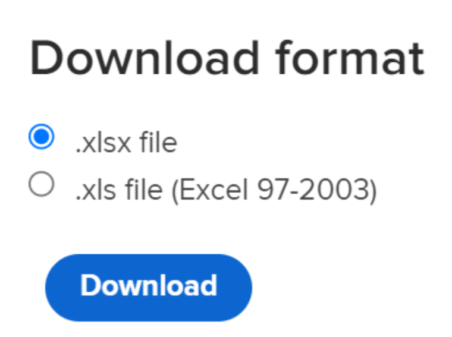
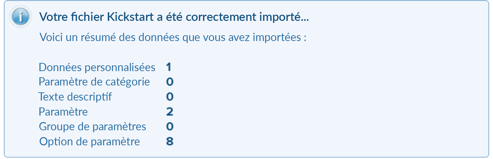

# Scénario de démarrage : Importation de champs personnalisés à plusieurs options dans Workfront

Vous pouvez importer des champs personnalisés avec plusieurs options dans Adobe Workfront à l’aide de la fonctionnalité de démarrage rapide.

Voici quelques exemples de champs personnalisés avec plusieurs options :

* Menu déroulant multi-sélection
* Menu déroulant
* Cases à cocher
* Cases d’option

Ces champs peuvent parfois comporter de nombreuses (parfois des centaines) options. Les importer à l’aide de la fonctionnalité Démarrage peut vous faire gagner beaucoup de temps, en tant qu’administrateur de Workfront, et vous permettre d’éviter les erreurs.

>[!IMPORTANT]
>
>Vous devez suivre les étapes décrites dans les sections ci-dessous, dans cet ordre, pour importer des champs personnalisés avec plusieurs options à l’aide d’un lancement rapide :
>
>1. Exportation de données personnalisées existantes à partir de Workfront (étape facultative)
>1. Exportation du modèle de démarrage rapide pour les données personnalisées
>1. Renseigner la feuille de calcul de démarrage rapide d’Excel
>1. Transfert de la feuille de calcul Excel vers Workfront

## Exportation de données personnalisées existantes à partir de Workfront (étape facultative)

Si vous ne connaissez pas la structure de la base de données Workfront ou si vous ne connaissez pas le fichier de démarrage de Workfront qui nécessite des informations d’importation, nous vous recommandons d’exporter d’abord un fichier de démarrage de à partir de Workfront avec des informations existantes, semblables à celles des champs que vous souhaitez importer.

Par exemple, si vous souhaitez importer des formulaires personnalisés ou des champs personnalisés, vous devez d’abord exporter un fichier de démarrage rapide avec des données personnalisées existantes.

L’export initial de vos données existantes vous permet de les analyser et de voir comment vos nouvelles données doivent être formatées.

Si vous maîtrisez bien la structure et les objets de la base de données Workfront, vous pouvez continuer avec la section ci-dessous.

Pour exporter des données existantes à partir de Workfront :

1. Cliquez sur **Menu principal > Configuration** dans le coin supérieur droit de l’interface de Workfront.
1. Développez le menu **System** à gauche, puis cliquez sur **Export Data (Kick-Starts)**.

   

1. Sélectionnez **Données personnalisées** dans la section **Que inclure** .

   

1. Sélectionnez **.xlsx file** dans la section **Télécharger le format** .

   >[!TIP]
   >
   >    Selon le volume de données personnalisées de votre système, cette opération peut prendre un certain temps.

   

1. Cliquez sur **Télécharger**. Un fichier .xlsx est téléchargé sur votre ordinateur. Accédez à et ouvrez-le.

   

1. Examinez le fichier téléchargé et notez les détails suivants :

   * Le fichier contient plusieurs feuilles. Vous n’aurez peut-être pas besoin de connaître les informations contenues dans chaque feuille, mais vous utiliserez certaines feuilles pour importer vos informations. Prenez le temps de vous familiariser avec leur contenu, et en particulier avec le format du contenu dans chaque feuille.
   * Accordez une attention particulière aux noms des colonnes et au format d’affichage des données de chaque colonne.
   * Vous ne devez pas modifier les noms ou l’ordre des colonnes dans aucune des feuilles. Les en-têtes de colonne indiquent les champs que vous devez remplir avec vos informations, dans chaque ligne. Si l’en-tête de colonne s’affiche en gras, il s’agit d’un champ obligatoire. Vous devez donc y inclure des informations.

   >[!IMPORTANT]
   >
   >Certains en-têtes de colonne peuvent ne pas s’afficher en gras, mais ils peuvent toujours être obligatoires.

   * Conservez le fichier téléchargé à des fins de référence ultérieure et passez à la section suivante.

## Exportation du modèle de démarrage rapide pour les données personnalisées

Après avoir analysé les informations sur les champs personnalisés existants de votre système, vous pouvez télécharger un nouveau modèle de démarrage rapide pour votre importation.

1. Cliquez sur **Menu principal > Configuration** dans le coin supérieur droit de l’interface de Workfront.

1. Développez le menu **System** à gauche.

1. Cliquez sur **Importer des données (Démarrages)**.

   

1. Dans la zone **Télécharger une feuille de calcul de démarrage rapide vide**, cochez la case **Données personnalisées** et cliquez sur **Télécharger**.

   

   Un fichier de démarrage rapide vierge est téléchargé sur votre ordinateur.

   >[!NOTE]
   >
   >Le nombre de feuilles dans le fichier, leur nom, ainsi que le nombre et le nom des colonnes de chaque feuille doivent être identiques à ceux du démarrage téléchargé dans la section ci-dessus qui contenait vos données personnalisées existantes.

## Renseigner la feuille de calcul de démarrage rapide d’Excel

Avant de remplir la feuille de calcul Excel, téléchargez le modèle de démarrage rapide comme décrit dans la section ci-dessus.

>[!IMPORTANT]
>
>N’essayez pas d’importer des informations à l’aide d’une feuille de calcul Excel ad hoc. Tous les tableurs pour importer des informations dans Workfront à l’aide de la fonctionnalité de démarrage rapide doivent correspondre au contenu des fichiers que vous téléchargez à partir de Workfront et décrits dans cet article.

Pour remplir la feuille de calcul Excel avec des informations sur les nouveaux champs personnalisés :

1. Ouvrez la feuille de calcul Excel que vous avez téléchargée dans la section précédente et notez plusieurs feuilles. Chaque feuille représente un objet dans l’application.

   >[!INFO]
   >
   >Par exemple, **Paramètre** (qui fait référence au champ personnalisé), **Option de paramètre** (qui fait référence à l’option Champ personnalisé), **Catégorie** (qui fait référence au formulaire personnalisé).
   >
   >Vous devez écrire les noms des objets et leurs attributs au format pris en charge par la base de données Workfront.
   >
   >Pour plus d’informations sur la signification de ces objets, consultez le [Glossaire de [!DNL Adobe Workfront] terminologie](../../../workfront-basics/navigate-workfront/workfront-navigation/workfront-terminology-glossary.md).
   >
   >Pour plus d’informations sur les noms des objets dans la base de données Workfront, voir l’ [explorateur d’API](../../../wf-api/general/api-explorer.md).
   >
   >

1. Assurez-vous que les informations suivantes sont correctement formatées :

   * La première ligne de chaque feuille doit rester vide, sinon l’importation génère une erreur.
   * Les en-têtes de colonne de chaque feuille représentent les attributs des objets qui peuvent être définis lors d’un import. Tous les en-têtes de colonne doivent rester dans l’ordre que vous trouvez lorsque vous exportez la feuille. Ils ne peuvent pas être renommés.
   * Les en-têtes de colonne en gras sont des champs obligatoires qui doivent avoir une valeur.

     >[!TIP]
     >
     >Certaines colonnes sont obligatoires, bien qu’elles ne soient pas en gras. Par exemple, les colonnes `isNew` et `ID` ne sont pas en gras, mais ce sont des champs obligatoires.

1. Sélectionnez la feuille `**PARAM Parameter`** et ajoutez des informations sur les nouveaux champs personnalisés dans les colonnes obligatoires suivantes :

   * **`isNew`** = entrez **`TRUE`** dans cette colonne pour chaque ligne qui représente un nouveau champ personnalisé. Cela indique que le champ est nouveau et qu’il n’existe pas dans Workfront.

     >[!TIP]
     >
     >    Si une ligne représente un champ existant déjà dans Workfront, vous devez saisir **`isNew`** = **`FALSE`**.

   * **`ID`** = doit être un nombre unique pour chaque ligne qui représente un nouveau champ. Vous pouvez utiliser n’importe quel nombre commençant par 1, à condition que chaque nouveau champ ait un numéro unique.
   * **`setDataType`** = pour chaque ligne représentant un nouveau champ, saisissez le type de données pris en charge par le champ. Le Type de données doit être renseigné tel qu&#39;il apparaîtra dans la base de données. Sélectionnez l’un des types de données suivants :
      * **`NMBR`** pour le nombre
      * **`CURC`** pour la devise
      * **`TEXT`** pour le texte
   * `**setDisplaySize**` = la taille d’affichage (&#39;**setDisplaySize**&#39;) pour les champs personnalisés de plusieurs options est toujours 0.
   * **`setDisplayType`** = pour chaque ligne représentant un nouveau champ, saisissez le type d’affichage du champ. Le Type d&#39;affichage doit être renseigné tel qu&#39;il apparaîtra dans la base de données.

     Pour les champs personnalisés à plusieurs options, sélectionnez l’une des options suivantes :

      * **`MULT`** pour la liste déroulante à sélection multiple
      * **`SLCT`** pour la liste déroulante
      * **`RDIO`** pour les boutons radio
      * **`CHCK`** pour les cases à cocher

     >[!TIP]
     >
     >Pour trouver les informations sur le type de données et le type d’affichage, reportez-vous à l’[API Explorer](../../../wf-api/general/api-explorer.md), développez l’objet **Paramètre** et recherchez ces attributs dans l’onglet **fields**.

   * **`setName`** = saisissez le nom des champs personnalisés tel que vous le souhaitez s’afficher dans Workfront.

     >[!INFO]
     >
     >Par exemple, nous pouvons importer deux champs personnalisés, appelés _Brand_, un champ de case à cocher et _Media_, un champ de bouton radio.

   * Les colonnes **`setName`** et **`setValue`** contiennent généralement les mêmes informations et doivent refléter les noms souhaités dans l’interface Workfront pour votre nouveau champ.

   La valeur d’un champ est le nom qui apparaît dans les rapports, par exemple, tandis que le nom s’affiche dans les formulaires personnalisés associés aux objets.

   Pour plus d’informations, consultez [Ajouter un champ personnalisé à un formulaire personnalisé](../../../administration-and-setup/customize-workfront/create-manage-custom-forms/add-a-custom-field-to-a-custom-form.md).

   

1. Sélectionnez la feuille **`POPT Parameter Options`** et ajoutez des informations sur les options de chaque champ personnalisé dans les colonnes obligatoires suivantes :

   * **`isNew`** = entrez **`TRUE`** dans cette colonne pour chaque ligne qui représente une nouvelle option de champ.

     >[!TIP]
     >
     >    Si une ligne représente une option existante, vous devez saisir **`isNew`** = **`FALSE`**.

   * **`ID`** = doit être un nombre unique pour chaque ligne qui représente une nouvelle option. Vous pouvez utiliser n’importe quel nombre commençant par 1, à condition que chaque nouvelle option ait un numéro unique.
   * **`setIsDefault`** = saisissez `TRUE` pour les options que vous souhaitez afficher par défaut et `FALSE` pour toutes les autres options, pour chaque champ.  Par exemple, nous voulons que _Nike_ soit l’option par défaut pour _Brand_ et _Print_ comme option par défaut pour _Media_.

     >[!TIP]
     >
     >Vous ne pouvez avoir qu’une seule option par défaut pour chaque champ.

   * **`setParameterID`** = les options correspondant au champ personnalisé _Brand_ ont un **`setParameterID`** de 1, et les options correspondant au _Media_ ont un **`setParameterID`**de 2. Les feuilles `PARAM` et `POPT` se croisent pour indiquer les options appartenant à quel champ personnalisé.
   * **`setDisplayOrder`**= la colonne de l’ordre d’affichage indique l’ordre dans lequel les options s’afficheront dans votre champ personnalisé. Vous pouvez commencer par 1 et continuer par ordre croissant pour toutes les options, quels que soient les champs auxquels elles appartiennent. L&#39;important ici est d&#39;avoir des nombres uniques pour chaque option.
   * Les colonnes **`setLabel`** et `**setValue`** contiennent généralement les mêmes informations et doivent refléter les noms souhaités dans l’interface utilisateur de Workfront. La valeur d’une option est le nom qui s’affiche dans les rapports, par exemple, tandis que le libellé s’affiche dans les formulaires personnalisés lorsqu’il est associé à un objet. Pour plus d’informations, consultez [Ajouter un champ personnalisé à un formulaire personnalisé](../../../administration-and-setup/customize-workfront/create-manage-custom-forms/add-a-custom-field-to-a-custom-form.md).
   * **`setIsHidden`** = entrez `TRUE` si vous souhaitez que l’une des options soit masquée.

   

1. (Facultatif) Si vous souhaitez également créer un formulaire personnalisé dans lequel vous pourrez ajouter les nouveaux champs ultérieurement, sélectionnez la feuille **`CTGY Category`** et mettez à jour les colonnes requises suivantes pour les informations de formulaire personnalisé :

   * **`isNew`** = entrez **`TRUE`** dans cette colonne pour chaque ligne qui représente un nouveau formulaire personnalisé.
   * **`ID`** = saisissez un nombre unique pour chaque ligne représentant un nouveau formulaire. Vous pouvez utiliser n’importe quel nombre commençant par 1, à condition que chaque nouvelle option ou ligne ait un numéro unique.
   * **`setGroupID`** = ajoutez l’ID de groupe de votre groupe d’accueil, ou tout autre groupe du système dont vous souhaitez que les membres aient accès à ce formulaire. Il s’agit d’un champ obligatoire.

   Pour découvrir le `ID` d&#39;un groupe, vous pouvez soit créer un rapport Groupe et ajouter le champ `ID` dans la vue, soit accéder à un groupe et trouver l&#39;URL du groupe. L’ID de groupe se trouve dans l’URL de la page du groupe. Par exemple, si l’URL du groupe est `https://companyName.my.workfront.com/group/575b000800467a6f66e747932c807464/members`, l’ID de groupe est `575b000800467a6f66e747932c807464`.

   * **`setCatObjCode` **= Il s’agit du code d’objet du type d’objet pour lequel vous souhaitez que le formulaire soit créé. Saisissez un code parmi les options suivantes :
      * **`CMPY`** pour la société
      * **`TASK`** pour la tâche
      * **`PROJ`** pour le projet
      * **`PORT`** pour le Portfolio
      * **`PRGM`** pour le programme
      * **`USER`** pour l’utilisateur
      * **`DOCU`** pour Document
      * **`OPTASK`** pour le problème
      * **`EXPNS`** pour les dépenses
      * **`ITRN`** pour itération
      * **`BILL`** pour les enregistrements de facturation
      * **`GROUP`** pour le groupe

     >[!NOTE]
     >
     >Dans le cas des formulaires à plusieurs objets, saisissez le premier objet que vous sélectionnez lors de la création d’un formulaire dans l’interface utilisateur. Par exemple, définissez `setCatObjCode` sur `TASK` si vous sélectionnez Tâche dans l’interface de Workfront, puis Problème, Portfolio, etc., mais que vous ne souhaitez pas que le formulaire soit disponible pour les projets.

   * **`setName`** = nom du formulaire personnalisé tel que vous souhaitez le voir apparaître dans l’interface de Workfront.

     

1. Enregistrez la feuille de calcul au format .xls ou .xlsx sur votre ordinateur. Votre feuille de calcul Excel est remplie et prête à être importée dans Workfront.

## Transfert de la feuille de calcul Excel vers Workfront

Après avoir suivi les étapes décrites dans les sections précédentes, procédez comme suit pour charger les nouveaux champs et formulaires dans Workfront :

1. Cliquez sur **Importer des données** **(Démarrages) **sous le menu **Menu principal > Configuration > Système** .

1. Cliquez sur **Choisir un fichier** sous la section **Charger des données avec la feuille de calcul de démarrage rapide**.

1. Recherchez la feuille de calcul Excel que vous avez préparée sur votre ordinateur et sélectionnez-la lorsque vous la trouvez.  Lorsque le fichier est reconnu par Workfront, le bouton Télécharger devient bleu.
1. Cliquez sur **Télécharger.**

   

1. Une notification indiquant que l’importation a réussi s’affiche. Selon le volume d’informations que vous importez, cette étape peut prendre quelques secondes à une minute.

   

   Les nouveaux champs et formulaires personnalisés se trouvent désormais dans votre système Workfront. Vous pouvez les trouver dans la zone Forms personnalisée de Configuration.

   >[!NOTE]
   >
   >Les nouveaux formulaires et les champs que vous avez importés ne sont pas encore connectés. Le formulaire est importé sans champ personnalisé. Vous devez ajouter manuellement les champs au nouveau formulaire personnalisé ou à un autre formulaire personnalisé existant.

   Pour plus d’informations sur l’ajout de champs à des formulaires personnalisés, voir [Ajout d’un champ personnalisé à un formulaire personnalisé](../../../administration-and-setup/customize-workfront/create-manage-custom-forms/add-a-custom-field-to-a-custom-form.md).

1. (Conditionnel) Si l’importation a échoué, vous recevez un message d’erreur indiquant le problème. Essayez d&#39;identifier le champ, la feuille et le numéro de ligne dans lesquels le problème s&#39;est produit, corrigez les informations du fichier Excel, puis essayez de réimporter le fichier une fois de plus.

   

1. (Conditionnel) Selon le problème, comme indiqué dans le message d’erreur, certaines informations peuvent déjà être importées. Vous devez effectuer l’une des opérations suivantes avant de pouvoir réimporter la feuille :

   * Supprimez les informations importées de Workfront depuis la zone Forms personnalisé, puis apportez la correction indiquée par le message d’erreur.
   * Indiquez qu’un champ ou un formulaire se trouve déjà dans le système pour les champs ou formulaires déjà importés, puis apportez la correction.
Pour indiquer qu’un champ ou un formulaire personnalisé se trouve déjà dans Workfront, vous devez vous assurer que le champ `inNew` est marqué comme `FALSE` dans les feuilles qui contiennent des informations sur le formulaire (`CTGY`) ou le champ (`PARAM`) sur la feuille de lancement de l’importation.
