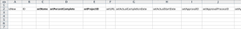

# Scénario de démarrage : préparation simple de l’importation de projets et de tâches

Décrit en détail les paramètres et les contrôles disponibles pour un projet de base et l’importation de tâches à l’aide de la méthode de démarrage rapide.

## Scénario

L’équipe d’implémentation préfère importer les informations sur les projets et les tâches pour les projets principaux plutôt que de saisir manuellement ces données dans le système.

* [Projets](#projects)
* [Liste des tâches](#task-list)

### Projets {#projects}

Le tableau suivant affiche quatre projets et leurs détails de base qui doivent être mappés dans les formats de fichier Démarrage rapide .

Ce scénario suppose que les utilisateurs sont déjà importés dans Adobe Workfront. Si les utilisateurs ne se trouvent pas déjà dans Workfront, remplacez des noms différents ou complétez le scénario de démarrage rapide avec les utilisateurs avant ce scénario.

1. Implémentez Workfront.

   | Date de début prévue | Aujourd’hui |
   |---|---|
   | Gestionnaire de projet | Jennifer Campbell |
   | Sponsor du projet | Marc Lewis |
   | Groupe | Marketing |
   | Entreprise | *YourCompany* |

   {style=&quot;table-layout:auto&quot;}

1. Mettre en oeuvre le système des ressources humaines.

   | Date de début prévue | 14 juillet 2020XX |
   |---|---|
   | Gestionnaire de projet | Pam Reynolds |
   | Sponsor du projet | Marc Lewis |
   | Groupe | Marketing |
   | Entreprise | *YourCompany* |

   {style=&quot;table-layout:auto&quot;}

1. Mise en oeuvre du système de gestion des documents.

   | Date de début prévue | 22 août 2020XX |
   |---|---|
   | Gestionnaire de projet | Jennifer Campbell |
   | Sponsor du projet | Ray Andrews |
   | Groupe | IT |
   | Entreprise | *YourCompany* |

   {style=&quot;table-layout:auto&quot;}

1. Mise En Oeuvre Du Nouveau Système De Calendrier.

   | Date de début prévue | 6 septembre 20XX |
   |---|---|
   | Gestionnaire de projet | Pam Reynolds |
   | Sponsor du projet | Ray Andrews |
   | Groupe | IT |
   | Entreprise | *YourCompany* |

   {style=&quot;table-layout:auto&quot;}

### Liste des tâches {#task-list}

La liste de tâches suivante affiche des listes de tâches trop simplifiées pour les projets. La seule différence entre les projets est la date de début et l’état d’avancement de chaque projet.

Les tâches parentes héritent des tâches Durée, Travail et Pourcentage d’achèvement des tâches enfants. Il n’est pas nécessaire de définir ces valeurs pour qui deviendra des tâches de résumé.

>[!NOTE]
>
>Les instructions fournies dans ce scénario ne sont pas aussi explicites que les instructions étape par étape fournies dans [Scénario de démarrage : Préparation du coup d’envoi de l’entreprise, du groupe, du rôle et de l’utilisateur](../../../administration-and-setup/manage-workfront/using-kick-starts/kick-starts-scenario-company-group-role-user-prep.md). L’hypothèse est que vous avez déjà appris à rechercher et à copier des valeurs dans les feuilles Société et Groupe. Par conséquent, ces étapes seront mentionnées, mais pas spécifiquement décrites.

1. Configurer.
1. Importez des utilisateurs.

   <table style="table-layout:auto"> 
    <col width="50%"> 
    <col width="50%"> 
    <tbody> 
     <tr> 
      <td role="rowheader">Affecté à</td> 
      <td>Ray Andrews</td> 
     </tr> 
     <tr> 
      <td role="rowheader">Tâche parente</td> 
      <td>1</td> 
     </tr> 
     <tr> 
      <td role="rowheader">Durée</td> 
      <td>1 heure</td> 
     </tr> 
     <tr> 
      <td role="rowheader">Travail</td> 
      <td>1 heure</td> 
     </tr> 
     <tr> 
      <td role="rowheader">Pourcentage d’achèvement</td> 
      <td> 
Workfront : 0 %
 
HR : 100 %
 
Documents : 100 %
 
Calendrier : 100 %
 </td> 
     </tr> 
    </tbody> 
   </table>

1. Définissez des autorisations.

   <table style="table-layout:auto"> 
    <col width="50%"> 
    <col width="50%"> 
    <tbody> 
     <tr> 
      <td role="rowheader">Affecté à</td> 
      <td>Ray Andrews</td> 
     </tr> 
     <tr> 
      <td role="rowheader">Tâche parente</td> 
      <td>1</td> 
     </tr> 
     <tr> 
      <td role="rowheader">Ant</td> 
      <td>2</td> 
     </tr> 
     <tr> 
      <td role="rowheader">Durée</td> 
      <td>1 heure</td> 
     </tr> 
     <tr> 
      <td role="rowheader">Travail</td> 
      <td>1 heure</td> 
     </tr> 
     <tr> 
      <td role="rowheader">Pourcentage d’achèvement</td> 
      <td> 
Workfront : 0 %
 
HR : 100 %
 
Documents : 100 %
 
Calendrier : 100 %
 </td> 
     </tr> 
    </tbody> 
   </table>

1. Créez des groupes.

   <table style="table-layout:auto"> 
    <col width="50%"> 
    <col width="50%"> 
    <tbody> 
     <tr> 
      <td role="rowheader">Affecté à</td> 
      <td>Ray Andrews</td> 
     </tr> 
     <tr> 
      <td role="rowheader">Tâche parente</td> 
      <td>1</td> 
     </tr> 
     <tr> 
      <td role="rowheader">Ant</td> 
      <td>4</td> 
     </tr> 
     <tr> 
      <td role="rowheader">Durée</td> 
      <td>2 jours</td> 
     </tr> 
     <tr> 
      <td role="rowheader">Travail</td> 
      <td>4 heures</td> 
     </tr> 
     <tr> 
      <td role="rowheader">Pourcentage d’achèvement</td> 
      <td> 
Workfront : 0 %
 
HR : 100 %
 
Documents : 100 %
 
Calendrier : 25 %
 </td> 
     </tr> 
    </tbody> 
   </table>

1. Préparez la formation.

   <table style="table-layout:auto"> 
    <col width="50%"> 
    <col width="50%"> 
    <tbody> 
     <tr> 
      <td role="rowheader">Affecté à</td> 
      <td>Chris Manning</td> 
     </tr> 
     <tr> 
      <td role="rowheader">Durée</td> 
      <td>2 jours</td> 
     </tr> 
     <tr> 
      <td role="rowheader">Travail</td> 
      <td>4 heures</td> 
     </tr> 
     <tr> 
      <td role="rowheader">Pourcentage d’achèvement</td> 
      <td> 
Workfront : 0 %
 
HR : 100 %
 
Documents : 50 %
 
Calendrier : 100 %
 </td> 
     </tr> 
    </tbody> 
   </table>

1. Construire des politiques d’assistance en cours.

   <table style="table-layout:auto"> 
    <col width="50%"> 
    <col width="50%"> 
    <tbody> 
     <tr> 
      <td role="rowheader">Affecté à</td> 
      <td>Chris Manning</td> 
     </tr> 
     <tr> 
      <td role="rowheader">Durée</td> 
      <td>2 jours</td> 
     </tr> 
     <tr> 
      <td role="rowheader">Travail</td> 
      <td>4 heures</td> 
     </tr> 
     <tr> 
      <td role="rowheader">Pourcentage d’achèvement</td> 
      <td> 
Workfront : 0 %
 
HR : 100 %
 
Documents : 50 %
 
Calendrier : 0 %
 </td> 
     </tr> 
    </tbody> 
   </table>

1. Déployez.

   | Ant | 1, 6, 7 |
   |---|---|

   {style=&quot;table-layout:auto&quot;}

1. Formation des utilisateurs.

   <table style="table-layout:auto"> 
    <col width="50%"> 
    <col width="50%"> 
    <tbody> 
     <tr> 
      <td role="rowheader">Affecté à</td> 
      <td>Chris Manning</td> 
     </tr> 
     <tr> 
      <td role="rowheader">Tâche parente</td> 
      <td>8</td> 
     </tr> 
     <tr> 
      <td role="rowheader">Durée</td> 
      <td>1 jour</td> 
     </tr> 
     <tr> 
      <td role="rowheader">Travail</td> 
      <td>2 heures</td> 
     </tr> 
     <tr> 
      <td role="rowheader">Pourcentage d’achèvement</td> 
      <td> 
Workfront : 0 %
 
HR : 0 %
 
Documents : 0 %
 
Calendrier : 0 %
 </td> 
     </tr> 
    </tbody> 
   </table>

## Modèle de téléchargement

Accédez à la page Démarrages de session . Sélectionnez les objets Société, Groupe, Projet, Tâche et Utilisateur . Cochez la case Inclure les données existantes (effectuez cette opération pour référencer rapidement les ID d’entreprise, de groupe et d’utilisateur). Cliquez sur le bouton Télécharger .

## Détails du projet d’entrée

Ouvrez le fichier Workfront.xlsx que vous venez de télécharger. Accédez à la feuille de projet PROJ .

\
À moins que vous n’ayez déjà créé des projets dans Workfront, il doit être vide.\

>[!NOTE]
>
>Pensez à utiliser l’outil de blocage des volets de la feuille de calcul et/ou à masquer ou supprimer les colonnes inutiles pour faciliter l’utilisation de la feuille. Veillez toutefois à ne pas supprimer les colonnes ou colonnes requises à utiliser ultérieurement.

Définissez les valeurs des champs de projet suivants :

* **Définir la colonne isNew**
Saisissez TRUE dans les lignes 3 à 6 pour la colonne isNew .
* **Définition d’identifiants uniques**
Saisissez un identifiant unique dans chaque ligne pour la colonne ID — En règle générale, les entiers commençant à 1 fonctionnent bien lors de la création de nouveaux enregistrements.
* **Définition des noms de projet**
Saisissez les noms de chaque projet dans la colonne setName .
* **Définition du planning du projet**

   Saisissez l’identifiant du planning que vous souhaitez que le projet utilise dans le champ setScheduleID .

* **Définition de la date de début prévue du projet**

   Saisissez la date et l’heure dans la colonne setScheduleStartDate avec l’heure et la date de début du projet. S’il n’est pas renseigné, Workfront importe le projet avec la date du jour en cours et un horodatage de minuit en fonction du fuseau horaire du navigateur.

* **Définition des numéros de tâche**
Saisissez des valeurs dans la colonne setTaskNumber pour contrôler l’ordre dans lequel les tâches apparaîtront dans le plan du projet.
* **Indiquez les dates du projet.**
Saisissez la Date de début planifiée pour chaque projet dans la colonne setScheduleStartDate .
* **Définissez d’autres détails nécessaires.**
Renseignez d’autres détails, tels qu’une description ou l’état actuel, si nécessaire. Recherchez les ID de groupe pour chaque projet dans la feuille Groupe GROUP et saisissez-les dans la colonne setGroupID pour les projets respectifs. Recherchez l’ID de société pour les projets dans la feuille de calcul Société CMPY et saisissez-le dans la colonne setCompanyID . Recherchez l’ID utilisateur pour chaque propriétaire de projet dans la feuille utilisateur de l’utilisateur et saisissez-le dans la colonne setOwnerID . Recherchez l’ID utilisateur de chaque sponsor de projet dans la feuille utilisateur USER et saisissez-le dans la colonne setSponsorID .

>[!NOTE]
>
>Vous pouvez rechercher des valeurs acceptables pour les champs État et Priorité en examinant l’état et les préférences de priorité de chaque objet dans la zone Configuration du processus de Workfront.

## Détails de la tâche d’entrée

Vous pouvez ajouter des informations sur les tâches du projet, car vous importez le projet à l’aide de lancements.

Ouvrez le fichier Workfront.xlsx que vous venez de télécharger. **Accédez à la feuille TÂCHE .**

Cette feuille doit être vide, sauf si vous avez déjà créé des tâches dans Workfront.

Le moyen le plus simple de mapper des tâches est un projet à la fois (en particulier lorsque les tâches sont identiques pour chaque projet). Vous pouvez ensuite copier le plan de tâches du premier projet et apporter de petits ajustements au plan de tâches des projets suivants. Les étapes restantes supposent que vous créez des tâches uniquement pour le projet Mise en oeuvre de Workfront . Selon le scénario, vous importez 9 tâches par projet. Par conséquent, saisissez TRUE dans les lignes 3 à 11 pour la colonne isNew .

Définissez les valeurs des champs de tâche suivants :

* **Définition des ID**
Saisissez un identifiant unique dans chaque ligne pour la colonne ID.
* **Définir les noms**
Saisissez les noms des tâches dans la colonne setName .
* **Confirmation de l’ID de projet**
Saisissez l’identifiant que vous avez défini pour le projet de mise en oeuvre de Workfront ; consultez la feuille de projet PROJ pour vous assurer qu’il s’agit de l’ID correct.
* **Définition des utilisateurs**
Accédez à la feuille Utilisateur de l’utilisateur pour rechercher l’identifiant de l’utilisateur affecté à chaque tâche et saisissez ces valeurs dans les cellules respectives de la colonne setAssignedToID .
* **Identification des relations de tâche**
Pour les tâches 2 à 5, saisissez 1 dans la colonne setParentID . Pour la tâche 9, saisissez 8 dans la colonne setParentID . Dans la colonne setPredecessorString , saisissez le numéro de la tâche pour chaque tâche de prédécesseur. Dans les cas où une tâche comporte plusieurs prédécesseurs, comme la tâche 8 dans ce scénario, vous devrez utiliser une virgule pour séparer chaque ID de tâche de prédécesseur. Les prédécesseurs peuvent être définis avec des décalages sur les relations non-finish-Start à l’aide du raccourci décrit dans l’article Création de relations avec le prédécesseur .
* **Définir la durée**
Définissez la durée de chaque tâche en saisissant le nombre d’heures, de jours, de semaines ou de mois pour la tâche dans le champ setDuration . Ensuite, saisissez l’unité de durée dans le champ setDurationUnit .

   |  | Valeur acceptable |
   |---|---|
   | Minutes | L |
   | Heures | h |
   | Jours | Dés |
   | Semaines | M |
   | Mois | M |

   Les minutes peuvent également être représentées sous la forme d’une fraction d’heure (par exemple, minutet = 5 heures).

* Définissez la quantité de travail pour chaque tâche dans le champ setWorkRequired . Ensuite, saisissez l’unité de travail dans le champ setWorkUnit . Si la valeur Work Required est différente de la durée, vous devrez également saisir un A dans le champ setDurationType .

   | Type de durée | Valeur acceptable |
   |---|---|
   | Calcul d&#39;affectation | A |
   | Calcul de travail | M |
   | Piloté par l&#39;effort | Dés |
   | Simple | S |

* Saisissez la représentation numérique complète du pourcentage terminé dans le champ setPercentComplete pour chaque tâche. Cette valeur ne doit pas inclure le symbole de pourcentage (%).
* Ajoutez une description et d’autres détails pour chaque tâche que vous créez, si nécessaire.

   

* Les colonnes setScheduleStartDate et setTaskConstraint ne sont pas utilisées pour construire la chronologie de ce projet, car nous nous appuyons sur les relations de prédécesseur. Vous pouvez saisir plutôt une date pour chaque tâche. Dans ce cas, veillez également à fournir une contrainte de tâche valide dans la colonne setTaskConstraint . Pour plus d’informations sur les valeurs valides de ce champ, consultez la Contrainte de tâche et les articles connexes.

   Dans ce cas, la méthode la plus simple pour créer les tâches des autres projets que vous importez consiste à copier les tâches que vous venez de définir et à les coller ci-dessous, à partir de la ligne 12. Vous pourrez ensuite :

   1. Renumérotez les valeurs de la colonne ID.
   1. Mettez à jour la colonne setProjectID avec la valeur que vous définissez pour le projet suivant.
   1. Mettez à jour les valeurs setParentID et setPredecessorString pour refléter les nouveaux ID affectés aux tâches de ce projet.
   1. Mise à jour des affectations de tâche et pourcentage terminé.
   1. Répétez ces étapes pour les tâches du projet suivant.

* **Importation du fichier Excel**

   Suivez les instructions de la section [Importer des données dans Adobe Workfront à l’aide d’un modèle de démarrage rapide](../../../administration-and-setup/manage-workfront/using-kick-starts/import-data-via-kickstarts.md).
