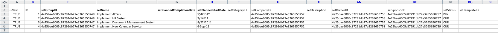

# Scénario Kickstart : préparation d’un projet simple et de l’import de tâches

Décrit en détail les paramètres et commandes disponibles pour une importation de base de projet et de tâche à l&#39;aide de la méthode Kickstart.

## Scénario

L’équipe d’implémentation préfère importer les informations de projet et de tâche pour les projets actifs plutôt que d’entrer manuellement ces données dans le système.

* [Projets](#projects)
* [Liste de tâches](#task-list)

### Projets {#projects}

Le tableau suivant présente quatre projets et leurs détails de base qui doivent être mappés aux formats de fichiers Kickstart.

Ce scénario suppose que les utilisateurs et utilisatrices sont déjà importés dans Adobe Workfront. Si les utilisateurs et utilisatrices ne se trouvent pas déjà dans Workfront, ajoutez des noms différents ou complétez le scénario Kickstart avec les utilisateurs et utilisatrices avant ce scénario.

1. Implémentez Workfront.

   | Date de début prévue | Aujourd’hui |
   |---|---|
   | Gestionnaire de projet | Jennifer Campbell |
   | Sponsor du projet | Marc Lewis |
   | Groupe | Marketing |
   | Entreprise | *YourCompany* |

   {style="table-layout:auto"}

1. Implémentez le système des ressources humaines.

   | Date de début prévue | 14 juillet 20xx |
   |---|---|
   | Gestionnaire de projet | Pam Reynolds |
   | Sponsor du projet | Marc Lewis |
   | Groupe | Marketing |
   | Entreprise | *YourCompany* |

   {style="table-layout:auto"}

1. Implémentez le système de gestion des documents.

   | Date de début prévue | 22 août 20xx |
   |---|---|
   | Gestionnaire de projet | Jennifer Campbell |
   | Sponsor du projet | Ray Andrews |
   | Groupe | IT |
   | Entreprise | *YourCompany* |

   {style="table-layout:auto"}

1. Implémentez le nouveau système de calendrier.

   | Date de début prévue | 6 septembre 20xx |
   |---|---|
   | Gestionnaire de projet | Pam Reynolds |
   | Sponsor du projet | Ray Andrews |
   | Groupe | IT |
   | Entreprise | *YourCompany* |

   {style="table-layout:auto"}

### Liste de tâches {#task-list}

La liste de tâches suivante affiche des listes de tâches grandement simplifiées pour les projets. La seule différence entre les projets est la date de début et l’état d’avancement de chaque projet.

Les tâches parent héritent de la Durée, du Travail et du Pourcentage terminé des tâches enfant. Il n’est pas nécessaire de définir ces valeurs, car ces tâches deviendront des tâches récapitulatives.

>[!NOTE]
>
>Les instructions fournies dans ce scénario ne sont pas aussi explicites que les instructions détaillées étape par étape fournies dans le [Scénario Kickstart : préparation Kickstart entreprise, groupe, rôle et utilisateur ou utilisatrice](../../../administration-and-setup/manage-workfront/using-kick-starts/kick-starts-scenario-company-group-role-user-prep.md). Il est supposé que vous avez déjà appris à rechercher et à copier des valeurs à partir des feuilles Entreprise et Groupe. Par conséquent, ces étapes seront mentionnées mais pas détaillées.

1. Configurez.
1. Importez des utilisateurs et utilisatrices.

   <table style="table-layout:auto"> 
    <col width="50%"> 
    <col width="50%"> 
    <tbody> 
     <tr> 
      <td role="rowheader">Affecté à</td> 
      <td>Ray Andrews</td> 
     </tr> 
     <tr> 
      <td role="rowheader">Tâche parent</td> 
      <td>1</td> 
     </tr> 
     <tr> 
      <td role="rowheader">Durée</td> 
      <td>1 heure</td> 
     </tr> 
     <tr> 
      <td role="rowheader">Travail</td> 
      <td>1 heure</td> 
     </tr> 
     <tr> 
      <td role="rowheader">Pourcentage d’achèvement</td> 
      <td> 
Workfront : 0 %
 
Ressources humaines : 100 %
 
Documents : 100 %
 
Calendrier : 100 %
 </td> 
     </tr> 
    </tbody> 
   </table>

1. Définissez des autorisations.

   <table style="table-layout:auto"> 
    <col width="50%"> 
    <col width="50%"> 
    <tbody> 
     <tr> 
      <td role="rowheader">Affecté à</td> 
      <td>Ray Andrews</td> 
     </tr> 
     <tr> 
      <td role="rowheader">Tâche parent</td> 
      <td>1</td> 
     </tr> 
     <tr> 
      <td role="rowheader">Ant</td> 
      <td>2</td> 
     </tr> 
     <tr> 
      <td role="rowheader">Durée</td> 
      <td>1 heure</td> 
     </tr> 
     <tr> 
      <td role="rowheader">Travail</td> 
      <td>1 heure</td> 
     </tr> 
     <tr> 
      <td role="rowheader">Pourcentage d’achèvement</td> 
      <td> 
Workfront : 0 %
 
Ressources humaines : 100 %
 
Documents : 100 %
 
Calendrier : 100 %
 </td> 
     </tr> 
    </tbody> 
   </table>

1. Créez des groupes.

   <table style="table-layout:auto"> 
    <col width="50%"> 
    <col width="50%"> 
    <tbody> 
     <tr> 
      <td role="rowheader">Affecté à</td> 
      <td>Ray Andrews</td> 
     </tr> 
     <tr> 
      <td role="rowheader">Tâche parent</td> 
      <td>1</td> 
     </tr> 
     <tr> 
      <td role="rowheader">Ant</td> 
      <td>4</td> 
     </tr> 
     <tr> 
      <td role="rowheader">Durée</td> 
      <td>2 jours</td> 
     </tr> 
     <tr> 
      <td role="rowheader">Travail</td> 
      <td>4 heures</td> 
     </tr> 
     <tr> 
      <td role="rowheader">Pourcentage d’achèvement</td> 
      <td> 
Workfront : 0 %
 
Ressources humaines : 100 %
 
Documents : 100 %
 
Calendrier : 25 %
 </td> 
     </tr> 
    </tbody> 
   </table>

1. Préparer la formation.

   <table style="table-layout:auto"> 
    <col width="50%"> 
    <col width="50%"> 
    <tbody> 
     <tr> 
      <td role="rowheader">Affecté à</td> 
      <td>Chris Manning</td> 
     </tr> 
     <tr> 
      <td role="rowheader">Durée</td> 
      <td>2 jours</td> 
     </tr> 
     <tr> 
      <td role="rowheader">Travail</td> 
      <td>4 heures</td> 
     </tr> 
     <tr> 
      <td role="rowheader">Pourcentage d’achèvement</td> 
      <td> 
Workfront : 0 %
 
Ressources humaines : 100 %
 
Documents : 50 %
 
Calendrier : 100 %
 </td> 
     </tr> 
    </tbody> 
   </table>

1. Créez des politiques d’assistance continues.

   <table style="table-layout:auto"> 
    <col width="50%"> 
    <col width="50%"> 
    <tbody> 
     <tr> 
      <td role="rowheader">Affecté à</td> 
      <td>Chris Manning</td> 
     </tr> 
     <tr> 
      <td role="rowheader">Durée</td> 
      <td>2 jours</td> 
     </tr> 
     <tr> 
      <td role="rowheader">Travail</td> 
      <td>4 heures</td> 
     </tr> 
     <tr> 
      <td role="rowheader">Pourcentage d’achèvement</td> 
      <td> 
Workfront : 0 %
 
Ressources humaines : 100 %
 
Documents : 50 %
 
Calendrier : 0 %
 </td> 
     </tr> 
    </tbody> 
   </table>

1. Déployez.

   | Ant | 1, 6, 7 |
   |---|---|

   {style="table-layout:auto"}

1. Formez les utilisateurs et utilisatrices.

   <table style="table-layout:auto"> 
    <col width="50%"> 
    <col width="50%"> 
    <tbody> 
     <tr> 
      <td role="rowheader">Affecté à</td> 
      <td>Chris Manning</td> 
     </tr> 
     <tr> 
      <td role="rowheader">Tâche parent</td> 
      <td>8</td> 
     </tr> 
     <tr> 
      <td role="rowheader">Durée</td> 
      <td>1 jour</td> 
     </tr> 
     <tr> 
      <td role="rowheader">Travail</td> 
      <td>2 heures</td> 
     </tr> 
     <tr> 
      <td role="rowheader">Pourcentage d’achèvement</td> 
      <td> 
Workfront : 0 %
 
Ressources humaines : 0 %
 
Docs : 0 %
 
Calendrier : 0 %
 </td> 
     </tr> 
    </tbody> 
   </table>

## Télécharger un modèle

Accédez à la page Kickstart. Sélectionnez les objets Entreprise, Groupe, Projet, Tâche et Utilisateur ou utilisatrice. Cochez la case Inclure les données existantes (pour référencer rapidement les identifiants d’entreprise, de groupe et d’utilisateur ou d’utilisatrice). Cliquez sur le bouton Télécharger.

## Saisissez les détails du projet.

Ouvrez le fichier Workfront.xlsx que vous venez de télécharger. Accédez à la feuille de projet PROJ.

À moins que vous n’ayez déjà créé des projets dans Workfront, il doit être vide.

Définissez les valeurs des champs de projet suivants :

* **Définir la colonne isNew**
Saisissez TRUE dans les lignes 3 à 6 de la colonne isNew.
* **Définir des identifiants uniques**
Saisissez un identifiant unique dans chaque ligne de la colonne ID ; des nombres entiers commençant par 1 conviennent généralement bien lors de la création de nouveaux enregistrements.
* **Définir les noms des projets**
Saisissez les noms de chaque projet dans la colonne setName.
* **Définir le planning du projet**

  Saisissez l’identifiant du planning que le projet doit utiliser dans le champ setScheduleID.

* **Définir la date de début prévue du projet**

  Saisissez la date et l’heure dans la colonne setPlannedStartDate avec l’heure et la date auxquelles le projet doit démarrer. Si ce champ n’est pas renseigné, Workfront importe le projet avec la date du jour et la date et l’heure de ce jour à minuit en fonction du fuseau horaire du navigateur.

* **Définir les numéros de tâches**
Saisissez des valeurs dans la colonne setTaskNumber pour déterminer l’ordre dans lequel les tâches apparaîtront dans le plan du projet.
* **Indiquer les dates du projet**
Saisissez la date de début prévue de chaque projet dans la colonne setPlannedStartDate.
* **Définir les autres détails nécessaires**
Renseignez d’autres détails, comme une description ou le statut actuel, si nécessaire. Recherchez les identifiants de groupes de chaque projet sur la feuille de groupe GROUP et saisissez-les dans la colonne setGroupID des projets respectifs. Recherchez l’identifiant d’entreprise des projets sur la feuille d’entreprise CMPY et saisissez-le dans la colonne setCompanyID. Recherchez l’ID d’utilisateur ou d’utilisatrice de chaque personne propriétaire de projet sur la feuille d’utilisateur ou d’utilisatrice USER et saisissez-le dans la colonne setOwnerID. Recherchez l’ID d’utilisateur ou d’utilisatrice de chaque personne sponsor du projet sur la feuille d’utilisateur ou d’utilisatrice USER et saisissez-le dans la colonne setSponsorID.

>[!NOTE]
>
>Les valeurs acceptables des champs Statut et Priorité peuvent être retrouvées en vérifiant les préférences de statut et de priorité de chaque objet dans la zone de configuration du workflow de Workfront.

## Saisir des détails de la tâche

Vous pouvez ajouter des informations sur les tâches du projet lorsque vous importez le projet à l’aide de Kickstart.

Ouvrez le fichier Workfront.xlsx que vous venez de télécharger. **Accédez à la feuille de tâche TASK.**

À moins que vous n’ayez déjà créé des tâches dans Workfront, cette feuille doit être vide.

La façon la plus simple de mapper des tâches consiste à le faire projet par projet (en particulier lorsque les tâches sont les mêmes pour chaque projet). Vous pouvez ensuite copier le plan de tâches du premier projet et y apporter de légères modifications pour les projets suivants. Les étapes suivantes supposent que vous créez des tâches pour le projet Implementez Workfront seulement. Selon le scénario, vous importerez 9 tâches par projet. Saisissez donc TRUE dans les lignes 3 à 11 de la colonne isNew.

Définissez les valeurs des champs de tâche suivants :

* **Définir les identifiants**
Saisissez un identifiant unique dans chaque ligne de la colonne ID.
* **Définir les noms**
Saisissez les noms des tâches dans la colonne setName.
* **Confirmer l’identifiant du projet**
Saisissez l’identifiant que vous avez défini pour le projet Implementez Workfront ; vérifiez la feuille de projet PROJ pour vous assurer qu’il s’agit du bon identifiant.
* **Définir les utilisateurs et utilisatrices**
Accédez à la feuille d’utilisateur ou d’utilisatrice USER pour rechercher l’identifiant de la personne affectée à chaque tâche et saisissez ces valeurs dans les cellules respectives de la colonne setAssignedToID.
* **Identifier les relations entre les tâches**
Pour les tâches 2 à 5, saisissez 1 dans la colonne setParentID. Pour la tâche 9, saisissez le chiffre 8 dans la colonne setParentID. Dans la colonne setPredecessorString, saisissez le numéro de tâche pour chaque tâche de prédécesseur. Lorsqu’une tâche a plusieurs tâches antérieures, comme la tâche 8 dans ce scénario, vous devez utiliser une virgule pour séparer chaque identifiant de tâche antérieure. Les tâches antérieures peuvent être définies avec des décalages sur des relations autres que Terminer-Démarrer en utilisant les raccourcis décrits dans l’article Création de relations antérieures.
* **Définir la durée**
Définissez la durée de chaque tâche en saisissant le nombre d’heures, de jours, de semaines ou de mois pour la tâche dans le champ setDuration. Saisissez ensuite l’unité de durée dans le champ setDurationUnit.

  |   | Valeur acceptable |
  |---|---|
  | Minutes | L |
  | Heures | H |
  | Jours | Dés |
  | Semaines | S |
  | Mois | M |

  Les minutes peuvent également être représentées sous la forme d’une fraction d’heure (par exemple, 30 minutes = 0,5 heures).

* Définissez la quantité d’effort pour chaque tâche dans le champ setWorkRequired. Saisissez ensuite l’unité de travail dans le champ setWorkUnit. Si la valeur Travail requis est différente de la durée, vous devrez également saisir un A dans le champ setDurationType.

  | Type de durée | Valeur acceptable |
  |---|---|
  | Calcul d&#39;affectation | A |
  | Calcul de travail | S |
  | Piloté par l&#39;effort | Dés |
  | Simple | S |

* Saisissez la représentation en nombres entiers du pourcentage terminé dans le champ setPercentComplete pour chaque tâche. Cette valeur ne doit pas inclure le symbole de pourcentage (%).
* Ajoutez une description et d’autres détails pour chaque tâche que vous créez, si nécessaire.

  

* Les colonnes setPlannedStartDate et setTaskConstraint ne sont pas utilisées pour construire la chronologie de ce projet, car nous nous appuyons sur les relations entre tâches antérieures. Vous pouvez en revanche saisir une date pour chaque tâche. Dans ce cas, veillez à fournir également une contrainte de tâche valide dans la colonne setTaskConstraint. Pour plus d’informations sur les valeurs valides de ce champ, consultez la rubrique Contrainte de tâche et les articles connexes.

  Dans le cas de ce scénario, la manière la plus simple de construire les tâches pour les autres projets que vous importez est de copier les tâches que vous venez de définir et de les coller ci-dessous, à partir de la ligne 12. Vous pouvez ensuite effectuer les actions suivantes :

   1. Renumérotez les valeurs de la colonne ID.
   1. Mettez à jour la colonne setProjectID avec la valeur que vous avez définie pour le projet suivant.
   1. Mettez à jour les valeurs setParentID et setPredecessorString pour refléter les nouveaux ID attribués aux tâches de ce projet.
   1. Mettez à jour l’affectation des tâches et le pourcentage terminé.
   1. Répétez ces étapes pour les tâches du projet suivant.

* **Importer le fichier Excel**

  Suivez les instructions fournies dans [Importer des données dans Adobe Workfront à l’aide d’un modèle Kickstart](../../../administration-and-setup/manage-workfront/using-kick-starts/import-data-via-kickstarts.md).
