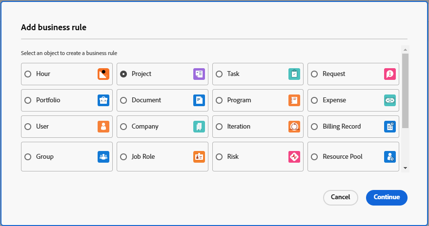

# Créer et modifier des règles métier

Une règle métier vous permet d’appliquer une validation aux objets Workfront et d’empêcher les utilisateurs de créer, modifier ou supprimer un objet lorsque certaines conditions sont remplies. Les règles métier permettent d’améliorer la qualité des données et l’efficacité opérationnelle en empêchant les actions susceptibles de compromettre l’intégrité des données.

Une seule règle métier ne peut être affectée qu&#39;à un seul objet. Par exemple, si vous créez une règle métier pour ne pas modifier les projets sous certaines conditions, vous ne pouvez pas appliquer la même règle aux tâches. Vous devez créer une règle métier distincte avec les mêmes conditions pour les tâches.

Les niveaux d’accès et le partage d’objets ont une priorité supérieure aux règles métier lorsqu’un utilisateur interagit avec un objet. Par exemple, si un utilisateur dispose d’un niveau d’accès ou d’une autorisation qui ne permet pas de modifier un projet, ils sont prioritaires sur une règle métier qui permet de modifier un projet sous certaines conditions.

Lorsque plusieurs règles métier s’appliquent à un objet , elles sont toutes suivies, mais ne sont pas appliquées dans un certain ordre. Par exemple, vous disposez de deux règles métier. L’une limite la création de dépenses au mois de février. La seconde empêche de modifier un projet lorsque son statut est Terminé. Si un utilisateur ou une utilisatrice tente d’ajouter une dépense à un projet terminé en juin, la dépense ne peut pas être ajoutée, car elle a déclenché la deuxième règle.

Les règles métier s’appliquent à la création, à la modification et à la suppression d’objets par le biais de l’API ainsi que dans l’interface Workfront.

>[!NOTE]
>
>Comme les règles métier bloquent certaines actions, vous devez toujours configurer vos règles métier en premier dans un sandbox ou un environnement de prévisualisation et les tester minutieusement avant de les activer en production.

## Conditions d’accès

+++ Développez pour afficher les exigences d’accès aux fonctionnalités de cet article.

<table style="table-layout:auto"> 
 <col> 
 <col> 
 <tbody> 
  <tr>
   <td>Package Adobe Workfront
   </td>
   <td> <p>Ultimate</p>
    <p>Workflow Ultimate</p>
   </td>
  </tr> 
  <tr> 
   <td>Licence Adobe Workfront</td> 
   <td>Standard</td> 
  </tr> 
  <tr> 
   <td>Configurations des niveaux d’accès</td> 
   <td>Administrateur ou administratrice système</td> 
  </tr>  
 </tbody> 
</table>

Pour plus d’informations, voir [Conditions d’accès requises dans la documentation Workfront](/help/quicksilver/administration-and-setup/add-users/access-levels-and-object-permissions/access-level-requirements-in-documentation.md).

+++

## Scénarios pour les règles métier

Le format d’une règle métier est « SI la condition définie est remplie, l’utilisateur ne peut pas agir sur l’objet et le message s’affiche ».

La syntaxe des propriétés et autres fonctions d&#39;une règle métier est identique à celle d&#39;un champ calculé dans un formulaire personnalisé. Pour plus d’informations sur la syntaxe, voir [&#x200B; Ajouter des champs calculés avec le concepteur de formulaire &#x200B;](/help/quicksilver/administration-and-setup/customize-workfront/create-manage-custom-forms/form-designer/design-a-form/add-a-calculated-field.md).

Pour plus d’informations sur les instructions IF, consultez [&#x200B; présentation des instructions « IF »](/help/quicksilver/reports-and-dashboards/reports/calc-cstm-data-reports/if-statements-overview.md) et [Opérateurs de condition dans les champs calculés personnalisés](/help/quicksilver/reports-and-dashboards/reports/calc-cstm-data-reports/condition-operators-calculated-custom-expressions.md).

Pour plus d’informations sur les caractères génériques basés sur l’utilisateur, voir [Utilisation de caractères génériques basés sur l’utilisateur pour généraliser les rapports](/help/quicksilver/reports-and-dashboards/reports/reporting-elements/use-user-based-wildcards-generalize-reports.md).

Pour plus d’informations sur les caractères génériques basés sur la date, voir [Utilisation de caractères génériques basés sur la date pour généraliser les rapports](/help/quicksilver/reports-and-dashboards/reports/reporting-elements/use-date-based-wildcards-generalize-reports.md).

Un caractère générique d’API est également disponible dans les règles métier. Utilisez `$$ISAPI` pour déclencher la règle uniquement dans l’API. Utilisez `!$$ISAPI` pour appliquer la règle uniquement dans l’interface utilisateur et permettre aux utilisateurs de contourner la règle via l’API.

* Par exemple, cette règle interdit aux utilisateurs de modifier des projets terminés via l’API. Si le caractère générique n’était pas utilisé, la règle bloquait l’action à la fois dans l’interface utilisateur et dans l’API.

  ```
  IF({status} = "CPL" && $$ISAPI, "You cannot edit completed projects through the API.")
  ```

Les caractères génériques `$$BEFORE_STATE` et `$$AFTER_STATE` sont utilisés dans les expressions pour accéder aux valeurs de champ de l’objet avant et après toute modification.

* Ces deux caractères génériques sont disponibles pour le déclencheur de modification. L’état par défaut du déclencheur de modification (si aucun état n’est inclus dans l’expression) est le `$$AFTER_STATE`.
* Le déclencheur de création d’objet autorise uniquement le `$$AFTER_STATE`, car l’état « before » n’existe pas.
* Le déclencheur de suppression d’objet autorise uniquement le `$$BEFORE_STATE`, car l’état après n’existe pas.

Voici quelques scénarios de règles métier simples :

* Les utilisateurs ne peuvent pas ajouter de nouvelles dépenses pendant la dernière semaine de février. Cette formule pourrait se présenter comme suit :

  ```
  IF(MONTH($$TODAY) = 2 && DAYOFMONTH($$TODAY) >= 22, "You cannot add new expenses during the last week of February.")
  ```

* Les utilisateurs ne peuvent pas modifier le nom d’un projet dont le statut est défini sur Terminé. Cette formule pourrait se présenter comme suit :

  ```
  IF({status} = "CPL" && {name} != $$BEFORE_STATE.{name}, "You cannot edit the project name.")
  ```

Le système autorise une règle métier par objet et par déclencheur. Par exemple, une règle de déclenchement de modification est autorisée pour les problèmes. Cependant, vous pouvez inclure plusieurs règles dans une formule avec des instructions IF imbriquées.

Un scénario avec des instructions IF imbriquées est le suivant :

Les utilisateurs ne peuvent pas modifier les projets terminés et ne peuvent pas modifier les projets dont la date d’achèvement est planifiée en mars. Cette formule pourrait se présenter comme suit :

```
IF(
    $$AFTER_STATE.{status}="CPL",
    "You cannot edit a completed project",
    IF(
        MONTH({plannedCompletionDate})=3,
        "You cannot edit a project with a planned completion date in March")
)
```

## Ajouter une nouvelle règle métier

{{step-1-to-setup}}

1. Cliquez sur **Règles métier** dans le panneau de gauche.
1. Cliquez sur **Nouvelle règle métier**.
1. Sélectionnez le type d&#39;objet auquel affecter la règle métier, puis cliquez sur **Continuer**.

   

   Vous pouvez appliquer des règles métier aux objets suivants :

   * Projet
   * Tâche
   * Problème/Demande
   * Portfolio
   * Document
   * Programme
   * Frais
   * l’utilisateur ou de l’utilisatrice
   * Entreprise
   * Itération
   * Enregistrement de facturation
   * Groupe
   * Risque
   * Affectation
   * Fonction
   * Pool de ressources
   * Congés
   * Heure
   * Modèle

1. Saisissez le **Nom** de la règle métier dans la boîte de dialogue Créateur de règles.
1. Dans le champ **Est actif**, indiquez si la règle doit être active lorsque vous l’enregistrez.

   Si vous sélectionnez **Non**, la règle est enregistrée comme inactive et vous pouvez l’activer ultérieurement.

1. Sélectionnez un **Déclencheur** pour la règle métier. Les options sont les suivantes :

   * **Lors de la création de l’objet :** la règle est appliquée lorsqu’un utilisateur tente de créer un objet.
   * **Lors de la modification d’un objet :** la règle est appliquée lorsqu’un utilisateur tente de modifier un objet.
   * **Lors de la suppression d’un objet :** la règle est appliquée lorsqu’un utilisateur tente de supprimer un objet.

1. (Facultatif) Saisissez une **Description** de la règle métier et de ce qui se passe lorsqu’elle est appliquée.
1. Créez la formule dans l’éditeur de formules, au centre de la boîte de dialogue des règles métier.

   Le format d’une règle métier est « SI la condition définie est remplie, l’utilisateur ne peut pas agir sur l’objet et le message s’affiche ».

   Dans la zone de formule, les parties de la règle métier que vous créez sont la condition et le message qui s’affiche dans Workfront lorsque la condition est remplie.

   * L&#39;« objet » est le type d&#39;objet que vous avez sélectionné lors de la création de la règle métier. Elle s’affiche dans l’en-tête de la boîte de dialogue.
   * L’« action » est le déclencheur que vous avez sélectionné pour la règle : créer, modifier ou supprimer l’objet.
   * Comme l’objet et l’action sont déjà définis, vous ne les incluez pas dans la formule.
   * Le message d’erreur personnalisé s’affiche pour l’utilisateur lorsqu’il déclenche la règle métier. Il doit fournir des instructions claires sur ce qui s’est passé et sur la manière de corriger le problème.

     Vous pouvez inclure une URL statique dans le message d’erreur pour créer un lien vers la documentation ou d’autres pages utiles afin de guider l’utilisateur ou l’utilisatrice sur la manière de modifier son action dans la contrainte de la règle.

     Dans cet exemple, « En savoir plus » renvoie vers l’URL. `"You are not allowed to add a new project in November.[Learn more](http://url)"` L’URL doit être entre parenthèses, mais le texte du lien entre crochets n’est pas obligatoire. Vous pouvez afficher l’URL complète sous la forme d’un lien cliquable.

   

   Cet exemple illustre une règle métier pour les projets. Si le mois en cours est novembre, les utilisateurs ne sont pas autorisés à créer de nouveaux projets, ce que le message explique.

   Pour plus d’exemples de règles métier, voir [Scénarios de règles métier](#scenarios-for-business-rules) dans cet article.

1. (Facultatif) Utilisez la formule **Expressions** et **Champs** dans le panneau de droite pour faciliter la création de la règle.

   Recherchez une expression ou un champ pour affiner la liste des éléments disponibles.

   La liste des champs disponibles est limitée aux champs liés au type d&#39;objet de la règle métier.

1. Cliquez sur **Enregistrer** lorsque vous avez terminé de créer la règle métier.

>[!NOTE]
>
>Après avoir ajouté une règle métier, vous devez la tester en ajoutant, en modifiant ou en supprimant l’objet associé pour vous assurer que la règle est appliquée correctement.

## Activer une règle métier

Lorsqu’une règle métier est inactive, le champ Est actif dans la liste des règles métier affiche False. Vous ne pouvez pas mettre à jour le statut de la règle dans la vue Liste.

Pour activer une règle métier :

1. Sélectionnez la règle métier dans la liste des règles et cliquez sur l&#39;icône Modifier .
1. Sélectionnez **Oui** pour **Est actif** dans la boîte de dialogue des règles métier.
1. Cliquer sur **Enregistrer**.
