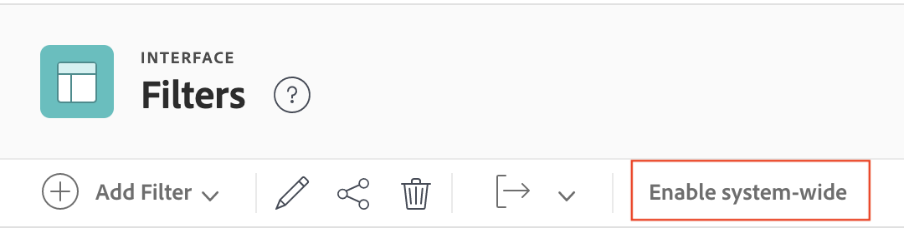

# Créer, modifier et partager des filtres, des vues et des regroupements à l’échelle du système

<!-- Audited: 5/2025 -->

<!--

***DON'T DELETE, DRAFT OR HIDE THIS ARTICLE. IT IS LINKED TO THE PRODUCT, THROUGH THE CONTEXT SENSITIVE HELP LINKS. **

-->

Vous pouvez créer des filtres, des vues et des regroupements et les rendre disponibles pour les utilisateurs à l’échelle du système dans votre entreprise.

Lorsque vous créez des filtres, des vues et des regroupements à l’échelle du système comme décrit dans cet article, les utilisateurs avec lesquels vous les partagez peuvent les exploiter lors de l’affichage de leurs listes. Les utilisateurs peuvent créer leurs propres filtres, vues et regroupements en fonction de ceux que vous créez, mais ils ne peuvent pas les modifier directement.

Notez que les filtres, vues et regroupements à l’échelle du système que vous créez sont différents de ceux par défaut qu’Adobe Workfront crée automatiquement pour vous dans le système. Ces filtres, vues et regroupements par défaut ne peuvent pas être modifiés ni supprimés.

## Conditions d’accès

+++ Développez pour afficher les exigences d’accès aux fonctionnalités de cet article.

Vous devez disposer des accès suivants pour effectuer les étapes de cet article :

<table style="table-layout:auto"> 
 <col> 
 <col> 
 <tbody> 
  <tr> 
   <td role="rowheader">[!DNL Adobe Workfront] plan</td> 
   <td>Tous</td> 
  </tr> 
  <tr> 
   <td role="rowheader">[!DNL Adobe Workfront] licence</td> 
   <td>
Nouvelle : [!UICONTROL Standard]

   Ou
   
Actuelle : [!UICONTROL Plan]

   </td> 
  </tr>
  <tr> 
  <tr> 
   <td role="rowheader">Configurations des niveaux d’accès</td> 
   <td>[!UICONTROL System Administrator]</td>
  </tr> 
 </tbody> 
</table>

Pour plus de détails sur les informations contenues dans ce tableau, consultez [Conditions d’accès préalables dans la documentation Workfront](/help/quicksilver/administration-and-setup/add-users/access-levels-and-object-permissions/access-level-requirements-in-documentation.md).

+++

## Créer des filtres, des vues ou des regroupements

{{step-1-to-setup}}

1. Cliquez sur **[!UICONTROL Interface]**, puis sur l’un des éléments suivants : **[!UICONTROL Filtres]**, **[!UICONTROL Vues]** ou **[!UICONTROL Regroupements]**.

1. Si vous créez un filtre, une vue ou un regroupement, cliquez sur **[!UICONTROL Ajouter un filtre]**, **[!UICONTROL Ajouter une vue]** ou **[!UICONTROL Ajouter un regroupement]**, puis sélectionnez le type d’objet auquel vous souhaitez associer le nouveau filtre, la nouvelle vue ou le nouveau regroupement.

   Ou

   Si vous modifiez un filtre, une vue ou un regroupement existant(e), sélectionnez l’élément puis cliquez sur l’icône **[!UICONTROL Modifier]** .

1. Configurez le filtre, la vue ou le regroupement.

   Pour plus d’informations sur les options disponibles, consultez l’un des articles suivants :

   * [Vue d’ensemble des filtres](../../../reports-and-dashboards/reports/reporting-elements/filters-overview.md)
   * [Vue d’ensemble des vues dans [!UICONTROL Adobe Workfront]](../../../reports-and-dashboards/reports/reporting-elements/views-overview.md)
   * [Vue d’ensemble des regroupements dans [!UICONTROL Adobe Workfront]](../../../reports-and-dashboards/reports/reporting-elements/groupings-overview.md)

1. Cliquez sur **[!UICONTROL Enregistrer]** dans le coin inférieur gauche.

Vous pouvez mettre le filtre, la vue ou le regroupement à la disposition des personnes de votre système. Pour plus d’informations sur le partage de filtres, de vues ou de regroupements avec d’autres personnes, voir la section [Mettre des filtres, des vues ou des regroupements à la disposition des personnes](#make-filters-views-or-groupings-available-to-users) dans cet article.

## Afficher ou masquer les filtres, les vues ou les regroupements disponibles dans le modèle de disposition

Vous pouvez choisir d’afficher ou de masquer les filtres, les vues ou les regroupements du modèle de disposition. Les filtres visibles sont disponibles pour tous les utilisateurs à l’échelle du système. Vous pouvez utiliser un modèle de disposition pour masquer les filtres visibles pour des personnes ou des groupes spécifiques.

>[!NOTE]
>
>Si une personne utilise activement un filtre, une vue ou un regroupement et qu’un administrateur ou une administratrice désactive l’élément, la personne conserve l’accès jusqu’à ce qu’elle choisisse un nouveau filtre, une nouvelle vue ou un nouveau regroupement. Une fois qu’ils en ont choisi un nouveau, ils ne pourront plus revenir à celui qui est masqué.

Pour afficher ou masquer les filtres, les vues ou les regroupements disponibles dans le modèle de disposition :

{{step-1-to-setup}}

1. Cliquez sur **[!UICONTROL Interface]**, puis sur l’un des éléments suivants : **[!UICONTROL Filtres]**, **[!UICONTROL Vues]** ou **[!UICONTROL Regroupements]**.

1. (Le cas échéant) Sélectionnez le filtre, la vue ou le regroupement que vous souhaitez mettre à la disposition des personnes, puis cliquez sur **[!UICONTROL Activer à l’échelle du système]**.

   

   >[!TIP]
   >
   >Si vous souhaitez que le filtre, la vue ou le regroupement reste disponible pour la plupart des utilisateurs, mais qu&#39;il soit masqué pour les autres, vous pouvez utiliser le modèle de mise en page. Pour plus d’informations, voir [Personnaliser les filtres, les vues et les regroupements à l’aide d’un modèle de disposition](/help/quicksilver/administration-and-setup/customize-workfront/use-layout-templates/customize-fvg-list-controls-layout-template.md).

1. (Conditionnel) Sélectionnez le filtre, la vue ou le regroupement que vous souhaitez masquer aux utilisateurs, puis cliquez sur **[!UICONTROL Désactiver à l’échelle du système]**. Le filtre, la vue ou le regroupement est maintenant masqué dans le modèle de mise en page et pour les utilisateurs du système.

## Mettre les filtres, les vues ou les regroupements à la disposition de toutes les personnes {#make-filters-views-or-groupings-available-to-users}

Ces étapes expliquent comment mettre les filtres, les vues et les regroupements à disposition à partir de la boîte de dialogue [!UICONTROL Partager] dans la zone [!UICONTROL Interface] de [!UICONTROL Configuration]. Ce paramètre agit comme un interrupteur marche/arrêt pour l’ensemble du système, y compris le modèle de disposition.

{{step-1-to-setup}}

1. Cliquez sur **[!UICONTROL Interface]**, puis sur l’un des éléments suivants : **[!UICONTROL Filtres]**, **[!UICONTROL Vues]** ou **[!UICONTROL Regroupements]**.

1. Sélectionnez le filtre, la vue ou le regroupement que vous souhaitez mettre à la disposition des utilisateurs, puis cliquez sur l’icône **[!UICONTROL Partager]** .
1. Commencez à taper le nom des personnes, des équipes, des rôles, des groupes ou des entreprises avec lesquels vous souhaitez partager le filtre, la vue ou le regroupement, puis cliquez sur le nom lorsqu’il apparaît dans la liste déroulante.

   Pour plus d’informations sur le partage, voir [Vue d’ensemble du partage des autorisations sur les objets](../../../workfront-basics/grant-and-request-access-to-objects/sharing-permissions-on-objects-overview.md).

1. Cliquer sur **[!UICONTROL Enregistrer]**. Les utilisateurs que vous avez spécifiés peuvent désormais voir le filtre, l’affichage ou le regroupement lors de l’affichage du type d’objet auquel vous l’avez associé.

## Supprimer des filtres, des vues et des regroupements

{{step-1-to-setup}}

1. Cliquez sur **[!UICONTROL Interface]**, puis sur l’un des éléments suivants : **[!UICONTROL Filtres]**, **[!UICONTROL Vues]** ou **[!UICONTROL Regroupements]**.

1. Sélectionnez un ou plusieurs éléments dans la liste, puis cliquez sur l’icône **[!UICONTROL Supprimer]** .

1. Dans la boîte de dialogue **Supprimer** qui s’affiche, cliquez sur **Oui, supprimer**.
