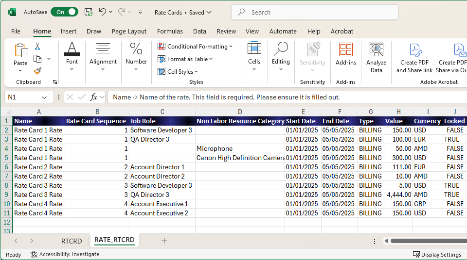

# Importer des cartes tarifaires à partir d’un modèle

Vous pouvez utiliser un fichier modèle pour créer vos cartes tarifaires dans Excel et les importer dans Adobe Workfront, au lieu d’ajouter manuellement toutes les fonctions et tous les taux.

## Règles importantes pour l’utilisation du fichier de modèle

* Saisissez la fonction OU la catégorie de ressources non liées à la main-d&#39;œuvre, mais pas les deux.
* La séquence des cartes tarifaires de l&#39;onglet RATE_RTCRD doit correspondre à l&#39;ordre des cartes de l&#39;onglet RTCRD (1 pour la première, 2 pour la seconde, etc.).
* La date de début et la date de fin doivent respecter les formats autorisés.
* Les cartes tarifaires peuvent être importées sans taux et mises à jour ultérieurement.
* Les attributs personnalisés (Agence, Centre de coûts, etc.) peuvent varier. Consultez votre administrateur système pour connaître les exigences exactes.
* Les lignes supprimées dans le modèle ne supprimeront pas les enregistrements existants dans le système.

## Conditions d’accès

+++ Développez pour afficher les exigences d’accès aux fonctionnalités de cet article.

<table style="table-layout:auto"> 
 <col> 
 <col> 
 <tbody> 
  <tr> 
   <td>[!DNL Adobe Workfront] paquet</td> 
   <td>Tous</td> 
  </tr> 
  <tr> 
   <td>[!DNL Adobe Workfront] licence</td> 
   <td>
[!UICONTROL Standard]

   
[!UICONTROL Plan]

   </td> 
  </tr> 
  <tr> 
   <td>Configurations des niveaux d’accès</td> 
   <td>Modifier l’accès aux [!UICONTROL Rate Cards]</td> 
  </tr> 
 </tbody> 
</table>

Pour plus d’informations, voir [Conditions d’accès requises dans la documentation Workfront](/help/quicksilver/administration-and-setup/add-users/access-levels-and-object-permissions/access-level-requirements-in-documentation.md).

+++

## Remplir le fichier de modèle

{{step-1-to-setup}}

1. Dans le panneau de gauche, cliquez sur [!UICONTROL **Carte tarifaire**].
1. Cliquez sur **Nouvelle carte tarifaire**, puis sur **Télécharger le modèle Excel**.
1. Suivez les invites du navigateur pour enregistrer le fichier de modèle sur votre ordinateur.
1. Ouvrez le fichier modèle dans Excel.

   >[!TIP]
   >
   > Enregistrez le fichier sous un nouveau nom si vous souhaitez conserver le fichier de modèle vide et le réutiliser ultérieurement.

   Le modèle comporte deux onglets. Les deux onglets doivent contenir les informations correctes pour importer les cartes tarifaires avec succès.

   * RTCRD : définition des cartes tarifaires (informations de base)
   * RATE_RTCRD : permet de définir les taux détaillés associés à chaque carte tarifaire.

### Remplissez l’onglet RTCRD (Rate Card Setup) .

Créez et répertoriez toutes les cartes tarifaires sur cet onglet. Chaque ligne représente une carte tarifaire.

1. Saisissez les informations d&#39;une carte tarifaire sur chaque ligne :

   * **Nom** (obligatoire) : nom de la carte tarifaire, par exemple « Facturation globale 2025 ».

     Ce nom est l’identifiant principal de la carte tarifaire. Chaque carte tarifaire doit avoir un nom unique.

   * **Description** (facultatif) : description textuelle de forme libre de la carte tarifaire. Utilisez-la pour décrire l’objectif, la portée ou la validité, par exemple « S’applique aux projets nord-américains ».
   * **Société** (facultatif) : il peut s’agir du nom ou de l’ID de la société. L&#39;importation reconnaîtra les deux.

     Exemple : Coffesta ou _68c0234e00000541dd8c0757723daa68_

   * **Groupe** (facultatif) : il peut s’agir du nom du groupe ou de l’identifiant du groupe. L&#39;importation reconnaîtra les deux.

     Exemple : marketing ou _68c0234e00000541dd8c0757723daa68_

   * **Champs personnalisés** (facultatif) : vous pouvez ajouter des colonnes supplémentaires avec des noms de champ personnalisés si votre environnement a des exigences spécifiques.

   >[!NOTE]
   >
   >* Au minimum, vous devez saisir le nom de chaque carte tarifaire.
   >* Chaque carte tarifaire reçoit automatiquement un numéro séquentiel en fonction de sa position en ligne. Par exemple, la première carte tarifaire que vous définissez (à la ligne 2) est la séquence 1, la suivante est la séquence 2, etc. Ces numéros de séquence sont utilisés dans l&#39;onglet RATE_RTCRD pour joindre des taux.

### Remplissez l’onglet RATE_RTCRD (Configuration des taux) .

Définissez tous les taux qui appartiennent aux cartes tarifaires sur cet onglet.

Chaque ligne de l’onglet définit un taux spécifique. Vous pouvez créer plusieurs taux sous la même carte tarifaire en répétant la séquence des cartes tarifaires.

Assurez-vous que les dates ne se chevauchent pas, sauf si cela est prévu.

1. Renseignez les informations relatives à un taux sur chaque ligne :

   * **Nom** (obligatoire) : libellé de la ligne de taux.

     La bonne pratique consiste à réutiliser le nom de la carte tarifaire pour plus de clarté, par exemple « Facturation globale 2025 - Taux développeur ».

   * **Référence de la carte tarifaire** (obligatoire) : numéro de séquence de la carte tarifaire à laquelle ce taux appartient.

     Si la carte tarifaire était la première que vous avez listée dans l&#39;onglet RTCRD (ligne 2), entrez 1. S&#39;il s&#39;agissait de la deuxième, entrez 2, et ainsi de suite.

   * **Fonction** (obligatoire si la catégorie de ressources non liées à la main-d’œuvre n’est pas utilisée) : fonction à laquelle le taux s’applique. Il peut s’agir du nom de la fonction ou de l’identifiant de la fonction. L&#39;importation reconnaîtra les deux.

     Exemple : Designer ou _68c0234e00000541dd8c0757723daa68_

   * **Catégorie de ressources non liées à la main-d&#39;œuvre** (obligatoire si la fonction n&#39;est pas utilisée) : catégorie de ressources non liées à la main-d&#39;œuvre à laquelle le taux s&#39;applique. Il peut s’agir du nom de la catégorie ou de l’ID de la catégorie. L&#39;importation reconnaîtra les deux.

     Exemple : Caméra ou _68c0234e00000541dd8c0757723daa68_

     >[!IMPORTANT]
     >
     >Vous ne pouvez pas saisir de données dans les colonnes **Fonction** et **Catégorie de ressources hors main-d’œuvre**. Un est requis.

   * **Date de début** (facultatif) : date à laquelle le taux devient effectif.

     La date doit respecter l’un des formats pris en charge (selon votre emplacement) : MM/jj/aaaa, jj/MM/aaaa, MM/JJ/AAAA, JJ/MM/AAAA, MM/j/aa, jj/M/aaaa, mm/jj, aaaa/jj/MM, aaaa-MM-jj, aaaa-jj-MM

     Exemple : 01/01/2025

     Pour plus d’informations, voir [Exigences de formatage des dates](#date-formatting-requirements) ci-dessous.

   * **Date de fin** (facultatif) : date à laquelle le taux cesse d’être effectif.

     Cette date doit suivre les mêmes formats pris en charge que la date de début.

     Pour plus d’informations, voir [Exigences de formatage des dates](#date-formatting-requirements) ci-dessous.

   * **Value** (facultatif) : valeur numérique du taux, par exemple 150. La valeur par défaut est 0.
   * **Devise** (facultatif) : devise du taux, par exemple USD, EUR, GBP. La valeur par défaut est la devise système.
   * **Verrouillé** (facultatif) : indique si le taux est verrouillé. Les valeurs valides sont True ou False.
   * **Attributs** (facultatif/personnalisé) : les dernières colonnes (Agence, Emplacement, Centre de coûts, etc.) sont des attributs de taux qui diffèrent selon la configuration du client. Il s’agit de champs personnalisables qui peuvent varier selon l’environnement du client.

     Exemple : Agence = « 1 : Agence », Emplacement = « Chicago », Centre de coûts = « 22 : Centre de coûts »

### Exigences de formatage des dates

Lors de la préparation des données de carte tarifaire pour l’importation, vous devez vous assurer que les colonnes de date sont au format **Général**, et non **Date**.

Si les colonnes sont définies sur le format de date, le système peut mal interpréter les valeurs pendant le processus d’importation, ce qui entraîne des erreurs ou des échecs de chargement. L’utilisation du format Général préserve la représentation numérique ou textuelle brute de la date, ce qui permet au système de valider et d’appliquer correctement les valeurs.

Suivre ces étapes permet d’éviter les problèmes inutiles et d’assurer une importation fluide et précise des données de taux.

1. Avant d’enregistrer ou de charger le fichier, sélectionnez les colonnes de dates dans la feuille de calcul.
1. Remplacez le format de colonne par **Général**.
1. Vérifiez que les valeurs s’affichent toujours correctement (par exemple, 01/01/2025 ou 2025-01-01).

## Importer le fichier de modèle

{{step-1-to-setup}}

1. Dans le panneau de gauche, cliquez sur [!UICONTROL **Carte tarifaire**].
1. Cliquez sur **Nouvelle carte tarifaire**, puis sur **Importer de nouvelles cartes tarifaires**.
1. Glissez-déposez votre fichier dans la boîte de dialogue ou cliquez sur Sélectionner un fichier Excel pour accéder au fichier sur votre ordinateur.
1. Cliquez sur **Démarrer l’importation**.

   Si le fichier ne présente aucun problème, un message de confirmation s’affiche et les nouvelles cartes tarifaires apparaissent dans la liste.

1. Si le fichier présente des problèmes, un message d’erreur s’affiche. Cliquez sur **Voir les problèmes** pour afficher les problèmes sur un écran distinct.

   Vous devez corriger les problèmes du fichier Excel et l’importer à nouveau avant que les cartes tarifaires n’existent dans Workfront.

