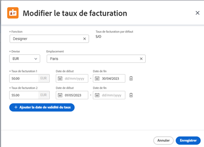

# Gérer les cartes tarifaires

{{highlighted-preview-article-level}}

Les cartes tarifaires vous permettent de définir plusieurs taux de facturation par rôle, en fonction de l’emplacement. Vous pourriez avoir un concepteur basé à Paris et un second basé à New York, chacun ayant des des taux de facturation différents. L’emplacement n’est toutefois pas requis pour les fonctions sur une carte tarifaire. Un taux de facturation pour une fonction (et éventuellement un emplacement) sur une carte tarifaire peut également inclure des dates d’entrée en vigueur.

## Conditions d’accès

Vous devez disposer des accès suivants pour effectuer les étapes de cet article :

<table style="table-layout:auto"> 
 <col> 
 <col> 
 <tbody> 
  <tr> 
   <td role="rowheader">[!DNL Adobe Workfront] plan</td> 
   <td>N’importe quelle</td> 
  </tr> 
  <tr> 
   <td role="rowheader">[!DNL Adobe Workfront] licence</td> 
   <td>
Nouveau plan : [!UICONTROL Standard] 

       
ou
 
       
Plan actuel : [!UICONTROL Plan] 

   </td>    
  </tr> 
  <tr> 
   <td role="rowheader">Configurations du niveau d’accès</td> 
   <td> 
Modifier l’accès aux [!UICONTROL Financial Data]
 
<b>REMARQUE</b> : si vous n’avez toujours pas accès, demandez à votre administrateur ou administratrice de [!DNL Workfront] s’il ou elle a défini des restrictions supplémentaires dans votre niveau d’accès. Pour plus d’informations sur la manière dont un administrateur ou une administratrice [!DNL Workfront] peut modifier votre niveau d’accès, voir <a href="../../../administration-and-setup/add-users/configure-and-grant-access/create-modify-access-levels.md" class="MCXref xref">Créer ou modifier des niveaux d’accès personnalisés</a>.
 </td> 
  </tr> 
  <tr> 
   <td role="rowheader">Autorisations d’objet</td> 
   <td>Pour modifier une carte tarifaire partagée avec vous, vous devez disposer des autorisations Gérer sur la carte tarifaire.</td> 
  </tr> 
 </tbody> 
</table>

## Ajouter une carte tarifaire

{{step-1-to-setup}}

1. Dans le panneau de gauche, cliquez sur [!UICONTROL **Cartes tarifaires**].
1. Cliquez sur [!UICONTROL **Nouvelle carte tarifaire**], puis saisissez le nom de la carte tarifaire dans la zone [!UICONTROL Nouvelle carte tarifaire] pour remplacer « Carte tarifaire sans titre ».
1. (Facultatif) Sur l’écran Détails de la carte tarifaire, ajoutez une [!UICONTROL **Description**].
1. (Facultatif) Pour joindre un formulaire personnalisé à la carte tarifaire, cliquez sur le champ [!UICONTROL **Ajouter un formulaire personnalisé**] dans le coin supérieur droit et sélectionnez un formulaire personnalisé dans la liste qui s’affiche.

   Pour plus d’informations sur l’ajout d’un formulaire personnalisé, voir [Ajouter un formulaire personnalisé à un objet](/help/quicksilver/workfront-basics/work-with-custom-forms/add-a-custom-form-to-an-object.md).

1. Cliquez sur [!UICONTROL **Rôles et tarifs du poste**] dans le panneau de navigation de gauche.
1. Sur l’écran Rôles et tarifs du poste de carte tarifaire, cliquez sur [!UICONTROL **Ajouter une fonction**].
1. Dans la boîte de dialogue, sélectionnez une [!UICONTROL **Fonction**] pour laquelle définir des taux de facturation.

   Le taux de facturation par défaut affiche le taux au niveau du système pour cette fonction, le cas échéant.

   

1. Sélectionnez une [!UICONTROL **Devise**] pour la fonction.
1. (Facultatif) Sélectionnez une [!UICONTROL **Emplacement**] pour la fonction.
1. Dans le champ [!UICONTROL **Taux de facturation 1**], saisissez le taux de facturation de cet emplacement. Cliquez ensuite sur [!UICONTROL **Enregistrer**] pour remplacer le taux de facturation une fois.

   Ou

   Cliquez sur [!UICONTROL **Ajouter des taux**] pour ajouter d’autres taux de facturation spécifiques à un emplacement avec des dates d’entrée en vigueur.

1. (Conditionnel) Si vous ajoutez plusieurs taux de facturation pour cet emplacement, saisissez les informations suivantes :

   * **[!UICONTROL Taux de facturation 1], 2, etc.:** La valeur du taux de facturation pour la période.
   * **[!UICONTROL Date de début] :** la date à laquelle le remplacement de taux commence.
   * **[!UICONTROL Date de fin] :** la date à laquelle le remplacement de taux se termine.

     Le taux de facturation 1 ne comporte pas de date de début et le dernier taux de facturation n’a pas de date de fin. Certaines dates sont ajoutées automatiquement. Par exemple, si le taux de facturation 1 n’a pas de date de fin et que vous ajoutez le taux de facturation 2 avec une date de début le 1er mai 2023, une date de fin le 30 avril 2023 est ajoutée au taux de facturation 1 afin qu’il n’y ait pas d’écart.

1. Cliquer sur [!UICONTROL **Enregistrer**].
1. (Facultatif) Pour ajouter un autre taux de facturation, soit pour la même fonction à un autre emplacement, soit pour une fonction distincte, cliquez sur [!UICONTROL **Ajouter fonction**].
1. (Facultatif) Pour modifier une carte tarifaire, cliquez sur le nom de la carte tarifaire dans la liste Cartes tarifaires, dans Configuration. Pour modifier un taux de facturation, cliquez sur [!UICONTROL **Rôles et tarifs du poste**] dans le panneau de navigation de gauche de la carte tarifaire. Sélectionnez ensuite le taux et cliquez sur l’icône **Modifier** .

## Copier une carte tarifaire

{{step-1-to-setup}}

1. Dans le panneau de gauche, cliquez sur [!UICONTROL **Carte tarifaire**].
1. Cochez la case en regard de la carte tarifaire dans la liste et cliquez sur l’icône **Copier** .
1. Saisissez le nom de la carte tarifaire dans la zone [!UICONTROL Copier la carte tarifaire] pour remplacer « Untitled Rate Card ». Cliquez ensuite **Enregistrer**.

   La nouvelle carte tarifaire est enregistrée. Modifiez les détails de la carte tarifaire, les fonctions et les taux selon les besoins.

## Supprimer une carte tarifaire entière

{{step-1-to-setup}}

1. Dans le panneau de gauche, cliquez sur [!UICONTROL **Carte tarifaire**].
1. Cochez la case en regard de la carte tarifaire dans la liste, puis cliquez sur l’icône **Supprimer** .

   >[!NOTE]
   >
   >Une carte tarifaire associée à un projet sera supprimée du projet.
