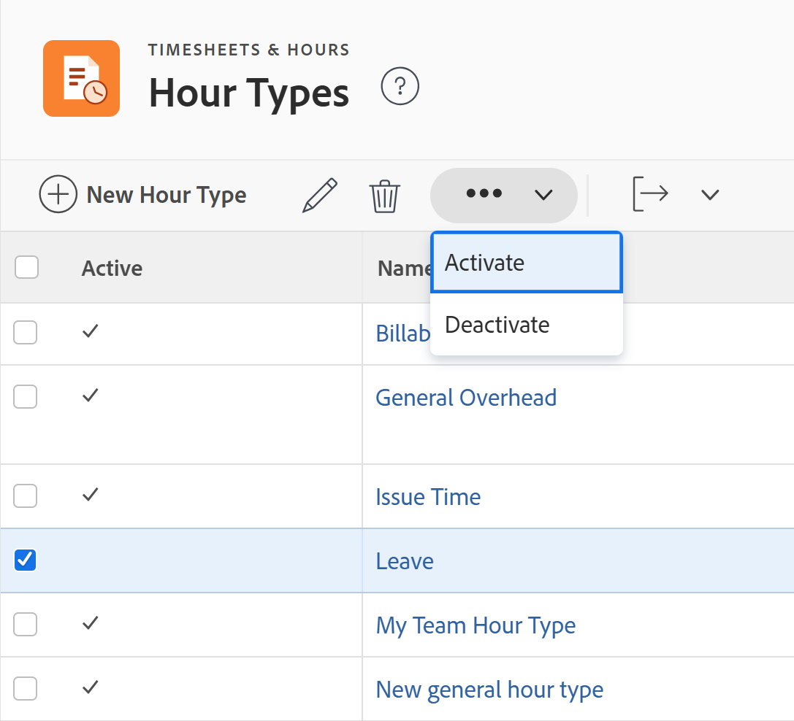

# Gérer les types d’heures

<!--Audited: 05/2025-->

<!--DON'T DELETE, DRAFT OR HIDE THIS ARTICLE. IT IS LINKED TO THE PRODUCT, THROUGH THE CONTEXT SENSITIVE HELP LINKS. 
**Linked to Creating Billing Record-->

<!--

The highlighted information on this page refers to functionality not yet generally available. It is available only in the Preview environment for all customers. The same features will also be available in the Production environment for all customers after a week from the Preview release.     

For more information, see [Interface modernization](/help/quicksilver/product-announcements/product-releases/interface-modernization/interface-modernization.md). 

-->

Les types d’heures sont des libellés que vous utilisez pour définir vos entrées d’heures. Vous pouvez associer des types d&#39;heures à vos entrées d&#39;heures.

Il existe deux catégories de types d&#39;heures :

* **Types d’heures spécifiques au projet** : il s’agit du temps consigné sur les projets, les tâches et les problèmes. Les types d’heures spécifiques au projet peuvent être associés à des entrées d’heures n’importe où dans [!DNL Adobe Workfront] où vous pouvez consigner du temps pour les projets, les tâches et les problèmes.

  Lors de la consignation du temps dans [!DNL Workfront], les types d’heures spécifiques au projet disponibles dépendent des options de configuration définies au niveau du système, du projet et de l’utilisateur ou utilisatrice.

  Les types d’heures suivants par défaut spécifiques au projet sont toujours disponibles :

   * Durée du projet
   * Durée de la tâche
   * Heure de l’événement

  L’administrateur [!DNL Workfront] détermine les types d’heures disponibles spécifiques au projet, comme décrit dans la section [ Définir les types d’heures et la disponibilité](../../../timesheets/create-and-manage-timesheets/define-hour-types-and-availability.md).

  >[!NOTE]
  >
  >Si vous activez des types d’heures spécifiques au projet dans votre système [!DNL Workfront], au moins un type d’heure spécifique au projet doit être activé sur chaque projet de votre système. Vous ne pouvez pas activer un type d&#39;heures spécifique au projet au niveau du système et aucun type d&#39;heures spécifique au projet n&#39;est disponible au niveau du projet.

* **Types d&#39;heures généraux** : les heures générales ne peuvent pas être associées à un projet, une tâche ou un événement et sont directement consignées dans une feuille de temps.

Pour plus d’informations sur la journalisation des heures et leur association aux types d’heures, voir [Consigner les heures](/help/quicksilver/timesheets/create-and-manage-timesheets/log-time.md).

## Conditions d’accès

+++ Développez pour afficher les exigences d’accès.

<table style="table-layout:auto"> 
 <col> 
 <col> 
 <tbody> 
  <tr> 
   <td role="rowheader">Formule Adobe Workfront</td> 
   <td>Tous</td> 
  </tr> 
  <tr> 
   <td role="rowheader">Licence Adobe Workfront*</td> 
   <td> 
Standard ou Plan

   </td> 
  </tr> 
  <tr> 
   <td role="rowheader">Niveau d’accès</td> 
   <td>Administrateur ou administratrice système</td>
  </tr> 
 </tbody> 
</table>

* Pour plus d’informations sur ce tableau, consultez [Conditions d’accès requises dans la documentation Workfront](/help/quicksilver/administration-and-setup/add-users/access-levels-and-object-permissions/access-level-requirements-in-documentation.md).

+++

## Types d’heures intégrés

Workfront est fourni avec un ensemble de types d’heures intégrés. Ces types d&#39;heures ne peuvent pas être modifiés ou masqués.

Voici les types d’heures fournis avec [!DNL Workfront] :

* **[!UICONTROL Congés maladie]** : type d’heure général qui ne peut pas être associé aux entrées d’heures d’un projet, d’une tâche ou d’un événement. Les heures de congé maladie ne peuvent pas être comptabilisées comme du chiffre d’affaires.
* **[!UICONTROL Congés]** : type d’heure général qui ne peut pas être associé aux entrées d’heures d’un projet, d’une tâche ou d’un événement. Les vacances ne peuvent pas être comptabilisées comme un chiffre d’affaires.
* **[!UICONTROL Frais généraux]** : type d&#39;heures général qui ne peut pas être associé aux entrées d&#39;heures d&#39;un projet, d&#39;une tâche ou d&#39;un événement. Il peut être comptabilisé comme un chiffre d’affaires dans le processus de planification de votre projet.
* **[!UICONTROL Durée du projet]** : type d’heure général qui ne peut être associé qu’aux entrées d’heures d’un projet.
* **[!UICONTROL Heure de la tâche]** : type d’heure général qui ne peut être associé qu’aux entrées d’heures d’une tâche.
* **[!UICONTROL Heure de l&#39;événement]** : type d&#39;heures général qui ne peut être associé qu&#39;aux entrées d&#39;heures d&#39;un événement.

## Créer des types d’heures

En tant qu’administrateur [!DNL Workfront], vous pouvez créer des types d’heures pour votre organisation au niveau du système et du projet.

Après avoir défini les types d’heures au niveau du système, les utilisateurs et utilisatrices peuvent définir les types d’heures disponibles pour des projets spécifiques ou pour des utilisateurs et utilisatrices spécifiques.

Pour plus d’informations, voir la [Définition des types d’heures et de leur disponibilité](../../../timesheets/create-and-manage-timesheets/define-hour-types-and-availability.md)

Pour créer des types d’heures :

{{step-1-to-setup}}

1. Dans le panneau de gauche, cliquez sur **Feuille de temps et heures**, puis sur **Types d’heures**.

1. Dans la section **Types d&#39;heures**, cliquez sur **Nouveau type d&#39;heures**.
1. Dans la boîte de dialogue **Nouveaux types d’heures**, spécifiez les informations suivantes :

   <table style="table-layout:auto"> 
    <col> 
    <col> 
    <tbody> 
     <tr> 
      <td role="rowheader">[!UICONTROL Name]</td> 
      <td>Entrez un nom de type d'heures facilement reconnaissable par le système.</td> 
     </tr> 
     <tr> 
      <td role="rowheader">[!UICONTROL Description]</td> 
      <td>Ajoutez une description à votre type d’heure.</td> 
     </tr> 
     <tr> 
      <td role="rowheader">[!UICONTROL Scope]</td> 
      <td> 
Indiquez si le type d'heures correspond à un type général ou à un type spécifique au projet dans le menu déroulant <strong>Portée</strong>.
 
Les types d'heures généraux sont visibles uniquement dans les feuilles de temps et ne peuvent pas être associés aux projets, tâches ou événements.
 
<b>IMPORTANT</b>

 Si vous avez un type d'heures personnalisé [!UICONTROL Project Specific] et que vous le remplacez par [!UICONTROL General], toutes les heures de tâche, d'événement et de projet existantes sont définies sur leurs types par défaut système.
 </td> 
     </tr> 
     <tr> 
      <td role="rowheader">[!UICONTROL Count as Revenue]</td> 
      <td>
Sélectionnez cette option si vous souhaitez que l’entrée d’heure associée à ce type d’heure affecte le calcul des revenus.

      
Les congés de maladie et les congés ne peuvent pas être comptabilisés comme des revenus.

      
<b>NOTE</b>

      
Lorsque les types d’heures généraux sont comptabilisés comme revenu, le taux de dépenses associé au profil de la personne qui consigne les heures est associé au coût horaire.  
      </td> 
     </tr> 
    </tbody> 
   </table>

1. Cliquez sur **Enregistrer**.

   Le type d’heure est ajouté à votre système Workfront et activé par défaut.

## Modifier les types d&#39;heures

En tant qu’administrateur [!DNL Workfront], vous pouvez modifier les types d’heures pour votre organisation au niveau du système et du projet.

>[!NOTE]
>
>* Vous ne pouvez pas modifier les types d&#39;heures intégrés.
>* Vous ne pouvez pas modifier les types d’heures en bloc.

{{step-1-to-setup}}

1. Dans le panneau de gauche, cliquez sur **Feuille de temps et heures**, puis sur **Types d’heures**.

1. Cliquez sur le nom d’un type d’heure ou sélectionnez le type d’heure, puis cliquez sur l’icône **Modifier**  en haut de la liste.
1. Dans la boîte de dialogue **Modifier les types d’heures**, spécifiez les informations suivantes :

   <table style="table-layout:auto"> 
    <col> 
    <col> 
    <tbody> 
     <tr> 
      <td role="rowheader">[!UICONTROL Name]</td> 
      <td>Entrez un nom de type d'heures facilement reconnaissable par le système.</td> 
     </tr> 
     <tr> 
      <td role="rowheader">[!UICONTROL Description]</td> 
      <td>Ajoutez une description à votre type d’heure.</td> 
     </tr> 
     <tr> 
      <td role="rowheader">[!UICONTROL Scope]</td> 
      <td> 
Indiquez si le type d'heures correspond à un type général ou à un type spécifique au projet dans le menu déroulant <strong>Portée</strong>.
 
Les types d'heures généraux sont visibles uniquement dans les feuilles de temps et ne peuvent pas être associés aux projets, tâches ou événements.
 
<b>IMPORTANT</b>
 
Si vous avez un type d'heures personnalisé [!UICONTROL Project Specific] et que vous le remplacez par [!UICONTROL General], toutes les heures de tâche, d'événement et de projet existantes sont définies sur leurs types par défaut système.
 </td> 
     </tr> 
     <tr> 
      <td role="rowheader">[!UICONTROL Count as Revenue]</td> 
      <td>
Sélectionnez cette option si vous souhaitez que l’entrée d’heure associée à ce type d’heure affecte le calcul des revenus.

      
Les congés de maladie et les congés ne peuvent pas être comptabilisés comme des revenus.

      
<b>NOTE</b>

      
Lorsque les types d’heures généraux sont comptabilisés comme revenu, le taux de dépenses associé au profil de la personne qui consigne les heures est associé au coût horaire.  
      </td> 
     </tr> 
    </tbody> 
   </table>

1. Cliquer sur **Enregistrer**.

   Vos modifications sont enregistrées et le type d’heure est modifié.

## Désactiver les types d’heures

Vous pouvez désactiver les types d’heures si vous ne souhaitez plus que les utilisateurs les associent. La désactivation des types d’heures les masque de n’importe quel endroit dans [!DNL Workfront] où les types d’heures sont visibles.

>[!NOTE]
>
>* Vous ne pouvez pas désactiver les types d&#39;heures intégrés.
>* Vous pouvez désactiver les types d’heures en bloc.
>* Lorsque vous désactivez un type d&#39;heures spécifique à un projet, toutes les heures consignées pour ce type sont automatiquement définies par défaut sur un type d&#39;heures intégré spécifique au projet. Par exemple, le type d’heure Temps enregistré pour un projet est celui par défaut ; le type d’heure enregistré pour une tâche est celui par défaut.
>* Lorsque vous désactivez un type d’heure général, l’heure consignée reste sur la feuille de temps, mais les utilisateurs ne pourront plus consigner d’heures pour ce type d’heure à l’avenir.

Pour désactiver un type d’heure :

{{step-1-to-setup}}

1. Dans le panneau de gauche, cliquez sur **[!UICONTROL Feuille de temps et heures]**, puis sur **[!UICONTROL Types d’heures]**.

1. Sélectionnez le type d&#39;heures à désactiver. Vous pouvez sélectionner plusieurs types d’heures.

1. Cliquez sur **Plus**, puis sur **Désactiver**.

   

   Le type d’heure est désactivé et les utilisateurs ne le trouvent plus lors de la journalisation des heures.

1. (Facultatif) Pour réactiver un type d’heure, sélectionnez-le dans la liste **Types d’heures**, puis cliquez sur **Plus** > **Activer**.

