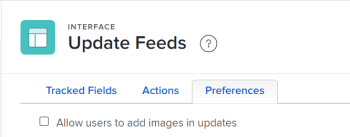

# Configuration des préférences pour les mises à jour des utilisateurs

Vous pouvez configurer des préférences qui donnent aux utilisateurs l’accès à certaines fonctions lorsqu’ils ajoutent des commentaires dans un objet. [!UICONTROL Mises à jour] zone.

## Exigences d’accès

Vous devez disposer des accès suivants pour effectuer les étapes de cet article :

<table style="table-layout:auto"> 
 <col> 
 <col> 
 <tbody> 
  <tr> 
   <td role="rowheader">[!DNL Adobe Workfront] plan</td> 
   <td>Tous</td> 
  </tr> 
  <tr> 
   <td role="rowheader">[!DNL Adobe Workfront] license</td> 
   <td>[!UICONTROL Plan]</td> 
  </tr> 
  <tr> 
   <td role="rowheader">Paramétrages du niveau d'accès</td> 
   <td> 
Pour effectuer ces étapes au niveau du système, vous devez disposer du niveau d’accès [!UICONTROL Administrateur système].

Pour les exécuter pour un groupe, vous devez être un responsable de ce groupe.
 
<b>REMARQUE</b>: si vous n’avez toujours pas accès à , demandez [!DNL Workfront] s’ils définissent des restrictions supplémentaires au niveau de votre accès. Pour plus d’informations sur la manière dont une [!DNL Workfront] l’administrateur peut modifier votre niveau d’accès, voir <a href="../../../administration-and-setup/add-users/configure-and-grant-access/create-modify-access-levels.md" class="MCXref xref">Création ou modification de niveaux d’accès personnalisés</a>.
 </td> 
  </tr> 
 </tbody> 
</table>

## Autoriser les utilisateurs à ajouter des images dans les mises à jour

Par défaut, les utilisateurs ne peuvent pas ajouter d’images dans les mises à jour. Lorsque vous activez cette préférence, les utilisateurs peuvent joindre des images dans les mises à jour. La préférence s’applique à toutes les mises à jour dans toutes les zones de votre [!DNL Workfront] instance.

>[!NOTE]
>
>* Les images enregistrées dans les mises à jour sont prises en compte dans la limite de stockage du document. Pour plus d’informations, voir [Vérifier les limites de stockage des documents](../../../documents/managing-documents/check-document-storage.md).
>* Les images sont accessibles par le biais du [!UICONTROL Mises à jour] sur un objet et sont également disponibles dans la variable [!UICONTROL Documents] sous la zone [!UICONTROL Menu Principal].
>

1. Cliquez sur le bouton **[!UICONTROL Menu Principal]** icon  dans le coin supérieur droit de [!DNL Adobe Workfront], puis cliquez sur **[!UICONTROL Configuration]** .
1. Dans le panneau de gauche, sélectionnez **[!UICONTROL Interface]** > **[!UICONTROL Mise à jour de flux]**.
1. Sélectionnez la variable **[!UICONTROL Préférences]** .

   

1. Sélectionnez la variable **[!UICONTROL Autoriser les utilisateurs à ajouter des images dans les mises à jour]** .
1. Sélectionner **[!UICONTROL Enregistrer]**.

   Lorsque cette préférence est activée, vous pouvez la désactiver à tout moment. Toutes les images déjà publiées dans les mises à jour seront conservées dans la variable [!UICONTROL Mises à jour] sur l’objet.
