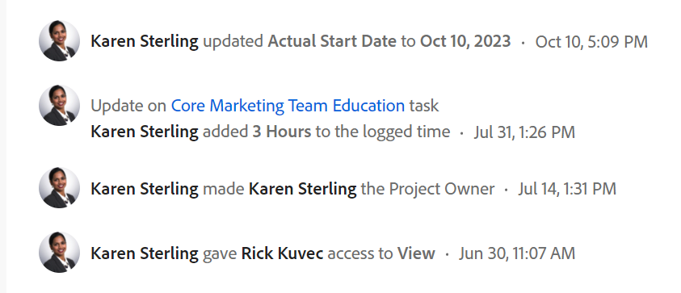

# Présentation des mises à jour suivies par le système

<!-- Audited: 06/2025-->

[!DNL Adobe Workfront] capture l’activité qui se produit sur certains objets en consignant des informations relatives au statut dans la section [!UICONTROL Mises à jour] de l’objet.

Pour plus d’informations sur la section Mises à jour, consultez la [Vue d’ensemble de la section Mises à jour](/help/quicksilver/workfront-basics/updating-work-items-and-viewing-updates/updates-tab-overview.md).

La zone [!UICONTROL Mises à jour] comprend les types de mises à jour suivants :

* **Mises à jour par les utilisateurs et utilisatrices :** informations saisies manuellement par les utilisateurs et utilisatrices. Il peut s’agir de commentaires, de réponses ou de notes. Les mises à jour apportées par les utilisateurs et utilisatrices s’affichent dans les onglets Commentaires et Tous de la section Mises à jour d’un objet.

  Pour plus d’informations sur la configuration des mises à jour apportées par les utilisateurs et utilisatrices, consultez la section [Configurer les préférences en matière de mises à jour apportées par les utilisateurs et utilisatrices](../../../administration-and-setup/set-up-workfront/system-tracked-update-feeds/configure-preferences-user-updates.md).

  

* **Mises à jour système :** créés automatiquement par le système. Une mise à jour système comprend une brève note décrivant le type de modification apporté à l’élément. Les mises à jour système s’affichent dans les onglets Activité du système et Tous de la section Mises à jour d’un objet.

  Pour plus d’informations sur les flux de mise à jour système et leur activation, consultez la section [Configurer les mises à jour système](../../../administration-and-setup/set-up-workfront/system-tracked-update-feeds/configure-system-updates.md).

  

  <!--
  DRAFTED IN FLARE:
  Timestamps for system updates are based on your operating system's timezone.
  
  -->

## Considérations relatives aux mises à jour suivies par le système

Les mises à jour suivies par le système ne sont pas disponibles pour tous les objets disposant de la zone Mises à jour.

* La zone [!UICONTROL Mises à jour] est disponible pour les objets suivants :

   * [!UICONTROL Projet]
   * [!UICONTROL Tâche]
   * [!UICONTROL Problème]
   * [!UICONTROL Portfolio]
   * [!UICONTROL Programme]
   * [!UICONTROL Utilisateur ou utilisatrice]
   * [!UICONTROL Modèle]
   * [!UICONTROL Tâche de modèle]
   * [!UICONTROL Équipe]
   * [!UICONTROL Document]
   * [!UICONTROL Feuille de temps]
   * [!UICONTROL Histoire]

     Dans [!DNL Workfront], une histoire est une tâche.
   * [!UICONTROL Itération]
   * [!UICONTROL Objectif]

     Tous les packages Workfront n’incluent pas d’objectifs Workfront. Pour plus d’informations, voir la section [Conditions requises pour utiliser Workfront Goals](../../../workfront-goals/goal-management/access-needed-for-wf-goals.md).
   * [!UICONTROL Carte] sur un panorama

     Pour plus d’informations sur les mises à jour des cartes, voir la section [Utiliser des cartes connectées sur les panoramas](../../../agile/get-started-with-boards/connected-cards.md).

* [!DNL Workfront] ne suit pas les mises à jour du système pour les objets suivants :

   * [!UICONTROL Équipe]
   * [!UICONTROL Modèle]
   * [!UICONTROL Tâche de modèle]
   * [!UICONTROL Carte] ad hoc
   * [!UICONTROL Itérations]

<!--hiding this bit because this is not true, at this time (August 2023). Users with a Work or Review license can see system updates by default as well.

Your [!DNL Workfront] license determines whether system updates display by default in the [!UICONTROL Updates] area of objects. [!DNL Workfront] users with a [!UICONTROL Plan] license have system updates displayed in the [!UICONTROL Updates] area by default. However, users can filter out system updates, as described in the [Enable or disable system updates](../../../workfront-basics/updating-work-items-and-viewing-updates/update-work.md#enable) section in [Update work](../../../workfront-basics/updating-work-items-and-viewing-updates/update-work.md). All other [!DNL Workfront] licenses filter system updates by default.
-->

* Les mises à jour apportées par les utilisateurs et utilisatrices s’affichent dans l’onglet Commentaires et les mises à jour système s’affichent dans les onglets Activité du système et Tous.

  Pour obtenir la liste des objets ne disposant pas des onglets Activité du système ou Tous, consultez la [Vue d’ensemble de la section Mise à jour](/help/quicksilver/workfront-basics/updating-work-items-and-viewing-updates/updates-tab-overview.md).

* Vous ne pouvez pas ajouter de réponse à une mise à jour système. Toutefois, toutes les réponses apportées aux enregistrements d’activité du système dans l’ancienne expérience de commentaire avant le 11 avril 2024 sont renseignées en lecture seule dans l’onglet Activité du système.

<!--
* The following are differences between the new and the legacy commenting experience: 

   * When using the new commenting experience, user updates display in the Comments tab and system updates display in the System Activity and the All tabs.  

      For more information about the new commenting experience, see [New commenting experience](../../../product-announcements/betas/new-commenting-experience-beta/unified-commenting-experience.md).

      For a list of objects that do not have the System Activity or the All tabs, see [Update section overview](/help/quicksilver/workfront-basics/updating-work-items-and-viewing-updates/updates-tab-overview.md)

   * When using the new commenting experience, you cannot add a comment to a system update. However, any replies made to system activity records in the legacy commenting experience are populated on the System Activity tab as read-only in the new commenting experience.
   * When using the legacy commenting experience, the system and user updates display in one continuous feed. 

   * When using the legacy commenting experience, users can view system updates by default or they can choose to not display them. Disabling system updates is not possible when using the new commenting experience. 

      For information about disabling the display of system updates, see the section [Enable or disable system updates](../../../workfront-basics/updating-work-items-and-viewing-updates/update-work.md#enable) in the article [Update work](../../../workfront-basics/updating-work-items-and-viewing-updates/update-work.md).  

   * The legacy commenting experience has been disabled in the Preview environment. For more information, see [Second Quarter 2024 Update stream and notification enhancements](/help/quicksilver/product-announcements/product-releases/24-q2-release-activity/24-q2-update-stream-enhancements.md).
-->

* L’administration de [!DNL Workfront] peut définir le type de modifications dont le système doit effectuer le suivi dans la zone [!UICONTROL Mises à jour]. Tous les objets qui ont une zone [!UICONTROL Mises à jour] ont également des flux [!UICONTROL mise à jour] configurables. Les objets suivants ont une zone [!UICONTROL Mises à jour] qui capture les flux de mise à jour suivis par le système, mais qui ne comporte pas de flux de mise à jour configurables :

   * [!UICONTROL Document]
   * [!UICONTROL Feuille de temps]
   * [!UICONTROL Itération]
   * [!UICONTROL Objectif]

