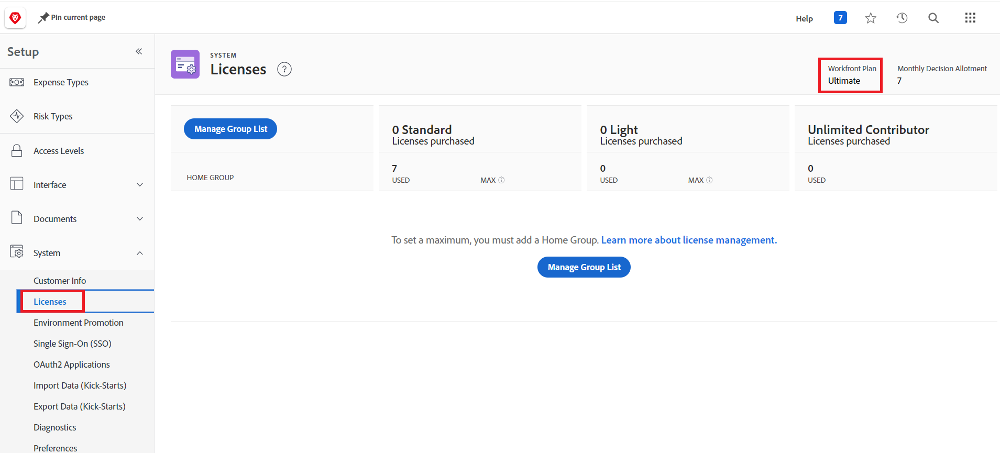

# FAQ sur la promotion environnementale

Les questions suivantes sont fréquemment posées sur la promotion de l’environnement :

## La promotion inter-domaines est-elle prise en charge ?

### Réponse

La promotion interdomaines de l’environnement n’est actuellement pas prise en charge. Vous devez effectuer une promotion entre les environnements du même domaine.

## Comment déterminer si notre instance Workfront dispose d’une licence Prime ou Ultimate ?

### Réponse

* Un administrateur Workfront peut localiser la licence de votre entreprise.

  1. Cliquez sur l’icône **[!UICONTROL Menu principal]**  dans le coin supérieur droit d’Adobe Workfront, ou (le cas échéant), cliquez sur l’icône **[!UICONTROL Menu principal]**  dans le coin supérieur gauche et sélectionnez **[!UICONTROL Configuration]** .
  1. Cliquez sur **Système** dans le panneau de gauche.
  1. Pour afficher votre plan Workfront, sélectionnez **Licences**.
Votre plan s’affiche dans le coin supérieur droit de la page.
     

  Ou
* Contactez votre représentant de compte Workfront.

## La promotion de l’environnement est-elle bidirectionnelle ?

### Réponse

Oui. Par exemple, vous pouvez convertir un sandbox en production ou un sandbox en production.

## Le partage est-il pris en charge ?

### Réponse

Non, le partage n’est actuellement pas pris en charge.

## La restauration de package est-elle disponible ?

### Réponse

La restauration des packages est disponible pour le package le plus récent, dans les 24 heures suivant l’installation du package.

## Y aura-t-il une option pour ignorer la promotion de composants individuels ? Où se trouvent les options `Use Existing`, `Overwrite` et `Save with a new Name` », peut-`Skip` être ajouté pour que vous puissiez ignorer la promotion de paramètres individuels ?

### Réponse

* « Utiliser existant » revient à « ignorer » ou à ignorer le déploiement, car il correspond à l’objet existant dans l’environnement cible et n’apporte aucune modification.
* Pour ignorer les objets, nous vous recommandons de supprimer du package de promotion ou directement de l’environnement source les objets que vous ne souhaitez pas installer. Après avoir supprimé les objets, réassemblez le package.
