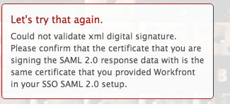

# Message d’erreur : impossible de valider la signature numérique XML

## Problème

Vous ne pouvez pas établir une connexion réussie à ADFS.

>[!NOTE]
>
>Si vous établissez une connexion de test réussie et que vous rencontrez toujours des problèmes, vous pouvez rencontrer des mappages d’attributs ou des problèmes avec les ID de fédération. Contactez l’assistance clientèle pour toute question.

## Conditions d’accès

Vous devez disposer des accès suivants pour effectuer les étapes de cet article :

+++ Développez pour afficher les exigences d’accès aux fonctionnalités de cet article.

Vous devez disposer des accès suivants pour effectuer les étapes de cet article :

<table style="table-layout:auto"> 
 <col> 
 <col> 
 <tbody> 
  <tr> 
   <td role="rowheader">[!DNL Adobe Workfront] plan</td> 
   <td>N’importe quelle</td> 
  </tr> 
  <tr> 
   <td role="rowheader">[!DNL Adobe Workfront] licence</td> 
   <td>
   
Nouvelle : standard

   
ou

   
Actuelle : formule
</td> 
  </tr> 
  <tr> 
   <td role="rowheader">Configurations du niveau d’accès</td> 
   <td>Vous devez être un administrateur ou une administratrice [!DNL Workfront]. </td> 
  </tr> 
 </tbody> 
</table>

Pour plus d’informations sur ce tableau, consultez [Conditions d’accès requises dans la documentation Workfront](/help/quicksilver/administration-and-setup/add-users/access-levels-and-object-permissions/access-level-requirements-in-documentation.md).

+++

## Cause 1 : le certificat est incorrect

### Solution

Récupérez manuellement le certificat de signature à partir du serveur ADFS :

1. Dans [!DNL Windows], cliquez sur **[!UICONTROL Démarrer]** > **[!UICONTROL Administration]** > **[!UICONTROL Gestion ADFS 2.0]**.\
   La boîte de dialogue Gestion ADFS 2.0 s’affiche.

1. Sélectionnez **[!UICONTROL Trust Relationship]** > **[!UICONTROL Relying Party Trtrust]** dans le volet de gauche.

1. Cliquez avec le bouton droit de la souris sur **[!UICONTROL Relying Party Trust]**, puis sélectionnez **[!UICONTROL Properties]**.

1. Cliquez sur l’onglet **[!UICONTROL Signature]** .
1. Cliquez sur le nom du certificat de signature, puis sur **[!UICONTROL Afficher]**.
1. Cliquez sur Copier vers **[!UICONTROL Fichier]**... et sélectionnez **[!UICONTROL Suivant]**.

1. Sélectionnez **[!UICONTROL Base-64 codé x.509 (CER)]**, puis cliquez sur **[!UICONTROL Suivant]**.

1. Indiquez le nom du fichier, puis cliquez sur **[!UICONTROL Suivant]**.
1. Cliquez sur **[!UICONTROL Terminer]**.
1. Dans [!DNL Adobe Workfront], accédez à **[!UICONTROL Configuration]** > **[!UICONTROL Système]** > **[!UICONTROL Connexion unique (SSO)]** et chargez manuellement le certificat de signature.

## Cause 2 : le certificat est signé à l’aide de DSA lorsque [!DNL Workfront] attend une signature RSA

### Solution

Recréez le certificat et utilisez la signature RSA au lieu de la DSA.

## Cause 3 : les données XML sont incorrectes

### Solution

Réexportez et réimportez les métadonnées XML à partir du système de gestion ADFS.

## Cause 4 : la requête n’a pas pu être exécutée en raison d’une erreur côté SAML.

### Solution

Contactez votre fournisseur SAML.
