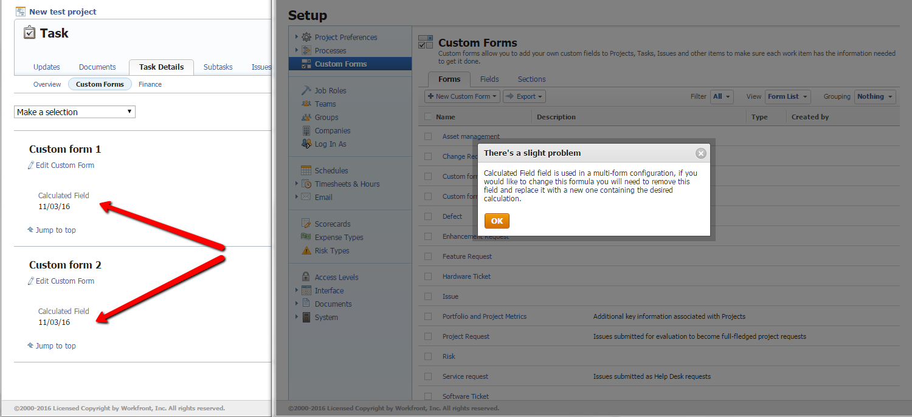

# Message d’erreur : il y a un léger problème. Ce champ est utilisé dans une configuration multi-formulaires.

## Problème

Lorsque vous modifiez un calcul sur un champ personnalisé calculé sur un formulaire personnalisé, [!DNL Adobe Workfront] peut afficher l’avertissement suivant :

Il y a un petit problème

[Le champ] est utilisé dans une configuration multi-formulaires. Si vous souhaitez modifier ce formulaire, vous devez supprimer ce champ et le remplacer par un nouveau champ contenant le calcul souhaité.

## Cause

Au moins deux formulaires personnalisés contenant le champ personnalisé calculé que vous essayez de modifier sont associés à un seul objet de votre instance [!DNL Workfront].

**Exemple :** les formulaires personnalisés A et B sont associés à la même tâche. Les deux formulaires contiennent un champ personnalisé calculé appelé Profit. L’erreur se produit lorsque vous essayez de modifier le calcul dans le champ Profit du formulaire personnalisé A.

Vous ne pouvez pas modifier le calcul du champ personnalisé dans l’un des formulaires, car cela entrerait en conflit avec la formule dans le même champ de l’autre formulaire.
Pour résoudre ce conflit, vous devez rechercher l’objet auquel sont attachés les différents formulaires utilisant le même champ personnalisé calculé, puis effectuer l’une des opérations suivantes :

* Supprimez l’un des formulaires de l’objet.
* Modifiez le calcul selon vos besoins, mais faites-le dans tous les formulaires personnalisés attachés à l’objet.
* Dans tous les formulaires personnalisés associés à l’objet, ajoutez un nouveau champ personnalisé calculé contenant le calcul dont vous avez besoin et marquez l’ancien champ personnalisé calculé comme obsolète.

Cet article explique comment trouver l’objet puis résoudre le problème de l’une de ces trois façons.

>[!NOTE]
>
>Si l’erreur s’affiche, mais que vous ne pouvez pas localiser plusieurs objets contenant le champ personnalisé, vérifiez la Corbeille. Il est possible qu’un objet de la Corbeille contienne le champ . Comme les objets de la Corbeille peuvent être restaurés à tout moment, l’erreur de conflit multiforme continue de se produire jusqu’à ce que le conflit soit résolu.
>
>Pour ajouter un champ avec une expression différente, vous devez résoudre ce conflit en effectuant l’une des opérations suivantes :
>
>* Supprimez le champ du formulaire personnalisé en conflit
>* Restaurez l’objet supprimé, désolidarisez l’un des formulaires personnalisés en conflit, puis supprimez à nouveau l’objet si nécessaire.

## Rechercher l’objet auquel les formulaires personnalisés sont joints. {#find-the-object-where-the-custom-forms-are-attached}

{{step-1-to-setup}}

1. Cliquez sur **[!UICONTROL Formulaires personnalisés]** > **[!UICONTROL Champs]**.
1. Appliquez la vue **[!UICONTROL Liste de champs]** pour rechercher le champ calculé que vous essayez de modifier et prenez note de chaque formulaire personnalisé sur lequel il est utilisé (par exemple, formulaire 1, formulaire 2, formulaire 3).
1. Cliquez sur **[!UICONTROL Formulaires]**, puis appliquez la vue **[!UICONTROL Liste de formulaires]**.
1. Cliquez sur la liste déroulante **[!UICONTROL Filtre]**, puis sur **[!UICONTROL Nouveau filtre]**.

1. Cliquez sur **[!UICONTROL Ajouter une règle de filtre]**, puis commencez à saisir « nom du formulaire personnalisé » et sélectionnez cette valeur lorsqu’elle s’affiche dans la liste.
1. Sélectionnez **[!UICONTROL Égal]** pour le modificateur de filtre, commencez à saisir le nom de chaque formulaire dont vous avez pris note à l’étape 1, puis sélectionnez-le lorsqu’il s’affiche.

   **Exemple :** Nom du formulaire personnalisé Égal Formulaire 1, Formulaire 2, Formulaire 3.

1. Cliquez sur **[!UICONTROL Enregistrer le filtre]**, puis nommez le nouveau filtre et cliquez sur **[!UICONTROL Enregistrer le filtre]**.

1. Dans la liste des formulaires, notez le type d’objet du filtre, tel que Tâche ou Problème, qui s’affiche dans la colonne **[!UICONTROL Type]**.
1. Sur chaque formulaire personnalisé que vous avez trouvé à l’étape 1, créez un champ personnalisé Case à cocher avec une seule valeur par défaut : Oui.

   **Exemple :** Champ 1 sur le Formulaire 1 = Oui, Champ 2 sur le Formulaire 2 = Oui, Champ 3 sur le Formulaire 3 = Oui. Cela signifie : « Le champ personnalisé calculé existe sur le Formulaire 1 » ou « Le champ personnalisé calculé existe sur le Formulaire 2 », etc.

1. Dans l’**[!UICONTROL icône Rechercher]**  dans le coin supérieur droit de l’écran, cliquez sur **[!UICONTROL Recherche avancée]**.
1. Cliquez sur l’objet de votre formulaire personnalisé (tel que Problème), puis sur **[!UICONTROL Filtrer vos résultats]**, puis cliquez sur **[!UICONTROL Ajouter un filtre]**.
1. Commencez à saisir le nom d’un champ de case à cocher dans le champ **[!UICONTROL Saisissez le nom du champ]** et sélectionnez-le lorsqu’il s’affiche dans la liste, puis sélectionnez **[!UICONTROL Égal]** et saisissez **[!UICONTROL Oui]** (sans guillemets) dans la case suivante.

   **Exemple :** Champ 1 Égal (respect de la casse) Oui.

1. Cliquez sur **[!UICONTROL Ajouter un filtre]** et ajoutez tous les champs Case à cocher à votre recherche avancée.

   Recherchez chaque combinaison possible.

   **Exemple :** créez plusieurs filtres avec les combinaisons que vous trouvez, comme indiqué ci-dessous. Vous devez rechercher des objets comportant plusieurs formulaires personnalisés associés contenant les mêmes champs calculés. Il se peut que vous rencontriez les scénarios suivants :

   * Champ 1= Oui + Champ 2 = Oui + Champ 3 = Oui (aucun objet, par exemple)
   * Champ 1= Oui + Champ 2 = Oui (aucun objet, par exemple)
   * Champ 1= Oui + Champ 3 = Oui (deux objets, par exemple)

   Cela signifie que le champ calculé existe à la fois sur le Formulaire 1 et sur le Formulaire 3, car les champs de case à cocher correspondants (Champ 1 et Champ 3) existent sur ces objets.

   Champ 2 = Oui + Champ 3 = Oui (aucun objet, par exemple)

1. Passez à l’une des sections suivantes de cet article :

   * [Supprimer l’un des formulaires personnalisés de l’objet et y modifier le calcul](#remove-one-of-the-custom-forms-from-the-object-and-edit-the-calculation-there)
   * [Apporter des modifications identiques au calcul dans tous les formulaires personnalisés joints](#make-identical-edits-in-the-calculation-in-all-of-the-attached-custom-forms)
   * [Ajouter un nouveau champ calculé contenant le calcul modifié à un ou à tous les formulaires personnalisés joints](#add-a-new-calculated-field-containing-the-edited-calculation-to-one-or-all-of-the-attached-custom-forms)

## Supprimer l’un des formulaires personnalisés de l’objet et y modifier le calcul {#remove-one-of-the-custom-forms-from-the-object-and-edit-the-calculation-there}

1. Recherchez l’objet auquel les formulaires personnalisés sont joints, tel qu’expliqué dans [Rechercher l’objet auquel les formulaires personnalisés sont joints](#find-the-object-where-the-custom-forms-are-attached) de cet article, puis ouvrez l’objet.
1. Supprimez l’un des formulaires personnalisés de l’objet, puis enregistrez l’objet.

   >[!NOTE]
   >
   >Pour ajouter les champs du formulaire que vous avez supprimés de l’objet, vous devrez peut-être modifier le formulaire personnalisé qui reste joint à l’objet. Vous pouvez ainsi conserver les informations de données personnalisées sur l’objet.

1. Dans le formulaire personnalisé que vous avez supprimé, modifiez le calcul du champ personnalisé que vous essayiez de mettre à jour initialement, puis cliquez sur **[!UICONTROL Enregistrer]**.

   Cette fois, [!DNL Workfront] ne doit pas rencontrer de conflit.

1. (Facultatif) Supprimez les champs de case à cocher des formulaires personnalisés ou supprimez-les de [!DNL Workfront].

## Apporter des modifications identiques au calcul dans tous les formulaires personnalisés joints {#make-identical-edits-in-the-calculation-in-all-of-the-attached-custom-forms}

>[!IMPORTANT]
>
>Les données sont perdues dans les objets où le formulaire personnalisé est déjà joint lorsque vous suivez ces étapes. Cependant, si le champ calculé fait référence à des champs statiques et non à des champs calculés, vous pouvez utiliser l’option [!UICONTROL Recalculer les expressions personnalisées] sur l’objet pour restaurer les données perdues.

1. Recherchez l’objet auquel les formulaires personnalisés sont joints, tel qu’expliqué dans la section [Rechercher l’objet auquel les formulaires personnalisés sont joints](#find-the-object-where-the-custom-forms-are-attached) de cet article.
1. Supprimez le champ de tous les formulaires personnalisés joints à l’objet, puis enregistrez les formulaires.

1. Rajoutez le champ personnalisé contenant le nouveau calcul aux formulaires personnalisés.

   >[!IMPORTANT]
   >
   >Les calculs doivent être identiques dans tous les formulaires personnalisés joints.

1. (Facultatif) Supprimez les champs de case à cocher des formulaires ou supprimez-les de [!DNL Workfront].

## Ajouter un nouveau champ calculé contenant le calcul modifié à un ou à tous les formulaires personnalisés joints {#add-a-new-calculated-field-containing-the-edited-calculation-to-one-or-all-of-the-attached-custom-forms}

Pour éviter de perdre des données dans le champ personnalisé calculé existant, ou si vous devez modifier le calcul dans un seul des formulaires personnalisés joints à l’objet que vous avez trouvé, procédez comme suit :

1. Recherchez l’objet auquel les formulaires personnalisés sont joints, tel qu’expliqué dans la section [Rechercher l’objet auquel les formulaires personnalisés sont joints](#find-the-object-where-the-custom-forms-are-attached) de cet article.
1. Ajoutez un nouveau champ personnalisé calculé contenant le calcul dont vous avez besoin pour un ou tous les formulaires.
1. Renommez l’ancien champ personnalisé calculé **Obsolète**.

   Sur tous les formulaires joints à l’objet, ce formulaire personnalisé calculé plus ancien conserve ses données historiques, mais les utilisateurs et utilisatrices arrêtent de les utiliser.

   >[!IMPORTANT]
   >
   >Le champ plus ancien peut être référencé dans d’autres champs personnalisés calculés. Vous devez donc mettre à jour ces calculs après avoir modifié son nom.

1. (Facultatif) Supprimez les champs de case à cocher des formulaires ou supprimez-les de Workfront.

<!--
<blockquote data-mc-conditions="QuicksilverOrClassic.Draft mode">
<h2>Problem</h2>

You get the following error while editing a calculated Custom Field on a custom form: 

<em>"<Name of custom field> field is used in a multi-form configuration, if you would like to change this formula you will need to remove this field and replace it with a new one containing the desired calculation."</em> 

<h2>Cause</h2>

The error occurs because the following setup exists: currently you have at least one object in your system that has multiple custom forms attached. The calculated field you are editing exists on multiple forms attached to these objects.

You cannot have the same calculated field with different calculations on the same object. For this reason, the system does not allow you to make a change which will result in calculations being different.

 

For example, you have a task with custom forms A and B attached to it. Both forms contain the same calculated field, Field 1. You encounter this error when you try to edit the calculation for Field 1 on custom form A. 

<h2>Solution</h2>

Remove the field from the custom form and replace it with a new one containing the desired calculation.  

To understand what custom forms are attached to objects, you can build a report for those objects and reference the Category Name field in the view of the report. For more information about referencing custom forms in reports, see the "Referencing Custom Forms in a Report View (Column)" section in <a href="../../reports-and-dashboards/reports/creating-and-managing-reports/reference-custom-form-report.md" class="MCXref xref" xrefformat="{para}">Reference a custom form in a report</a>.

To understand what custom form contains a Custom Field, see the "Accessing Custom Forms and Fields" section in <a href="../../administration-and-setup/customize-workfront/create-manage-custom-forms/custom-forms-overview.md" class="MCXref xref" xrefformat="{para}">Custom forms overview</a>.

</blockquote>
-->
