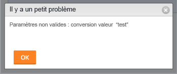

# Message d’erreur : Paramètre non valide : valeur de conversion

## Problème

Vous recevez le message d’erreur suivant lorsque vous tentez de modifier le format d’un champ personnalisé sur un formulaire personnalisé existant : &quot;Paramètre non valide : valeur de conversion &quot;&lt;...>&quot;\

## Cause

Ce message se produit dans le scénario suivant :

Par exemple, vous avez un champ personnalisé au format Texte.  Maintenant, vous souhaitez modifier le format du champ personnalisé en devise. Quelque part dans votre instance Adobe Workfront, ce champ est déjà attaché à un objet et contient des informations déjà spécifiées. Les informations existantes dans au moins un de ces champs sont déjà au format Texte. Par conséquent, le format du champ ne peut pas être modifié en devise.

<table style="table-layout:auto"> 
 <col> 
 <col> 
 <tbody> 
  <tr> 
   <td role="rowheader"> 
<a href="https://www.workfront.com/plans?lang=fr" target="_blank">Plan Workfront</a>*
 </td> 
   <td>N’importe quelle</td> 
  </tr> 
  <tr> 
   <td role="rowheader"> 
<a href="../../administration-and-setup/add-users/access-levels-and-object-permissions/wf-licenses.md" class="MCXref xref">Présentation des licences</a>*
 </td> 
   <td>Plan</td> 
  </tr> 
  <tr data-mc-conditions=""> 
   <td role="rowheader"><strong>Niveau d’accès*</strong> </td> 
   <td> 
Modifier l’accès à :
 
    <ul> 
     <li> 
Création de rapports, de tableaux de bord et de calendriers
 </li> 
     <li> 
Création de filtres, d’affichages et de groupes
 </li> 
    </ul> 
<b>REMARQUE</b> : si vous n’avez toujours pas l’accès, demandez à votre administrateur ou administratrice Workfront si des restrictions supplémentaires à votre niveau d’accès ont été appliquées. Pour plus d’informations sur la façon dont un administrateur ou une administratrice de Workfront peut modifier votre niveau d’accès, voir <a href="../../administration-and-setup/add-users/configure-and-grant-access/create-modify-access-levels.md" class="MCXref xref">Créer ou modifier les niveaux d’accès personnalisés</a>.
 </td> 
  </tr> 
 </tbody> 
</table>

## Solution

Procédez comme suit :

1. Créez des rapports pour tous les objets auxquels ce champ peut être associé à leur Forms personnalisée.\
   Pour plus d&#39;informations sur la création d&#39;un rapport, voir [Création d&#39;un rapport personnalisé](../../reports-and-dashboards/reports/creating-and-managing-reports/create-custom-report.md).

1. Insérez le champ personnalisé que vous essayez de modifier dans la vue du rapport afin de voir quel objet ce champ est renseigné par une valeur de texte.
1. Corrigez les valeurs des champs personnalisés des objets qui s’affichent au format texte et attribuez-leur une valeur au format Devise, puis tentez à nouveau de modifier le champ Format du formulaire personnalisé.\
   Ou\
   Si trop de valeurs de champ sont déjà renseignées avec des informations au format texte, pensez à ajouter un nouveau champ personnalisé à votre formulaire personnalisé et à le formater en tant que devise.
