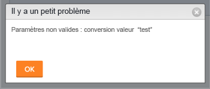

# Message d’erreur : paramètre non valide : valeur de conversion

## Problème

Vous recevez le message d’erreur suivant lorsque vous tentez de modifier le format d’un champ personnalisé dans un formulaire personnalisé existant : « Paramètre non valide : valeur de conversion &quot;&lt;...>&quot; ».\

## Cause

Ce message s’affiche dans le cas suivant :

Par exemple, vous avez un champ personnalisé formaté en tant que texte.  Vous voulez maintenant changer le format du champ personnalisé en devise. Quelque part dans votre instance Adobe Workfront, ce champ est déjà lié à un objet et des informations y sont déjà spécifiées. Les informations existantes dans au moins l’un de ces champs sont déjà formatées en tant que texte. Par conséquent, le format du champ ne peut être modifié en devise.

## Conditions d’accès

+++ Développez pour afficher les exigences d’accès aux fonctionnalités de cet article.

<table style="table-layout:auto"> 
 <col> 
 <col> 
 <tbody> 
  <tr> 
   <td>[!DNL Adobe Workfront] paquet</td> 
   <td>
Tous
</td> 
  </tr> 
  <tr> 
   <td>[!DNL Adobe Workfront] licence</td> 
   <td>
Standard

       
Plan
</td>
  </tr>
  <tr> 
   <td>Configurations des niveaux d’accès</td> 
   <td> 
Accès en modification aux éléments suivants :
 
    <ul> 
     <li> 
Créer des rapports, des tableaux de bord et des calendriers
 </li> 
     <li> 
Créer des filtres, des vues et des regroupements
 </li> 
    </ul>
  </tr> 
 </tbody> 
</table>

Pour plus d’informations, voir [Conditions d’accès requises dans la documentation Workfront](/help/quicksilver/administration-and-setup/add-users/access-levels-and-object-permissions/access-level-requirements-in-documentation.md).

+++

## Solution

Procédez comme suit :

1. Créez des rapports pour tous les objets dont le champ est susceptible d’être associé à leurs formulaires personnalisés.\
   Pour plus d’informations sur la création d’un rapport, consultez la section [Créer un rapport personnalisé](../../reports-and-dashboards/reports/creating-and-managing-reports/create-custom-report.md).

1. Incluez le champ personnalisé que vous essayez de modifier dans la vue du rapport afin de voir les objets dont ledit champ contient une valeur de texte.
1. Corrigez les valeurs du champ personnalisé des objets qui s’affichent au format texte et donnez-leur une valeur formatée en tant que devise. Ensuite, essayez à nouveau de modifier le champ Format du formulaire personnalisé.\
   Ou\
   Si vous avez trop de valeurs de champ déjà remplies avec des informations au format texte, envisagez d’ajouter un nouveau champ personnalisé à votre formulaire personnalisé et de le formater en tant que devise.
