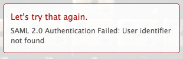

# Message d’erreur : Erreur SAML 2.0 : Identifiant utilisateur introuvable

## Problème

Vous ne pouvez pas établir une connexion réussie à ADFS.

>[!NOTE]
>
>Si vous établissez une connexion de test réussie et que vous rencontrez toujours des problèmes, vous pouvez rencontrer des mappages d’attributs ou des problèmes avec les ID de fédération. Contactez l’assistance clientèle pour toute question.

## Cause :

Les revendications sur le serveur ADFS sont incorrectes

## Exigences d’accès

Vous devez disposer des accès suivants pour effectuer les étapes de cet article :

<table style="table-layout:auto"> 
 <col> 
 <col> 
 <tbody> 
  <tr> 
   <td role="rowheader">[!DNL Adobe Workfront] plan</td> 
   <td>Tous</td> 
  </tr> 
  <tr> 
   <td role="rowheader">[!DNL Adobe Workfront] license</td> 
   <td>Plan</td> 
  </tr> 
  <tr> 
   <td role="rowheader">Paramétrages du niveau d'accès</td> 
   <td> 
Vous devez être un [!DNL Workfront] administrateur. Pour plus d’informations, voir <a href="../../administration-and-setup/add-users/configure-and-grant-access/grant-a-user-full-administrative-access.md" class="MCXref xref">Octroi d’un accès administratif complet à un utilisateur</a>.
 
<b>REMARQUE</b>: Si vous n’avez toujours pas accès à , demandez à votre [!DNL Workfront] s’ils définissent des restrictions supplémentaires au niveau de votre accès. Pour plus d’informations sur la manière dont une [!DNL Workfront] l’administrateur peut modifier votre niveau d’accès, voir <a href="../../administration-and-setup/add-users/configure-and-grant-access/create-modify-access-levels.md" class="MCXref xref">Création ou modification de niveaux d’accès personnalisés</a>.
 </td> 
  </tr> 
 </tbody> 
</table>

## Solution

Sur le serveur ADFS, assurez-vous qu’il existe une demande pour l’ID de nom :

1. Sous Windows, cliquez sur **[!UICONTROL Début]** > **[!UICONTROL Administration]** > **[!UICONTROL Gestion d’ADFS 2.0]**.\
   La boîte de dialogue Gestion ADFS 2.0 s’affiche.

1. Sélectionner **[!UICONTROL Relation de confiance]** > **[!UICONTROL Confiance des parties]** dans le volet de gauche.

1. Cliquez avec le bouton droit de la souris sur la confiance de la partie de confiance associée à Adobe Workfront, puis sélectionnez **[!UICONTROL Modifier des règles de demande]**.
1. Vérifiez que la demande comporte une **[!UICONTROL Type de demande sortante]** de **[!UICONTROL ID de nom]**.

