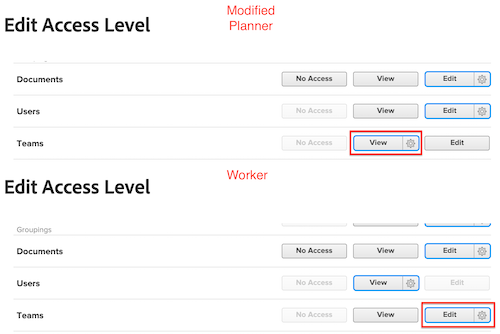
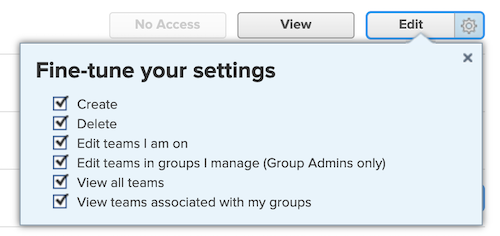

# Les administrateurs et administratrices de groupe doivent avoir un accès plus élevé que ceux qu’ils gèrent.

Si un administrateur de groupes dispose d’autorisations de niveau d’accès inférieur à celles qu’il gère, il ne pourra pas afficher, modifier ni attribuer de niveaux d’accès inférieurs.

## Problème

Si une personne chargée de l’administration de groupes se voit attribuer un niveau d’accès planificateur modifié avec les autorisations d’affichage pour les équipes, mais que certains utilisateurs et utilisatrices reçoivent un niveau d’accès travail avec les autorisations de modification pour les équipes, elle ne pourra pas interagir avec le niveau d’accès travail modifié.

>[!NOTE]
>
>Cette logique s’applique également au menu déroulant Ajuster vos paramètres. Les deux niveaux d’accès peuvent disposer de l’accès en modification, mais les paramètres du menu déroulant Ajuster vos paramètres doivent être supérieurs pour l’administrateur ou l’administratrice de groupes.
> 

## Solution

Les administrateurs et administratrices de groupes doivent disposer d’autorisations plus élevées dans toutes les zones du niveau d’accès que celles qu’ils gèrent.
