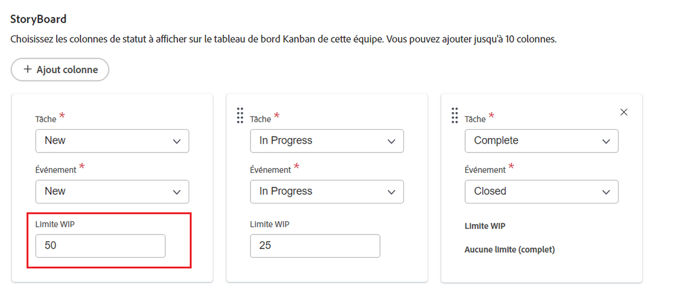

# Configurer [!UICONTROL Kanban]

<!--Audited: 12/2023-->

Vous pouvez créer une équipe Agile dans [!DNL Adobe Workfront] comme décrit dans la section [Créer une équipe Agile](../../agile/get-started-with-agile-in-workfront/create-an-agile-team.md). Lors de la création d’une équipe Agile, vous pouvez choisir la méthodologie que l’équipe utilise pour terminer son travail. Vous pouvez choisir parmi les options suivantes :

* Scrum
* Kanban

Cet article décrit comment configurer les paramètres d’une équipe Kanban. Après avoir créé une équipe Agile et choisi la méthodologie Kanban , vous pouvez vous reporter à cet article pour mettre à jour les paramètres suivants :

* Si les histoires sont estimées en points ou en heures
* Les colonnes de statut du storyboard agile
* Champs supplémentaires à afficher sur les cartes de l’histoire sur le storyboard agile
* Limite du travail en cours (WIP)
* Ajouter automatiquement des histoires depuis la liste d’attente
* Durée de conservation des cartes sur le tableau Kanban

Pour plus d’informations sur la configuration d’une équipe Scrum, consultez la section [Configurer Scrum](../get-started-with-agile-in-workfront/configure-scrum.md).

## Conditions d’accès

+++ Développez pour afficher les exigences d’accès aux fonctionnalités de cet article.

<table style="table-layout:auto"> 
 <col> 
 </col> 
 <col> 
 </col> 
 <tbody> 
  <tr> 
   <td role="rowheader">Package Adobe Workfront</td> 
   <td> 
Tous
 </td> 
  </tr>

<tr> 
   <td role="rowheader">Licence Adobe Workfront</td> 
   <td> 
Standard
 
   
Travail ou supérieur
 </td> 
  </tr>

<tr> 
   <td role="rowheader">Configurations des niveaux d’accès</td> 
   <td> 
Modifier l’accès aux équipes
  </td> 
  </tr>

</tbody> 
</table>

Pour plus de détails sur les informations contenues dans ce tableau, consultez [Conditions d’accès préalables dans la documentation Workfront](/help/quicksilver/administration-and-setup/add-users/access-levels-and-object-permissions/access-level-requirements-in-documentation.md).

+++

## Configurer l’estimation des histoires en points ou en heures

Vous pouvez configurer les histoires à estimer en points ou en heures.

Pour configurer la manière dont les histoires sont estimées pour votre équipe Agile :

{{step1-to-team}}

1. Cliquez sur l’icône **[!UICONTROL Changer d’équipe]** , puis sélectionnez une nouvelle équipe dans le menu déroulant ou recherchez une équipe dans la zone de recherche.
1. Sélectionnez l’équipe Agile à gérer.
1. Cliquez sur le menu **[!UICONTROL Plus]** , puis sélectionnez **[!UICONTROL Modifier]**.

   

1. Dans la section **[!UICONTROL Agile]**, dans la zone **[!UICONTROL Estimer des histoires dans]**, choisissez si vous souhaitez utiliser des points ou des heures pour estimer la taille (charge de travail) des histoires. Si vous sélectionnez Points, indiquez le nombre d’heures égal à 1 point. (La valeur par défaut est 1 point = 8 heures.) Il s’agit du nombre d’heures planifiées qui sont ajoutées à l’histoire.

   **Exemple :** si vous avez choisi d’estimer les histoires en points et qu’un point équivaut à 8 heures, et qu’une histoire est estimée à 3 points, 24 heures prévues sont ajoutées à l’histoire.

1. Cliquez sur **[!UICONTROL Enregistrer les modifications]**.

## Configurer les colonnes de statut sur le storyboard agile

Vous pouvez définir les statuts qui existent sur le storyboard pour l&#39;équipe Agile. Ce sont les seuls statuts qui s’affichent sur le Storyboard.

Pour définir les statuts disponibles pour le storyboard associé à l&#39;équipe Agile :

{{step1-to-team}}

1. Cliquez sur l’icône **[!UICONTROL Changer d’équipe]** , puis sélectionnez une nouvelle équipe dans le menu déroulant ou recherchez une équipe dans la barre de recherche.

1. Sélectionnez l’équipe Agile à gérer.
1. Cliquez sur le menu **[!UICONTROL Plus]**, puis sélectionnez **[!UICONTROL Modifier]**.

   

1. Dans la section **[!UICONTROL Agile]**, recherchez la zone **[!UICONTROL StoryBoard]**.

1. (Facultatif) Cliquez sur **[!UICONTROL Ajouter une colonne]** pour ajouter une colonne de statut supplémentaire au StoryBoard.
1. (Facultatif) Faites glisser une colonne de statut à l’aide de l’indicateur glisser-déposer pour réorganiser les colonnes de statut sur le StoryBoard. La première colonne ne peut pas être déplacée et vous ne pouvez pas faire glisser une autre colonne devant la première colonne.

   

1. Sélectionnez les statuts de la tâche.

   >[!IMPORTANT]
   >
   >Seuls les statuts verrouillés à l’échelle du système peuvent être sélectionnés. Vous ne pouvez pas sélectionner de statuts spécifiques à un groupe. Le statut de la première colonne correspond toujours à **[!UICONTROL Nouveau]**.

   Vous pouvez ajouter des statuts personnalisés si votre administrateur ou administratrice [!DNL Workfront] les a configurés. Pour plus d’informations, voir [Créer ou modifier un statut](../../administration-and-setup/customize-workfront/creating-custom-status-and-priority-labels/create-or-edit-a-status.md).

1. Cliquez sur **[!UICONTROL Enregistrer les modifications]**.

## Configurer des champs supplémentaires à afficher sur les cartes de l’histoire dans le storyboard agile

Lorsque vous ajoutez des champs à des cartes d’histoire, ces champs ne s’affichent que lorsque le champ est renseigné.

Par défaut, les types de données suivants s’affichent sur la carte d’histoire pour les tâches et les problèmes :

* Nom de l’article avec un lien direct vers la tâche ou le problème
* Nom du projet avec un lien direct vers le projet
* Ce lien s’affiche uniquement pour les histoires, et non pour les sous-tâches.
* Description de la tâche ou du problème
* Engagement actuel
* Affichez et modifiez le pourcentage terminé soit en ajustant le pourcentage terminé lui-même, soit en ajustant le nombre de points ou d’heures terminés.
* Personnes affectées

Vous pouvez afficher des données supplémentaires (y compris des données personnalisées) sur les cartes d’histoire. Il se peut que vous vouliez afficher des champs supplémentaires sur les cartes d’histoire pour un certain nombre de raisons. Par exemple, vous pouvez afficher l’ID de client ou cliente si vous travaillez sur des histoires pour plusieurs clientes et clients au cours de l’itération ou vous pouvez afficher la date de début ou la date de fin du projet.

>[!NOTE]
>
>Si vous utilisez un champ personnalisé sur une carte d’histoire, son nom ne peut pas contenir de point.

Pour configurer les cartes d’histoire affectées à l’équipe Agile afin d’afficher des champs supplémentaires :

{{step1-to-team}}

1. Cliquez sur l’icône **[!UICONTROL Changer d’équipe]** , puis sélectionnez une nouvelle équipe dans le menu déroulant ou recherchez une équipe dans la barre de recherche.

1. Sélectionnez l’équipe Agile à gérer.
1. Cliquez sur le menu **[!UICONTROL Plus]**, puis sélectionnez **[!UICONTROL Modifier]**.

   

1. Dans la section **[!UICONTROL Agile]**, saisissez un nom de champ pour le localiser.

   

1. Sélectionnez le nom du champ que vous souhaitez ajouter.
1. Saisissez le **[!UICONTROL Nom d’affichage]** pour que le champ s’affiche sur la carte d’histoire ou de problème.
1. Cliquez sur **[!UICONTROL Enregistrer les modifications]**.

## Configurer la limite du travail en cours (WIP)

Lorsque vous définissez la limite du travail en cours d’une équipe Kanban, vous pouvez contrôler le nombre d’éléments sur lesquels l’équipe travaille actuellement en limitant le nombre de tâches pouvant apparaître dans la colonne [!UICONTROL Nouveau] ou [!UICONTROL En cours] sur le tableau [!UICONTROL Kanban].

Après avoir configuré la limite WIP pour une équipe Kanban, vous pouvez afficher la limite WIP et la mettre à jour à partir du storyboard [!UICONTROL Kanban] Agile, comme décrit dans la section [ Gérer la limite WIP (Work in Progress) sur le panorama [!UICONTROL Kanban]](../../agile/use-kanban-in-an-agile-team/work-in-progress-limit-on-the-kanban-board.md).

Pour limiter le travail en cours pour votre équipe Kanban, procédez comme suit :

{{step1-to-team}}

1. Cliquez sur l’icône **[!UICONTROL Changer d’équipe]** , puis sélectionnez une nouvelle équipe dans le menu déroulant ou recherchez une équipe dans la barre de recherche.

1. Sélectionnez l’équipe Kanban que vous souhaitez gérer.
1. Cliquez sur le menu **[!UICONTROL Plus]** , puis sélectionnez **[!UICONTROL Modifier]**.

   

1. Dans la section **[!UICONTROL Agile]**, dans la section **[!UICONTROL Méthodologie]**, vérifiez que Kanban est sélectionné.

1. Dans la section **[!UICONTROL Storyboard]**, dans le champ **[!UICONTROL Limite WIP]**, indiquez le nombre maximal d’éléments autorisés dans chaque colonne du storyboard [!UICONTROL Kanban] Agile. Vous pouvez définir une limite différente pour chaque colonne. La limite maximale que vous pouvez définir pour chaque colonne est de 100.
Lorsqu&#39;elle est définie, la limite des travaux en cours affiche un message d&#39;avertissement sur le storyboard agile [!UICONTROL Kanban] chaque fois que la limite est dépassée pour une colonne du storyboard. Ce message d’avertissement s’affiche uniquement la première fois que la limite du travail en cours est dépassée. Ce message d&#39;avertissement ne s&#39;affiche dans aucune colonne dont le statut est égal à [!UICONTROL Terminé].
La limite WIP est simplement un avertissement visuel et ne limite pas votre équipe à un nombre d’éléments d’une colonne supérieur à la limite que vous avez définie.

   

1. Cliquez sur **Enregistrer les modifications**.

## Configurer l’ajout automatique d’histoires depuis la liste d’attente

<!-- this functionality needs to be verified-->

Vous pouvez configurer les histoires de la liste d’attente pour qu’elles soient automatiquement ajoutées à la première colonne du tableau [!UICONTROL Kanban] immédiatement après qu’un élément a été déplacé de cette colonne.

{{step1-to-team}}

1. Cliquez sur l’icône **[!UICONTROL Changer d’équipe]** , puis sélectionnez une nouvelle équipe Scrum dans le menu déroulant ou recherchez une équipe dans la barre de recherche.

1. Sélectionnez l’équipe Kanban que vous souhaitez gérer.
1. Cliquez sur le menu **[!UICONTROL Plus]** , puis sélectionnez **[!UICONTROL Modifier]**.

   

1. Sélectionnez **[!UICONTROL Ajouter automatiquement l’histoire suivante à partir de la liste d’attente]** pour configurer que l’élément suivant de la liste d’attente soit automatiquement ajouté à la colonne **[!UICONTROL Nouveau]** lorsqu’un élément est déplacé de la colonne **[!UICONTROL En cours]**.

   Les utilisateurs et utilisatrices doivent activer le paramètre **Afficher la liste d’attente** dans le tableau [!UICONTROL Kanban] pour que cette fonctionnalité soit prise en compte. Lorsque les utilisateurs et utilisatrices activent le paramètre [!UICONTROL Afficher la liste d’attente] dans le [!UICONTROL tableau Kanban], les fonctionnalités suivantes ont lieu :

   Chaque fois qu’une histoire est déplacée de la colonne [!UICONTROL En cours] à une colonne du storyboard qui représente un statut [!UICONTROL Terminé] (ou un statut qui correspond à [!UICONTROL Terminé]), une histoire de la colonne Liste d’attente passe automatiquement à la colonne [!UICONTROL Nouveau] du [!UICONTROL tableau Kanban].
Une fois ajoutée à partir de la liste d’attente, l’histoire ayant la priorité la plus élevée est ajoutée au storyboard.

1. Cliquez sur **[!UICONTROL Enregistrer les modifications]**.

## Configurer la durée de conservation des cartes sur le tableau [!UICONTROL Kanban]

Vous pouvez choisir la durée pendant laquelle les cartes terminées restent sur le tableau [!UICONTROL Kanban]. Les tâches qui tombent du tableau [!UICONTROL Kanban] sont toujours accessible dans leur projet d’origine.

{{step1-to-team}}

1. (Facultatif) Cliquez sur l’icône **[!UICONTROL Changer d’équipe]** , puis sélectionnez une nouvelle équipe Kanban dans le menu déroulant ou recherchez une équipe dans la barre de recherche.
1. Sélectionnez l’équipe Kanban.
1. Cliquez sur le menu **[!UICONTROL Plus]** , puis sélectionnez **[!UICONTROL Modifier]**.

   

1. Dans le menu déroulant **[!UICONTROL Nombre de jours pendant lequel les cartes terminées restent sur le tableau Kanban]**, sélectionnez une valeur.

   Vous pouvez choisir un nombre compris entre 1 et 30 jours.
1. Cliquez sur **[!UICONTROL Enregistrer les modifications]**.
