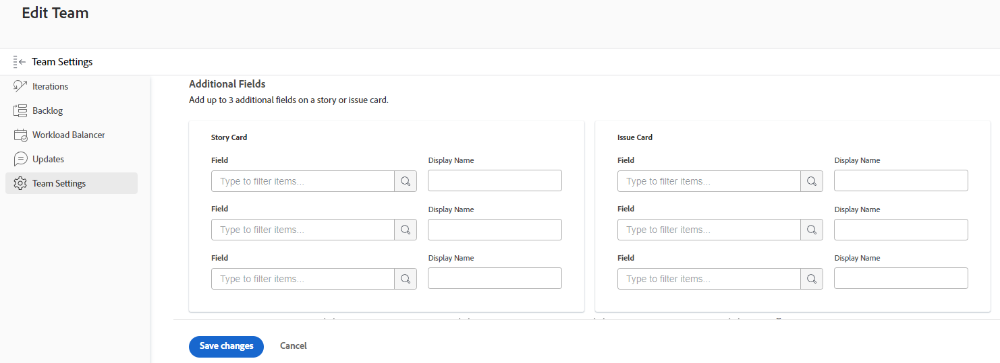

# Configurer [!UICONTROL Scrum]

Vous pouvez créer une équipe Agile dans [!DNL Adobe Workfront] comme décrit dans la section [Créer une équipe Agile](/help/quicksilver/agile/get-started-with-agile-in-workfront/create-an-agile-team.md). Lors de la création d’une équipe Agile, vous pouvez choisir la méthodologie que l’équipe utilise pour terminer son travail. Vous pouvez choisir parmi les options suivantes :

* Scrum
* Kanban

Cet article décrit comment configurer les paramètres d’une équipe Scrum. Après avoir créé une équipe Agile et choisi la méthodologie Scrum, vous pouvez vous reporter à cet article pour mettre à jour les paramètres suivants :

* Si les histoires sont estimées en points ou en heures
* Les colonnes de statut du storyboard agile pour les itérations et les projets
* Champs supplémentaires à afficher sur les cartes de l’histoire sur le storyboard agile
* Utilisation des indicateurs de couleur pour les articles sur le storyboard agile
* Application des dates lors de l’ajout d’éléments de travail à une itération

Pour plus d’informations sur la configuration d’une équipe Kanban, voir [Configurer Kanban](/help/quicksilver/agile/get-started-with-agile-in-workfront/configure-kanban.md).

## Conditions d’accès

+++ Développez pour afficher les exigences d’accès aux fonctionnalités de cet article.

<table style="table-layout:auto"> 
 <col> 
 </col> 
 <col> 
 </col> 
 <tbody> 
  <tr> 
   <td role="rowheader">Package Adobe Workfront</td> 
   <td> 
Tous
 </td> 
  </tr>

<tr> 
   <td role="rowheader">Licence Adobe Workfront</td> 
   <td> 
Standard
 
   
Travail ou supérieur
 </td> 
  </tr>

<tr> 
   <td role="rowheader">Configurations des niveaux d’accès</td> 
   <td> 
Modifier l’accès aux équipes
  </td> 
  </tr>

</tbody> 
</table>

Pour plus de détails sur les informations contenues dans ce tableau, consultez [Conditions d’accès préalables dans la documentation Workfront](/help/quicksilver/administration-and-setup/add-users/access-levels-and-object-permissions/access-level-requirements-in-documentation.md).

+++

## Configurer l’estimation des histoires en points ou en heures

>[!NOTE]
>
>Ce paramètre ne peut pas être modifié si l’équipe possède des itérations actuellement en cours.

Vous pouvez configurer les histoires à estimer en points ou en heures.

Pour configurer la manière dont les histoires sont estimées pour votre équipe Agile :

{{step1-to-team}}

1. Cliquez sur l’icône **[!UICONTROL Changer d’équipe]**, puis sélectionnez une nouvelle équipe dans le menu déroulant ou recherchez une équipe dans la barre de recherche.
1. Sélectionnez l’équipe Agile à gérer.
1. Cliquez sur le bouton **[!UICONTROL Plus]**, puis sélectionnez **[!UICONTROL Modifier]**.

   Seuls les membres de l&#39;équipe disposant d&#39;une licence [!UICONTROL Standard], [!UICONTROL Plan] ou [!UICONTROL Work] voient cette option.
   

1. Dans la section **[!UICONTROL Agile]**, dans la zone **[!UICONTROL Estimer des histoires dans]**, choisissez si vous souhaitez utiliser des points ou des heures pour estimer la taille (charge de travail) des histoires. Si vous sélectionnez Points, indiquez le nombre d’heures égal à 1 point. (La valeur par défaut est 1 point = 8 heures.) Il s’agit du nombre d’heures planifiées qui sont ajoutées à l’histoire.

   **Exemple :** si vous avez choisi d’estimer les histoires en points et qu’un point équivaut à 8 heures, et qu’une histoire est estimé à 3 points, 24 heures prévues sont ajoutées à l’histoire.

1. Cliquez sur **[!UICONTROL Enregistrer les modifications]**.

## Configurer les colonnes de statut sur le storyboard agile

Vous pouvez configurer les colonnes affichées sur le storyboard agile pour toutes les itérations affectées à votre équipe ou pour un projet donné.

* [Configurer les colonnes de statut pour les itérations](#configure-status-columns-for-iterations)
* [Configurer les colonnes de statut pour les projets](#configure-status-columns-for-projects)

### Configurer les colonnes de statut pour les itérations {#configure-status-columns-for-iterations}

Vous pouvez définir les statuts qui existent sur le storyboard pour l&#39;équipe Agile. Ce sont les seuls statuts qui s’affichent sur le Storyboard.

Pour définir les statuts disponibles pour le storyboard associé à l&#39;équipe Agile :

{{step1-to-team}}

1. Cliquez sur l’icône **[!UICONTROL Changer d’équipe]** , puis sélectionnez une nouvelle équipe dans le menu déroulant ou recherchez une équipe dans la barre de recherche.

1. Sélectionnez l’équipe Agile à gérer.
1. Cliquez sur le bouton **[!UICONTROL Plus]**, puis sélectionnez **[!UICONTROL Modifier]**.

   Seuls les membres de l’équipe qui disposent d’une licence [!UICONTROL Plan] ou [!UICONTROL Travail] peuvent voir cette option.

   

1. Dans la section **[!UICONTROL Agile]**, recherchez la zone **[!UICONTROL StoryBoard]**.

1. (Facultatif) Cliquez sur **[!UICONTROL Ajouter une colonne]** pour ajouter une colonne de statut supplémentaire au StoryBoard.
1. (Facultatif) Faites glisser une colonne de statut à l’aide de l’indicateur glisser-déposer pour réorganiser les colonnes de statut sur le StoryBoard. La première colonne ne peut pas être déplacée et vous ne pouvez pas faire glisser une autre colonne devant la première colonne.

   

1. Sélectionnez les statuts des tâches et des problèmes. Les statuts des tâches s’affichent sous forme de titre de colonne pour chaque colonne du StoryBoard. Les statuts du problème que vous sélectionnez correspondent aux statuts de la tâche. Cela signifie que lorsque vous déplacez un problème vers une autre colonne du StoryBoard, le statut du problème est modifié en fonction des statuts du problème affichés ici, et non pas en fonction du nom de la colonne du StoryBoard (qui reflète le statut de la tâche).

   >[!IMPORTANT]
   >
   >Seuls les statuts verrouillés à l’échelle du système peuvent être sélectionnés ; vous ne pouvez pas sélectionner des statuts spécifiques à un groupe. En outre, le statut de la première colonne correspond toujours à **[!UICONTROL Nouveau]**.

   Vous pouvez ajouter des statuts personnalisés si votre équipe d’administration [!DNL Workfront] les a configurés. Les statuts personnalisés peuvent être configurés comme décrit dans la section [Créer ou modifier un statut](../../administration-and-setup/customize-workfront/creating-custom-status-and-priority-labels/create-or-edit-a-status.md).

   >[!NOTE]
   >
   >Lors de la sélection des statuts d’un problème, la troisième colonne est définie par défaut sur [!UICONTROL Fermé]. Si vous disposez de plus de trois colonnes, veillez à les mettre à jour manuellement pour qu’elles reflètent les statuts appropriés.

1. Cliquez sur **[!UICONTROL Enregistrer les modifications]**.

### Configurer les colonnes de statut pour les projets {#configure-status-columns-for-projects}

Pour plus d’informations sur la configuration des colonnes de statuts d’un projet, voir la section [Créer ou personnaliser une vue [!UICONTROL Agile]](../../reports-and-dashboards/reports/reporting-elements/create-edit-views.md#customizing-an-agile-view) dans l’article [Créer ou modifier des vues dans  [!DNL Adobe Workfront]](../../reports-and-dashboards/reports/reporting-elements/create-edit-views.md).

## Configurer des champs supplémentaires à afficher sur les cartes de l’histoire dans le storyboard agile

Lorsque vous ajoutez des champs aux cartes d’histoire, ils sont en lecture seule et s’affichent uniquement lorsqu’ils sont renseignés.

Par défaut, les types de données suivants s’affichent sur la carte d’histoire pour les tâches et les problèmes :

* Nom de l’article avec un lien direct vers la tâche ou le problème
* Nom du projet avec un lien direct vers le projet
* Ce lien s’affiche uniquement pour les histoires, et non pour les sous-tâches.
* Description de la tâche ou du problème
* Engagement actuel
* Visualiser et modifier le pourcentage terminé, soit en ajustant le pourcentage terminé lui-même, soit en ajustant le nombre de points terminés ou d’heures terminées.
* Personnes affectées

Vous pouvez afficher des données supplémentaires (y compris des données personnalisées) sur les cartes d’histoire. Il se peut que vous vouliez afficher des champs supplémentaires sur les cartes d’histoire pour un certain nombre de raisons. Par exemple, vous pouvez afficher l’ID de client ou cliente si vous travaillez sur des histoires pour plusieurs clientes et clients au cours de l’itération ou vous pouvez afficher la date de début ou la date de fin du projet.

>[!NOTE]
>
>Si vous utilisez un champ personnalisé sur une carte d’histoire, son nom ne peut pas contenir de point.

Pour configurer les cartes d’histoire affectées à l’équipe Agile afin d’afficher des champs supplémentaires :

{{step1-to-team}}

1. Cliquez sur l’icône **[!UICONTROL Changer d’équipe]** , puis sélectionnez une nouvelle équipe dans le menu déroulant ou recherchez une équipe dans la barre de recherche.

1. Sélectionnez l’équipe Agile à gérer.
1. Cliquez sur le menu **[!UICONTROL Plus]**, puis sélectionnez **[!UICONTROL Modifier]**.
Seuls les membres de l’équipe qui disposent d’une licence [!UICONTROL Plan] ou [!UICONTROL Travail] peuvent voir cette option.

   

1. Dans la section **[!UICONTROL Agile]**, saisissez un nom de champ pour le localiser.

   

1. Sélectionnez le nom du champ que vous souhaitez ajouter.
1. Saisissez le **[!UICONTROL Nom d’affichage]** pour que le champ s’affiche sur la carte d’histoire ou de problème.
1. Cliquez sur **[!UICONTROL Enregistrer les modifications]**.

## Configurer la manière dont les indicateurs de couleur sont utilisés pour les histoires sur le storyboard agile

Par défaut, les vignettes de storyboard d’une itération agile sont codées par couleur en fonction du projet auquel l’histoire est associée. Chaque projet se voit attribuer arbitrairement une couleur sur le Storyboard. Vous pouvez modifier ce comportement par défaut pour chaque équipe Agile. Les couleurs des histoires agiles peuvent être liées à la priorité de l’histoire, au propriétaire, etc.

Pour modifier le comportement de l’affectation des couleurs aux articles pour une équipe Agile :

{{step1-to-team}}

1. Cliquez sur l’icône **[!UICONTROL Changer d’équipe]** , puis sélectionnez une nouvelle équipe dans le menu déroulant ou recherchez une équipe dans la barre de recherche.

1. Sélectionnez l’équipe Agile à gérer.
1. Cliquez sur le bouton **[!UICONTROL Plus]**, puis sélectionnez **[!UICONTROL Modifier]**.

   Seuls les membres de l’équipe qui disposent d’une licence [!UICONTROL Plan] ou [!UICONTROL Travail] peuvent voir cette option.

   

1. Dans la section [!UICONTROL Agile], dans la zone [!UICONTROL Associer la couleur de la carte à ], sélectionnez l’une des options suivantes :

   * **[!UICONTROL Projet]** : les couleurs sont associées au projet auquel l’histoire est liée. (Lorsqu’une histoire est créée, elle doit être associée à un projet, comme décrit dans [Créer une histoire agile](/help/quicksilver/agile/work-in-an-agile-environment/create-an-agile-story.md). Toutes les tâches d’un même projet s’affichent avec la même couleur.
   * **[!UICONTROL Formulaire libre]** : toutes les cartes sont affichées en bleu par défaut jusqu’à ce que quelqu’un modifie manuellement la couleur, comme décrit dans [[!UICONTROL Catégoriser les histoires par couleur] sur le panorama Scrum](/help/quicksilver/agile/use-scrum-in-an-agile-team//scrum-board/categorize-stories-by-color.md).
   * **[!UICONTROL Priorité]** : les couleurs sont associées à la priorité de l’histoire, comme suit :

      * Élevée = Rouge
      * Moyenne = Jaune
      * Faible = Vert

        Si votre administrateur ou administratrice système a configuré des priorités personnalisées pour votre système [!DNL Workfront], la priorité la plus élevée est le rouge, la seconde le jaune et la troisième le vert.
   * **[!UICONTROL Propriétaire de la tâche]** : toutes les histoires ayant le même cessionnaire principal ou la même cessionnaire principale sont de la même couleur. Le cessionnaire principal ou la cessionnaire principale est la personne qui a été affectée en premier à la tâche.

1. Cliquez sur **[!UICONTROL Enregistrer les modifications]**.

## Configurer l’application des dates lors de l’ajout d’éléments de travail à une itération

Par défaut, lorsque vous ajoutez un élément de travail à une itération Scrum, la date de début prévue et la date d’achèvement prévue de l’élément de travail sont modifiées pour correspondre aux dates de début et de fin de l’itération. Vous pouvez choisir de conserver les dates d’origine sur tous les éléments de travail de l’équipe.

{{step1-to-team}}

1. (Facultatif) Cliquez sur l’icône **[!UICONTROL Changer d’équipe]** , puis sélectionnez une nouvelle équipe Scrum dans le menu déroulant ou recherchez une équipe dans la barre de recherche.
1. Cliquez sur le menu **[!UICONTROL Plus]**, puis sélectionnez **[!UICONTROL Modifier]**.
Seuls les membres de l’équipe qui disposent d’une licence [!UICONTROL Plan] ou [!UICONTROL Travail] peuvent voir cette option.
1. Dans la section [!UICONTROL Agile], dans la zone [!UICONTROL Lorsqu’un élément de travail est ajouté à une itération], sélectionnez l’une des options suivantes :

   * **[!UICONTROL Modifiez la Date de début prévue et la Date d’achèvement prévue pour qu’elles correspondent aux dates de début et de fin de l’itération]** : lorsque des éléments de travail sont ajoutés à une itération, les dates des éléments de travail sont remplacées par les dates d’itération.

     Pour plus d’informations sur la façon dont les dates sont modifiées, voir la section [Comprendre comment l’ajout d’histoires affecte les dates des tâches](../../agile/use-scrum-in-an-agile-team/iterations/add-stories-to-existing-iteration.md#understand-how-adding-stories-affects-task-dates) dans l’article [Ajouter des histoires à une itération existante](../../agile/use-scrum-in-an-agile-team/iterations/add-stories-to-existing-iteration.md).
   * **[!UICONTROL Ne pas modifier la date de début prévue et la date d’achèvement prévue pour qu’elles ne correspondent pas aux dates de début et de fin de l’itération]** : lorsque des éléments de travail sont ajoutés à une itération, ils conservent leurs dates d’origine.

   Si vous modifiez l’option de date, les dates des éléments de travail déjà en itération ne sont pas ajustées.

   Ces options peuvent affecter les dates lorsque les équipes affectent des éléments de travail aux itérations les unes des autres. Par exemple, l’équipe A modifie les dates des éléments de travail en fonction des dates d’itération et l’équipe B ne modifie pas les dates des éléments de travail. Si l’équipe B affecte un élément de travail à l’itération de l’équipe A, les dates de l’élément de travail seront modifiées. Cependant, si l’équipe A affecte un élément de travail à l’itération de l’équipe B, les dates ne changent pas.

1. Cliquez sur **[!UICONTROL Enregistrer les modifications]**.
