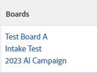

# Ajouter des tâches ou des événements existants à un tableau de [!DNL Workfront]

>[!IMPORTANT]
>
>Les flux de travail ne sont disponibles que pour un groupe spécifique de clientes et de clients.

Vous pouvez ajouter une tâche ou un problème à un panorama ou à un flux de travail dans [!DNL Adobe Workfront] à partir d’une vue de liste ou de rapport, ou à partir des détails de l’objet.

## Conditions d’accès

+++ Développez pour afficher les exigences d’accès aux fonctionnalités de cet article.

<table style="table-layout:auto">
 <col>
 <col>
 <tbody>
  <tr>
   <td role="rowheader">Package Adobe Workfront</td>
   <td> 
Tous
 </td>
  </tr>
  <tr>
   <td role="rowheader">Licence Adobe Workfront</td>
   <td>
   
Standard
 
   
Travail ou supérieur

   </td>
  </tr>
  <tr>
   <td role="rowheader">Autorisations d’objet</td>
   <td>Autorisations d’affichage ou supérieures pour la tâche ou l’événement </td>
  </tr>
 </tbody>
</table>

Pour plus d’informations, voir [Conditions d’accès requises dans la documentation Workfront](/help/quicksilver/administration-and-setup/add-users/access-levels-and-object-permissions/access-level-requirements-in-documentation.md).

+++

## Ajouter des tâches ou des problèmes existants à un panorama ou à un flux de travail à partir d’une liste

{{step1-click-main-menu}}

1. Choisissez l’une des options suivantes : **[!UICONTROL Projets]**, **[!UICONTROL Rapports]** ou **[!UICONTROL Tableaux de bord]**.
1. Accédez au projet, au rapport ou au tableau de bord qui contient la tâche ou le problème que vous souhaitez ajouter au panorama ou au flux de travail.
1. Sélectionnez une ou plusieurs tâches ou problèmes.

   Si vous sélectionnez une sous-tâche, elle sera également ajoutée en tant que carte sur le panorama.

1. Cliquez sur [!UICONTROL **Plus**] > [!UICONTROL **Ajouter aux panoramas**] ou [!UICONTROL **Ajouter aux flux de travail**].
1. Dans la boîte de dialogue [!UICONTROL Ajouter à], sélectionnez le panorama ou le flux de travail auquel ajouter les éléments.

   Pour un panorama, seuls les panoramas autonomes sont disponibles, et non les panoramas qui font partie de flux de travail.

1. Cliquez sur [!UICONTROL **Ajouter**].

   Pour un panorama : la tâche ou le problème est ajouté(e) au panorama en tant que carte. Si le panorama a des politiques de colonne appliquées pour le statut, la carte est ajoutée dans la colonne correspondant à son statut. Sinon, elle apparaît dans la première colonne de gauche, sans compter la colonne de saisie.

   Pour plus d’informations sur les politiques de colonnes, consultez [Gérer les colonnes du panorama](/help/quicksilver/agile/get-started-with-boards/manage-board-columns.md).

   Pour un flux de travail : la tâche ou le problème est ajouté(e) à la liste des cartes du flux de travail en tant que carte non planifiée.

## Ajouter des tâches ou des problèmes existants à un panorama ou à un flux de travail à partir des détails de l’objet

{{step1-click-main-menu}}

1. Cliquez sur [!UICONTROL **Projets**], puis cliquez sur le nom d’un projet pour l’ouvrir.
1. Cliquez sur [!UICONTROL **Tâches**] ou sur [!UICONTROL **Problèmes**] dans le panneau de gauche.
1. Cliquez sur la tâche, la sous-tâche ou le problème que vous souhaitez ajouter à un panorama ou à un flux de travail.
1. Cliquez sur le menu **[!UICONTROL Plus]** à côté du nom de l’objet et sélectionnez [!UICONTROL **Ajouter aux panoramas**] ou [!UICONTROL **Ajouter aux flux de travail**].
1. Dans la boîte de dialogue [!UICONTROL Ajouter à], sélectionnez le panorama ou le flux de travail auquel ajouter les éléments.

   Pour un panorama, seuls les panoramas autonomes sont disponibles, et non les panoramas qui font partie de flux de travail.

1. Cliquez sur [!UICONTROL **Ajouter**].

   Pour un panorama : la tâche ou le problème est ajouté(e) au panorama en tant que carte. Si le panorama a des politiques de colonne appliquées pour le statut, la carte est ajoutée dans la colonne correspondant à son statut. Sinon, elle apparaît dans la première colonne de gauche, sans compter la colonne de saisie.

   Pour plus d’informations sur les politiques de colonnes, consultez [Gérer les colonnes du panorama](/help/quicksilver/agile/get-started-with-boards/manage-board-columns.md).

   Pour un flux de travail : la tâche ou le problème est ajouté(e) à la liste des cartes du flux de travail en tant que carte non planifiée.

## Afficher les panoramas associés à une tâche ou à un problème à partir d’une liste

1. Accédez au projet, au rapport ou au tableau de bord qui contient la tâche ou le problème dont vous souhaitez consulter les informations sur les panoramas.
1. Sélectionnez une vue qui inclut la colonne Panoramas ou créez une vue avec la colonne Panoramas .
Pour plus d’informations sur les vues, voir [Création ou modification de vues dans Adobe Workfront](/help/quicksilver/reports-and-dashboards/reports/reporting-elements/create-edit-views.md).
1. Cliquez sur [!UICONTROL **Afficher**] dans la colonne pour afficher la liste des panoramas sur lesquels la tâche ou le problème se trouve.

   

1. Cliquez sur le nom d’un panorama pour ouvrir la tâche ou le problème connecté(e) sur le panorama.

   
