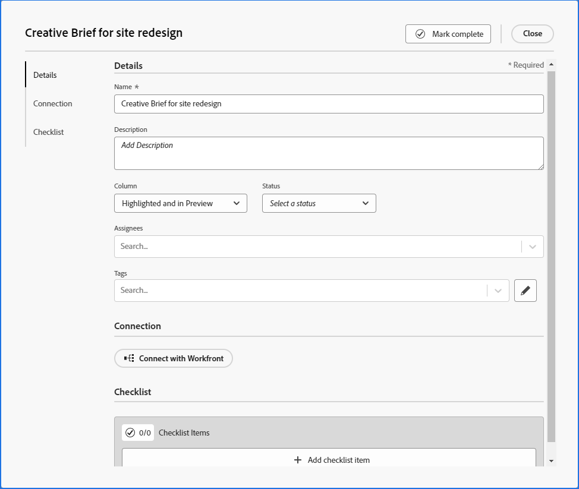

# Ajout d’une carte ad hoc à un panorama

Vous pouvez ajouter rapidement une carte à un panorama et l’affecter à un membre du panorama. La carte peut représenter une tâche, un problème, une personne, un groupe ou tout type d’élément que vous souhaitez inclure dans le panorama.

>[!NOTE]
>
>Les cartes ad hoc d’un panorama ne sont pas connectées aux tâches dans [!DNL Adobe Workfront]. Pour plus d’informations sur les cartes connectées, voir [Utilisation de cartes connectées sur les panoramas](/help/quicksilver/agile/get-started-with-boards/connected-cards.md).

## Exigences d’accès

Vous devez disposer des accès suivants pour effectuer les étapes de cet article :

<table style="table-layout:auto"> 
 <col> 
 </col> 
 <col> 
 </col> 
 <tbody> 
  <tr> 
   <td role="rowheader"><strong>[!DNL Adobe Workfront] plan*</strong></td> 
   <td> 
Tous
 </td> 
  </tr> 
  <tr> 
   <td role="rowheader"><strong>[!DNL Adobe Workfront] license*</strong></td> 
   <td> 
[!UICONTROL Request] ou version ultérieure
 </td> 
  </tr> 
 </tbody> 
</table>

&#42;Pour connaître le plan, le type de licence ou l’accès dont vous disposez, contactez votre [!DNL Workfront] administrateur.

## Ajout d’une carte ad hoc avec des détails complets

Une carte ad hoc n’est pas connectée à un élément de travail dans [!DNL Adobe Workfront].

1. Cliquez sur le bouton **[!UICONTROL Menu Principal]** icon  dans le coin supérieur droit de [!DNL Adobe] Workfront, puis cliquez sur **[!UICONTROL Panoramas]**.
1. Accédez à un panorama. Pour plus d’informations, voir [Création ou modification d’un panorama](../../agile/get-started-with-boards/create-edit-board.md).
1. Cliquez sur **[!UICONTROL Ajouter une carte] > [!UICONTROL Nouvelle carte]**.
1. Dans le **[!UICONTROL Détails de la carte]** ajoutez les informations suivantes :

   <table style="table-layout:auto"> 
    <col> 
    <col> 
    <tbody> 
     <tr> 
      <td role="rowheader"><strong>[!UICONTROL Name]</strong> </td> 
      <td>Nom de la carte.</td> 
     </tr> 
     <tr> 
      <td role="rowheader"><strong>[!UICONTROL Description]</strong> </td> 
      <td>Description de la carte. Vous pouvez ajouter des URL dans la description ; elles deviennent des liens cliquables lors de l’enregistrement de la carte.</td>
     </tr>
     <tr> 
      <td role="rowheader"><strong>[!UICONTROL Column]</strong> </td> 
      <td>Sélectionnez la colonne de la carte. Si vous laissez le champ <strong>[!UICONTROL Column]</strong> , la carte est placée dans la première colonne à gauche du panorama.</td>
     </tr>
     <tr> 
      <td role="rowheader"><strong>[!UICONTROL Status]</strong> </td> 
      <td>Sélectionnez l’état de la carte. Si vous cliquez sur <strong>[!UICONTROL Mark Complete]</strong> en haut de la carte, l’état devient automatiquement [!UICONTROL Terminé].</td> 
     </tr>
     <tr> 
      <td role="rowheader"><strong>[!UICONTROL Échéance]</strong></td> 
      <td>Sélectionnez une date d’échéance pour la carte. </td>
     </tr>
     <tr> 
      <td role="rowheader"><strong>[!UICONTROL Estimation]</strong></td> 
      <td>Saisissez l’estimation du nombre d’heures pour la carte à remplir. Il s’agit d’une entrée manuelle uniquement.</td>
     </tr>
     <tr> 
      <td role="rowheader"><strong>[!UICONTROL Assigents]</strong> </td> 
      <td> 
Pour attribuer la carte, commencez à saisir un nom dans le champ de recherche, puis sélectionnez-le lorsqu’il s’affiche dans la liste. Vous pouvez ajouter des individus et des équipes et affecter plusieurs personnes ou équipes à une carte.
 
Les personnes désignées doivent être membres du panorama ou elles n’apparaîtront pas dans la liste de sélection. Lorsqu’une équipe est membre du panorama, chaque membre de l’équipe peut être affecté à la carte.
</td>
     </tr>     
     <tr> 
      <td role="rowheader"><strong>[!UICONTROL Balises]</strong></td> 
      <td>Recherchez et sélectionnez des balises pour la carte. Pour plus d’informations sur la création de balises, voir <a href="../../agile/get-started-with-boards/add-tags.md" class="MCXref xref">Ajout de balises</a>.</td> 
     </tr>
     <tr>
      <td role="rowheader"><strong>[!UICONTROL Connection]</strong> </td>
      <td>Vous pouvez connecter une carte ad hoc à une [!DNL Workfront] tâche ou problème. Pour plus d’informations, voir "Convertir une carte ad hoc en carte connectée" dans l’article . <a href="/help/quicksilver/agile/get-started-with-boards/connected-cards.md">Utilisation de cartes connectées sur les panoramas</a>.</td>
     </tr>
     <tr> 
      <td role="rowheader"><strong>[!UICONTROL Liste de contrôle]</strong> </td> 
      <td> 
Cliquez sur <strong>[!UICONTROL Ajouter un élément de liste de contrôle]</strong>. Saisissez ensuite le titre de l’élément et appuyez sur Entrée. Un autre élément est automatiquement ajouté. Continuez à saisir des titres pour ajouter d’autres éléments.
 
Le compteur en haut de la liste de contrôle indique le nombre d’éléments terminés et le nombre total d’éléments.
 
Pour plus d’informations sur les éléments de liste de contrôle, voir <a href="/help/quicksilver/agile/get-started-with-boards/manage-checklist-items.md">Gérer les éléments de liste de contrôle sur les cartes</a>.
 </td> 
     </tr>
     <tr>
      <td role="rowheader"><strong>[!UICONTROL Comments]</strong></td>
      <td>
Cliquez sur dans le <strong>[!UICONTROL Nouveau commentaire]</strong> et saisissez votre commentaire. Utilisez les outils de formatage pour mettre le texte en forme, puis cliquez sur le bouton <strong>Ajouter une pièce jointe</strong> icon  pour joindre un fichier au commentaire. Pour baliser une personne ou une équipe, utilisez la zone de recherche située au bas de la zone de commentaire. L’utilisateur n’a pas à être membre du panorama.

<strong>REMARQUE :</strong> Actuellement, les utilisateurs balisés dans les commentaires sur les cartes ad hoc ne reçoivent pas de notification par courrier électronique.
      

Cliquez sur <strong>[!UICONTROL Submit]</strong> pour ajouter le commentaire à la carte.

      
<strong>REMARQUE :</strong> La zone de commentaire sur les cartes utilise la nouvelle expérience de commentaire d’Adobe Workfront. Pour plus d’informations, voir <a href="/help/quicksilver/workfront-basics/updating-work-items-and-viewing-updates/update-work.md">Mise à jour du travail</a>.

<strong>REMARQUE :</strong> Les commentaires sur les cartes sont disponibles uniquement par le biais de l’accord préalable à la fonctionnalité des panoramas Workfront.
</td>
     </tr>
    </tbody> 
   </table>

   Exemple d’image dans l’environnement de production lorsque l’opt-in de la fonctionnalité anticipée n’est pas utilisé :
   

   Exemple d’image dans l’environnement de production lorsque l’inclusion anticipée des fonctionnalités est activée :
   

   Utilisez le panneau de navigation de gauche pour vous déplacer entre les sections des champs des détails de la carte.

1. Cliquez sur **[!UICONTROL Fermer]** pour ajouter la carte au panorama.

   Les personnes désignées, les balises, l’échéance, le compteur de liste de contrôle, l’estimation des heures et l’état s’affichent sur la carte.

## Ajout rapide d’une carte ad hoc

Vous pouvez ajouter des cartes ad hoc avec un titre uniquement pour remplir rapidement votre panorama.

1. Accédez au panorama auquel vous souhaitez ajouter des cartes.
1. Cliquez sur le bouton **[!UICONTROL Ajouter]** icon  dans la colonne où vous souhaitez ajouter la carte.
1. Saisissez le nom de la carte et appuyez sur Entrée.

   Une autre carte est automatiquement ajoutée sous la nouvelle carte.

1. Continuez à saisir les noms de carte pour ajouter d’autres cartes.
1. Pour arrêter l’ajout de cartes, cliquez en dehors de la colonne.
1. Pour ajouter d’autres détails, vous devez modifier la carte. Pour plus d’informations, voir [Modification d’une carte existante](#edit-an-existing-card) dans cet article.

## Modification d’une carte existante {#edit-an-existing-card}

1. Accédez au panorama.
1. Cliquez sur le nom de la carte pour le modifier.
1. Pour modifier les détails de la carte, cliquez sur la carte (et non dans le nom de la carte).

   Ou

   Cliquez sur le bouton **[!UICONTROL Plus]** menu ![[!UICONTROL Plus de menu]](assets/more-icon-spectrum.png) sur la carte et sélectionnez **[!UICONTROL Modifier]**.

1. Dans le [!UICONTROL Détails de la carte] , mettez à jour les informations selon les besoins, puis cliquez sur **[!UICONTROL Fermer]** pour revenir au panorama.

   Si des stratégies de colonne sont activées pour la mise à jour des valeurs de champ, la modification de l’état de la carte déplace automatiquement la carte vers la colonne correspondante. Pour plus d’informations, voir &quot;Définition des paramètres et des stratégies de colonne&quot; dans l’article [Gestion des colonnes de panorama](/help/quicksilver/agile/get-started-with-boards/manage-board-columns.md).
