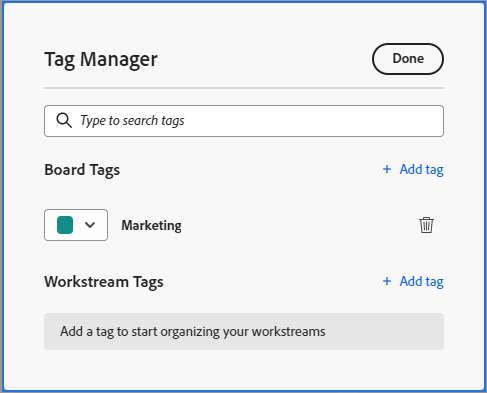

# Ajout de balises

Vous pouvez ajouter des balises aux cartes pour indiquer visuellement qu’elles sont similaires. Vous pouvez ensuite filtrer par ces balises pour afficher les cartes associées. Les balises du panorama ne sont pas partagées entre les panoramas, mais les balises du workflow sont disponibles sur tous les panoramas d’un workflow.

## Exigences d’accès

Vous devez disposer des accès suivants pour effectuer les étapes de cet article :

<table style="table-layout:auto"> 
 <col> 
 </col> 
 <col> 
 </col> 
 <tbody> 
  <tr> 
   <td role="rowheader"><strong>[!DNL Adobe Workfront] plan*</strong></td> 
   <td> 
Tous
 </td> 
  </tr> 
  <tr> 
   <td role="rowheader"><strong>[!DNL Adobe Workfront] license*</strong></td> 
   <td> 
[!UICONTROL Request] ou version ultérieure
 </td> 
  </tr> 
 </tbody> 
</table>

&#42;Pour connaître le plan, le type de licence ou l’accès dont vous disposez, contactez votre [!DNL Workfront] administrateur.

## Création de balises pour un panorama

{{step1-to-boards}}

1. Accédez à un panorama. Pour plus d’informations, voir [Création ou modification d’un panorama](../../agile/get-started-with-boards/create-edit-board.md).
1. Cliquez sur le bouton **[!UICONTROL Plus]** menu  en regard du nom du panorama, puis choisissez **[!UICONTROL Gestionnaire de balises]**.

   

1. Dans le [!UICONTROL Gestionnaire de balises] boîte de dialogue, sélectionnez [!UICONTROL **Ajouter une balise**] dans le [!UICONTROL Balises de panorama] .
1. Saisissez le nom de la balise dans la zone mise en surbrillance, puis choisissez une couleur pour cette balise dans le menu déroulant. La balise est enregistrée automatiquement.
1. (Conditionnel) Répétez les étapes 4 à 5 pour créer des balises supplémentaires.
1. Cliquez sur **[!UICONTROL Terminé]** dans le coin supérieur droit de la zone.

   

## Création de balises pour un flux de travail

{{step1-to-boards}}

1. Dans le tableau de bord, cliquez sur [!UICONTROL **Afficher le flux de travail**] pour ouvrir un workflow.
1. Ouvrez un panorama. Cliquez sur le bouton **[!UICONTROL Plus]** menu  en regard du nom du panorama, puis choisissez **[!UICONTROL Gestionnaire de balises]**.

   Ou

   Cliquez sur [!UICONTROL **Configurer**] pour ouvrir le [!UICONTROL Configuration de Workstream] du panneau. Cliquez ensuite sur **[!UICONTROL Gestionnaire de balises]**.

1. Dans le [!UICONTROL Gestionnaire de balises] boîte de dialogue, sélectionnez [!UICONTROL **Ajouter une balise**] dans la section Balises de processus .
1. Saisissez le nom de la balise dans la zone mise en surbrillance, puis choisissez une couleur pour cette balise dans le menu déroulant. La balise est enregistrée automatiquement.
1. (Conditionnel) Répétez les étapes 4 à 5 pour créer des balises supplémentaires.
1. Cliquez sur **[!UICONTROL Terminé]** dans le coin supérieur droit de la zone.

   

## Ajout d’une balise à une carte

1. Accédez à un panorama.
1. Pour modifier les détails de la carte, cliquez sur la carte (et non dans le nom de la carte).

   Ou

   Cliquez sur le bouton **[!UICONTROL Plus]** menu ![[!UICONTROL Plus de menu]](assets/more-icon-spectrum.png) sur la carte et sélectionnez **[!UICONTROL Modifier]**.

1. Dans le **[!UICONTROL Balises]** , saisissez le nom d’une balise existante et sélectionnez-la dans les résultats de la recherche.\
   Ou\
   Cliquez sur le bouton **[!UICONTROL Modifier]** Icône &#x200B;  et créez une balise dans le Gestionnaire de balises. Cliquez sur **Terminé** pour revenir à la carte, sélectionnez la balise sur la carte.
1. Cliquez sur **Fermer**.

## Modification d’une balise

1. Accédez à un panorama.
1. Cliquez sur le bouton **[!UICONTROL Plus]** menu  en regard du nom du panorama, puis choisissez **[!UICONTROL Gestionnaire de balises]**.

   

1. (Conditionnel) Cliquez sur le nom de la balise pour modifier le texte.
1. (Conditionnel) Cliquez sur le bouton [!UICONTROL color] pour modifier la couleur de la balise.
1. Cliquez sur **[!UICONTROL Terminé]**.

## Suppression d’une balise d’une carte

1. Accédez à un panorama.
1. Pour modifier les détails de la carte, cliquez sur la carte (et non dans le nom de la carte).

   Ou

   Cliquez sur le bouton **[!UICONTROL Plus]** menu ![[!UICONTROL Plus de menu]](assets/more-icon-spectrum.png) sur la carte et sélectionnez **[!UICONTROL Modifier]**.

1. Recherchez la balise à supprimer de la carte, puis cliquez sur le bouton **[!UICONTROL Supprimer]** icon .
1. Cliquez sur **[!UICONTROL Fermer]**.

## Suppression d’une balise

1. Accédez à un panorama.
1. Cliquez sur le bouton **[!UICONTROL Plus]** menu ![[!UICONTROL Plus de menu]](assets/more-icon-spectrum.png) en regard du nom du panorama, puis choisissez **[!UICONTROL Gestionnaire de balises]**.

   

1. Recherchez la balise à supprimer, puis cliquez sur le bouton **[!UICONTROL Supprimer]** icon .
1. Cliquez sur **[!UICONTROL Terminé]**.
