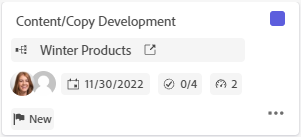
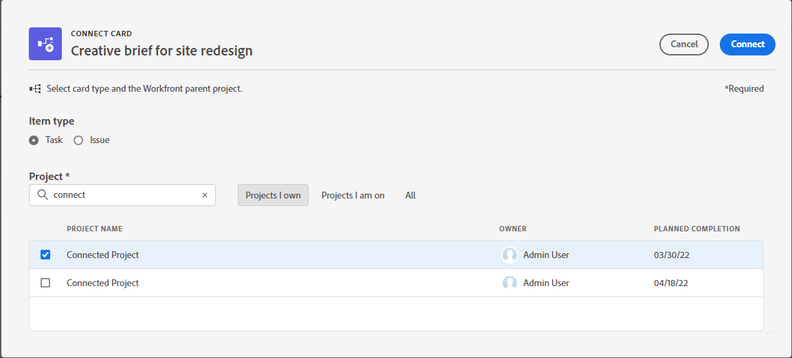

# Utiliser des cartes connectées sur des panoramas

<!-- Audited: 2/2024 -->

Vous pouvez ajouter sur votre panorama une carte qui est connectée à des tâches et problèmes existants dans [!DNL Workfront].

Lorsque l’un des détails suivants est mis à jour pour la carte à un emplacement donné, il est automatiquement mis à jour à l’autre emplacement :

* [!UICONTROL Nom]
* [!UICONTROL Description]
* [!UICONTROL Personnes cessionnaires]
* [!UICONTROL Statut]
* [!UICONTROL Date d’achèvement prévue]
* [!UICONTROL Estimation] / [!UICONTROL Points de l’histoire]
* [!UICONTROL Sous-tâches]
* [!UICONTROL Documents]

Pour synchroniser les cartes connectées avec Workfront, cliquez sur le menu **[!UICONTROL Plus]** ![[!UICONTROL Plus]](assets/more-icon-spectrum.png) en regard du nom du panorama et sélectionnez **[!UICONTROL Synchroniser les éléments connectés]**. Les cartes archivées ne sont pas synchronisées avec les tâches et les événements Workfront. Si vous restaurez une carte, elle sera à nouveau synchronisée.

>[!NOTE]
>
>Une tâche ou un problème connecté(e) ne peut être ajouté(e) qu’une seule fois par panorama. La même tâche ou le même problème peut être connecté(e) à plusieurs panoramas.

## Conditions d’accès

+++ Développez pour afficher les exigences d’accès aux fonctionnalités de cet article.

<table style="table-layout:auto"> 
 <tbody> 
  <tr> 
   <td role="rowheader">Package Adobe Workfront</td> 
   <td> 
Tous
 </td> 
  </tr> 
  <tr> 
   <td role="rowheader">Licence Adobe Workfront</td> 
   <td> 
   
Contributeur ou version ultérieure
 
   
Requête ou supérieure

   </td> 
  </tr> 
  <tr>
   <td role="rowheader">Configurations du niveau d’accès</td>
   <td>
Affichage ou accès supérieur aux tâches et aux problèmes
</td>
  </tr>
  <tr>
   <td role="rowheader">Autorisations d’objet</td>
   <td>
Autorisations d’affichage ou supérieures à une tâche ou à un problème Workfront

</td>
  </tr>
 </tbody> 
</table>

Pour plus d’informations sur ce tableau, consultez [Conditions d’accès requises dans la documentation Workfront](/help/quicksilver/administration-and-setup/add-users/access-levels-and-object-permissions/access-level-requirements-in-documentation.md).

+++

## Ajouter une carte connectée

{{step1-to-boards}}

1. Accédez à un panorama. Pour plus d’informations, consultez la section [Créer ou modifier un panorama](../../agile/get-started-with-boards/create-edit-board.md).
1. Cliquez sur **[!UICONTROL Ajouter une carte] > [!UICONTROL Carte connectée]**.
1. Choisissez un projet, puis sélectionnez une tâche ou un problème à ajouter sous forme de carte sur le panorama.

   Vous pouvez sélectionner plusieurs objets qui seront tous ajoutés sous forme de cartes distinctes.

   >[!NOTE]
   >
   >* Seuls les objets auxquels vous pouvez accéder sont disponibles dans les résultats de recherche. Si un élément est grisé, il a déjà été ajouté au panorama.
   >* Lorsque vous filtrez par **[!UICONTROL Projets dont je suis propriétaire]** ou **[!UICONTROL Projets auxquels je participe]**, les projets correspondant aux statuts « Terminé », « Immobilisé » ou « Refusé » ne sont pas inclus. Vous pouvez toujours rechercher ces projets en utilisant le filtre **[!UICONTROL Tous]**.

1. Cliquez sur **[!UICONTROL Ajouter]**.

   

   La carte est ajoutée au bas de la colonne la plus à gauche. L’objet connecté [!DNL Workfront] et ses personnes cessionnaires sont affichés sur la carte.

   

1. Cliquez sur  pour ouvrir la tâche ou le problème [!DNL Workfront] dans un nouvel onglet du navigateur.
1. Pour modifier les détails de la carte, cliquez sur la carte (ne cliquez pas sur le nom de la carte).

   Ou

   Cliquez sur le menu **[!UICONTROL Plus]**  sur la carte et sélectionnez **[!UICONTROL Modifier]**.

1. Dans la zone **[!UICONTROL Détails de la carte]**, ajoutez ou mettez à jour les informations suivantes :

   <table style="table-layout:auto"> 
    <tbody> 
     <tr> 
      <td role="rowheader"><strong>[!UICONTROL Name]</strong></td> 
      <td>Modifier le nom change également le nom de l’objet [!DNL Workfront] connecté.</td> 
     </tr> 
     <tr> 
      <td role="rowheader"><strong>[!UICONTROL Description]</strong></td> 
      <td>La modification de la description modifie également la description de l’objet [!DNL Workfront] connecté. Vous pouvez ajouter des URL dans la description ; elles deviennent des liens cliquables lors de l’enregistrement de la carte.</td> 
     </tr>
     <tr>
      <td role="rowheader"><strong>[!UICONTROL Column]</strong></td>
      <td>Sélectionnez la colonne de la carte.</td>
     </tr>
     <tr>
      <td role="rowheader"><strong>[!UICONTROL Status]</strong></td>
      <td>
Sélectionnez le statut de la carte. Les valeurs par défaut sont [!UICONTROL New], [!UICONTROL In Progress] et [!UICONTROL Complete], mais les statuts personnalisés définis pour l’élément dans [!DNL Workfront] sont également disponibles.

      
Si des politiques de colonne sont activées pour la mise à jour des valeurs de champ, la modification du statut de la carte déplace automatiquement la carte vers la colonne correspondante. Pour plus d’informations, voir « Définition des paramètres et des politiques de colonne » dans l’article <a href="/help/quicksilver/agile/get-started-with-boards/manage-board-columns.md" class="MCXref xref">Gérer les colonnes du panorama</a>.

      
Si vous cliquez sur <strong>[!UICONTROL Mark Complete]</strong> dans la partie supérieure de la carte, le statut devient automatiquement Terminé.
</td>
     </tr>
     <tr>
      <td role="rowheader"><strong>[!UICONTROL Planned Completion]</strong></td>
      <td>La modification de cette date modifie également la date d’achèvement prévue pour l’objet [!DNL Workfront] connecté.</td>
     </tr>
      <tr>
      <td role="rowheader"><strong>[!UICONTROL Estimation]</strong></td>
      <td>
Nombre d’heures pour l’achèvement de la carte.

La modification de l’estimation modifie également la valeur des points de l’histoire pour l’objet [!DNL Workfront] connecté.
</td>
     </tr>
     <tr>
      <td role="rowheader"><strong>[!UICONTROL Assignments]</strong></td>
      <td>
Pour affecter d’autres personnes ou une équipe à la carte, cliquez sur <strong>[!UICONTROL Add Assignment]</strong> et commencez à saisir un nom dans le champ de recherche. Sélectionnez-le ensuite lorsqu’il s’affiche dans la liste de résultats. Vous pouvez ajouter des personnes et des équipes. Une seule affectation d’équipe est autorisée sur une carte connectée.

      
Les personnes affectées que vous sélectionnez sont également affectées à la tâche ou au problème dans [!DNL Workfront].
</td>
     </tr>
     <tr>
      <td role="rowheader"><strong>[!UICONTROL Tags]</strong></td>
      <td>
Recherchez et sélectionnez des balises pour la carte.

      
Pour plus d’informations sur la création de balises, voir <a href="../../agile/get-started-with-boards/add-tags.md" class="MCXref xref">Ajouter des balises</a>.
</td>
     </tr>
     <tr>
      <td role="rowheader"><strong>[!UICONTROL Custom fields]</strong></td>
      <td>
Tous les champs personnalisés que vous ajoutez s’affichent dans cette zone.

      
Pour plus d’informations, voir <a href="/help/quicksilver/agile/get-started-with-boards/customize-fields-on-card.md">Personnaliser les champs affichés sur une carte</a>.
</td>
     </tr>
     <tr>
     <tr>
      <td role="rowheader"><strong>[!UICONTROL Subtask]</strong></td>
      <td>
Toutes les sous-tâches existantes pour la tâche apparaissent dans cette section. Cliquez sur <strong>[!UICONTROL Add Subtask]</strong> pour ajouter une nouvelle sous-tâche.

      
Le compteur en haut de la section indique le nombre de sous-tâches terminées et le nombre total de sous-tâches.

      
Pour plus d’informations sur les sous-tâches, voir <a href="/help/quicksilver/agile/get-started-with-boards/manage-subtasks-on-boards.md">Gérer les sous-tâches sur les panoramas</a>.
</td>
     </tr>
     <tr> 
      <td role="rowheader"><strong>[!UICONTROL Checklist]</strong></td>
      <td>
Cliquez sur <strong>[!UICONTROL Add checklist item]</strong>. Saisissez ensuite le titre de l’élément et appuyez sur Entrée. Un autre élément est automatiquement ajouté. Continuez à saisir des titres pour ajouter plus d’éléments.

      
Le compteur en haut de la liste de contrôle indique le nombre d’éléments terminés et le nombre total d’éléments.
 
Pour plus d’informations sur les éléments de liste de contrôle, voir <a href="/help/quicksilver/agile/get-started-with-boards/manage-checklist-items.md">Gérer les éléments de liste de contrôle sur les cartes</a>.
</td>
     </tr>
     <tr>
      <td role="rowheader"><strong>[!UICONTROL Documents]</strong></td>
      <td>Pour un document existant, pointez sur la miniature du document, puis cliquez sur <strong>Aperçu</strong> pour afficher le fichier dans le navigateur ou <strong>Télécharger</strong> pour télécharger le fichier sur votre ordinateur. Pour un nouveau document, voir <a href="/help/quicksilver/agile/get-started-with-boards/add-documents-on-cards.md">Ajouter des documents sur les cartes</a>.</td>
     </tr>
     <tr>
      <td role="rowheader"><strong>[!UICONTROL Hours]</strong></td>
      <td>Voir « Consigner les heures sur une carte connectée » ci-dessous.</td>
     </tr>
     <tr>
      <td role="rowheader"><strong>[!UICONTROL Comments]</strong></td>
      <td>
Cliquez sur dans le champ <strong>[!UICONTROL New comment]</strong> et saisissez votre commentaire. Utilisez les outils de mise en forme pour mettre le texte en forme. Pour taguer une personne ou une équipe, utilisez la zone de recherche située au bas de la zone de commentaire. La personne n’a pas à être membre du panorama. Les utilisateurs et utilisatrices tagués sur des cartes connectées recevront des notifications par e-mail.

Cliquez sur <strong>[!UICONTROL Submit]</strong> pour ajouter le commentaire à la carte.

      
Pour plus d’informations sur les commentaires, consultez la section <a href="/help/quicksilver/workfront-basics/updating-work-items-and-viewing-updates/update-work.md">Mettre à jour le travail</a>.
</td>
     </tr>
     <tr> 
      <td role="rowheader"><strong>[!UICONTROL System activity]</strong></td> 
      <td>
Si vous avez <strong>Activité du système</strong> activée en tant que section de carte, l’activité s’affiche dans cette zone.
 
Pour plus d’informations, voir <a href="/help/quicksilver/agile/get-started-with-boards/customize-fields-on-card.md">Personnaliser les champs affichés sur une carte</a> et <a href="/help/quicksilver/administration-and-setup/set-up-workfront/system-tracked-update-feeds/system-tracked-update-feeds.md">Mises à jour suivies par le système</a>.
</td>
     </tr>     
    </tbody> 
   </table>

   Utilisez le panneau de navigation de gauche pour vous déplacer entre les sections des champs des détails de la carte.

1. Cliquez sur **[!UICONTROL Fermer]** pour revenir au panorama.
L’objet connecté, les personnes cessionnaires, les balises, la date d’échéance, le compteur de liste de contrôle, l’estimation des heures et le statut s’affichent sur la carte.

   

## Déconnecter une carte connectée

Vous pouvez déconnecter une carte connectée de son objet Workfront. La carte reste sur le panorama sous la forme d’une carte ad hoc que vous pouvez modifier.

>[!NOTE]
>
>Si vous déconnectez une carte connectée sur un panorama dynamique, elle réapparaîtra lorsque vous actualiserez le panorama, car ce type de panorama extrait toutes les tâches et tous les événements d’un projet spécifique.
>
>Si vous déconnectez une carte connectée de tout autre type de panorama doté d’une colonne d’entrée, la carte réapparaît dans la colonne d’entrée lorsque vous actualisez le panorama si la tâche ou l’événement connecté n’est pas encore marqué comme terminé.
>
>Dans ces deux scénarios, après une actualisation, vous disposerez de deux cartes pour la même tâche ou le même problème : une carte ad hoc et une carte connectée.

Pour déconnecter une carte au niveau du panorama :

1. Accédez au panorama.
1. Cliquez sur le menu **[!UICONTROL Plus]**  sur la carte connectée et sélectionnez **[!UICONTROL Déconnecter]**.
1. Cliquez sur **[!UICONTROL Déconnecter]** sur le message de confirmation.

Pour déconnecter une carte au niveau de la carte :

1. Accédez au panorama et ouvrez la carte connectée.
1. Cliquez sur le menu **[!UICONTROL Plus]**  dans la zone Connexion des détails de la carte, puis sélectionnez **[!UICONTROL Déconnecter]**.
1. Cliquez sur **[!UICONTROL Déconnecter]** sur le message de confirmation.

## Convertir une carte ad hoc en carte connectée

Après avoir créé une carte ad hoc, vous pouvez la convertir en carte connectée. Pour plus d’informations sur les cartes ad hoc, voir [Ajouter une carte ad hoc à un panorama](/help/quicksilver/agile/get-started-with-boards/add-card-to-board.md).

1. Accédez au panorama et ouvrez la carte ad hoc.
1. Vérifiez le nom et la description de la carte. Ils seront ajoutés à la tâche ou au problème que vous créez dans [!DNL Workfront].
1. Dans la zone [!UICONTROL Connexion] des détails de la carte, cliquez sur **[!UICONTROL Se connecter à Workfront]**.
1. Sur la fenêtre [!UICONTROL Connecter la carte], choisissez si vous créez une tâche ou un problème.
1. Recherchez et sélectionnez un projet auquel ajouter la tâche ou le problème.

   >[!NOTE]
   >
   >* Seuls les objets auxquels vous pouvez accéder sont disponibles dans les résultats de recherche.
   >* Lorsque vous filtrez par **[!UICONTROL Projets dont je suis propriétaire]** ou **[!UICONTROL Projets auxquels je participe]**, les projets ayant le statut [!UICONTROL Terminé], [!UICONTROL Inactif], ou [!UICONTROL Rejeté] ne sont pas inclus. Vous pouvez toujours rechercher ces projets avec le filtre **[!UICONTROL Tous]**.

1. Cliquez sur **[!UICONTROL Connecter]**.

   

   Le nom du projet s’affiche dans la zone Connexion sur les détails de la carte.

1. Cliquez sur **[!UICONTROL Fermer]** pour revenir au panorama.

## Consigner des heures sur une carte connectée

Vous devez disposer des autorisations appropriées pour consigner des heures sur la tâche ou le problème connecté.

Par défaut, les champs de consignation du temps ne s’affichent pas sur les cartes connectées. Vous devez activer [!UICONTROL **Heures**] dans la zone [!UICONTROL Configurer] sous [!UICONTROL Cartes]. Pour plus d’informations, voir [Personnaliser les champs affichés sur une carte](/help/quicksilver/agile/get-started-with-boards/customize-fields-on-card.md).

1. Entrez le nombre d’heures pour la tâche ou le problème.
1. Sélectionnez un [!UICONTROL type d’heure] dans le menu déroulant, s’il est différent de la valeur par défaut.
1. Cliquez sur [!UICONTROL **Consigner le temps**].

   

   Le temps consigné sur la carte est également enregistrée sur la tâche ou le problème connecté.

Consigner du temps sur la carte se fait de la même façon que sur une tâche ou un problème. Pour plus d’informations, voir la section « Consigner du temps sur un projet, une tâche ou un problème » dans l’article [Consigner du temps](/help/quicksilver/timesheets/create-and-manage-timesheets/log-time.md).

