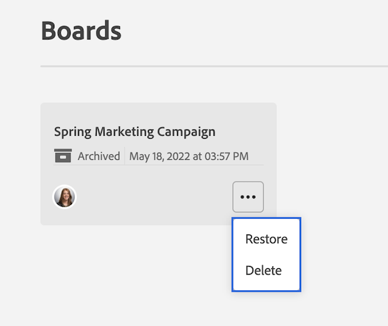

# Supprimer ou archiver un panorama

Vous pouvez supprimer ou archiver un panorama dans [!DNL Workfront]. La suppression d’un panorama le supprime définitivement de [!DNL Workfront], tandis que l’archivage d’un panorama conserve toutes les cartes et permet de le restaurer ultérieurement.

## Conditions d’accès

+++ Développez pour afficher les exigences d’accès aux fonctionnalités de cet article.

Vous devez disposer des accès suivants pour effectuer les étapes de cet article :

<table style="table-layout:auto"> 
 <col> 
 <col> 
 <tbody> 
  <tr> 
   <td role="rowheader">[!DNL Adobe Workfront]</td> 
   <td> 
N’importe quelle
 </td> 
  </tr> 
  <tr> 
   <td role="rowheader">[!DNL Adobe Workfront] licence</td> 
   <td> 
   
Nouvelle : [!UICONTROL Contributor] ou niveau supérieur
 
   
ou

   
Actuel : [!UICONTROL Request] ou supérieure

   </td> 
  </tr> 
 </tbody> 
</table>

Pour plus d’informations sur ce tableau, consultez [Conditions d’accès requises dans la documentation Workfront](/help/quicksilver/administration-and-setup/add-users/access-levels-and-object-permissions/access-level-requirements-in-documentation.md).

+++

## Supprimer un panorama

Lorsque vous supprimez un panorama, il est définitivement supprimé de [!DNL Workfront] et ne peut pas être restauré. Toutes les cartes du panorama sont également supprimées avec le panorama.

{{step1-to-boards}}

1. Dans le tableau de bord, sélectionnez le panorama à ouvrir.
1. Cliquez sur le menu **[!UICONTROL Plus]** ![[!UICONTROL Plus de menu]](assets/more-icon-spectrum.png) en regard du nom du panorama et sélectionnez **[!UICONTROL Supprimer]**. Cliquez ensuite sur **[!UICONTROL Supprimer le panorama]** dans le message de confirmation.

   >[!NOTE]
   >
   >Vous ne pouvez supprimer que les panoramas que vous avez créés, et non ceux auxquels vous avez été ajouté.

   

## Archiver un panorama

Les panoramas archivés conservent toutes les cartes et affectations. Tout utilisateur peut archiver ou restaurer un panorama à tout moment.

{{step1-to-boards}}

1. Dans le tableau de bord, sélectionnez le panorama à ouvrir.
1. Cliquez sur le menu **[!UICONTROL Plus]** ![[!UICONTROL Plus de menu]](assets/more-icon-spectrum.png) en regard du nom du panorama et sélectionnez **[!UICONTROL Archiver]**.

   

## Restaurer un panorama

Un panorama archivé peut être restauré à tout moment. Tout utilisateur peut restaurer un panorama archivé.

{{step1-to-boards}}

1. Dans le tableau de bord, cliquez sur l’icône de filtre  et sélectionnez **[!UICONTROL Panoramas archivés]**.
1. Recherchez le panorama à restaurer, cliquez sur le menu **[!UICONTROL Plus]**  en regard du nom du panorama, puis sélectionnez **[!UICONTROL Restaurer]**.

   
