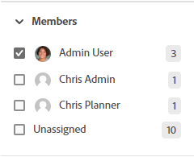

# Filtrage et recherche dans un panorama

Vous pouvez filtrer un panorama pour afficher les éléments suivants :

* Cartes affectées à certaines personnes
* Cartes avec certaines balises
* Cartes avec un état spécifique
* Cartes arrivant à échéance dans une certaine période
* Cartes archivées
* Cartes connectées à un projet spécifique

La recherche vous permet également de localiser une carte spécifique sur le panorama.

Lorsque des filtres sont appliqués, un indicateur s’affiche sur le panorama. . Cliquez sur **[!UICONTROL Effacer tout]** pour supprimer tous les filtres du panorama, cliquez sur **[!UICONTROL Masquer les filtres]** pour fermer le panneau de filtrage.

## Exigences d’accès

Vous devez disposer des accès suivants pour effectuer les étapes de cet article :

<table style="table-layout:auto"> 
 <col> 
 <col> 
 <tbody> 
  <tr> 
   <td role="rowheader"><strong>[!DNL Adobe Workfront] plan*</strong></td> 
   <td> 
Tous
 </td> 
  </tr> 
  <tr> 
   <td role="rowheader"><strong>[!DNL Adobe Workfront] license*</strong></td> 
   <td> 
[!UICONTROL Request] ou version ultérieure
 </td> 
  </tr> 
 </tbody> 
</table>

&#42;Pour connaître le plan, le type de licence ou l’accès dont vous disposez, contactez votre [!DNL Workfront] administrateur.

## Filtrage d’un panorama par personne désignée

1. Cliquez sur le bouton **[!UICONTROL Menu Principal]** icon  dans le coin supérieur droit de [!DNL Adobe Workfront], puis cliquez sur **[!UICONTROL Panoramas]**.
1. Accédez à un panorama. Pour plus d’informations, voir [Création ou modification d’un panorama](../../agile/get-started-with-boards/create-edit-board.md).
1. Cliquez sur [!UICONTROL **Filtrer**], développez la variable [!UICONTROL Membres] et sélectionnez la ou les personnes dont vous souhaitez afficher les cartes. Vous pouvez également afficher les cartes non affectées.

   

## Filtrage d’un panorama par balises

1. Accédez au panorama.
1. Cliquez sur [!UICONTROL **Filtrer**], développez la variable [!UICONTROL Balises] et sélectionnez les balises à afficher.

   

## Filtrage d’un panorama par statut

1. Accédez au panorama.
1. Cliquez sur [!UICONTROL **Filtrer**], développez la variable [!UICONTROL Statuts] et sélectionnez les types d’état à afficher.

   Vous pouvez également masquer les cartes terminées.

   

## Filtrage d’un panorama par date d’échéance

1. Accédez au panorama.
1. Cliquez sur [!UICONTROL **Filtrer**], développez la variable [!UICONTROL Date d’échéance] et sélectionnez les options de date à afficher.

   Seules les cartes des périodes sélectionnées s’affichent.

   

## Filtrage d’un panorama pour afficher les cartes archivées

Par défaut, seules les principales cartes sont affichées sur un panorama. Vous pouvez filtrer le panorama pour afficher également toutes les cartes archivées.

1. Accédez au panorama.
1. Cliquez sur [!UICONTROL **Filtrer**], développez la variable [!UICONTROL Cartes archivées] et sélectionnez **[!UICONTROL Cartes archivées]** pour afficher toutes les cartes archivées.

   Le filtre affiche le nombre de cartes archivées.

   

1. Sélectionner **[!UICONTROL Cartes archivées]** pour effacer l’option et afficher uniquement les principales cartes.

## Filtrage d’un panorama par connexion

1. Accédez au panorama.
1. Cliquez sur [!UICONTROL **Filtrer**], développez la variable [!UICONTROL Connexion] , puis sélectionnez la variable [!DNL Workfront] projets pour les cartes connectées que vous souhaitez afficher.

   Vous pouvez également afficher les cartes qui ne sont pas connectées à un projet.

   

## Recherche dans un panorama

1. Accédez au panorama.
1. Cliquez sur [!UICONTROL **Rechercher**] et saisissez un terme de recherche. Ensuite, appuyez sur Entrée.

   Toutes les cartes qui contiennent le terme de recherche s’affichent.

   Cliquez sur le X pour effacer la recherche.

   
