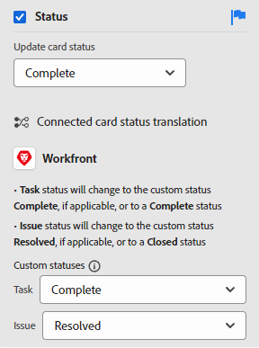

# Gérer les colonnes de panorama

<!-- Audited: 05/2024 -->

Un nouveau panorama contient trois colonnes par défaut. Vous pouvez ajouter d’autres colonnes, modifier l’ordre des colonnes, les renommer et supprimer celles dont vous n’avez pas besoin.

Les paramètres de colonne incluent des stratégies qui vous permettent de définir des options pour ce qui arrive à une carte lorsqu’elle est déplacée dans cette colonne.

Pour plus d’informations sur le tri des cartes en colonnes, voir [Filtrer et rechercher dans un panorama](/help/quicksilver/agile/get-started-with-boards/filter-search-in-board.md).

## Conditions d’accès

+++ Développez pour afficher les exigences d’accès aux fonctionnalités de cet article.

Vous devez disposer des accès suivants pour effectuer les étapes de cet article :

<table style="table-layout:auto"> 
 <col> 
 </col> 
 <col> 
 </col> 
 <tbody> 
  <tr> 
   <td role="rowheader">[!DNL Adobe Workfront] plan</td> 
   <td> 
Tous
 </td> 
  </tr> 
  <tr> 
   <td role="rowheader">[!DNL Adobe Workfront] licence</td> 
   <td> 
Nouvelle : contributeur ou supérieure 

        
ou
 
        
Actuelle : [!UICONTROL Request] ou supérieure 
</td> 
  </tr> 
 </tbody> 
</table>

Pour plus de détails sur les informations contenues dans ce tableau, voir [Conditions d’accès dans la documentation Workfront](/help/quicksilver/administration-and-setup/add-users/access-levels-and-object-permissions/access-level-requirements-in-documentation.md).

+++

## Ajouter une colonne à un panorama

{{step1-to-boards}}

1. Accédez à un panorama. Pour plus d’informations, voir [Créer ou modifier un panorama](../../agile/get-started-with-boards/create-edit-board.md).
1. Cliquez sur **[!UICONTROL Ajouter une colonne]** à droite des colonnes existantes.
1. Dans la nouvelle colonne, saisissez un nom, puis cliquez sur **[!UICONTROL Ajouter une colonne]**.

   

>[!TIP]
>
>Pour ajouter une colonne de saisie, voir [Ajouter une colonne de saisie à un panorama](/help/quicksilver/agile/use-boards-agile-planning-tools/add-intake-column-to-board.md).

## Réorganiser les colonnes du panorama

1. Accédez au panorama.
1. Faites glisser et déposez les colonnes dans l’ordre approprié. Veillez à sélectionner le haut de la colonne avant de la faire glisser vers un autre emplacement.

   

## Renommer une colonne de panorama

1. Accédez au panorama.
1. Cliquez sur le nom de la colonne, saisissez le nouveau nom, puis appuyez sur Entrée.

   Ou

   Cliquez sur le menu **[!UICONTROL Plus]**  dans la colonne et sélectionnez **[!UICONTROL Modifier]**. Dans la zone Paramètres, saisissez le nouveau nom dans le champ **[!UICONTROL Nom de la colonne]** puis cliquez sur **[!UICONTROL Fermer]**.

## Supprimer une colonne de panorama

Lorsque vous supprimez une colonne d’un panorama, elle ne peut pas être récupérée.

1. Accédez au panorama.
1. Cliquez sur le menu **[!UICONTROL Plus]**  dans la colonne, puis sélectionnez **[!UICONTROL Supprimer]**.

   >[!NOTE]
   >
   >Les colonnes contenant des cartes, y compris des cartes archivées, ne peuvent pas être supprimées. Si vous essayez de supprimer une colonne contenant des cartes, vous devez choisir une autre colonne pour ces cartes.

## Afficher le nombre de cartes

Vous pouvez utiliser un paramètre de configuration pour afficher le nombre de cartes dans chaque colonne.

Si vous utilisez la limite de travaux en cours sur une colonne, aucun compteur de cartes distinct n’est ajouté. Pour plus d’informations sur les limites de travail en cours, voir [Gérer la limite du [!UICONTROL travail en cours] (WIP) sur un panorama](/help/quicksilver/agile/use-boards-agile-planning-tools/manage-wip-limit-on-board.md).

1. Accédez au panorama.
1. Cliquez sur **[!UICONTROL Configurer]** à droite du panorama pour ouvrir le panneau de configuration.
1. Développez **[!UICONTROL Colonne]**.
1. Activez **[!UICONTROL Afficher le nombre de cartes d’une colonne]**.

   

   Le compteur de cartes s’affiche en haut de chaque colonne.

1. Cliquez sur **[!UICONTROL Masquer la configuration]** pour fermer le panneau [!UICONTROL Configuration].

## Définir des paramètres et des politiques de colonne

Les politiques de colonne incluent la mise à jour automatique des valeurs de champ et la définition d’une limite de travail en cours.

La politique de mise à jour du statut fonctionne automatiquement pour la carte et la colonne :

* Lorsqu’une carte est déplacée dans une colonne avec une politique, le statut de la carte est mis à jour en fonction du statut défini dans la politique. Cela s’applique aux cartes ad hoc et connectées.
* Lorsqu’un statut de carte ad hoc ou connectée est mis à jour sur la carte pour correspondre au statut de colonne dans la politique ou qu’un statut de carte connectée est mis à jour ailleurs dans Workfront, la carte est automatiquement déplacée vers cette colonne. En outre, si un statut personnalisé sur une carte correspond au statut système affecté à la colonne, la carte est déplacée vers cette colonne.

Une carte reste dans la colonne où elle a été placée si le statut de la carte ne correspond à aucun statut défini dans les politiques de colonne existantes.

>[!NOTE]
>
>Les panoramas dynamiques placent toujours des cartes dans la colonne qui correspond à leur statut, que les politiques de colonnes soient activées ou désactivées. Lorsque vous actualisez le panorama, les cartes reviennent dans les colonnes qui leur sont affectées.
> 
>En outre, pour tous les types de panoramas, si vous déplacez une carte d’une colonne à une autre colonne au statut identique, la carte revient dans la colonne d’origine lorsque vous actualisez le panorama.

1. Accédez au panorama.
1. Cliquez sur le menu **[!UICONTROL Plus]**  dans la colonne, puis sélectionnez **[!UICONTROL Modifier]**.

   La zone [!UICONTROL Paramètres] s’affiche. Le **[!UICONTROL Nom de la colonne]** vous permet de savoir pour quelle colonne vous définissez des paramètres.

1. Activez la politique **[!UICONTROL Mettre à jour automatiquement des valeurs de champ]** pour modifier automatiquement certaines valeurs de champ lorsqu’une carte est déplacée vers cette colonne.

   

1. (Facultatif) Définissez une valeur pour le statut de la carte :

   1. Sélectionnez la case à cocher **[!UICONTROL Statut]**.

   1. Sélectionnez le statut à appliquer à une carte lorsqu’elle est déplacée vers cette colonne.

      

      Les options de traduction du statut des cartes connectées s’affichent également. (La traduction du statut ne s’applique pas aux cartes ad hoc.) Ces options déterminent le statut personnalisé appliqué à la tâche ou au problème dans [!DNL Workfront] lorsqu’une carte connectée est déplacée vers cette colonne.

   1. Sélectionnez un statut [!UICONTROL **personnalisé**] à appliquer à la carte pour les tâches et les problèmes.

      Lorsqu’une carte est déplacée vers cette colonne, [!DNL Workfront] tente d’abord d’appliquer le statut personnalisé (par exemple, Résolu). Si le statut personnalisé sélectionné n’est pas disponible pour cette carte, vous pouvez choisir un autre statut correspondant au statut du système (à l’étape b ci-dessus). Pour plus d’informations sur les statuts, consultez la section [Vue d’ensemble des statuts](/help/quicksilver/administration-and-setup/customize-workfront/creating-custom-status-and-priority-labels/statuses-overview.md).

      En outre, si le statut de la tâche connectée ou du problème connecté est modifié dans le statut personnalisé ou système défini dans la politique de colonne, la carte est automatiquement déplacée dans la colonne.

1. (Facultatif) Définir une valeur pour les personnes cessionnaires de la carte :

   1. Sélectionnez la case à cocher **[!UICONTROL Personnes cessionnaires]**.
   1. Sélectionnez une action.

      * **[!UICONTROL Ajouter des personnes cessionnaires] :** les personnes cessionnaires que vous sélectionnez sont ajoutées à la liste existante des personnes affectées à une carte lorsqu’elle est déplacée vers cette colonne.
      * **[!UICONTROL Remplacer les personnes cessionnaires] :** les personnes cessionnaires que vous sélectionnez remplacent toutes les autres et deviennent les seules personnes cessionnaires de la carte lorsqu’elle est déplacée vers cette colonne.

   1. Cliquez sur [!UICONTROL **Ajouter une affectation**] et recherchez un utilisateur ou une utilisatrice. Sélectionnez les personnes cessionnaires dans les résultats de recherche. Vous pouvez choisir parmi les équipes de Workfront et l’ensemble des utilisateurs et des utilisatrices disponibles.

      

1. (Facultatif) Définissez une valeur pour les balises de carte :

   1. Sélectionnez la case à cocher **[!UICONTROL Cartes]**.
   1. Sélectionnez une action.

      * **[!UICONTROL Ajouter sur les balises] :** les balises que vous sélectionnez sont ajoutées à la liste des balises existantes sur une carte lorsqu’elles sont déplacées dans cette colonne.
      * **[!UICONTROL Remplacer les balises]:** les balises que vous sélectionnez remplacent toutes les autres et deviennent les seules balises de la carte lorsqu’elle est déplacée vers cette colonne.

   1. Sélectionnez les balises dans la liste déroulante. Vous pouvez choisir parmi les balises disponibles déjà créées dans le [!UICONTROL gestionnaire de balises]. Pour plus d’informations sur l’ajout de nouvelles balises, consultez la section [Ajouter des balises](/help/quicksilver/agile/get-started-with-boards/add-tags.md).

      

1. Activez la politique **[!UICONTROL Limite du travail en cours]** pour limiter le nombre de cartes à ajouter à la colonne. Saisissez ensuite le nombre limite dans le champ **[!UICONTROL Définir la limite]**.

   

   Pour plus d’informations, consultez la section [Gérer la limite du travail en cours (Work in Progress, WIP) sur un panorama](/help/quicksilver/agile/use-boards-agile-planning-tools/manage-wip-limit-on-board.md).

1. Cliquez sur **[!UICONTROL Fermer]** pour quitter la zone Paramètres et afficher la colonne et ses cartes.
