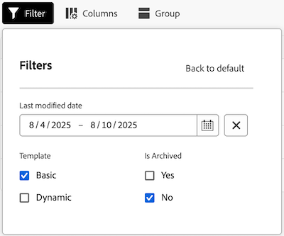
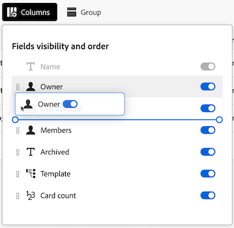
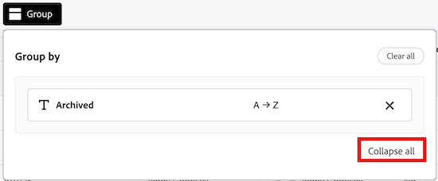
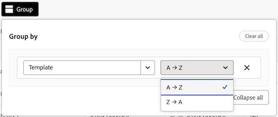
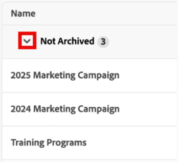

# Gérer la vue d’administration des panoramas

La vue Administrateur des forums contient une liste de chaque forum de votre compte que les administrateurs système peuvent utiliser pour obtenir un instantané rapide des détails globaux des forums, y compris la date de leur dernière mise à jour, le nombre de cartes dont chacun dispose, etc.

Dans cette zone, vous pouvez effectuer les actions suivantes :

* Filtrer la liste des tableaux
* Configurer les colonnes de la liste Tableaux
* Regrouper la liste des tableaux

## Conditions d’accès

+++ Développez pour afficher les exigences d’accès aux fonctionnalités de cet article.

<table style="table-layout:auto"> 
 <col> 
 </col> 
 <col> 
 </col> 
 <tbody> 
  <tr> 
   <td role="rowheader">Package Adobe Workfront</td> 
   <td> 
Tous
 </td> 
  </tr> 
  <tr> 
   <td role="rowheader">Licence Adobe Workfront</td> 
   <td> 
Standard

        
 Plan 
</td> 
  </tr> 
    <tr> 
   <td role="rowheader">Configurations des niveaux d’accès</td> 
   <td> 
Administrateur ou administratrice système 

        </td> 
  </tr> 
 </tbody> 
</table>

Pour plus d’informations, voir [Conditions d’accès requises dans la documentation Workfront](/help/quicksilver/administration-and-setup/add-users/access-levels-and-object-permissions/access-level-requirements-in-documentation.md).

+++

## Conditions préalables

Vous devez créer un panorama avant de pouvoir l’afficher à partir de la vue Administration.

Pour plus d’informations, voir [Créer ou modifier un panorama](/help/quicksilver/agile/get-started-with-boards/create-edit-board.md).

## Filtrer la liste des tableaux

{{step1-to-boards}}

1. Sur la page **Tableaux**, sélectionnez l’onglet **Vue Administration**.

1. Sélectionnez **Filtrer**. Le panneau **Filtres** s’ouvre.

1. Pour configurer le filtre, procédez comme suit :

   1. (Facultatif) Cliquez sur l’icône **Calendrier** , puis sélectionnez une période pour filtrer selon les tableaux qui ont été modifiés pour la dernière fois au cours de cette période.

   1. (Facultatif) Dans la section **Modèle**, sélectionnez le type de modèle de panorama par lequel la liste sera filtrée. Vous pouvez sélectionner plusieurs types de modèle.
      Pour plus d’informations sur les types de modèles de panorama, voir [Créer ou modifier un panorama](/help/quicksilver/agile/get-started-with-boards/create-edit-board.md).

   1. (Facultatif) Dans la section **Est archivé**, indiquez si les tableaux archivés ou non s’affichent. Vous pouvez sélectionner plusieurs options.

      

1. Cliquez en dehors du panneau **Filtres** pour le fermer. Vos sélections de filtres resteront appliquées à la liste des tableaux jusqu’à ce qu’elle soit de nouveau dans la vue par défaut.

   >[!NOTE]
   >
   >Pour supprimer un filtre, ouvrez le panneau **Filtres** et cliquez sur **Retour aux valeurs par défaut** dans le coin supérieur droit.

## Configurer les colonnes de la liste Tableaux

{{step1-to-boards}}

1. Sur la page **Tableaux**, sélectionnez l’onglet **Vue Administration**.

1. Sélectionnez **Colonnes**. Le panneau **Visibilité et ordre des champs** s’ouvre.

1. Configurez les colonnes qui apparaissent dans la liste Tableaux en sélectionnant ou en désélectionnant le bouton (bascule) en ligne avec chaque colonne :

   * **Personne propriétaire**
   * **Dernière mise à jour**
   * **Membres**
   * **Archivé**
   * **Modèle**
   * **Nombre de cartes**

1. (Facultatif) Pour ajuster l’ordre dans lequel les champs s’affichent, cliquez sur l’icône **Faire glisser** et maintenez-la à gauche d’un champ, puis faites-la glisser vers un nouvel emplacement.

   

1. Cliquez en dehors du panneau **Visibilité et ordre des champs** pour le fermer. Les configurations de vos colonnes resteront appliquées à la liste des tableaux jusqu’à ce qu’elles soient modifiées.

   >[!NOTE]
   >
   > Lorsque l’affichage des colonnes de la liste Tableaux est modifié, un point bleu s’affiche au-dessus de l’icône **Colonnes** pour indiquer que la vue actuelle a été modifiée par défaut.

## Regrouper la liste des tableaux par un champ spécifique

{{step1-to-boards}}

1. Sur la page **Tableaux**, sélectionnez l’onglet **Vue Administration**.

1. Sélectionnez **Groupe**. Le panneau **Regrouper par** s’ouvre.

1. Sélectionnez le champ en fonction duquel vous souhaitez regrouper la liste Tableaux :

   * **Archivé**
   * **Personne propriétaire**
   * **Modèle**

1. (Facultatif) Pour développer ou réduire le regroupement à partir du panneau **Regrouper par**, cliquez sur **Tout réduire** ou **Tout développer**.

   

1. (Facultatif) Pour modifier l’ordre d’affichage du regroupement de A à Z à A, sélectionnez le champ par lequel la liste est actuellement regroupée, puis sélectionnez **Z à A** dans la liste déroulante.

   

1. Cliquez en dehors du panneau **Regrouper par** pour le fermer. À partir de là, vous pouvez réduire ou développer le regroupement appliqué dans la liste en sélectionnant la flèche en regard du titre du regroupement.

   

   >[!NOTE]
   >   
   >Lorsque l’affichage du regroupement Liste Tableaux est modifié, un point bleu s’affiche au-dessus de l’icône **Groupe** pour indiquer que la vue actuelle est différente de la vue par défaut.  
   >Pour supprimer un regroupement, ouvrez le panneau **Regrouper par** et sélectionnez **Effacer tout** dans le coin supérieur droit.
