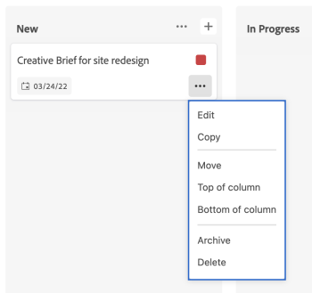

# Gérer les cartes

Vous pouvez déplacer une carte dans n’importe quelle colonne du panorama ou la copier.

Si des politiques de colonne sont activées pour la mise à jour des valeurs de champ, le statut, les personnes cessionnaires et les balises peuvent être mis à jour automatiquement lorsque vous déplacez une carte d’une colonne à une autre. Pour plus d’informations, voir « Définition des paramètres et des politiques de colonne » dans l’article [Gérer les colonnes de panorama](/help/quicksilver/agile/get-started-with-boards/manage-board-columns.md).

>[!NOTE]
>
>Vous ne pouvez pas déplacer une carte d’un panorama à un autre.

## Conditions d’accès

+++ Développez pour afficher les exigences d’accès aux fonctionnalités de cet article.

<table style="table-layout:auto"> 
 <col> 
 <col> 
 <tbody> 
  <tr> 
   <td role="rowheader">Package Adobe Workfront</td> 
   <td> 
Tous
 </td> 
  </tr> 
  <tr> 
   <td role="rowheader">Licence Adobe Workfront</td> 
   <td> 
   
Contributeur ou supérieur
 
   
Requête ou supérieure

   </td> 
  </tr> 
 </tbody> 
</table>

Pour plus d’informations, voir [Conditions d’accès requises dans la documentation Workfront](/help/quicksilver/administration-and-setup/add-users/access-levels-and-object-permissions/access-level-requirements-in-documentation.md).

+++

## Déplacer des cartes entre les colonnes

{{step1-to-boards}}

1. Accédez à un panorama. Pour plus d’informations, voir [Créer ou modifier un panorama](../../agile/get-started-with-boards/create-edit-board.md).
1. Faites glisser la carte et déposez-la dans une autre colonne, à l’emplacement où elle doit apparaître.

   Ou

   Cliquez sur le menu **[!UICONTROL Plus]**  sur la carte, puis sélectionnez **[!UICONTROL Déplacer]**. Ensuite, dans la boîte **[!UICONTROL Déplacer un élément]**, choisissez une autre colonne et sélectionnez **[!UICONTROL Déplacer]**.

   

   >[!NOTE]
   >
   >Lorsque vous utilisez la zone **[!UICONTROL Déplacer un élément]**, la carte est toujours déplacée en haut de la colonne.

## Déplacer des cartes vers le haut ou le bas d’une colonne

1. Accédez au panorama.
1. Faites glisser et déposez la carte à l’emplacement où elle doit apparaître dans la colonne.

   Ou

   Cliquez sur le menu **[!UICONTROL Plus]**  sur la carte, puis sélectionnez **[!UICONTROL Haut de la colonne]** ou **[!UICONTROL Bas de colonne]**.

   

## Copier une carte

La copie d’une carte ad hoc duplique tous les champs de la carte, y compris les éléments de liste de contrôle.

>[!NOTE]
>
>Vous ne pouvez pas copier de cartes connectées.

1. Accédez au panorama.
1. Cliquez sur le menu **[!UICONTROL Plus]** ![[!UICONTROL Menu Plus]](assets/more-icon-spectrum.png) sur la carte, puis sélectionnez **[!UICONTROL Copier]**.

   

   Une nouvelle carte est ajoutée dans la même colonne avec le titre « Copie de - [nom de la carte d’origine]. »
