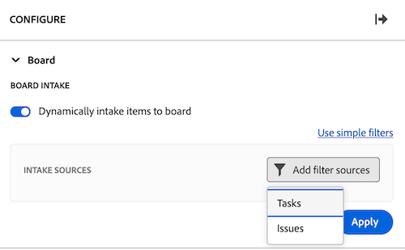

# Ajouter une colonne d’entrée à un panorama

<!-- Audited: 5/2025 -->

Vous pouvez éventuellement ajouter une colonne d’entrée à votre panorama qui extrait automatiquement les tâches et les événements en tant que cartes connectées lorsqu’ils sont ajoutés dans [!DNL Workfront] en fonction des filtres que vous définissez. La colonne de saisie peut servir de colonne de liste d’attente pour une équipe Kanban, d’emplacement de saisie pour une équipe d’assistance afin de voir les problèmes au fur et à mesure qu’ils sont ajoutés à une file d’attente des demandes, ou pour toute autre raison dont vous avez besoin.

Une seule colonne de saisie est autorisée sur un panorama et apparaît toujours comme la colonne à l’extrémité gauche.

La colonne de saisie n’est pas disponible sur un panorama dynamique. Vous pouvez toutefois mettre à jour les filtres qui définissent les cartes qui sont importées sur un panorama dynamique. Lorsque vous modifiez ces filtres sur un panorama dynamique, les paramètres de carte qui ne font pas partie de la tâche ou du problème Workfront (comme les balises) sont réinitialisés.

>[!NOTE]
>
>Pour des raisons de sécurité, seule la personne propriétaire d’un panorama peut modifier les filtres du panorama dans le panneau Configurer.

La colonne d’entrée est limitée à 300 tâches et 300 problèmes. L’ordre par défaut des éléments dans la colonne d’entrée est le suivant :

Tâches :

* Ordre principal : nom du projet
* Ordre secondaire : structure de répartition du travail

Problèmes :

* Ordre principal : nom du projet
* Ordre secondaire : numéro de référence

>[!IMPORTANT]
>
>Il est recommandé d’actualiser fréquemment le panorama si plusieurs personnes y travaillent simultanément. L’actualisation de la page permet de maintenir les modifications visuelles sur le panorama à jour et d’éviter des problèmes tels que les cartes en double qui sont déplacées sur le panorama à partir de la colonne de saisie.
>
>Pour vous synchroniser avec Workfront et importer de nouvelles tâches et de nouveaux événements sur le panorama ou la colonne d’entrée, cliquez sur le menu Plus ![[!UICONTROL menu Plus]](assets/more-menu.png) à côté du nom du panorama et sélectionnez Synchroniser les éléments connectés.

Pour plus d’informations sur les colonnes, voir [Gérer des colonnes de panorama](/help/quicksilver/agile/get-started-with-boards/manage-board-columns.md). Pour plus d’informations sur les cartes connectées, voir [Utiliser des cartes connectées sur des panoramas](/help/quicksilver/agile/get-started-with-boards/connected-cards.md).

## Conditions d’accès

+++ Développez pour afficher les exigences d’accès aux fonctionnalités de cet article.

<table style="table-layout:auto"> 
 <col> 
 <col> 
 <tbody> 
  <tr> 
   <td role="rowheader">[!DNL Adobe Workfront]</td> 
   <td> 
Tous
 </td> 
  </tr> 
  <tr> 
   <td role="rowheader">[!DNL Adobe Workfront] licence</td> 
   <td> 
   
Nouvelle : [!UICONTROL Contributor] ou niveau supérieur
 
   
ou

   
Actuelle : [!UICONTROL Request] ou supérieure

   </td> 
  </tr> 
 </tbody> 
</table>

Pour plus de détails sur les informations contenues dans ce tableau, voir [Conditions d’accès dans la documentation Workfront](/help/quicksilver/administration-and-setup/add-users/access-levels-and-object-permissions/access-level-requirements-in-documentation.md).

+++

## Créer une colonne d’entrée à l’aide de filtres simples

{{step1-to-boards}}

1. Sélectionnez un panorama dans le tableau de bord.
1. Cliquez sur **Configurer** à droite du panorama pour ouvrir le panneau **Configurer**.
1. Sélectionnez la section **Panorama**. De nouveaux champs s’affichent.
1. Activez **Ajout dynamique d’éléments au panorama**. La colonne d’entrée vide s’affiche sur le côté gauche du panorama.

   

1. (Facultatif) Recherchez et sélectionnez [!UICONTROL **Projets**] [!DNL Workfront].
1. (Facultatif) Recherchez et sélectionnez des [!UICONTROL **Affectations**] de personne ou d’équipe.
1. Cliquez sur **Appliquer**. Les objets apparaissent dans la colonne d’entrée du panorama sous la forme de cartes connectées.

   

## Créer une colonne d’entrée à l’aide de filtres avancés

{{step1-to-boards}}

1. Sélectionnez un panorama dans le tableau de bord.
1. Cliquez sur **Configurer** à droite du panorama pour ouvrir le panneau **Configurer**.
1. Sélectionnez la section **Panorama**. De nouveaux champs s’affichent.
1. Activez **Ajout dynamique d’éléments au panorama**. La colonne d’entrée vide s’affiche sur le côté gauche du panorama.

1. Cliquez sur [!UICONTROL **Utiliser des filtres avancés**].

1. Cliquez sur **[!UICONTROL Ajouter des sources de filtre]**, puis sélectionnez **[!UICONTROL Tâches]** ou **[!UICONTROL Problèmes]**.

   

   >[!NOTE]
   >
   >Vous pouvez filtrer la colonne d’entrée pour inclure à la fois les tâches et les problèmes, mais vous devez configurer les filtres séparément pour chaque type d’objet.
   >
   >De plus, vous pouvez sélectionner les filtres enregistrés et les filtres système par défaut.

1. Dans le panneau de filtrage, cliquez sur **[!UICONTROL Nouveau filtre]**.

1. Créez votre filtre, puis cliquez sur **[!UICONTROL Enregistrer en tant que nouveau]**.

   

   L’exemple ci-dessus montre un filtre pour les tâches d’un projet spécifique dont le statut est [!UICONTROL &#x200B; Nouveau &#x200B;] ou [!UICONTROL &#x200B; En cours &#x200B;].

   >[!NOTE]
   >
   >Il est recommandé de ne pas utiliser le caractère générique « Moi » (personne connectée) sur un filtre de panorama, car il n’est pas garanti que la personne connectée affiche toujours les tâches ou les problèmes. Une fois le panorama configuré avec les tâches et problèmes appropriés, vous pouvez le filtrer pour afficher les éléments d’une personne cessionnaire spécifique. Pour plus d’informations, consultez l’article [Filtres et recherche dans un panorama](/help/quicksilver/agile/get-started-with-boards/filter-search-in-board.md).

   Pour plus d’informations sur la création d’un filtre, consultez la section Créer ou modifier un filtre dans le créateur standard dans l’article [Créer ou modifier des filtres dans [!DNL Adobe Workfront]](/help/quicksilver/reports-and-dashboards/reports/reporting-elements/create-filters.md).

1. Nommez le filtre, puis cliquez sur **[!UICONTROL Enregistrer]**. Le filtre apparaît dans la liste des filtres enregistrés et est automatiquement appliqué à la colonne d’entrée.

   

1. Cliquez sur le X en haut du panneau de filtre pour le fermer.

1. (Facultatif) Pour partager le filtre avec d’autres personnes, pointez sur le filtre enregistré, cliquez sur le menu **[!UICONTROL Plus]** , puis sélectionnez **[!UICONTROL Partager]**. Sélectionnez les utilisateurs ou les équipes avec lesquels effectuer le partage dans la zone **Filtrer le partage**. Pour plus d’informations, voir [Partager un filtre, une vue ou un regroupement](/help/quicksilver/reports-and-dashboards/reports/reporting-elements/share-filter-view-grouping.md).
1. (Facultatif) Pour inclure les tâches et les problèmes dans la colonne d’entrée, cliquez sur **[!UICONTROL Sources de filtre]** et sélectionnez l’autre objet pour créer un autre filtre.
1. Lorsque vous avez terminé d’ajouter des filtres, passez en revue la colonne d’entrée pour vérifier que les tâches et problèmes corrects apparaissent.

   

   >[!NOTE]
   >
   >Vous pouvez à tout moment mettre à jour les filtres en ouvrant le panneau Configurer, en cliquant sur **[!UICONTROL Sources de filtre]** et en sélectionnant **[!UICONTROL Tâche]** ou **[!UICONTROL Problèmes]**.

## Utiliser la colonne d’entrée

Les cartes de la colonne d’entrée ne peuvent pas être modifiées tant que vous ne les déplacez pas dans d’autres colonnes du panorama. Vous pouvez cliquer sur la carte pour l’ouvrir en lecture seule ou cliquer sur  pour les ouvrir dans un nouvel onglet du navigateur.

Vous pouvez réorganiser manuellement les éléments de la colonne d’entrée.

Les icônes situées en haut à droite de la colonne d’entrée indiquent le nombre de cartes actuellement présentes dans la colonne et le nombre de filtres appliqués.

1. (Facultatif) Pour rechercher un élément dans la colonne d’entrée, cliquez sur l’ sur la colonne.
1. (Facultatif) Pour déplacer une carte de la colonne d’entrée vers une autre colonne, faites-la glisser et déposez-la à l’emplacement où elle doit apparaître.

   Ou

   Cliquez sur le menu **[!UICONTROL Plus]**  sur la carte, puis sélectionnez **[!UICONTROL Déplacer]**. Ensuite, dans la zone **Déplacer[ÉLÉMENT]**, choisissez une autre colonne et sélectionnez **[!UICONTROL Déplacer]**.

1. (Facultatif) Pour supprimer la colonne d’entrée, cliquez sur le menu **[!UICONTROL Plus]** , puis sélectionnez **[!UICONTROL Supprimer]**.
