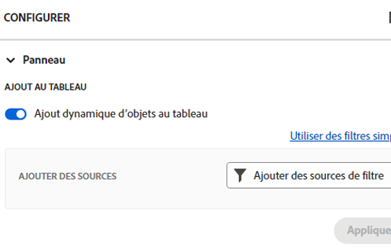

# Ajout d’une colonne d’ingestion à un panorama

Vous pouvez éventuellement ajouter une colonne d’entrée à votre panorama qui extrait automatiquement les tâches et les problèmes en tant que cartes connectées lorsqu’elles sont ajoutées dans [!DNL Workfront], en fonction des filtres que vous définissez. La colonne d’entrée peut servir de colonne de journal pour une équipe Kanban, un emplacement d’entrée pour une équipe d’assistance afin de voir les problèmes lorsqu’ils sont ajoutés à une file d’attente de demandes ou tout autre objectif dont vous avez besoin.

Une seule colonne d’entrée est autorisée sur un panorama et apparaît toujours comme la colonne la plus à gauche.

La colonne d’ingestion n’est pas disponible sur un panorama dynamique.

La colonne d’admission est limitée à 300 tâches et 300 numéros. Ils sont triés par priorité définie sur les éléments. Pour plus d’informations sur la priorité, voir [Mettre à jour la priorité des tâches](/help/quicksilver/manage-work/tasks/task-information/task-priority.md) et [Mise à jour de la priorité des problèmes](/help/quicksilver/manage-work/issues/issue-information/update-issue-priority.md).

Pour plus d’informations sur les colonnes, voir [Gestion des colonnes de panorama](/help/quicksilver/agile/get-started-with-boards/manage-board-columns.md). Pour plus d’informations sur les cartes connectées, voir [Utilisation de cartes connectées sur les panoramas](/help/quicksilver/agile/get-started-with-boards/connected-cards.md).

## Exigences d’accès

Vous devez disposer des accès suivants pour effectuer les étapes de cet article :

<table style="table-layout:auto"> 
 <col> 
 </col> 
 <col> 
 </col> 
 <tbody> 
  <tr> 
   <td role="rowheader"><strong>[!DNL Adobe Workfront] plan*</strong></td> 
   <td> 
Tous
 </td> 
  </tr> 
  <tr> 
   <td role="rowheader"><strong>[!DNL Adobe Workfront] license*</strong></td> 
   <td> 
[!DNL Request] ou supérieur
 </td> 
  </tr> 
 </tbody> 
</table>

&#42;Pour connaître le plan, le type de licence ou l’accès dont vous disposez, contactez votre [!DNL Workfront] administrateur.

## Création d’une colonne d’ingestion

1. Cliquez sur le bouton **[!UICONTROL Menu Principal]** icon  dans le coin supérieur droit d’Adobe Workfront, puis cliquez sur **[!UICONTROL Panoramas]**.
1. Accédez à un panorama. Pour plus d’informations, voir [Création ou modification d’un panorama](../../agile/get-started-with-boards/create-edit-board.md).
1. Cliquez sur **[!UICONTROL Configurer]** à droite du panorama pour ouvrir le panneau Configurer .
1. Développer **[!UICONTROL Panorama]**.
1. Activer **[!UICONTROL ingérer dynamiquement des éléments dans le panorama ;]**.

   

   La colonne d’ingestion est ajoutée à gauche du panorama. Il reste vide jusqu’à ce que vous lui appliquiez des filtres.

1. Cliquez sur **[!UICONTROL Filtrage des sources]** et sélectionnez **[!UICONTROL Tâches]** ou **[!UICONTROL Problèmes]**.

   >[!NOTE]
   >
   >Vous pouvez filtrer la colonne d’ingestion pour inclure à la fois les tâches et les problèmes, mais vous devez configurer les filtres séparément pour chaque type d’objet.
   >
   >Vous pouvez également sélectionner des filtres enregistrés et des filtres par défaut du système.

1. Dans le panneau de filtrage, cliquez sur **[!UICONTROL Nouveau filtre]** pour commencer.

   

1. Créez votre filtre et cliquez sur **[!UICONTROL Enregistrer comme nouveau]**.

   

   Cet exemple affiche un filtre pour les tâches d’un projet spécifique qui sont à l’état de [!UICONTROL Nouveau] ou [!UICONTROL En cours]et sont attribués à moi.

   Pour plus d’informations sur la création d’un filtre, reportez-vous à la section &quot;Création ou modification d’un filtre dans le créateur standard&quot; de l’article. [Création ou modification de filtres dans [!DNL Adobe Workfront]](/help/quicksilver/reports-and-dashboards/reports/reporting-elements/create-filters.md).

1. Nommez le filtre, puis cliquez sur **[!UICONTROL Enregistrer]**.

   

   En attribuant au filtre un nom unique, vous pouvez le rechercher ultérieurement.

1. Le filtre apparaît dans votre liste de filtres enregistrés et est automatiquement appliqué à la colonne d’entrée. Cliquez sur le X en haut du panneau de filtrage pour le fermer.

   

1. (Facultatif) Pour partager le filtre avec d’autres utilisateurs, passez la souris sur le filtre enregistré, cliquez sur le bouton **[!UICONTROL Plus]** menu , puis sélectionnez **[!UICONTROL Partager]**. Sélectionnez les utilisateurs ou les équipes à partager dans la boîte Partage des filtres . Pour plus d’informations, voir [Partage d’un filtre, d’une vue ou d’un regroupement](/help/quicksilver/reports-and-dashboards/reports/reporting-elements/share-filter-view-grouping.md).
1. (Facultatif) Pour inclure à la fois les tâches et les problèmes dans la colonne d’ingestion, cliquez sur **[!UICONTROL Filtrage des sources]** et sélectionnez l’autre objet pour créer un autre filtre.
1. Lorsque vous avez terminé d’ajouter des filtres, passez en revue la colonne d’ingestion pour vérifier que les tâches et problèmes corrects apparaissent.

   

   Les cartes de la colonne d’entrée ne peuvent pas être modifiées tant que vous ne les déplacez pas dans d’autres colonnes de la carte. Vous pouvez cliquer sur la carte pour l’ouvrir en lecture seule ou cliquer sur  pour ouvrir la tâche ou le problème dans un nouvel onglet du navigateur.

   Vous pouvez réorganiser manuellement les éléments de la colonne d’ingestion.

   Les icônes situées en haut à droite de la colonne d’entrée indiquent le nombre de cartes actuellement présentes dans la colonne et le nombre de filtres appliqués.

   >[!NOTE]
   >
   >Vous pouvez à tout moment mettre à jour les filtres en ouvrant le panneau Configurer , en cliquant sur **[!UICONTROL Filtrage des sources]** et en sélectionnant **[!UICONTROL Tâches]** ou **[!UICONTROL Problèmes]**.

1. (Facultatif) Pour rechercher un élément dans la colonne d’ingestion, cliquez sur  sur la colonne .
1. (Facultatif) Pour déplacer une carte de la colonne d’entrée vers une autre colonne, faites-la glisser et déposez-la à l’emplacement où elle doit apparaître.

   Ou

   Cliquez sur le bouton **[!UICONTROL Plus]** menu  sur la carte, puis sélectionnez **[!UICONTROL Déplacer]**. Ensuite, sur le **[!UICONTROL Déplacer un élément]** , choisissez une autre colonne et sélectionnez **[!UICONTROL Déplacer]**.

1. (Facultatif) Pour supprimer la colonne d’ingestion, cliquez sur le bouton **[!UICONTROL Plus]** menu  et sélectionnez **[!UICONTROL Supprimer]**.
