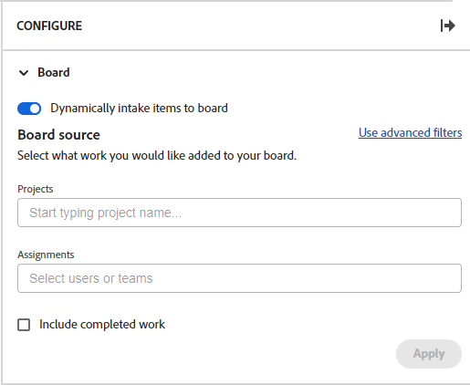

# Ajouter une colonne de saisie à un panorama

Vous pouvez éventuellement ajouter une colonne de saisie à votre panorama qui extrait automatiquement les tâches et les problèmes en tant que cartes connectées lorsqu’ils sont ajoutés dans [!DNL Workfront], en fonction des filtres que vous définissez. La colonne de saisie peut servir de colonne de liste d’attente pour une équipe Kanban, d’emplacement de saisie pour une équipe d’assistance afin de voir les problèmes au fur et à mesure qu’ils sont ajoutés à une file d’attente des demandes, ou pour toute autre raison dont vous avez besoin.

Une seule colonne de saisie est autorisée sur un panorama et apparaît toujours comme la colonne à l’extrémité gauche.

La colonne de saisie n’est pas disponible sur un panorama dynamique. Vous pouvez toutefois mettre à jour les filtres qui définissent les cartes qui sont importées sur un panorama dynamique. Lorsque vous modifiez ces filtres sur un panorama dynamique, les paramètres de carte qui ne font pas partie de la tâche ou du problème Workfront (comme les balises) sont réinitialisés.

>[!NOTE]
>
>Pour des raisons de sécurité, seule la personne propriétaire d’un panorama peut modifier les filtres du panorama dans le panneau Configurer.

La colonne de saisie est limitée à 300 tâches et 300 problèmes. L’ordre par défaut des éléments dans la colonne de saisie est le suivant :

Tâches :

* Ordre principal : nom du projet
* Ordre secondaire : structure de répartition du travail

Problèmes :

* Ordre principal : nom du projet
* Ordre secondaire : numéro de référence

>[!IMPORTANT]
>
>Il est recommandé d’actualiser fréquemment le panorama si plusieurs personnes y travaillent simultanément. L’actualisation de la page permet de maintenir les modifications visuelles sur le panorama à jour et d’éviter des problèmes tels que les cartes en double qui sont déplacées sur le panorama à partir de la colonne de saisie.

Pour plus d’informations sur les colonnes, voir [Gérer des colonnes de panorama](/help/quicksilver/agile/get-started-with-boards/manage-board-columns.md). Pour plus d’informations sur les cartes connectées, consultez [Utiliser des cartes connectées sur des panoramas](/help/quicksilver/agile/get-started-with-boards/connected-cards.md).

## Conditions d’accès

Vous devez disposer des accès suivants pour effectuer les étapes de cet article :

<table style="table-layout:auto"> 
 <col> 
 </col> 
 <col> 
 </col> 
 <tbody> 
  <tr> 
   <td role="rowheader"><strong>[!DNL Adobe Workfront] forfait*</strong></td> 
   <td> 
N’importe quelle
 </td> 
  </tr> 
  <tr> 
   <td role="rowheader"><strong>[!DNL Adobe Workfront] licence*</strong></td> 
   <td> 
[!DNL Request] ou supérieur
 </td> 
  </tr> 
 </tbody> 
</table>

&#42;Pour connaître le plan, le type de licence ou l’accès dont vous disposez, contactez votre administrateur ou administratrice [!DNL Workfront].

## Créer une colonne de saisie à l’aide de filtres simples

1. Cliquez sur l’icône **[!UICONTROL Menu principal]**  dans le coin supérieur droit d’Adobe Workfront, puis cliquez sur **[!UICONTROL Panoramas]**.
1. Accédez à un panorama. Pour plus d’informations, voir [Créer ou modifier un panorama](../../agile/get-started-with-boards/create-edit-board.md).
1. Cliquez sur **[!UICONTROL Configurer]** à droite du panorama pour ouvrir le panneau Configurer.
1. Développez **[!UICONTROL Panorama]**.
1. Activez **[!UICONTROL Ajout dynamique d’objets au panorama]**.

   

   La colonne de saisie est ajoutée à gauche du panorama. Elle reste vide jusqu’à ce que vous y appliquiez des filtres.

1. (Facultatif) Recherchez et sélectionnez des [!UICONTROL **Projets**] [!DNL Workfront].
1. (Facultatif) Recherchez et sélectionnez des [!UICONTROL **Affectations**] de personne ou d’équipe.
1. Sélectionnez [!UICONTROL **Inclure le travail terminé**] pour afficher les tâches et les problèmes dont le statut est Terminé dans la colonne de saisie.

   >[!NOTE]
   >
   >Si cette option n’est pas sélectionnée, lorsque les cartes portant d’autres statuts sont marquées comme étant terminées, elles « tombent » du panorama et ne s’affichent plus.

1. Cliquez sur [!UICONTROL **Appliquer**].

   Tous les objets apparaissent dans la colonne de saisie du panorama sous la forme de cartes connectées.

   

## Créer une colonne de saisie à l’aide de filtres avancés

1. Cliquez sur l’icône **[!UICONTROL Menu principal]**  dans le coin supérieur droit d’Adobe Workfront, puis cliquez sur **[!UICONTROL Panoramas]**.
1. Accédez à un panorama. Pour plus d’informations, voir [Créer ou modifier un panorama](../../agile/get-started-with-boards/create-edit-board.md).
1. Cliquez sur **[!UICONTROL Configurer]** à droite du panorama pour ouvrir le panneau Configurer.
1. Développez **[!UICONTROL Panorama]**.
1. Activez **[!UICONTROL Ajout dynamique d’objets au panorama]**.

   La colonne de saisie est ajoutée à gauche du panorama. Elle reste vide jusqu’à ce que vous y appliquiez des filtres.

1. Cliquez sur [!UICONTROL **Utiliser des filtres avancés**].
1. Cliquez sur **[!UICONTROL Ajouter des sources de filtre]** et sélectionnez **[!UICONTROL Tâches]** ou **[!UICONTROL Problèmes]**.

   

   >[!NOTE]
   >
   >Vous pouvez filtrer la colonne de saisie pour inclure à la fois les tâches et les problèmes, mais vous devez configurer les filtres séparément pour chaque type d’objet.
   >
   >Vous pouvez également sélectionner des filtres enregistrés et des filtres par défaut du système.

1. Dans le panneau de filtres, cliquez sur **[!UICONTROL Nouveau filtre]** pour commencer.

   

1. Créez votre filtre et cliquez sur **[!UICONTROL Enregistrer comme nouveau]**.

   

   Cet exemple affiche un filtre pour les tâches d’un projet spécifique qui sont au statut [!UICONTROL Nouveau] ou [!UICONTROL En cours].

   >[!NOTE]
   >
   >Il est recommandé de ne pas utiliser le caractère générique « Moi » (personne connectée) sur un filtre de panorama, car il n’est pas garanti que la personne connectée affiche toujours les tâches ou les problèmes. Une fois le panorama configuré avec les tâches et problèmes appropriés, vous pouvez le filtrer pour afficher les éléments d’une personne cessionnaire spécifique. Pour plus d’informations, voir [Filtrer et rechercher dans un panorama](/help/quicksilver/agile/get-started-with-boards/filter-search-in-board.md).

   Pour plus d’informations sur la création d’un filtre, consultez la section « Créer ou modifier un filtre dans le créateur standard » de l’article [Créer ou modifier des filtres dans  [!DNL Adobe Workfront]](/help/quicksilver/reports-and-dashboards/reports/reporting-elements/create-filters.md).

1. Nommez le filtre, puis cliquez sur **[!UICONTROL Enregistrer]**.

   

   Vous pourrez rechercher le filtre ultérieurement en lui donnant un nom unique.

1. Le filtre apparaît dans votre liste de filtres enregistrés et est automatiquement appliqué à la colonne de saisie. Cliquez sur le X en haut du panneau de filtre pour le fermer.

   

1. (Facultatif) Pour partager le filtre avec d’autres personnes, pointez sur le filtre enregistré, cliquez sur le menu **[!UICONTROL Plus]** , puis sélectionnez **[!UICONTROL Partager]**. Sélectionnez les utilisateurs et utilisatrices ou les équipes du partage dans la zone Partage des filtres. Pour plus d’informations, voir [Partager un filtre, une vue ou un regroupement](/help/quicksilver/reports-and-dashboards/reports/reporting-elements/share-filter-view-grouping.md).
1. (Facultatif) Pour inclure les tâches et les problèmes dans la colonne de saisie, cliquez sur **[!UICONTROL Sources de filtre]** et sélectionnez l’autre objet pour créer un autre filtre.
1. Lorsque vous avez terminé d’ajouter des filtres, passez en revue la colonne de saisie pour vérifier que les tâches et problèmes corrects apparaissent.

   

   >[!NOTE]
   >
   >Vous pouvez à tout moment mettre à jour les filtres en ouvrant le panneau Configurer, en cliquant sur **[!UICONTROL Sources de filtre]** et en sélectionnant **[!UICONTROL Tâches]** ou **[!UICONTROL Problèmes]**.

## Utiliser la colonne de saisie

Les cartes de la colonne de saisie ne peuvent pas être modifiées tant que vous ne les déplacez pas dans d’autres colonnes du panorama. Vous pouvez cliquer sur la carte pour l’ouvrir en lecture seule ou cliquer sur  pour les ouvrir dans un nouvel onglet du navigateur.

Vous pouvez réorganiser manuellement les éléments de la colonne de saisie.

Les icônes situées en haut à droite de la colonne de saisie indiquent le nombre de cartes actuellement présentes dans la colonne et le nombre de filtres appliqués.

1. (Facultatif) Pour rechercher un élément dans la colonne de saisie, cliquez sur l’ sur la colonne.
1. (Facultatif) Pour déplacer une carte de la colonne de saisie vers une autre colonne, faites-la glisser et déposez-la à l’emplacement où elle doit apparaître.

   Ou

   Cliquez sur le menu **[!UICONTROL Plus]**  sur la carte, puis sélectionnez **[!UICONTROL Déplacer]**. Ensuite, dans la zone **[!UICONTROL Déplacer un élément]**, choisissez une autre colonne et sélectionnez **[!UICONTROL Déplacer]**.

1. (Facultatif) Pour supprimer la colonne de saisie, cliquez sur le menu **[!UICONTROL Plus]** , puis sélectionnez **[!UICONTROL Supprimer]**.
