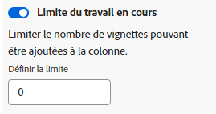

# Gérer les [!UICONTROL Travail en cours] Limite (en cours) sur un panorama

Vous pouvez configurer un [!UICONTROL Travail en cours] Limite (en cours) pour chaque colonne d’un panorama.

La limite de travaux en cours est simplement un avertissement visuel et ne vous empêche pas d’avoir plus d’éléments dans chaque colonne que la limite que vous avez définie.

## Exigences d’accès

Vous devez disposer des accès suivants pour effectuer les étapes de cet article :

<table style="table-layout:auto"> 
 <col> 
 </col> 
 <col> 
 </col> 
 <tbody> 
  <tr> 
   <td role="rowheader"><strong>[!DNL Adobe Workfront] plan*</strong></td> 
   <td> 
Tous
 </td> 
  </tr> 
  <tr> 
   <td role="rowheader"><strong>[!DNL Adobe Workfront] license*</strong></td> 
   <td> 
[!UICONTROL Request] ou version ultérieure
 </td> 
  </tr> 
 </tbody> 
</table>

&#42;Pour connaître le plan, le type de licence ou l’accès dont vous disposez, contactez votre [!DNL Workfront] administrateur.

## Définition de la limite de travail en cours sur une colonne

1. Cliquez sur le bouton **[!UICONTROL Menu Principal]** icon  dans le coin supérieur droit de [!DNL Adobe Workfront], puis cliquez sur **[!UICONTROL Panoramas]**.
1. Accédez à un panorama. Pour plus d’informations, voir [Création ou modification d’un panorama](../../agile/get-started-with-boards/create-edit-board.md).
1. Recherchez la colonne à laquelle vous souhaitez ajouter la limite de travaux en cours.

   Pour ajouter une nouvelle colonne, voir [Gestion des colonnes de panorama](/help/quicksilver/agile/get-started-with-boards/manage-board-columns.md).

1. Cliquez sur le bouton **[!UICONTROL Plus]** dans la colonne, puis sélectionnez **[!UICONTROL Modifier]** pour ouvrir la zone Paramètres .
1. Sous [!UICONTROL Stratégies de colonne], activez la variable **[!UICONTROL Travail en cours] limit** pour limiter le nombre de cartes à ajouter à la colonne.
1. Saisissez le nombre limite dans la variable **[!UICONTROL Définir la limite]** champ .

   

   Le nombre de cartes et la limite s’affichent en haut de la colonne. Si la colonne contient plus de cartes que la limite, le compteur devient rouge.

   

1. Cliquez sur **[!UICONTROL Fermer]** pour quitter le [!UICONTROL Paramètres] et affichez la colonne et ses cartes.
