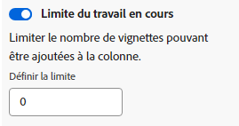

# Gérer la limite de [!UICONTROL travail en cours] (WIP) sur un panorama

Vous pouvez configurer une limite de [!UICONTROL travail en cours] (WIP) pour chaque colonne d’un panorama.

La limite WIP est simplement un avertissement visuel et ne vous empêche pas d’avoir plus d’éléments dans chaque colonne que la limite que vous avez définie.

## Conditions d’accès

+++ Développez pour afficher les exigences d’accès aux fonctionnalités de cet article.

<table style="table-layout:auto"> 
 <col> 
 <col> 
 <tbody> 
  <tr> 
   <td role="rowheader">Package Adobe Workfront</td> 
   <td> 
Tous
 </td> 
  </tr> 
  <tr> 
   <td role="rowheader">Licence Adobe Workfront</td> 
   <td> 
   
Contributeur ou supérieur
 
   
Requête ou supérieure

   </td> 
  </tr> 
 </tbody> 
</table>

Pour plus d’informations, voir [Conditions d’accès requises dans la documentation Workfront](/help/quicksilver/administration-and-setup/add-users/access-levels-and-object-permissions/access-level-requirements-in-documentation.md).

+++

## Définir la limite WIP sur une colonne

{{step1-to-boards}}

1. Accédez à un panorama. Pour plus d’informations, voir [Créer ou modifier un panorama](../../agile/get-started-with-boards/create-edit-board.md).
1. Localisez la colonne à laquelle vous souhaitez ajouter la limite WIP.

   Pour ajouter une colonne, voir [Gérer les colonnes du panorama](/help/quicksilver/agile/get-started-with-boards/manage-board-columns.md).

1. Cliquez sur le menu **[!UICONTROL Plus]** dans la colonne et sélectionnez **[!UICONTROL Modifier]** pour ouvrir la zone Paramètres.
1. Sous [!UICONTROL Politiques des colonnes], activez la politique de limite de **[!UICONTROL travail en cours]** pour limiter le nombre de cartes pouvant être ajoutées à la colonne.
1. Saisissez le numéro de la limite dans le champ **[!UICONTROL Définir la limite]**.

   

   Le nombre de cartes et la limite s’affichent en haut de la colonne. Si la colonne contient plus de cartes que la limite, le compteur devient rouge.

   

1. Cliquez sur **[!UICONTROL Fermer]** pour quitter la zone [!UICONTROL Paramètres] et afficher la colonne et ses cartes.
