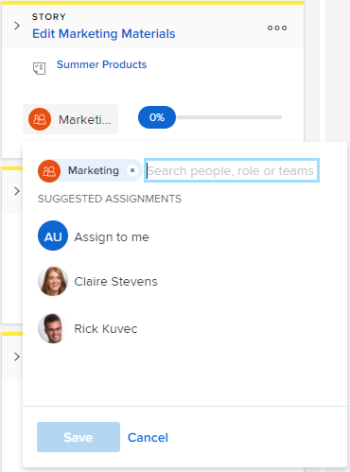

# Affecter des utilisateurs et des utilisatrices à une histoire sur le tableau [!UICONTROL Kanban]

Vous pouvez affecter des utilisateurs à des histoires directement sur le tableau kanban.

## Conditions d’accès

+++ Développez pour afficher les exigences d’accès aux fonctionnalités de cet article.

<table style="table-layout:auto"> 
 <col> 
 </col> 
 <col> 
 </col> 
 <tbody> 
  <tr> 
   <td role="rowheader">Package Adobe Workfront</td> 
   <td> 
Tous
 </td> 
  </tr> 
  <tr> 
   <td role="rowheader">Licence Adobe Workfront</td> 
   <td> 
Standard
 
   
Travail ou supérieur
 </td> 
  </tr>
 </tbody> 
</table>

Pour plus d’informations, voir [Conditions d’accès requises dans la documentation Workfront](/help/quicksilver/administration-and-setup/add-users/access-levels-and-object-permissions/access-level-requirements-in-documentation.md).

+++

## Affecter des utilisateurs et des utilisatrices à une histoire sur le tableau [!UICONTROL Kanban]

{{step1-to-team}}

1. (Facultatif) Cliquez sur l’icône **[!UICONTROL Changer d’équipe]** , puis sélectionnez une nouvelle équipe Kanban dans le menu déroulant ou recherchez une équipe dans la barre de recherche.

1. Accédez au panorama Agile [!UICONTROL Kanban] dans lequel vous souhaitez affecter des utilisateurs.
1. Accédez à la miniature de l’histoire dans le tableau [!UICONTROL Kanban] sur laquelle vous souhaitez ajouter un utilisateur ou une utilisatrice.
1. Cliquez sur l’avatar de l’équipe sur la miniature de l’histoire (ou sur l’avatar d’une personne déjà affectée), commencez à saisir le nom de la personne à affecter à l’histoire, puis cliquez sur le nom lorsqu’il apparaît. Vous pouvez également choisir une personne suggérée.

   >[!TIP]
   >
   >Vous pouvez également affecter une fonction à une histoire. Vous pouvez uniquement affecter des utilisateurs et utilisatrices actifs et des rôles actifs.

   
