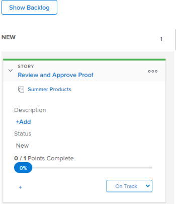

# Modifier les informations sur la story

## Comprendre les informations qui peuvent être affichées et modifiées {#understand-what-information-can-be-viewed-and-edited}

Lors de l’affichage d’une mosaïque d’article sur le panorama [!UICONTROL Kanban], les informations du tableau suivant sont disponibles. Vous pouvez modifier la plupart des informations intégrées, directement à partir de la mosaïque de l’article.

<table style="table-layout:auto"> 
 <col> 
 <col> 
 <col> 
 <thead> 
  <tr> 
   <th><strong>Informations</strong> </th> 
   <th><strong>Visible</strong> </th> 
   <th><strong>Modifiable en ligne</strong> </th> 
  </tr> 
 </thead> 
 <tbody> 
  <tr> 
   <td>Nom de l’article avec un lien direct vers la tâche ou le problème</td> 
   <td>✓</td> 
   <td> </td> 
  </tr> 
  <tr> 
   <td> 
Nom du projet avec un lien direct vers le projet
 </td> 
   <td>✓ </td> 
   <td> </td> 
  </tr> 
  <tr> 
   <td> 
Le nombre de points ou d’heures terminés sur l’article et le nombre de points ou d’heures attribués à l’article Ces chiffres sont utilisés pour calculer et afficher le pourcentage terminé pour chaque article.
 </td> 
   <td>✓</td> 
   <td> </td> 
  </tr> 
  <tr> 
   <td> 
Le [!UICONTROL Pourcentage terminé] pour chaque article et numéro. [!UICONTROL Le pourcentage terminé] pour l’itération est calculé d’après le [!UICONTROL Pourcentage terminé] pour chaque article. 
 
Lors de la mise à jour de [!UICONTROL Pourcentage terminé] pour un article ou un problème, vous pouvez choisir un nombre compris entre 0 et 100.
 </td> 
   <td>✓</td> 
   <td>✓</td> 
  </tr> 
  <tr> 
   <td> 
À qui l’article est affecté
 </td> 
   <td>✓</td> 
   <td>✓</td> 
  </tr> 
  <tr> 
   <td> 
Couleur ou catégorie de la mosaïque
 </td> 
   <td>✓</td> 
   <td>✓</td> 
  </tr> 
  <tr> 
   <td> 
Tout champ supplémentaire (y compris les champs personnalisés) qui peut avoir été ajouté à la vue agile en modifiant la vue agile, comme décrit dans "Création et personnalisation d’une vue agile" dans la <a href="../../reports-and-dashboards/reports/reporting-elements/views-overview.md" class="MCXref xref">vue d’ensemble dans [!DNL Adobe Workfront]</a>
 </td> 
   <td>✓</td> 
   <td>✓</td> 
  </tr> 
 </tbody> 
</table>

## Conditions d’accès

+++ Développez pour afficher les exigences d’accès aux fonctionnalités de cet article.

Vous devez disposer des accès suivants pour effectuer les étapes de cet article :

<table style="table-layout:auto"> 
 <col> 
 </col> 
 <col> 
 </col> 
 <tbody> 
  <tr> 
   <td role="rowheader">[!DNL Adobe Workfront] plan</td> 
   <td> 
N’importe quelle
 </td> 
  </tr> 
  <tr> 
   <td role="rowheader">[!DNL Adobe Workfront] licence</td> 
   <td> 
Nouvelle : [!UICONTROL Standard]
 
   ou
   
Actuelle : [!UICONTROL Work] ou licence supérieure
 </td> 
  </tr>
 </tbody> 
</table>

Pour plus d’informations sur ce tableau, consultez [Conditions d’accès requises dans la documentation Workfront](/help/quicksilver/administration-and-setup/add-users/access-levels-and-object-permissions/access-level-requirements-in-documentation.md).

+++

## Affichage et modification d’informations sur une mosaïque d’article

{{step1-to-team}}

1. (Facultatif) Cliquez sur l’icône **[!UICONTROL Changer d’équipe]** , puis sélectionnez une nouvelle équipe Kanban dans le menu déroulant ou recherchez une équipe dans la barre de recherche.

1. Allez sur la carte [!UICONTROL Kanban].
1. Développez la mosaïque de l’article pour afficher tous les champs associés à l’article.

   

1. (Facultatif) Pour modifier un champ, cliquez dessus, puis apportez toute modification.
Vous devez disposer des droits [!UICONTROL Modifier] sur la tâche ou le problème pour pouvoir modifier la mosaïque de l’article.
Pour plus d&#39;informations sur chaque champ et sur son édition, voir [Comprendre quelles informations peuvent être affichées et modifiées](#understand-what-information-can-be-viewed-and-edited).

>[!NOTE]
>
>Pour modifier le [!UICONTROL pourcentage terminé], vous devez saisir un nombre compris entre 0 et 100. Le champ n’est pas un curseur que vous pouvez déplacer.
