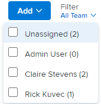

# Filtrer par utilisateur ou utilisatrice sur le panorama [!UICONTROL Kanban]

Vous pouvez utiliser le filtre sur un panorama [!UICONTROL Kanban] pour voir quels éléments de travail sont associés à d’autres personnes et lesquels sont non affectés.

## Conditions d’accès

+++ Développez pour afficher les exigences d’accès aux fonctionnalités de cet article.

<table style="table-layout:auto"> 
 <col> 
 </col> 
 <col> 
 </col> 
 <tbody> 
  <tr> 
   <td role="rowheader">Package Adobe Workfront</td> 
   <td> 
Tous
 </td> 
  </tr> 
  <tr> 
   <td role="rowheader">Licence Adobe Workfront</td> 
   <td> 
Standard
 
   
Travail ou supérieur
 </td> 
  </tr>
 </tbody> 
</table>

Pour plus d’informations, voir [Conditions d’accès requises dans la documentation Workfront](/help/quicksilver/administration-and-setup/add-users/access-levels-and-object-permissions/access-level-requirements-in-documentation.md).

+++

## Filtrer par personne sur le tableau Kanban

{{step1-to-team}}

1. (Facultatif) Cliquez sur l’icône **[!UICONTROL Changer d’équipe]** , puis sélectionnez une nouvelle équipe Kanban dans le menu déroulant ou recherchez une équipe dans la barre de recherche.

1. Accédez à un panorama [!UICONTROL Kanban].
1. Cliquez sur le menu déroulant [!UICONTROL Filtrer] à droite du panorama [!UICONTROL Kanban].
1. Sélectionnez une ou plusieurs personnes ou **[!UICONTROL Non affecté]**.

   >[!NOTE]
   >
   >* Les totaux des colonnes ne changent pas en fonction des résultats filtrés. Les totaux des colonnes affichent les totaux de tous les éléments de travail du panorama. Un maximum de cinquante cartes est affiché par défaut, mais vous pouvez cliquer sur **[!UICONTROL Afficher plus]** pour afficher des cartes supplémentaires.
   >* Les filtres ne sont pas appliqués à la colonne [!UICONTROL Liste d’attente].

   
