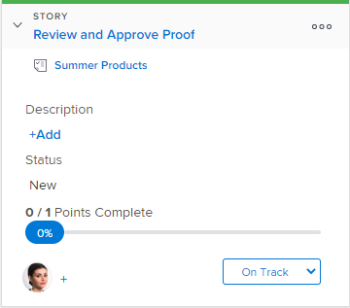

# Utilisez des indicateurs sur les articles sur la carte [!UICONTROL Kanban]

Sur le panorama [!DNL Kanban], les indicateurs fournissent une indication visuelle du moment où un article est prêt à passer à l’état suivant. Cela permet aux équipes de [!UICONTROL Kanban] d’utiliser une approche &quot;pull&quot; plutôt qu’une approche &quot;push&quot; lors du déplacement d’articles entre plusieurs états.

**Exemple :** Examinez l’exemple suivant d’une équipe utilisant une approche &quot;pull&quot; : Olivia, la créatrice graphique de l’équipe, termine son travail, puis définit l’indicateur d’histoire comme &quot;[!UICONTROL Ready to Pull]&quot;. Ce drapeau indique visuellement à Tony, le rédacteur en chef de l&#39;équipe, que l&#39;histoire est prête à passer au statut suivant. Tony passe alors l&#39;histoire au statut suivant lorsqu&#39;il est prêt à commencer à y travailler.

Tenez compte des points suivants lorsque vous utilisez des indicateurs sur des articles :

* Les drapeaux ne sont pas un statut, mais plutôt une indication visuelle que l&#39;histoire est prête à être déplacée vers le statut suivant par un autre membre de l&#39;équipe.
* Les indicateurs n’apparaissent sur aucune fiche d’article qui se trouve dans la colonne [!UICONTROL Backlog] ou dans la colonne [!UICONTROL Complete] (ou dans toute colonne où l’état de la colonne correspond à [!UICONTROL Complete]).

  Pour plus d’informations sur les états d’un article, voir [Utilisation d’indicateurs sur les articles sur le panorama Kanban](#updating-the-status-of-stories-and-subtasks)

## Conditions d’accès

+++ Développez pour afficher les exigences d’accès aux fonctionnalités de cet article.

Vous devez disposer des accès suivants pour effectuer les étapes de cet article :

<table style="table-layout:auto"> 
 <col> 
 </col> 
 <col> 
 </col> 
 <tbody> 
  <tr> 
   <td role="rowheader">[!DNL Adobe Workfront] plan</td> 
   <td> 
N’importe quelle
 </td> 
  </tr> 
  <tr> 
   <td role="rowheader">[!DNL Adobe Workfront] licence</td> 
   <td> 
Nouvelle : [!UICONTROL Standard]
 
   ou
   
Actuelle : [!UICONTROL Work] ou licence supérieure
 </td> 
  </tr>
 </tbody> 
</table>

Pour plus d’informations sur ce tableau, consultez [Conditions d’accès requises dans la documentation Workfront](/help/quicksilver/administration-and-setup/add-users/access-levels-and-object-permissions/access-level-requirements-in-documentation.md).

+++

## Utilisez des indicateurs sur les articles sur la carte [!UICONTROL Kanban]

Pour changer un drapeau sur une histoire :

{{step1-to-team}}

1. (Facultatif) Cliquez sur l’icône **[!UICONTROL Changer d’équipe]** , puis sélectionnez une nouvelle équipe [!UICONTROL Kanban] dans le menu déroulant ou recherchez une équipe dans la barre de recherche.

1. Allez sur le panorama [!UICONTROL Kanban] où vous souhaitez changer un drapeau sur un article.
1. Développez la mosaïque de l’article pour afficher l’indicateur.
Par défaut, l’indicateur est défini sur **[!UICONTROL On Track]** pour chaque article.
   

1. Cliquez sur l’indicateur actuel, puis sélectionnez l’une des options d’indicateur suivantes :

   * **[!UICONTROL Sur la piste] :** L’histoire est dans le statut approprié et aucune action n’a besoin d’être entreprise pour le moment.

     Il s’agit de l’indicateur par défaut pour chaque article sur le panorama Kanban.
     

   * **[!UICONTROL Est bloqué] :** L’histoire ne peut pas passer à l’état suivant. Lorsque cet indicateur est défini sur un article, l’article ne compte pas dans la limite du travail en cours. (Pour plus d’informations sur les limites de travaux en cours, consultez l’article [Configurer Kanban](../../agile/get-started-with-agile-in-workfront/configure-kanban.md).)

     

   * **[!UICONTROL Prêt à tirer] :** L’histoire est prête à être déplacée vers le statut suivant par un autre membre de l’équipe.

     
