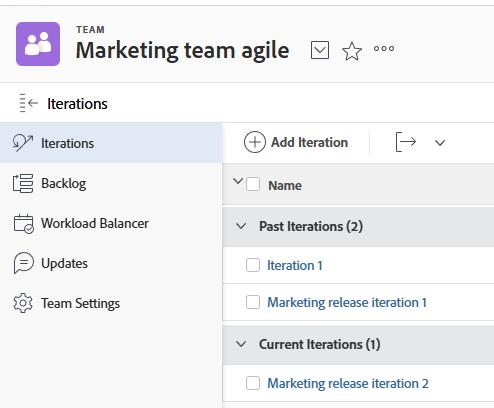

# Créer une itération

Les itérations sont un élément clé pour les équipes Agile Scrum dans la planification de la capacité de travail. [!DNL Adobe Workfront] permet aux équipes Agile Scrum de gérer leur travail en créant plusieurs itérations pour répondre aux besoins de l’équipe.

## Conditions d’accès

+++ Développez pour afficher les exigences d’accès aux fonctionnalités de cet article.

Vous devez disposer des accès suivants pour effectuer les étapes de cet article :

<table style="table-layout:auto"> 
 <col> 
 </col> 
 <col> 
 </col> 
 <tbody> 
  <tr> 
   <td role="rowheader">[!DNL Adobe Workfront] plan</td> 
   <td> 
Tous
 </td> 
  </tr> 
  <tr> 
   <td role="rowheader">[!DNL Adobe Workfront] licence</td> 
   <td> 
Nouveau : [!UICONTROL Light] ou version ultérieure
 
   ou
   
Actuel : [!UICONTROL Review] ou version ultérieure
 </td> 
  </tr>
 </tbody> 
</table>

Pour plus de détails sur les informations contenues dans ce tableau, consultez [Conditions d’accès préalables dans la documentation Workfront](/help/quicksilver/administration-and-setup/add-users/access-levels-and-object-permissions/access-level-requirements-in-documentation.md).

+++

## Ajouter une itération

Vous pouvez ajouter une itération à la liste pour créer rapidement une itération et y ajouter ultérieurement des tâches et des problèmes.

{{step1-to-team}}

1. (Facultatif) Cliquez sur l’icône **[!UICONTROL Changer d’équipe]** , puis sélectionnez une nouvelle équipe Scrum dans le menu déroulant ou recherchez une équipe dans la barre de recherche.

1. Dans l’onglet **[!UICONTROL Itérations]**, cliquez sur **[!UICONTROL Ajouter une itération]**.

   

1. Indiquez les informations suivantes :

   <table style="table-layout:auto">
    <col> 
    <col> 
    <tbody> 
     <tr> 
      <td role="rowheader"><strong>[!UICONTROL Iteration Name]</strong></td> 
      <td>Saisissez le nom de l’itération.</td> 
     </tr> 
     <tr> 
      <td role="rowheader"><strong>[!UICONTROL Goal]</strong></td> 
      <td>Ajoutez les objectifs que vous vous êtes fixés pour l’itération.</td> 
     </tr> 
     <tr> 
      <td role="rowheader"><strong>[!UICONTROL Start Date]</strong></td> 
      <td>Saisissez la date à laquelle l’itération doit démarrer.</td> 
     </tr> 
     <tr> 
      <td role="rowheader"><strong>[!UICONTROL End Date]</strong></td> 
      <td>
Saisissez la date à laquelle l’itération doit se terminer. [!DNL Workfront] recommande de fixer une date de fin ne dépassant pas 4 semaines à compter de la date de début.

Conseil : veillez à choisir un jour ouvrable comme date de fin. Le graphique d’avancement ne prend en compte que les jours ouvrables dans ses calculs. Par défaut, le graphique d’avancement utilise le planning par défaut pour définir les jours ouvrables (comme décrit dans <a href="../../../administration-and-setup/set-up-workfront/configure-timesheets-schedules/create-schedules.md" class="MCXref xref">Créer un planning</a>). Pour intégrer des jours non ouvrables propres à l’équipe, les équipes Agile peuvent choisir d’utiliser un planning alternatif (comme décrit dans la section « Définir un planning d’équipe alternatif pour les graphiques d’avancement » dans <a href="../../../agile/get-started-with-agile-in-workfront/create-an-agile-team.md" class="MCXref xref">Créer une équipe Agile</a>).
</td> 
     </tr> 
     <tr> 
      <td role="rowheader"><strong>[!UICONTROL Capacity]</strong></td> 
      <td> Indiquez la capacité de l’itération. Il s’agit du nombre de points ou d’heures que votre équipe est en mesure d’accomplir au cours de l’itération. Le nombre que vous saisissez doit être égal ou supérieur au nombre de points ou d’heures de la somme de toutes les histoires de l’itération. [!DNL Workfront] remplit ce champ par défaut avec une capacité de 50. </td> 
     </tr> 
     <tr> 
      <td role="rowheader"><strong>[!UICONTROL Focus]</strong></td> 
      <td>Indiquez le pourcentage de concentration de l’équipe. Si tous les membres de l’équipe se concentrent entièrement sur cette itération, la concentration est de 100 %. [!DNL Workfront] remplit ce champ avec 100 % par défaut. </td> 
     </tr> 
    </tbody> 
   </table>

1. Cliquez sur **[!UICONTROL Ajouter une itération]**. Maintenant que vous avez créé une itération, vous devez ajouter des histoires. Pour plus d’informations, voir [Ajouter des histoires à une itération existante](../../../agile/use-scrum-in-an-agile-team/iterations/add-stories-to-existing-iteration.md).

## Planifier une itération sur l’onglet [!UICONTROL Liste d’attente] 

Utilisez la fonctionnalité [!UICONTROL Planifier une itération] pour créer une itération en utilisant les tâches de votre liste d’attente.

{{step1-to-team}}

1. (Facultatif) Cliquez sur l’icône **[!UICONTROL Changer d’équipe]** , puis sélectionnez une nouvelle équipe Scrum dans le menu déroulant ou recherchez une équipe dans la barre de recherche.

1. Sélectionnez **[!UICONTROL Liste d’attente]** dans le panneau de gauche. Cliquez ensuite sur **[!UICONTROL Planifier une itération]**.

1. Indiquez les informations suivantes :

   <table style="table-layout:auto"> 
    <col> 
    <col> 
    <tbody> 
     <tr> 
      <td role="rowheader"><strong>[!UICONTROL Iteration Name]</strong></td> 
      <td>Spécifiez un nom pour l’itération.</td> 
     </tr> 
     <tr> 
      <td role="rowheader"><strong>[!UICONTROL Start Date]</strong></td> 
      <td> Indiquez la date à laquelle l’itération doit commencer.</td> 
     </tr> 
     <tr> 
      <td role="rowheader"><strong>[!UICONTROL End Date]</strong></td> 
      <td>
Indiquez la date à laquelle l’itération doit se terminer. [!DNL Workfront] recommande de fixer une date de fin ne dépassant pas 4 semaines à compter de la date de début.

Conseil : veillez à choisir un jour ouvrable comme date de fin. Le graphique d’avancement ne prend en compte que les jours ouvrables dans ses calculs. Par défaut, le graphique d’avancement utilise le planning par défaut pour définir les jours ouvrables (comme décrit dans <a href="../../../administration-and-setup/set-up-workfront/configure-timesheets-schedules/create-schedules.md" class="MCXref xref">Créer un planning</a>). Pour intégrer les jours non travaillés propres à l’équipe, les équipes Agile peuvent choisir d’utiliser un planning alternatif (comme décrit dans <a href="../../../agile/use-scrum-in-an-agile-team/burndown/use-alt-team-schedule-burndown-charts.md" class="MCXref xref">Utiliser un autre planning d’équipe pour les graphiques d’avancement</a>).
</td> 
     </tr> 
     <tr> 
      <td role="rowheader"><strong>[!UICONTROL Focus]</strong></td> 
      <td>Indiquez le pourcentage de concentration de l’équipe. Si tous les membres de l’équipe se concentrent entièrement sur cette itération, la concentration est de 100 %. [!DNL Workfront] pré-remplit ce champ avec la valeur moyenne des itérations passées de votre équipe. S’il s’agit de la première itération de votre équipe, la valeur de ce champ est 0 par défaut.</td> 
     </tr> 
     <tr> 
      <td role="rowheader"> <strong>[!UICONTROL Capacity]</strong></td> 
      <td> Indiquez la capacité de l’itération. Il s’agit du nombre de points ou d’heures que votre équipe est en mesure d’accomplir au cours de l’itération. Le nombre que vous saisissez doit être égal ou supérieur au nombre de points ou d’heures de la somme de toutes les histoires de l’itération. [!DNL Workfront] pré-remplit ce champ avec la valeur moyenne des itérations passées de votre équipe. S’il s’agit de la première itération de votre équipe, la valeur de ce champ est 0 par défaut.</td> 
     </tr> 
     <tr> 
      <td role="rowheader"> <strong>[!UICONTROL Goal]</strong></td> 
      <td> Spécifiez un objectif pour l’itération. Champ obligatoire.</td> 
     </tr> 
    </tbody> 
   </table>

1. (Facultatif) Sélectionnez les histoires pour les ajouter maintenant à l’itération, ou ignorez cette étape et ajoutez des histoires à une itération ultérieurement. Les histoires situées en haut de la liste d’attente ont la priorité la plus importante. Les histoires sont surlignées en vert quand elles correspondent à la capacité ; elles sont surlignées en rouge si elles ne correspondent pas à la capacité.
Vous pouvez ajouter des tâches et des problèmes à une seule itération :

   * **Pour ajouter des tâches à l’itération :** dans l’onglet **[!UICONTROL Liste d’attente]**, assurez-vous que l’onglet **[!UICONTROL Histoires]** est sélectionné (cet onglet est sélectionné par défaut lors de l’affichage de la liste d’attente). Sélectionnez les histoires à ajouter à l’itération.

     Lorsque vous ajoutez des tâches à une itération, la date de début de la tâche est calculée comme décrit dans [[!UICONTROL Comprendre] comment les dates de début des tâches sont calculées lorsqu’elles sont ajoutées à une itération](#understand-how-task-start-dates-are-calculated-when-added-to-an-iteration).

   * **Pour ajouter des problèmes à l’itération :** dans l’onglet **[!UICONTROL Liste d’attente]**, cliquez sur l’onglet **[!UICONTROL Problèmes]**. Sélectionnez les problèmes que vous souhaitez ajouter à cette itération.

1. Cliquer sur **[!UICONTROL Enregistrer].**
L’itération est créée.

1. (Facultatif) Pour ajouter des histoires à une itération existante, consultez la section [Ajouter des histoires à une itération existante](../../../agile/use-scrum-in-an-agile-team/iterations/add-stories-to-existing-iteration.md).

## Comprendre comment les dates de début des tâches sont calculées lorsqu’elles sont ajoutées à une itération. {#understand-how-task-start-dates-are-calculated-when-added-to-an-iteration}

Lorsque vous ajoutez une tâche en tant qu’histoire à une itération, la contrainte de tâche [!UICONTROL Il Faut Finir Le] est utilisée pour chaque histoire. Dans la plupart des cas, la date de début prévue de la tâche est calculée sur la base de la formule suivante :

[!UICONTROL Date de fin de l’itération] moins (-) [!UICONTROL Durée de la tâche] égal (=) [!UICONTROL Date de début prévue de la tâche]

La [!UICONTROL  Date de fin du projet ] est utilisée à la place de la Date de fin de l&#39;itération si la date de début du projet est postérieure à la date de début de l&#39;itération et si la date de fin du projet est postérieure à la date de fin de l&#39;itération.

Vous pouvez configurer des équipes Scrum individuelles de manière à utiliser les dates du projet par défaut plutôt que les dates d’itération. Pour plus d’informations, consultez la section [Configurer la façon dont les dates sont appliquées lors de l’ajout d’éléments de travail à une itération](../../../agile/get-started-with-agile-in-workfront/configure-scrum.md#configure-how-dates-are-applied-when-adding-work-items-to-an-iteration) dans l’article [Configurer Scrum](../../../agile/get-started-with-agile-in-workfront/configure-scrum.md).
